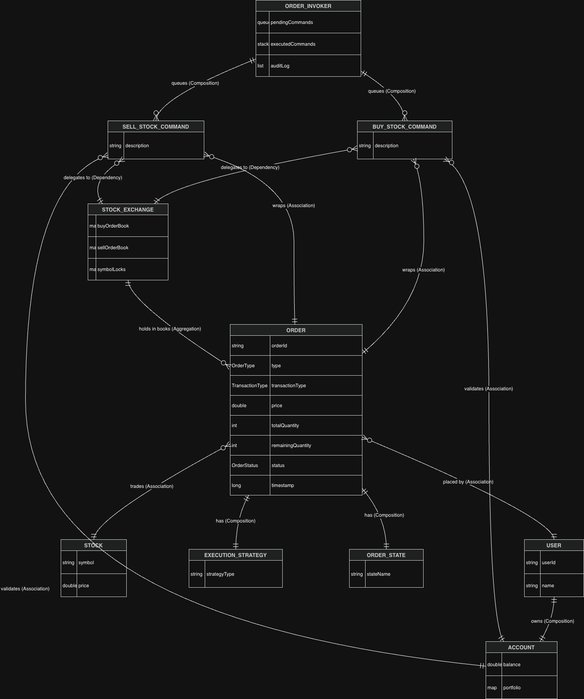
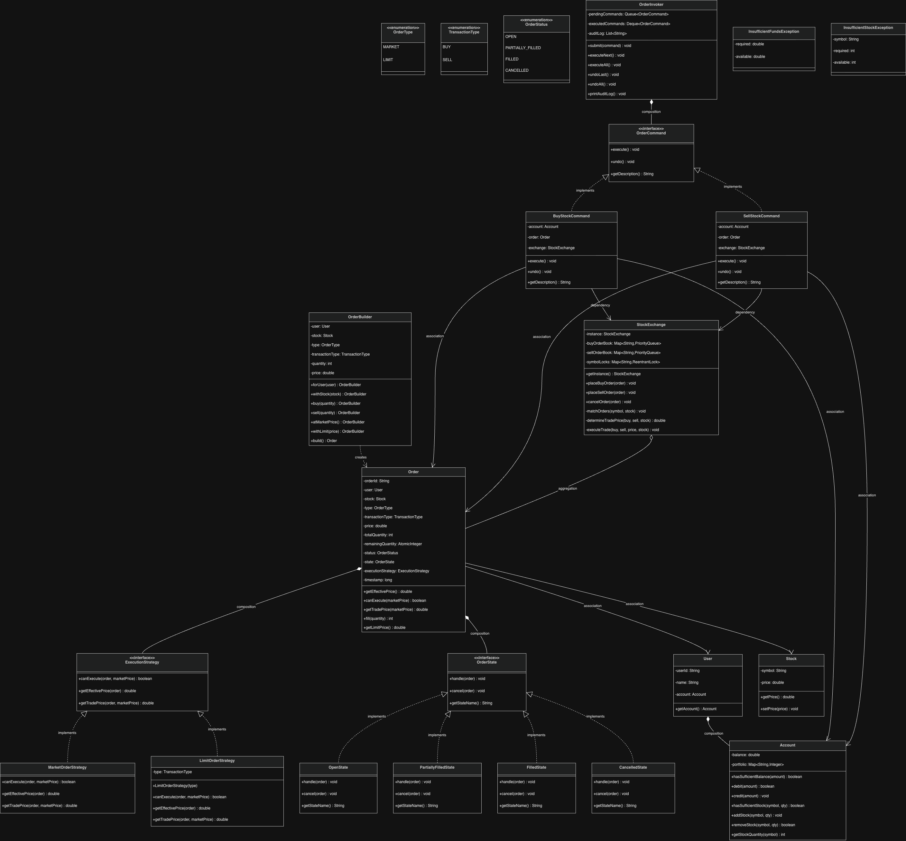
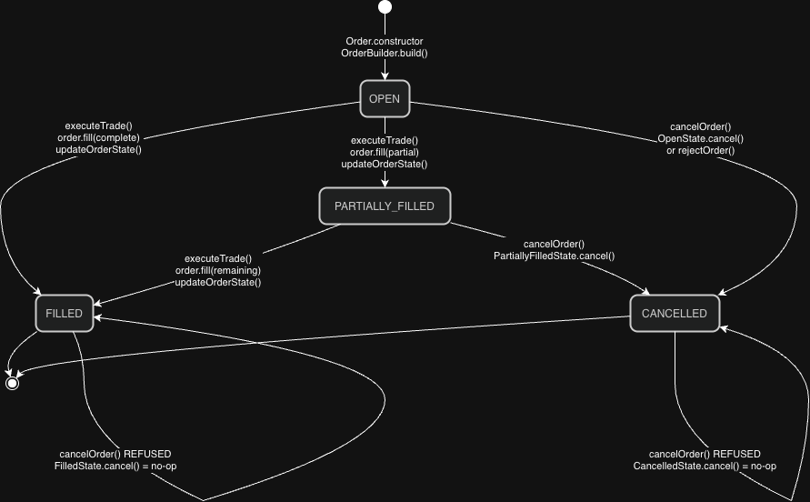
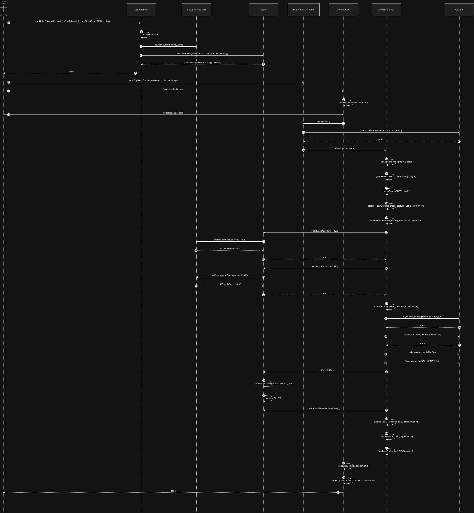
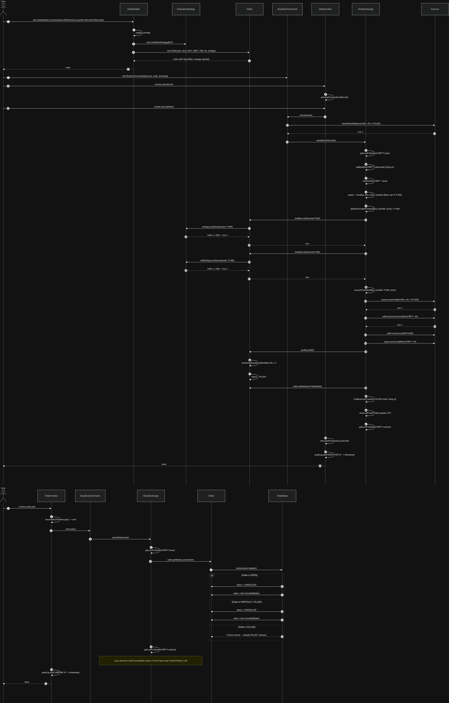
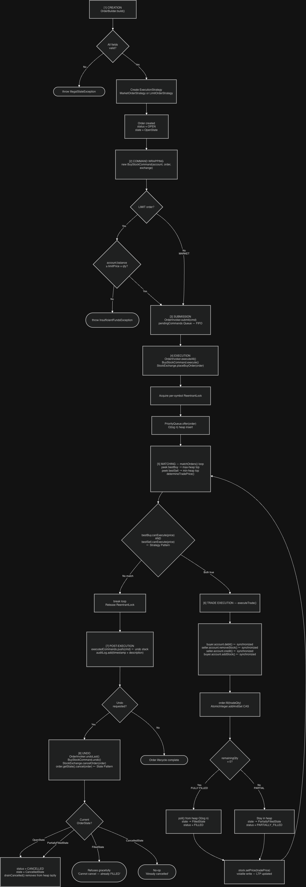
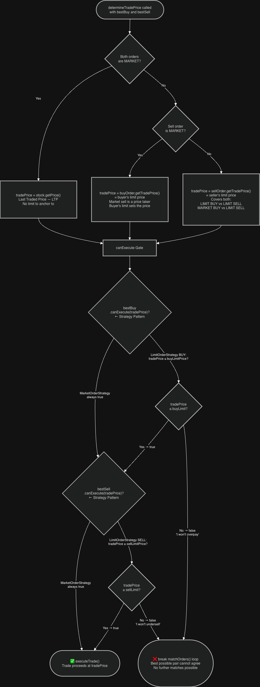

# Online Stock Broker — LLD Revision Guide

> **Purpose:** Complete revision reference. Read this instead of the entire codebase.
> Covers: problem statement, all design patterns (why + without analysis), entity/class/sequence diagrams, concurrency strategy, and application flow.

---

## Table of Contents
1. [Problem Statement](#1-problem-statement)
2. [System Overview](#2-system-overview)
3. [Entity Relationship Diagram](#3-entity-relationship-diagram)
4. [Class Diagram](#4-class-diagram)
5. [Design Patterns — Deep Dive](#5-design-patterns--deep-dive)
6. [Concurrency Strategy](#6-concurrency-strategy)
7. [Sequence Diagram — Order Placement Flow](#7-sequence-diagram--order-placement-flow)
8. [Application Flow](#8-application-flow)
9. [Quick Revision Cheatsheet](#9-quick-revision-cheatsheet)

---

## 1. Problem Statement

Design an **Online Stock Brokerage System** where:

- Users can place **buy and sell orders** on stocks
- Orders can be **MARKET** (execute immediately at best available price) or **LIMIT** (execute only at a specified price or better)
- A **matching engine** pairs compatible buy and sell orders and executes trades
- Orders can be **partially filled** — a buy of 100 shares may fill against a sell of 60, leaving 40 still open
- Orders have a **lifecycle**: OPEN → PARTIALLY_FILLED → FILLED / CANCELLED
- The system must be **thread-safe** — multiple users placing orders concurrently should never corrupt account balances or create phantom trades
- The design must be **extensible** — adding new order types (Stop-Limit, IOC, FOK) should not require rewriting the matching engine

### Core Entities
| Entity | Responsibility |
|--------|---------------|
| `User` | Holds identity and account |
| `Account` | Cash balance + stock portfolio |
| `Stock` | Symbol + Last Traded Price (LTP) |
| `Order` | Single buy/sell instruction with lifecycle |
| `StockExchange` | Matching engine — pairs orders and executes trades |

---

## 2. System Overview

```
┌─────────────────────────────────────────────────────────────────┐
│                        CLIENT LAYER                             │
│                                                                 │
│   OrderBuilder ──────────────► Order                           │
│   (Builder Pattern)            (domain object)                 │
│        │                            │                          │
│        │              ExecutionStrategy (Strategy Pattern)     │
│        │              MarketOrderStrategy / LimitOrderStrategy  │
│        ▼                                                        │
│   BuyStockCommand / SellStockCommand  (Command Pattern)        │
│        │                                                        │
│   OrderInvoker ─── submit/execute/undo/auditLog                │
└────────────────────────────┬────────────────────────────────────┘
                             │ execute()
┌────────────────────────────▼────────────────────────────────────┐
│                     EXCHANGE LAYER                              │
│                                                                 │
│   StockExchange (Singleton)                                     │
│     │                                                           │
│     ├── buyOrderBook[symbol]  → PriorityQueue<Order> (MAX-heap)│
│     ├── sellOrderBook[symbol] → PriorityQueue<Order> (MIN-heap)│
│     ├── symbolLocks[symbol]   → ReentrantLock (per symbol)     │
│     │                                                           │
│     └── matchOrders()                                          │
│           ├── determineTradePrice()                            │
│           ├── order.canExecute()  ← Strategy Pattern          │
│           └── executeTrade()                                   │
│                 ├── account.debit() / credit()                 │
│                 ├── account.addStock() / removeStock()         │
│                 └── order.fill() → OrderState (State Pattern)  │
└─────────────────────────────────────────────────────────────────┘
```

---

## 3. Entity Relationship Diagram

### Relationship Legend
- **◆───** Composition (child cannot exist without parent)
- **───►** Association (one uses another, both independent)
- **- - ►** Dependency (uses temporarily, not stored)
- **..|>** Realization (implements interface)
- **──|>** Inheritance (extends class)



### Key Relationship Decisions

| Relationship | Type | Why |
|---|---|---|
| `User` → `Account` | **Composition** | Account cannot exist without a User. Lifecycle is tied. |
| `Order` → `ExecutionStrategy` | **Composition** | Strategy is created for this specific order in `build()`, not shared. |
| `Order` → `OrderState` | **Composition** | State transitions are internal to the order's lifecycle. |
| `Order` → `User` | **Association** | User exists independently; order just references who placed it. |
| `Order` → `Stock` | **Association** | Stock exists on the exchange independently of any order. |
| `BuyStockCommand` → `StockExchange` | **Dependency** | Command uses the exchange only during `execute()` — no long-term storage needed conceptually, but stored for `undo()` support. |
| `OrderInvoker` → `OrderCommand` | **Composition** | Commands are owned by the invoker's queue/stack. |

---

## 4. Class Diagram



---

## 5. Design Patterns — Deep Dive

---

### 5.1 Singleton Pattern — `StockExchange`

**What it does:**
Ensures only ONE instance of `StockExchange` exists across the entire JVM.

**Implementation — Double-Checked Locking:**
```java
private static volatile StockExchange instance;

public static StockExchange getInstance() {
    if (instance == null) {                    // Fast path — no lock needed if already created
        synchronized (StockExchange.class) {   // Slow path — only one thread enters
            if (instance == null) {            // Second check — prevents double creation
                instance = new StockExchange();
            }
        }
    }
    return instance;
}
```

**Why `volatile`?**
Without `volatile`, the JVM can reorder instructions. Thread A might write the reference to `instance` BEFORE the constructor finishes (instruction reordering). Thread B then reads a non-null but half-initialized object. `volatile` creates a **memory barrier** — constructor must complete before reference is published.

**Why two null checks?**
- Outer check: once `instance` is created, all threads bypass the `synchronized` block entirely — zero contention on the hot path.
- Inner check: two threads could both pass the outer check before either acquires the lock. The inner check ensures only the first one creates the instance.

**❌ Without Singleton:**
```java
// Each caller creates their own exchange
StockExchange exchange1 = new StockExchange(); // has its own order book
StockExchange exchange2 = new StockExchange(); // separate order book
// Alice's buy order in exchange1 NEVER matches Bob's sell in exchange2
// The entire system is broken — two separate markets for the same stock
```

---

### 5.2 Builder Pattern — `OrderBuilder`

**What it does:**
Constructs a valid `Order` object with readable, named parameters and validation at build time.

**Implementation highlights:**
```java
Order order = new OrderBuilder()
    .forUser(alice)          // named: no positional confusion
    .withStock(infy)
    .buy(50)                 // sets TransactionType.BUY + quantity in ONE call
    .withLimit(1500.0)       // sets OrderType.LIMIT + price in ONE call
    .build();                // validates all fields + creates strategy + builds Order
```

**Three key design decisions:**

1. **Standalone class, not `Order.Builder` inner class** — GoF faithful, findable in large codebase, package-private constructor on Order prevents bypassing the builder from outside the package.

2. **`buy(qty)` and `sell(qty)` encode two facts atomically** — Can never have side set without quantity or vice versa. Impossible intermediate state.

3. **Strategy created in `build()`, not in `atMarketPrice()` / `withLimit()`** — Strategy needs both `transactionType` AND `price`. If created in `atMarketPrice()`, `transactionType` might not be set yet (if user called `atMarketPrice()` before `buy()`). `build()` is the only point where all fields are guaranteed finalized.

**Validation catches at build time:**
```
user != null → stock != null → transactionType != null → type != null
→ quantity > 0 → LIMIT orders must have price > 0
```

**❌ Without Builder — Telescoping Constructor Problem:**
```java
// What is 1500.0? What is 50? Is price before quantity or after?
new Order("uuid", alice, infy, OrderType.LIMIT, TransactionType.BUY, 50, 1500.0, strategy);
//                                                               ↑    ↑
//                  Easy to swap quantity and price — compiles fine, semantically wrong
// Compiler cannot catch: new Order("uuid", alice, infy, LIMIT, BUY, 1500, 50, strategy)
// Results in: buy 1500 shares at ₹50 instead of 50 shares at ₹1500 — a catastrophic trade
```

---

### 5.3 Command Pattern — `BuyStockCommand`, `SellStockCommand`, `OrderInvoker`

**What it does:**
Wraps a buy/sell operation as a first-class object, decoupling the caller from the exchange.

**Three participants:**
- **Command interface** (`OrderCommand`): `execute()`, `undo()`, `getDescription()`
- **Concrete commands** (`BuyStockCommand`, `SellStockCommand`): hold `account`, `order`, `exchange`
- **Invoker** (`OrderInvoker`): queue (FIFO for pending) + stack (LIFO for undo)

**Key design decisions:**

1. **`Account` injected explicitly** — avoids `order.getUser().getAccount()` (Law of Demeter violation). Command needs account directly for pre-validation; passing it explicitly makes dependency visible.

2. **`StockExchange` injected, not `getInstance()`** — hidden singleton dependency inside constructor makes class untestable. Injection allows mock exchange in unit tests.

3. **`undo()` is what makes Command Pattern valuable here** — without `undo()`, the interface is just a `Runnable` wrapper. `undo()` cancels the order, delegating to State Pattern — `FilledState.cancel()` refuses, `OpenState.cancel()` proceeds.

4. **`InsufficientFundsException` (not silent return)** — a void return that signals failure silently is dangerous. Exception forces the caller to handle it. `OrderInvoker.executeNext()` catches it and continues the batch — one bad order doesn't abort everything.

**Invoker queue/stack design:**
```
pendingCommands (LinkedList as Queue): FIFO
    submit() → adds to tail
    executeNext() → removes from head
    
executedCommands (ArrayDeque as Stack): LIFO
    after execute() → push to top
    undoLast() → pop from top (most recent first)
```

**❌ Without Command Pattern:**
```java
// Direct coupling — caller knows the exchange internals
exchange.placeBuyOrder(order);

// Cannot queue: no way to "submit now, execute later"
// Cannot audit: no history of what was placed
// Cannot undo: no handle to the operation after it's called
// Cannot batch: caller must orchestrate all orders manually
// Cannot rate-limit: no interception point in the invoker
```

---

### State Diagram of the Order State



### 5.4 Strategy Pattern — `ExecutionStrategy`

**What it does:**
Encapsulates all price-related behavior for an order. Each order type gets its own strategy, and the exchange delegates price decisions to it.

**Three methods on the interface:**

```
canExecute(order, marketPrice)    → MATCH GATE: "Can this order trade at this price?"
getEffectivePrice(order)          → HEAP KEY:   "Where does this sit in PriorityQueue?"
getTradePrice(order, marketPrice) → EXEC PRICE: "At what price does this trade execute?"
```

**`MarketOrderStrategy` (stateless):**
```
canExecute    → always true (no price restriction)
getEffectivePrice → reads order.getTransactionType():
                    BUY  → Double.MAX_VALUE (tops max-heap)
                    SELL → 0.0              (tops min-heap)
getTradePrice → returns currentMarketPrice (price taker)
```

**`LimitOrderStrategy` (stores TransactionType only, reads price from Order):**
```
canExecute    → BUY:  marketPrice <= order.getLimitPrice()
                SELL: marketPrice >= order.getLimitPrice()
getEffectivePrice → order.getLimitPrice() (limit price IS the heap key)
getTradePrice → order.getLimitPrice() (price setter — trades at its stated price)
```

**Why `canExecute()` replaces raw `buyPrice >= sellPrice`:**
```java
// BEFORE (original exchange code — exchange understands order types):
double buyPrice  = bestBuy.getType() == MARKET ? stock.getPrice() : bestBuy.getPrice();
double sellPrice = bestSell.getType() == MARKET ? stock.getPrice() : bestSell.getPrice();
if (buyPrice >= sellPrice) { executeTrade(); }

// AFTER (exchange asks each order — exchange knows nothing about MARKET/LIMIT):
double tradePrice = determineTradePrice(bestBuy, bestSell, stock);
if (bestBuy.canExecute(tradePrice) && bestSell.canExecute(tradePrice)) { executeTrade(); }
```

The second approach means adding a new order type (IOC, FOK, Stop-Limit) only requires a new strategy class. `matchOrders()` never changes — **Open/Closed Principle**.

**Why strategy is stateless / reads from Order (not stores limitPrice):**
Single source of truth: `limitPrice` lives on `Order`. Strategy is a pure behavior object. If order amendment is added, only `Order` changes — strategy automatically sees the new value.

**❌ Without Strategy Pattern:**
```java
// Every new order type requires adding a branch to StockExchange:
if (order.getType() == MARKET) { ... }
else if (order.getType() == LIMIT) { ... }
else if (order.getType() == STOP_LIMIT) { ... }  // new type added here
else if (order.getType() == IOC) { ... }           // and here
// StockExchange becomes a God class with O(n) branches for n order types
// Every new order type = modifying StockExchange = risk of breaking existing logic
```

---

### 5.5 State Pattern — `OrderState`

**What it does:**
Encapsulates order lifecycle behavior. Each state class knows what's legal to do in that state.

**States and transitions:**
```
                    fill(partial)
OPEN ──────────────────────────────► PARTIALLY_FILLED
  │                                          │
  │ fill(complete)                fill(complete)
  ▼                                          ▼
FILLED ◄─────────────────────────────────────
  │
  │ (refuses cancel — already done)
  
OPEN / PARTIALLY_FILLED ──► cancel() ──► CANCELLED
```

**Why State Pattern (vs if/else in Order):**
```java
// WITHOUT State — Order.cancel() is a mess:
public void cancel() {
    if (status == OPEN) { status = CANCELLED; }
    else if (status == PARTIALLY_FILLED) { status = CANCELLED; /* handle partial */ }
    else if (status == FILLED) { throw new Exception("Can't cancel filled order"); }
    else if (status == CANCELLED) { /* already cancelled, no-op */ }
}
// Every new status = new branch everywhere cancel() / fill() / handle() is called

// WITH State — FilledState.cancel() just says no:
class FilledState implements OrderState {
    public void cancel(Order order) {
        System.out.println("Cannot cancel — already FILLED."); // refuses gracefully
    }
}
// No if/else. No switch. Each state is self-contained and independently testable.
```

**How State + Command Pattern interact (the key insight):**
```
invoker.undoLast()
    → BuyStockCommand.undo()
        → StockExchange.cancelOrder(order)
            → order.getState().cancel(order)    ← polymorphic dispatch
                → OpenState: marks CANCELLED ✓
                → FilledState: refuses gracefully ✓
                → CancelledState: no-op ✓
```
The same `undo()` call on the command works correctly for ALL order states. No type checking anywhere.

**❌ Without State Pattern:**
Adding `PARTIALLY_FILLED` status requires finding every `if (status == OPEN)` check in the codebase and adding `|| status == PARTIALLY_FILLED`. Missed one? Silent bug where a partially filled order can't be cancelled.

---

## 6. Concurrency Strategy

The system handles concurrent order placement from multiple users. Here's every concurrency mechanism and why it's there.

### 6.1 Overview Table

| Component | Mechanism | Why |
|---|---|---|
| `StockExchange.instance` | `volatile` | Prevents half-initialized Singleton (DCL) |
| `StockExchange.buyOrderBook` | `ConcurrentHashMap` | Parallel reads on different symbols |
| `StockExchange.symbolLocks` | `ConcurrentHashMap` | Lock creation is atomic |
| Symbol-level matching | `ReentrantLock` per symbol | INFY and TCS match in parallel |
| `Order.remainingQuantity` | `AtomicInteger` | Decrement without locking in fill() |
| `Order.status` | `volatile` | Visibility across threads reading status |
| `Stock.price` | `volatile` | LTP update visible to all threads immediately |
| `Account` methods | `synchronized` | Debit/credit must be atomic per account |

---

### 6.2 Per-Symbol Lock — The Key Optimization

**Original (broken):**
```java
private void matchOrders(Stock stock) {
    synchronized (this) {  // ← ONE lock for ALL stocks
        // While INFY matches, TCS matching is blocked
        // While TCS matches, HDFC matching is blocked
        // Throughput = serial, not parallel
    }
}
```

**Optimized:**
```java
private final Map<String, ReentrantLock> symbolLocks = new ConcurrentHashMap<>();

private ReentrantLock getLockForSymbol(String symbol) {
    return symbolLocks.computeIfAbsent(symbol, k -> new ReentrantLock()); // atomic
}

// In placeBuyOrder:
ReentrantLock lock = getLockForSymbol(symbol);
lock.lock();
try {
    getBuyBook(symbol).offer(order);
    matchOrders(symbol, stock);
} finally {
    lock.unlock(); // ALWAYS in finally — never deadlock if matchOrders throws
}
```

**Why `computeIfAbsent` is safe:** `ConcurrentHashMap.computeIfAbsent()` is atomic — two threads creating a lock for "INFY" simultaneously will both get the same lock object.

**Lock scope:**
```
Thread A locks "INFY" ──────────────────────────────────► releases "INFY"
Thread B locks "TCS"  ──────────────────────────────────► releases "TCS"
                       ↑ Both run in parallel — zero contention
```

---

### 6.3 Account Thread Safety

```java
public synchronized boolean debit(double amount) {
    if (balance < amount) return false;  // check
    balance -= amount;                   // modify
    return true;                         // must be atomic together
}
```

**Why `synchronized` on Account methods:**
Without it, Thread A and Thread B could both read `balance = 1000`, both pass the `< amount` check for amount=800, both debit — balance goes to `200` then `-600`. Synchronized ensures check-then-act is atomic.

**Why `debit()` returns `boolean` instead of `void`:**
If debit fails (balance went below required between pre-validation and execution), the exchange must rollback. A `void` debit that silently fails leaves the system in inconsistent state — stock transferred but no money debited.

---

### 6.4 AtomicInteger for remainingQuantity

```java
private final AtomicInteger remainingQuantity;

public int fill(int quantityToFill) {
    int actual = Math.min(quantityToFill, remainingQuantity.get());
    int newRemaining = remainingQuantity.addAndGet(-actual); // atomic CAS
    ...
}
```

`AtomicInteger.addAndGet()` uses Compare-And-Swap (CAS) — lock-free, hardware-level atomicity. No thread can read a stale remaining quantity after a partial fill.

---

### 6.5 Lazy Cancellation — `drainCancelled()`

```java
// Cancelling an order in the PriorityQueue:
// PriorityQueue.remove(element) is O(n) — scans the entire heap
// Instead: mark CANCELLED in O(1), drain at match time in O(log n)

public void cancelOrder(Order order) {
    order.getState().cancel(order); // marks status = CANCELLED in O(1)
}

private void drainCancelled(PriorityQueue<Order> book) {
    while (!book.isEmpty() &&
           book.peek().getStatus() == OrderStatus.CANCELLED) {
        book.poll(); // O(log n) heap removal, only when encountered
    }
}
```

**Race condition this prevents:** Thread A cancels order X. Thread B's matching engine is about to peek at X. Since we check `order.getStatus()` after acquiring the symbol lock, Thread B will see `CANCELLED` status when it gets to match, and drain it harmlessly.

---

## 7. Sequence Diagram — Order Placement Flow



### Undo Flow (Order Cancellation)



---

## 8. Application Flow

### Full Order Lifecycle

```
ORDER LIFECYCLE

```


### Matching Engine Price Logic



---

## 9. Quick Revision Cheatsheet

### Design Patterns at a Glance

| Pattern | Class(es) | Problem Solved | Without It |
|---|---|---|---|
| **Singleton** | `StockExchange` | One order book for entire system | Multiple disconnected order books — no trades ever match |
| **Builder** | `OrderBuilder` | Safe construction of complex Order | Positional constructor — silently swap price and quantity, catastrophic trade |
| **Command** | `BuyStockCommand`, `SellStockCommand`, `OrderInvoker` | Decouple caller from exchange; enable undo, audit, queuing | No undo, no audit, tight coupling, can't batch |
| **Strategy** | `ExecutionStrategy`, `MarketOrderStrategy`, `LimitOrderStrategy` | Pluggable price logic per order type | God class — StockExchange has if/else for every order type |
| **State** | `OrderState`, `OpenState`, `PartiallyFilledState`, `FilledState`, `CancelledState` | Order lifecycle behavior varies by state | if/else chains everywhere — miss one state = silent bug |

### Concurrency at a Glance

| Mechanism | Where | Why |
|---|---|---|
| `volatile` | `StockExchange.instance`, `Stock.price`, `Order.status` | Visibility across threads without locking |
| `ConcurrentHashMap` | `buyOrderBook`, `sellOrderBook`, `symbolLocks` | Parallel access to different symbols |
| `ReentrantLock` per symbol | `symbolLocks` | INFY and TCS match simultaneously |
| `synchronized` | All `Account` methods | Debit/credit must be atomic (check-then-act) |
| `AtomicInteger` | `Order.remainingQuantity` | Lock-free CAS decrement for partial fills |
| `try-finally` on lock | `placeBuyOrder`, `placeSellOrder`, `cancelOrder` | Lock always released even if exception thrown |
| Lazy cancellation | `drainCancelled()` | O(1) cancel instead of O(n) heap scan |

### PriorityQueue Heap Design

```
BUY  book → MAX-HEAP by getEffectivePrice()
    Comparator.comparingDouble(Order::getEffectivePrice).reversed()
              .thenComparingLong(Order::getTimestamp)   ← FIFO tie-break

SELL book → MIN-HEAP by getEffectivePrice()
    Comparator.comparingDouble(Order::getEffectivePrice)
              .thenComparingLong(Order::getTimestamp)

MARKET BUY  → effectivePrice = Double.MAX_VALUE → always at top of max-heap
MARKET SELL → effectivePrice = 0.0              → always at top of min-heap
LIMIT       → effectivePrice = limitPrice       → ranked against other limits

Operations:
    offer()  → O(log n) insert
    peek()   → O(1)     read top
    poll()   → O(log n) remove top
    Original List.stream().max() was O(n) per match iteration
```

### Five Optimizations Over Original

| # | Original | Optimized | Impact |
|---|---|---|---|
| 1 | `CopyOnWriteArrayList` + `stream().max()` | `PriorityQueue` (heap) | O(n) → O(log n) per match |
| 2 | `synchronized(this)` global lock | `ReentrantLock` per symbol | Serial → parallel matching |
| 3 | MARKET price = `stock.getPrice()` in comparison | Sentinel values via `getEffectivePrice()` | MARKET orders now correctly prioritized |
| 4 | Always `status = FILLED` | `remainingQuantity` + `PARTIALLY_FILLED` | Real partial fill support |
| 5 | No pre-validation | Balance check (buy) + holdings check (sell) + exceptions | Fail fast before touching order book |