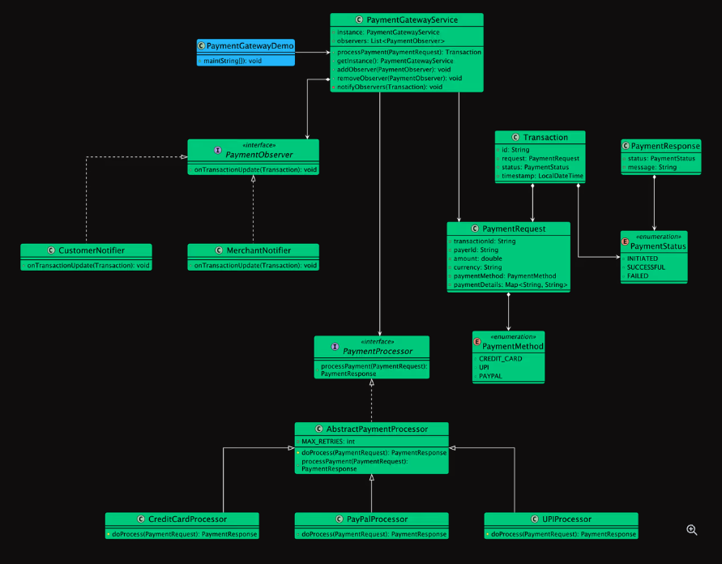

# Designing a Digital Wallet Service

## Requirements
1. The system supports multiple payment methods, including Credit Card, PayPal, and UPI.
2. The system processes the request using the appropriate payment processor.
3. If processing fails, the system retries the request up to a maximum number of times (e.g., 3).
4. The system should notify interested parties (e.g., customer, merchant) upon payment status updates.

## UML Class Diagram

## Implementations
#### [Java Implementation](../solution/)

## Classes, Interfaces and Enumerations
1. **PaymentMethod** & **PaymentStatus**: Enums that provide type-safe representations for the different ways to pay and the various states a transaction can be in.
PaymentRequest: A data object that encapsulates all the details provided by a merchant to initiate a payment.
2. **PaymentResponse**: A data object that represents the immediate synchronous result of a payment processing attempt.
3. **Transaction**: The central entity representing a single payment lifecycle. It links a *PaymentRequest* to its current *PaymentStatus* and serves as a record for logging and auditing.
4. **PaymentProcessor**: An interface (Strategy) that defines a common contract for processing payments. Concrete classes like *CreditCardProcessor* and *PayPalProcessor* implement this interface.
5. **PaymentProcessorFactory**: A factory class responsible for creating the correct PaymentProcessor instance based on the requested PaymentMethod.
6. **PaymentObserver**: An interface (Observer) for objects that need to be notified about changes in a Transaction's status.
7. **PaymentGatewayService**: The main service class that acts as a Facade for the entire system. It orchestrates the payment flow, from receiving the request to notifying observers, providing a simple API to the outside world.