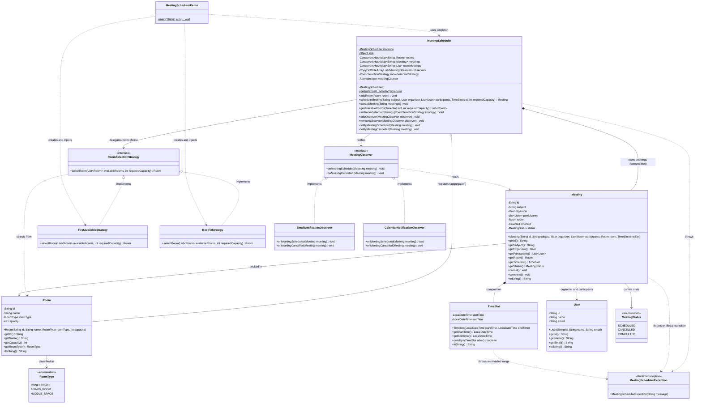
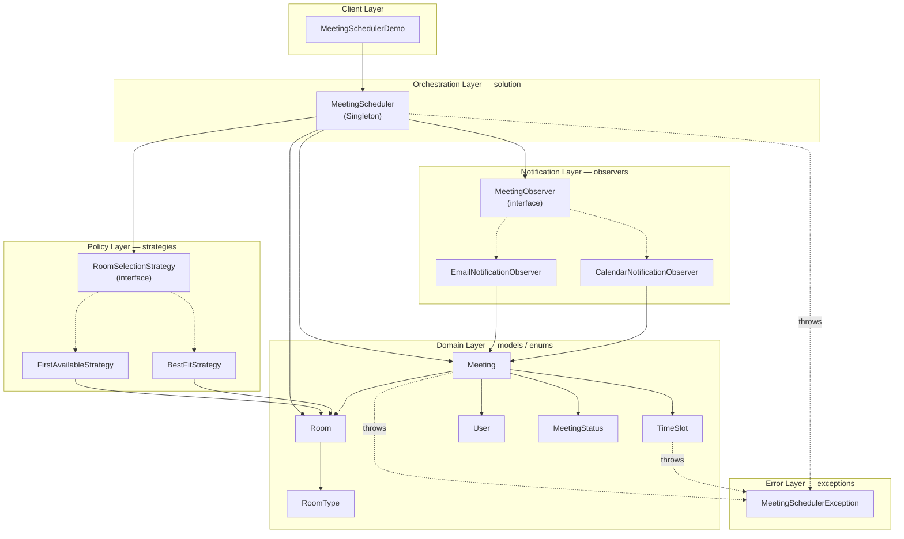
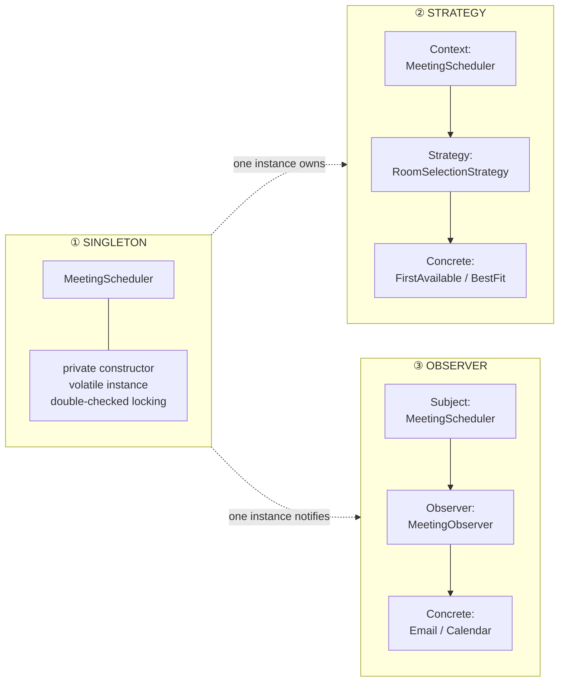

# Meeting Room Scheduler — Class Diagram

> Structural view of the system. Every field, method and relationship below mirrors the
> Java sources in [`../solution/`](../solution/).

---

## 1. Full Class Diagram

> **Note on `roomMeetings`** — its true type is
> `ConcurrentHashMap<String, List<Meeting>>`. Mermaid's `~...~` generic syntax does not
> nest, so the inner `<Meeting>` is elided in the box above.

---

## 2. Layered / Package View

How the classes group into packages, and which direction the dependencies point.
Note that every arrow points **inward or downward** — nothing in `models` knows about
the scheduler, which is what keeps the domain testable in isolation.

---

## 3. Design-Pattern Overlay

The same classes, grouped by the pattern each one plays a role in.

| Pattern | Role in this system | Swap without touching the scheduler? |
|---|---|---|
| **Singleton** | One global point of control over rooms + bookings | — |
| **Strategy** | Makes the room-choice policy interchangeable at runtime | ✅ add a class implementing `RoomSelectionStrategy` |
| **Observer** | Decouples booking from notification channels | ✅ add a class implementing `MeetingObserver` |

---

## 4. Relationship Notation Cheatsheet

| Mermaid | UML meaning | Example here | Why |
|---|---|---|---|
| `*--` | Composition — the part dies with the whole | `Meeting *-- TimeSlot` | A `TimeSlot` has no identity outside its meeting |
| `o--` | Aggregation — the part outlives the whole | `MeetingScheduler o-- Room` | Rooms are physical; they exist whether or not the scheduler does |
| `-->` | Association — holds a reference | `Meeting --> Room` | A meeting points at the room it booked |
| `<\|..` | Realization — implements an interface | `RoomSelectionStrategy <\|.. BestFitStrategy` | Strategy / Observer implementations |
| `..>` | Dependency — uses transiently | `MeetingScheduler ..> MeetingSchedulerException` | Thrown, never stored |
