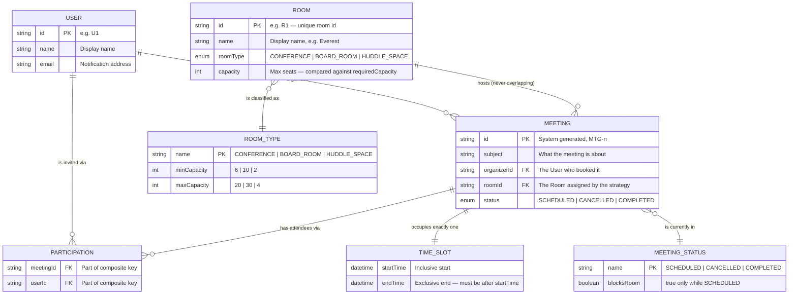
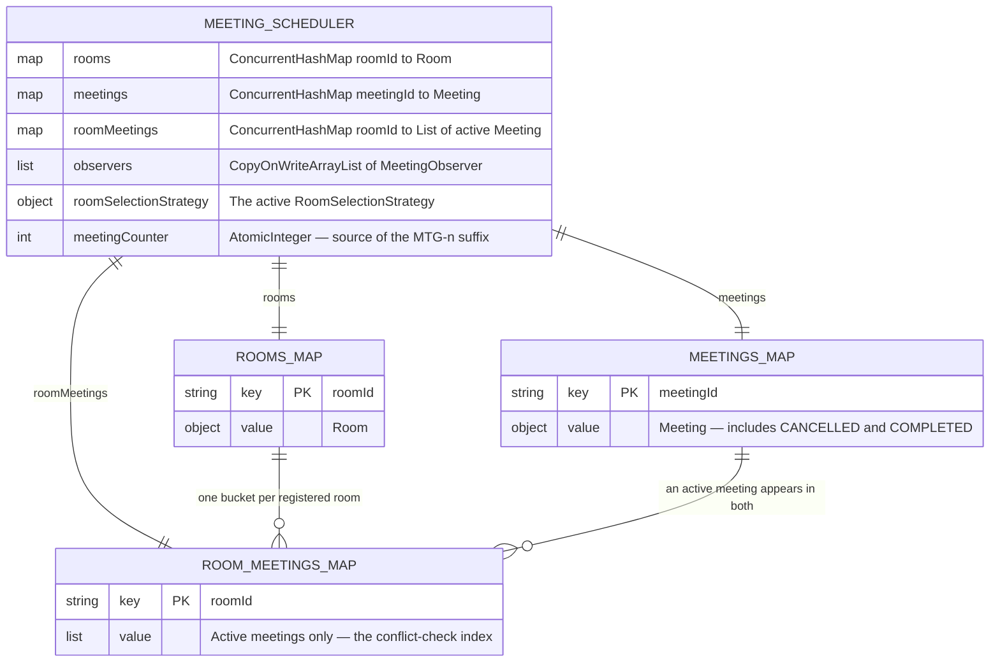
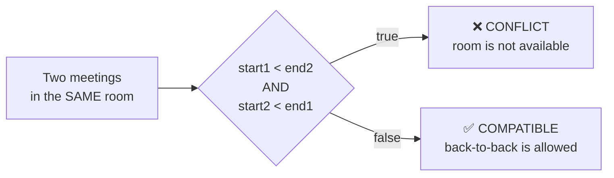

# Meeting Room Scheduler — Entity Relationship Diagram

> The **data** view: what is stored, with what attributes, and how the records relate.
> Where the class diagram shows behaviour, this shows shape — it is the diagram you
> would hand to someone asked to persist this system in a database.

---

## 1. Core ER Diagram

**Reading the crow's feet**

| Relationship | Cardinality | Meaning |
|---|---|---|
| `USER ||--o{ MEETING` | one-to-many | One user organizes zero or more meetings; each meeting has exactly one organizer |
| `ROOM ||--o{ MEETING` | one-to-many | One room hosts many meetings **over time** — but never two that overlap |
| `MEETING ||--|| TIME_SLOT` | one-to-one | `TimeSlot` is a value object owned by the meeting; it is `final` and never shared |
| `MEETING ||--o{ PARTICIPATION }o--|| USER` | many-to-many | Resolved through a junction table, since a meeting has many participants and a user attends many meetings |

---

## 2. In-Memory Storage Map

The ER diagram above is the *logical* model. This is how the running Java program
actually holds it — three `ConcurrentHashMap`s inside the singleton.

### The key invariant

There are **two** collections of meetings, and they deliberately disagree:

| | `meetings` | `roomMeetings` |
|---|---|---|
| Keyed by | meeting id | room id |
| Holds | **every** meeting ever created | only **active** (`SCHEDULED`) meetings |
| Purpose | lookup by id for `cancelMeeting` | the index scanned by `getAvailableRooms` |
| On cancel | record **stays** (audit trail) | entry is **removed** (frees the slot) |

That split is what makes requirement 7 work: cancelling removes the meeting from
`roomMeetings` so the window becomes bookable again, while `meetings` retains the
cancelled record so `cancelMeeting` on the same id can still find it and correctly
reject the second attempt.

---

## 3. Conflict Rule — The Constraint Behind the Model

No database constraint can express "no overlapping bookings per room" with a simple
`UNIQUE`; it needs an exclusion constraint over a range. The in-memory equivalent is
the `overlaps` scan:

| Meeting A | Meeting B | `overlaps`? | Verdict |
|---|---|---|---|
| 09:00–10:00 | 09:30–10:30 | `09:00 < 10:30 && 09:30 < 10:00` → true | Conflict |
| 09:00–10:00 | 10:00–11:00 | `09:00 < 11:00 && 10:00 < 10:00` → **false** | Back-to-back, allowed |
| 09:00–10:00 | 11:00–12:00 | `09:00 < 12:00 && 11:00 < 10:00` → false | No conflict |
| 09:00–12:00 | 10:00–11:00 | `09:00 < 11:00 && 10:00 < 12:00` → true | Conflict (fully contained) |

Because the comparison is strict (`<`, not `<=`), an end time that equals the next
start time is **not** an overlap — which is exactly the "back-to-back bookings are
allowed" rule from the problem statement.
