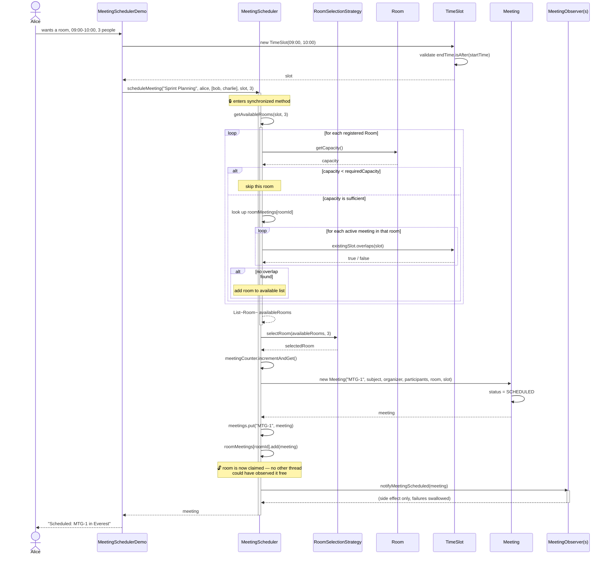
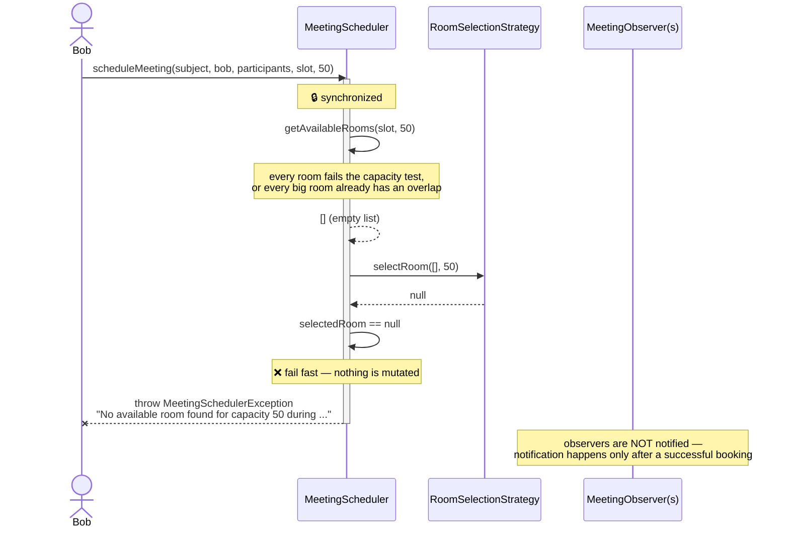
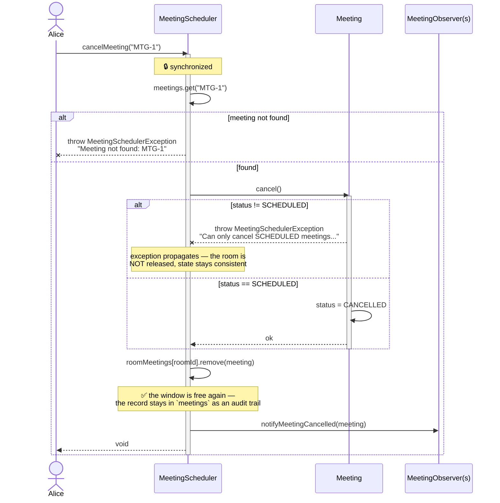
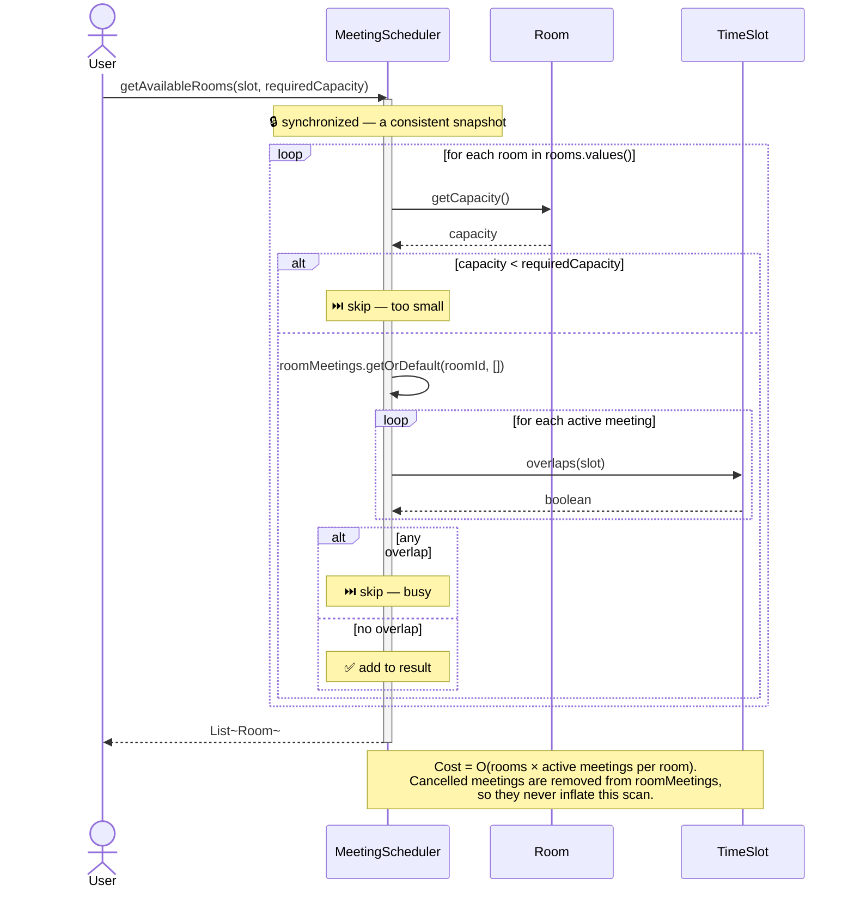
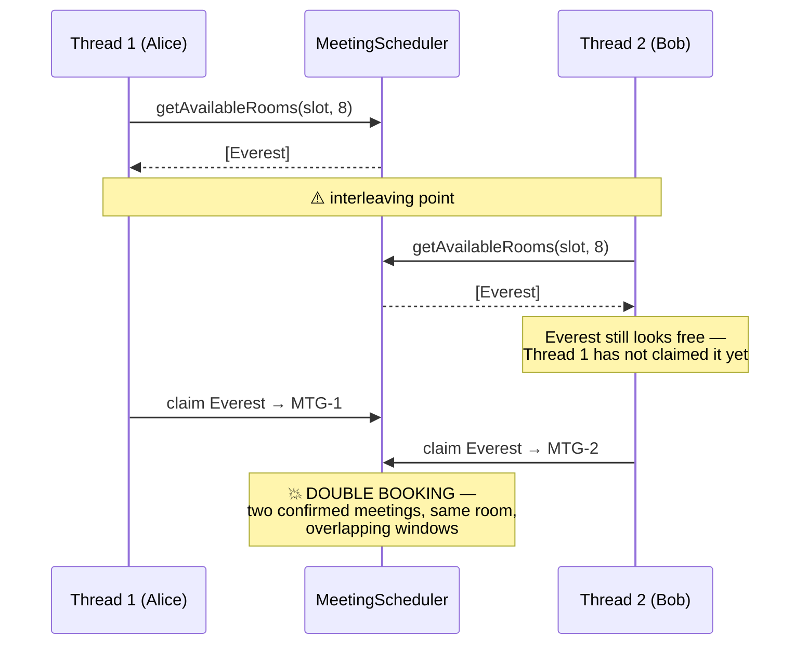
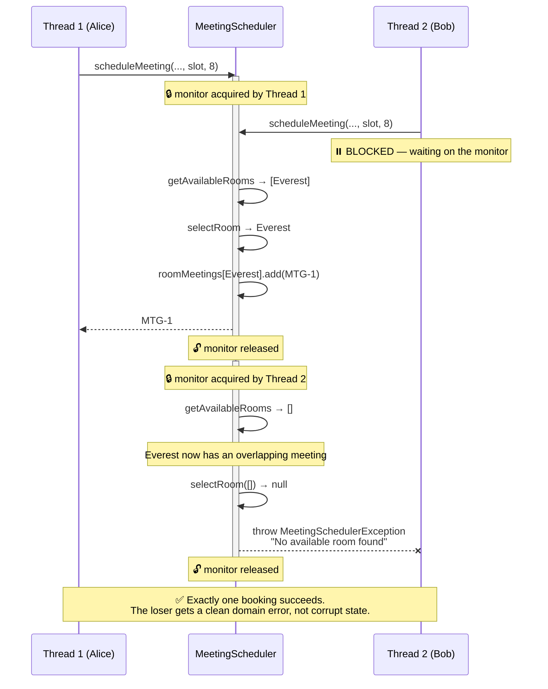
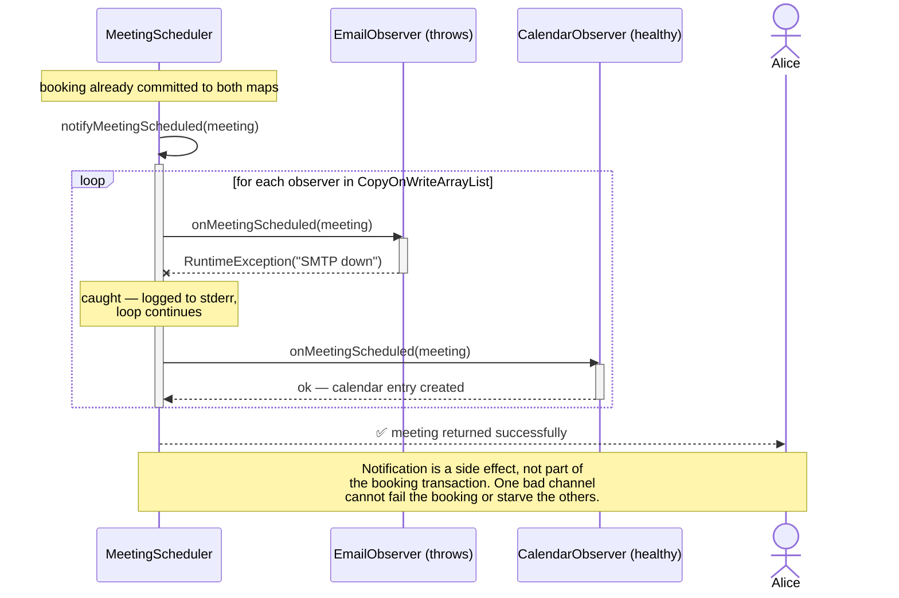
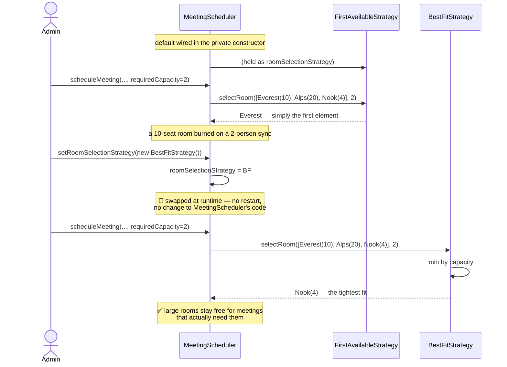

# Meeting Room Scheduler — Sequence Diagrams

> The **interaction** view: who calls whom, in what order, for each significant flow.
> Seven flows, from the happy path through to the concurrency race the whole design
> exists to prevent.

---

## Flow 1 — Schedule a Meeting (Happy Path)

The core booking transaction. Note the `synchronized` block spans the entire
check-then-act sequence — that is the whole point.

---

## Flow 2 — Schedule Rejected (No Room Available)

**What did *not* happen:** the counter was not incremented, no `Meeting` was created,
neither map was touched, and no observer fired. The failure leaves zero residue.

---

## Flow 3 — Cancel a Meeting

**Ordering matters.** `cancel()` is called *before* the room is released. If the state
machine rejects the transition, the exception propagates and the `remove` never runs —
so a double-cancel cannot free a room twice.

---

## Flow 4 — Room Availability Lookup

The read-only query, shown on its own because it is the cost centre of the design.

---

## Flow 5 — The Concurrency Race (Why `synchronized` Is Not Optional)

Two employees hit "book" at the same instant, and only one room qualifies.

### ❌ Without the lock — the bug

### ✅ With `synchronized scheduleMeeting` — the fix

The critical section is **find → select → claim**, all three. Locking only the `add`
would not help: both threads would already be holding a stale "Everest is free" answer.

---

## Flow 6 — Observer Failure Isolation

A broken notification channel must not roll back a valid booking.

Iteration is over a `CopyOnWriteArrayList`, so an observer that calls `removeObserver`
from inside its own callback cannot cause a `ConcurrentModificationException`.

---

## Flow 7 — Runtime Strategy Swap

Adding a third policy — say `SameFloorStrategy` — means writing one new class. The
scheduler is never edited. That is the Open/Closed Principle paying rent.
