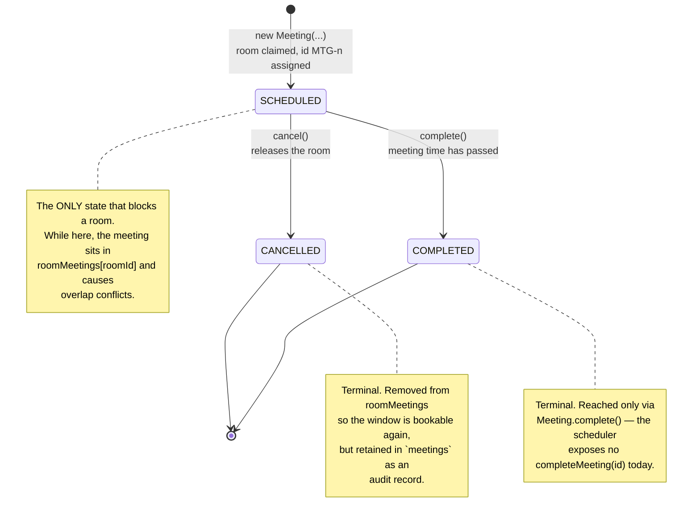
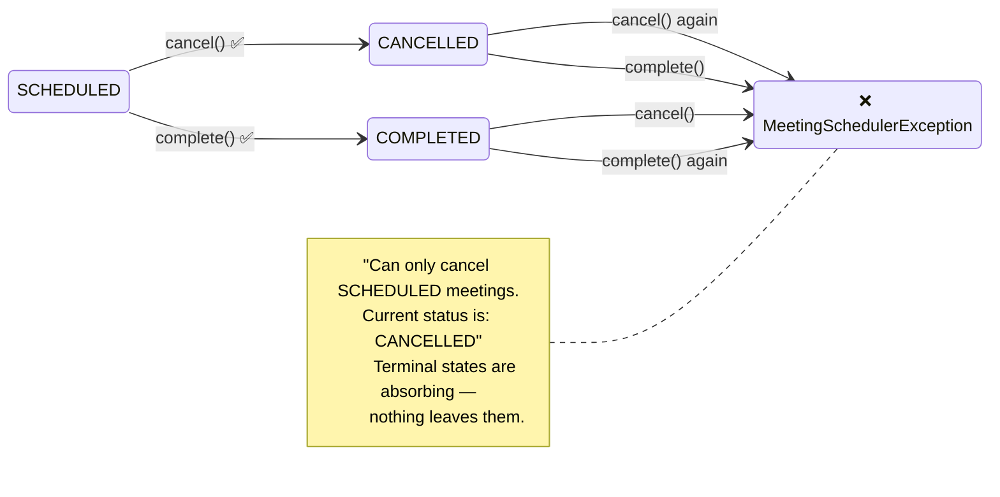
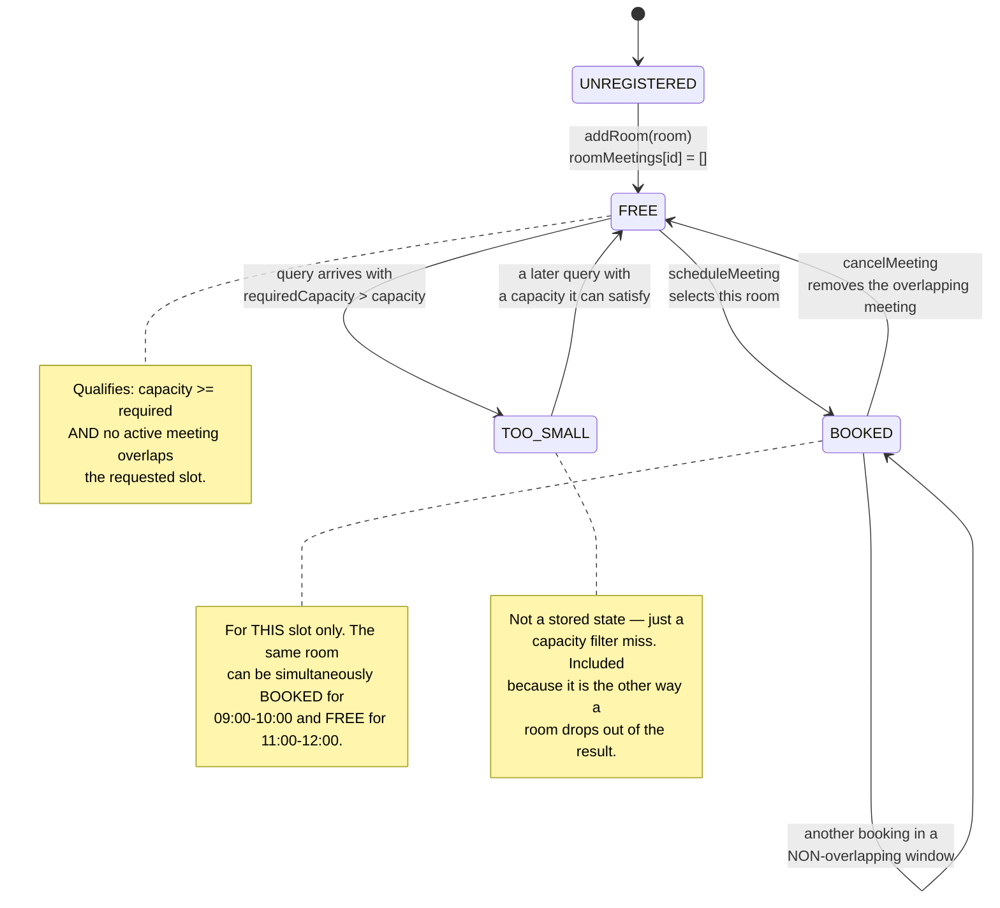
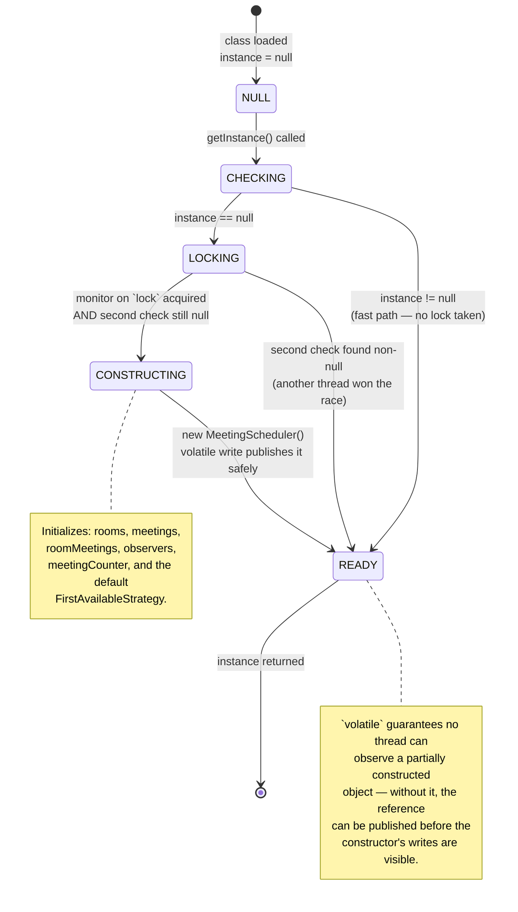
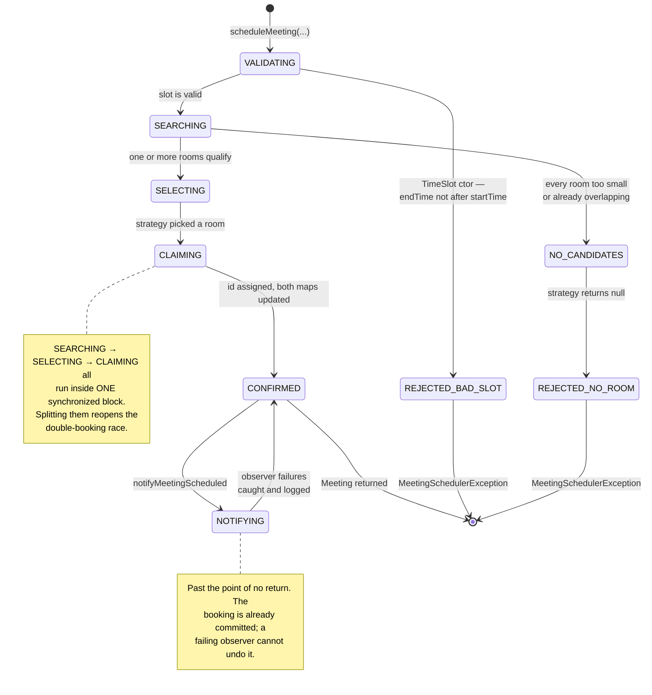

# Meeting Room Scheduler — State Diagrams

> The **lifecycle** view: every legal state, every legal transition, and — just as
> importantly — the transitions the code actively rejects.

---

## 1. Meeting Lifecycle

The state machine enforced by `Meeting.cancel()` and `Meeting.complete()`.

### Rejected transitions

Every arrow **not** drawn above throws `MeetingSchedulerException`. Both guards are
the same shape: *if the current status is not `SCHEDULED`, refuse.*

| From | Action | Result |
|---|---|---|
| `SCHEDULED` | `cancel()` | → `CANCELLED`, room released |
| `SCHEDULED` | `complete()` | → `COMPLETED` |
| `CANCELLED` | `cancel()` | ❌ `MeetingSchedulerException` |
| `CANCELLED` | `complete()` | ❌ `MeetingSchedulerException` |
| `COMPLETED` | `cancel()` | ❌ `MeetingSchedulerException` |
| `COMPLETED` | `complete()` | ❌ `MeetingSchedulerException` |

**Why fail loudly instead of silently ignoring?** A silent no-op on double-cancel would
let the caller believe it freed a room it never held, and would fire a second
`onMeetingCancelled` notification to every observer. Fail-fast keeps the notification
stream truthful.

---

## 2. Room Occupancy (per time slot)

A room has no `status` field — its availability is *derived* by scanning
`roomMeetings`. This is that derived state machine, evaluated per requested window.

The important subtlety: **availability is a function of `(room, timeSlot)`, not of the
room alone.** A room is never globally "busy"; it is busy *for a window*.

---

## 3. Singleton Initialization

The double-checked locking sequence, as a state machine over the `volatile instance`
field.

### Why both checks?

| Check | Purpose | Cost |
|---|---|---|
| **First** (outside `synchronized`) | Fast path for the 99.99% of calls after init | No lock — just a volatile read |
| **Second** (inside `synchronized`) | Correctness: two threads can both pass the first check | Lock held, but only during the rare init |

Dropping the first check makes every call pay for a lock. Dropping the second allows
two instances. Dropping `volatile` allows a half-built object to escape.

---

## 4. Booking Request Lifecycle

One request's journey through the system, from the caller's point of view.

