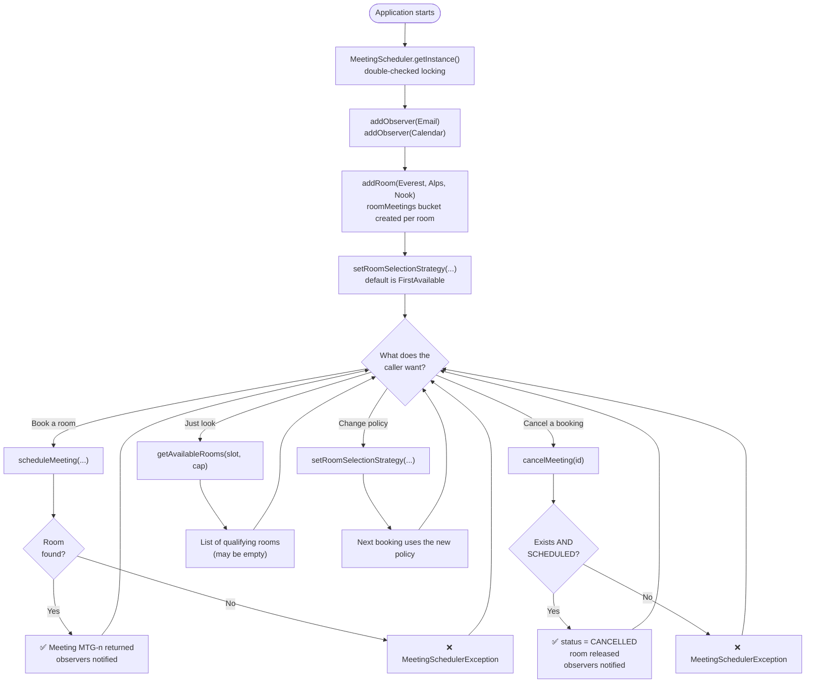
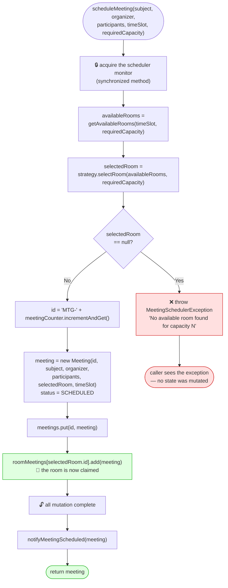
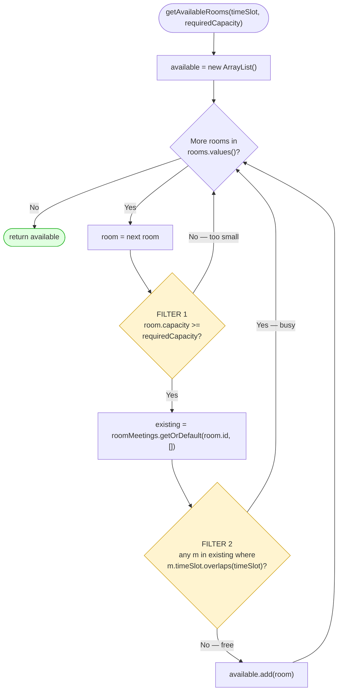
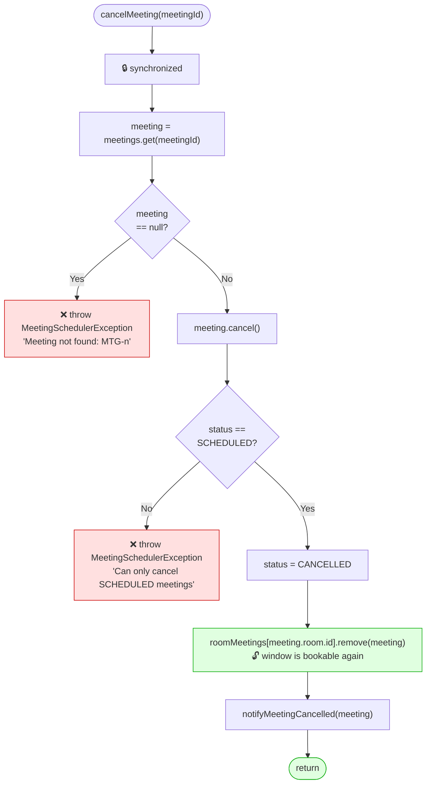
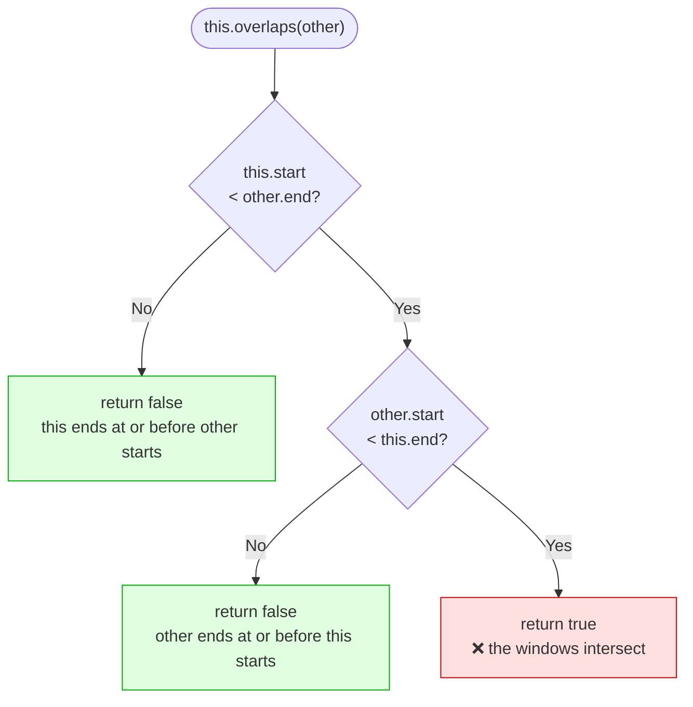
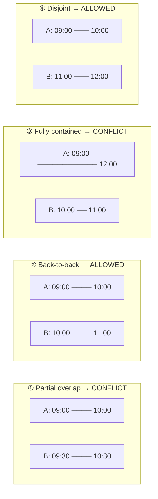
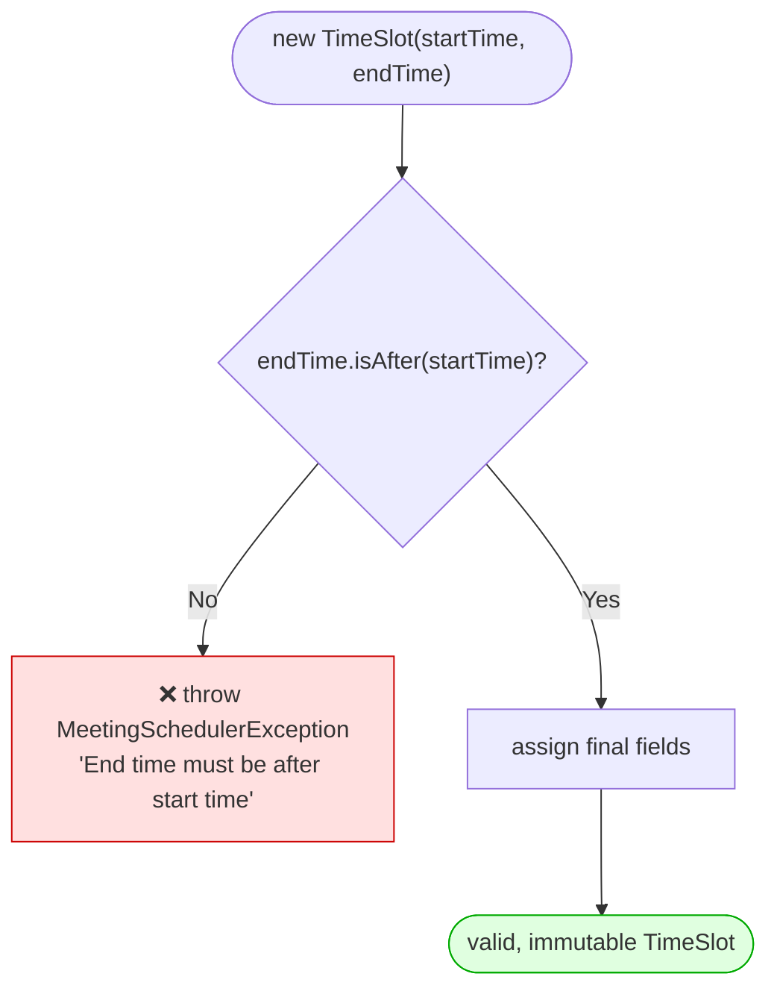
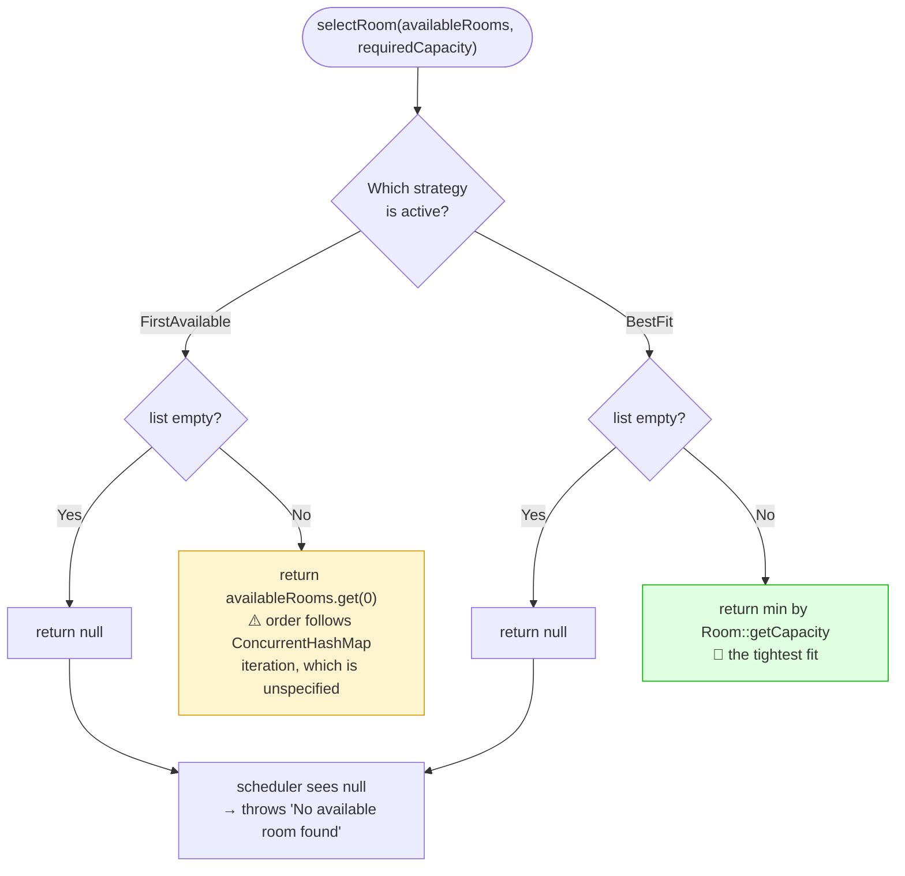
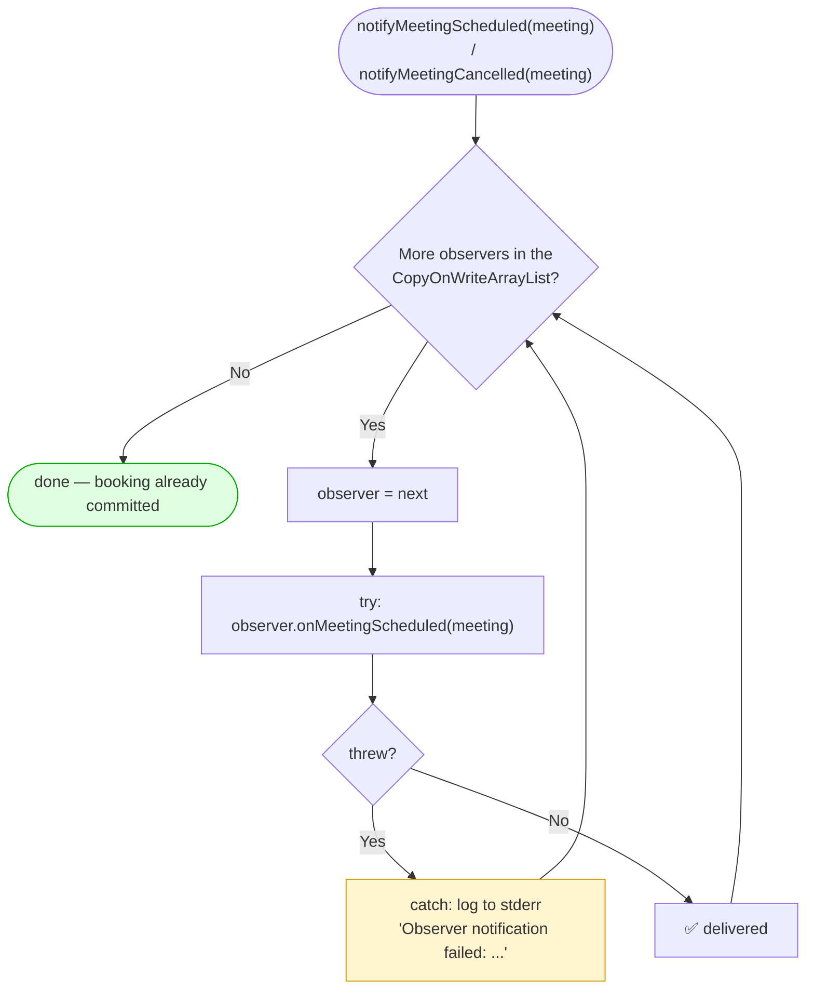
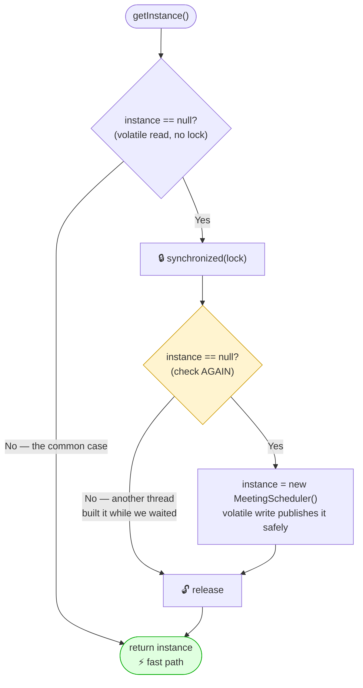

# Meeting Room Scheduler — Flowcharts

> The **algorithm** view: the decision logic inside each method, branch by branch.
> Where the sequence diagrams show *who talks to whom*, these show *what the code
> decides*.

---

## 1. Master Flow — End to End

Everything the system does, in one picture.

---

## 2. `scheduleMeeting` — The Booking Algorithm

**The critical section** is steps B → I. If the lock were released anywhere between
"found a free room" and "claimed it", a second thread could slip in and claim the same
room. This is the classic *check-then-act* race, and a single `synchronized` on the
method closes it.

---

## 3. `getAvailableRooms` — The Two-Filter Scan

| | Filter 1 — Capacity | Filter 2 — Conflict |
|---|---|---|
| Test | `room.getCapacity() >= requiredCapacity` | no active meeting overlaps the window |
| Cost | O(1) per room | O(active meetings in that room) |
| Cheap first? | ✅ yes — runs before the expensive scan | — |

**Total cost:** `O(rooms × active meetings per room)`. Because cancelled meetings are
*removed* from `roomMeetings` rather than filtered by status, dead bookings never
inflate this scan.

---

## 4. `cancelMeeting` — Release the Room

Note the meeting is **not** removed from `meetings` — only from `roomMeetings`. That is
deliberate: the record survives as an audit trail, and a second `cancelMeeting` on the
same id finds it and correctly reports "can only cancel SCHEDULED meetings" rather than
the misleading "meeting not found".

---

## 5. `TimeSlot.overlaps` — The Conflict Test

Visualised on a timeline:

The comparison is **strict** (`isBefore`, not "is before or equal"), which is precisely
why case ② is allowed: a 10:00 end does not collide with a 10:00 start.

---

## 6. `TimeSlot` Construction — Fail Fast

Both degenerate cases are rejected here: `end < start` (inverted) and `end == start`
(zero-length). Because the check lives in the constructor and the fields are `final`,
**an invalid `TimeSlot` object cannot exist** — no downstream code needs to re-validate.

---

## 7. Strategy Selection — The Two Policies

Worked example — rooms `Everest(10)`, `Alps(20)`, `Nook(4)`, all free, asking for 2:

| Strategy | Picks | Consequence |
|---|---|---|
| `FirstAvailableStrategy` | whichever room the map iterates first | A 2-person sync may occupy the 20-seat board room |
| `BestFitStrategy` | `Nook(4)` | Large rooms stay free for meetings that need them |

> ⚠️ **Known wrinkle.** `getAvailableRooms` iterates `rooms.values()` on a
> `ConcurrentHashMap`, whose iteration order is unspecified — so "first available" is
> *not* registration order. In the bundled demo, Everest is registered first but the
> first booking lands in Alps. Switching `rooms` to a `LinkedHashMap` (already safe,
> since every accessor is `synchronized`) would make the policy match its name.

---

## 8. Observer Notification — Fault Isolation

Three properties fall out of this loop:

1. **Isolation** — each observer is wrapped in its own `try/catch`, so a throw never
   escapes to the caller and never aborts the booking.
2. **Progress** — the loop continues, so observer #2 still fires after observer #1
   fails. A `try` around the *whole loop* would starve the survivors.
3. **Safe iteration** — `CopyOnWriteArrayList` means an observer may call
   `removeObserver` from inside its own callback without a
   `ConcurrentModificationException`.

---

## 9. Singleton Initialization — Double-Checked Locking

| Remove this | And you get |
|---|---|
| The **first** check | Every call pays for lock acquisition, forever |
| The **second** check | Two threads both pass check 1 → **two instances** |
| `volatile` | A reference can be published before the constructor's writes are visible — another thread sees a half-built object with null maps |
