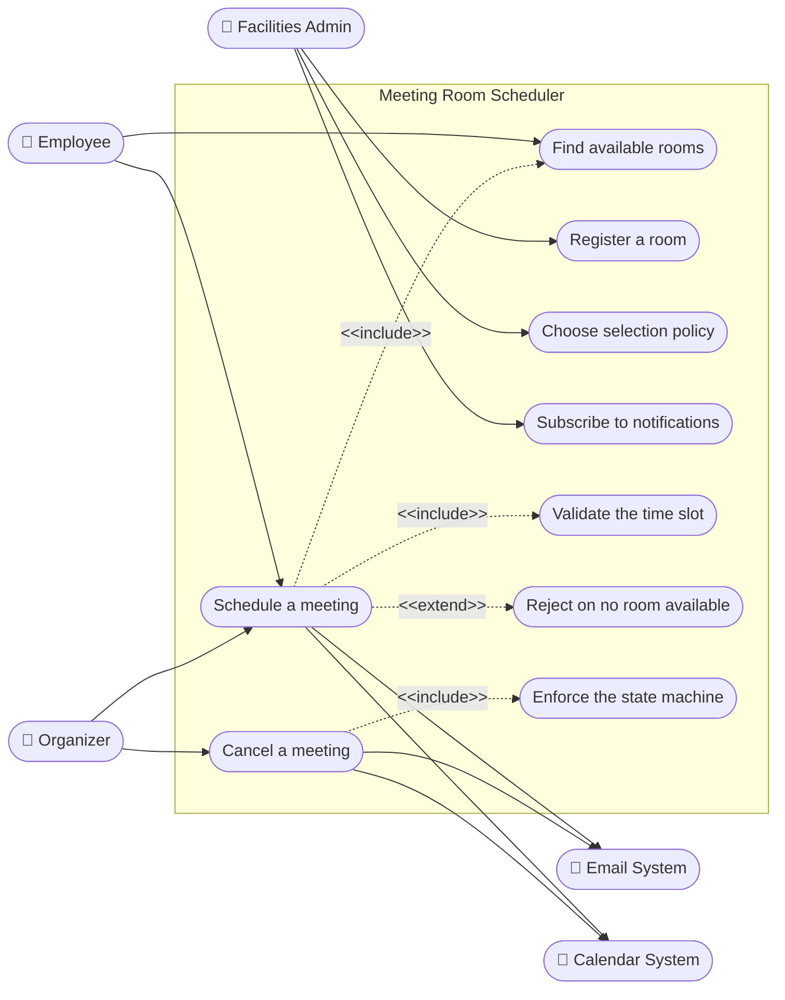
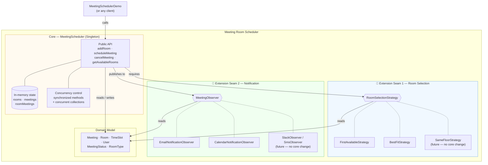
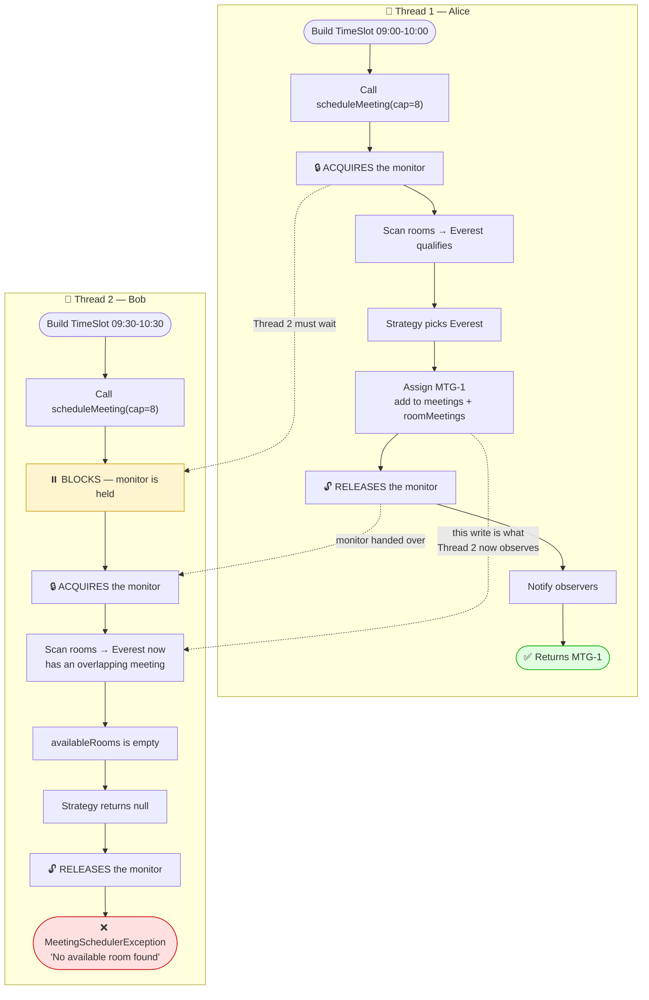
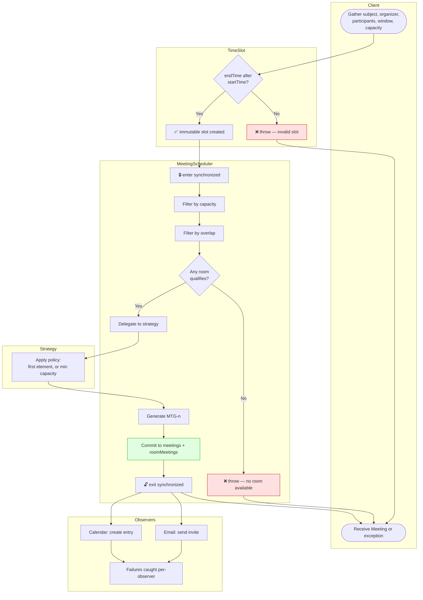
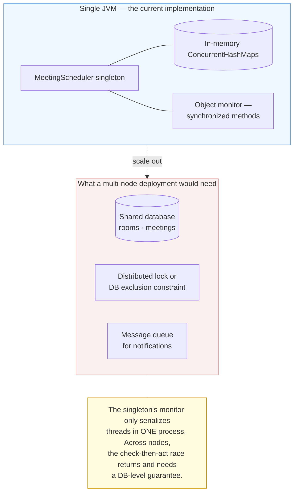

# Meeting Room Scheduler — Use Case, Component & Activity Diagrams

> The remaining UML views that earn their place: who uses the system (**use case**),
> how it is assembled and where extensions plug in (**component**), and the
> concurrent work of a booking (**activity**).

---

## 1. Use Case Diagram

Actors and the capabilities exposed to each.

| Actor | Use cases | Entry point in code |
|---|---|---|
| **Employee** | Book a room, browse availability | `scheduleMeeting`, `getAvailableRooms` |
| **Organizer** | Book, then cancel their meeting | `scheduleMeeting`, `cancelMeeting` |
| **Facilities Admin** | Register rooms, set policy, wire channels | `addRoom`, `setRoomSelectionStrategy`, `addObserver` |
| **Email / Calendar** *(secondary)* | Receive push notifications | `MeetingObserver` implementations |

---

## 2. Component Diagram

The assembled system, with the two extension seams called out explicitly.

### Open/Closed in one table

| Change request | Files added | Files **modified** |
|---|---|---|
| "Prefer rooms on my floor" | `SameFloorStrategy.java` | none |
| "Notify Slack too" | `SlackNotificationObserver.java` | none |
| "Add a PROJECTOR room type" | — | `RoomType.java` (enum only) |
| "Require approval for board rooms" | new strategy/observer | ⚠️ likely core — this is a genuine new responsibility |

The first two rows are the design working as intended. The last row is honest about
the limit: the seams cover *policy* and *notification*, not new workflow stages.

---

## 3. Activity Diagram — Concurrent Booking

A swimlane view of two employees booking at the same instant, showing where one waits.

**The guarantee:** exactly one booking is confirmed. The loser is not silently dropped
and does not corrupt state — it receives a specific domain exception it can act on
(retry a different window, or widen the search).

---

## 4. Activity Diagram — Full Booking with Swimlanes

The same booking, but split by *which object does the work*.

Read the lanes as responsibilities: the client only *asks*, `TimeSlot` guards its own
validity, the scheduler owns the transaction, the strategy owns the choice, and the
observers own the side effects. No lane reaches into another's job — which is the
"modularity and separation of concerns" requirement made visible.

---

## 5. Deployment / Extension View

Where this design sits today, and what changes when it leaves a single JVM.

| Concern | Single JVM (today) | Multi-node (what would change) |
|---|---|---|
| Mutual exclusion | `synchronized` on the scheduler | Distributed lock, or a range-exclusion constraint in the DB |
| State | `ConcurrentHashMap` | Shared relational store |
| Singleton | One instance per JVM | One instance *per node* — no longer globally unique |
| Notifications | In-process observer loop | Durable queue, so a crash does not lose the event |

This is the honest answer to "does your design scale?" — the in-process lock is correct
for the stated problem, and the table names exactly what breaks if the requirement
changes.
