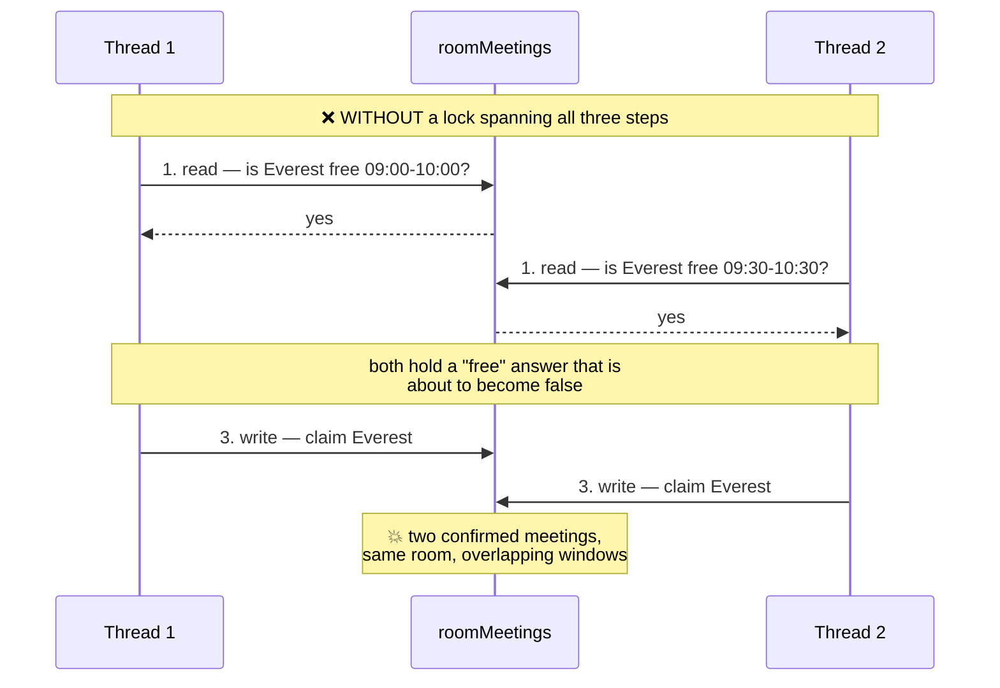
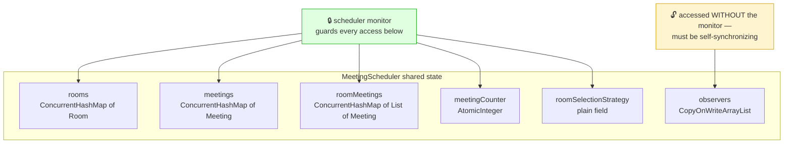
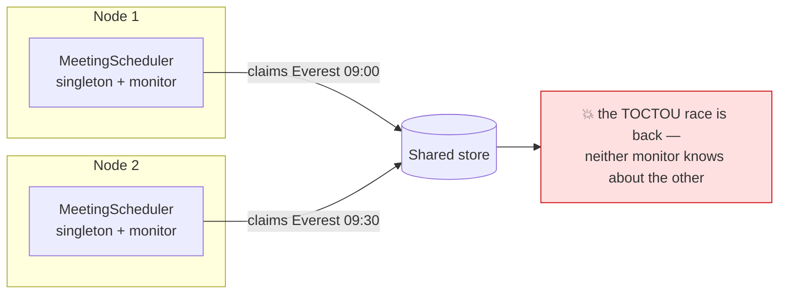

# Meeting Room Scheduler — Concurrency & Thread Safety

> How the current implementation achieves thread safety, where it still falls short,
> and what to change. Every claim below was **measured against the real code**, not
> reasoned about in the abstract — the probe results are quoted inline.

**Related:** [Problem statement](../problem/meeting-room-scheduler.md) ·
[Design diagrams](../classDiagram/) ·
[Race sequence diagram](../classDiagram/03-sequence-diagrams.md) ·
[Revision guide](revision.md) — the condensed version of this page

---

## Table of Contents

1. [The one-paragraph summary](#1-the-one-paragraph-summary)
2. [The central problem: check-then-act](#2-the-central-problem-check-then-act)
3. [Mechanism inventory — what protects what](#3-mechanism-inventory--what-protects-what)
4. [Walkthrough: the critical section](#4-walkthrough-the-critical-section)
5. [Why each collection was chosen](#5-why-each-collection-was-chosen)
6. [Safe singleton initialization](#6-safe-singleton-initialization)
7. [Verified: what actually works](#7-verified-what-actually-works)
8. [Gaps — what is NOT protected](#8-gaps--what-is-not-protected)
9. [Improvements, in priority order](#9-improvements-in-priority-order)
10. [Beyond one JVM](#10-beyond-one-jvm)
11. [The concurrency test suite](#11-the-concurrency-test-suite)
12. [Interview cheatsheet](#12-interview-cheatsheet)

---

## 1. The One-Paragraph Summary

`MeetingScheduler` is a singleton whose mutating methods are `synchronized`, so the
**find a free room → pick one → claim it** sequence executes atomically under a single
monitor. That is the whole safety argument: without it, two threads can both observe
the same room as free and confirm overlapping bookings. Shared maps are
`ConcurrentHashMap`, the observer list is a `CopyOnWriteArrayList`, the id counter is an
`AtomicInteger`, and the singleton is published through a `volatile` field guarded by
double-checked locking. **This design is correct for its stated goal** — a 200-thread
race produces exactly one booking. It is, however, *coarse*: one global lock serializes
every booking in the building, and the lock is held across observer I/O.

---

## 2. The Central Problem: Check-Then-Act

Booking a room is not one operation. It is three:

```
1. READ    which rooms are free for this window?
2. DECIDE  which of those do I want?
3. WRITE   claim it
```

Each step may be individually safe and the sequence still be broken, because the answer
from step 1 can go stale before step 3 lands. This is the classic **time-of-check to
time-of-use (TOCTOU)** race.



**Making the map thread-safe does not fix this.** `ConcurrentHashMap` guarantees each
individual `get` and `put` is atomic; it guarantees nothing about a `get` and a later
`put` behaving as one unit. That is a widely-made mistake, and it is why the
`synchronized` keyword on `scheduleMeeting` is doing the real work here — the concurrent
collections are secondary.

---

## 3. Mechanism Inventory — What Protects What

| Mechanism | Applied to | Protects against | Necessary? |
|---|---|---|---|
| `synchronized scheduleMeeting` | the booking transaction | **double-booking** (the TOCTOU race) | ✅ load-bearing |
| `synchronized cancelMeeting` | cancel + room release | lost updates on `roomMeetings` | ✅ yes |
| `synchronized getAvailableRooms` | the availability scan | reading a half-written list | ✅ yes |
| `synchronized addRoom` | room registration | a racing scan seeing a room with no bucket | ✅ yes |
| `synchronized setRoomSelectionStrategy` | the strategy field | a booking seeing a torn/stale strategy | ✅ yes |
| `volatile instance` + DCL | singleton creation | publishing a half-built object | ✅ yes |
| `ConcurrentHashMap` | `rooms`, `meetings`, `roomMeetings` | corruption on concurrent structural change | ⚠️ defence in depth — every accessor is already `synchronized` |
| `CopyOnWriteArrayList` | `observers` | `ConcurrentModificationException` during notification | ✅ yes — `add/removeObserver` are *not* synchronized |
| `AtomicInteger` | `meetingCounter` | duplicate meeting ids | ⚠️ redundant — only ever incremented under the lock |
| per-observer `try/catch` | the notification loop | one bad channel failing the booking | ✅ yes (fault isolation, not thread safety) |

Two entries are marked ⚠️. Neither is a bug — they are simply *not* where the safety
comes from. If asked "what makes this thread-safe?", the answer is the monitor, not the
`ConcurrentHashMap`.

---

## 4. Walkthrough: The Critical Section

```java
public synchronized Meeting scheduleMeeting(String subject, User organizer,
                                            List<User> participants,
                                            TimeSlot timeSlot,
                                            int requiredCapacity) {
    // ┌─ CRITICAL SECTION — all of this is one atomic unit ────────────┐
    List<Room> availableRooms = getAvailableRooms(timeSlot, requiredCapacity); // READ
    Room selectedRoom = roomSelectionStrategy.selectRoom(availableRooms, requiredCapacity); // DECIDE
    if (selectedRoom == null) {
        throw new MeetingSchedulerException("No available room found ...");    // fail, no mutation
    }
    String meetingId = "MTG-" + meetingCounter.incrementAndGet();
    Meeting meeting = new Meeting(meetingId, subject, organizer,
                                  participants, selectedRoom, timeSlot);
    meetings.put(meetingId, meeting);                                          // WRITE
    roomMeetings.get(selectedRoom.getId()).add(meeting);                       // WRITE — room claimed
    // └────────────────────────────────────────────────────────────────┘

    notifyMeetingScheduled(meeting);   // ⚠️ still holding the lock — see §8.1
    return meeting;
}
```

**Why the boundaries are where they are**

- The lock must open **before** the read. Opening it after would mean acting on an
  answer computed without protection.
- The lock must close **after** the write to `roomMeetings`. That `add` is the moment
  the room becomes visibly claimed; releasing earlier reopens the race.
- The `throw` sits inside the section but mutates nothing, so a rejected booking leaves
  **zero residue** — no id burned, no map touched, no observer fired.

**Reentrancy note.** `scheduleMeeting` calls `getAvailableRooms`, which is itself
`synchronized`. This is safe because Java monitors are *reentrant* — a thread already
holding an object's monitor re-acquires it without blocking. A non-reentrant lock here
would self-deadlock instantly.

---

## 5. Why Each Collection Was Chosen



| Field | Type | Rationale |
|---|---|---|
| `rooms` | `ConcurrentHashMap` | Read on every availability scan; concurrent reads never block each other |
| `meetings` | `ConcurrentHashMap` | Keyed lookup for cancel; holds **all** meetings, including terminal ones |
| `roomMeetings` | `ConcurrentHashMap<String, List<Meeting>>` | The conflict index. Holds only **active** meetings, so cancelled ones neither block bookings nor inflate the scan |
| `observers` | `CopyOnWriteArrayList` | The only field touched outside the monitor. Writes are rare, iteration is frequent, and iteration must tolerate concurrent mutation |
| `meetingCounter` | `AtomicInteger` | Unique ids — though the monitor already guarantees this |
| `roomSelectionStrategy` | plain reference | Written in `synchronized setRoomSelectionStrategy`, read in `synchronized scheduleMeeting` — **same monitor on both sides**, so it needs no `volatile` |

> **The `roomSelectionStrategy` detail is worth understanding.** A plain field is safe
> here *only* because both the write and every read happen under the same lock, which
> establishes happens-before. Make one read unsynchronized and the field would need to
> become `volatile`. This is the kind of invariant that decays silently during
> maintenance.

---

## 6. Safe Singleton Initialization

```java
private static volatile MeetingScheduler instance;
private static final Object lock = new Object();

public static MeetingScheduler getInstance() {
    if (instance == null) {                 // 1st check — no lock, fast path
        synchronized (lock) {
            if (instance == null) {         // 2nd check — under lock
                instance = new MeetingScheduler();
            }
        }
    }
    return instance;
}
```

| Remove this | Consequence |
|---|---|
| the **1st** check | every call pays lock acquisition forever, long after init |
| the **2nd** check | two threads both pass check 1 → **two schedulers** → two independent booking universes |
| `volatile` | ☠️ the subtle one — see below |

**Why `volatile` is not optional.** `instance = new MeetingScheduler()` is not atomic.
It is roughly: *(a)* allocate memory, *(b)* run the constructor, *(c)* assign the
reference. The JVM and CPU are permitted to reorder *(b)* and *(c)*. Without `volatile`,
Thread B can see a non-null `instance` at check 1, skip the lock entirely, and return an
object whose `rooms` and `meetings` maps are **still null**. `volatile` forbids that
reordering and establishes the happens-before edge that makes the constructor's writes
visible.

---

## 7. Verified: What Actually Works

These are not assertions — a probe harness was run against the compiled classes.

### ✅ Double-booking is genuinely prevented

200 threads, all requesting an **overlapping** window, with exactly one room large
enough to satisfy them:

```
threads competing for 1 room : 200
bookings confirmed           : 1
rejected with exception      : 199
VERDICT: PASS - exactly one winner
```

One winner, 199 clean `MeetingSchedulerException`s. No corrupt state, no silent drops.
**The core safety claim of the design holds.**

### ✅ Losers fail cleanly

The 199 rejections are ordinary domain exceptions carrying an actionable message, not
`NullPointerException`s or half-written meetings. A caller can retry with a different
window.

---

## 8. Gaps — What Is NOT Protected

### 8.1 🔴 The lock is held across observer I/O

`notifyMeetingScheduled(meeting)` is called from **inside** the `synchronized` method.
Every observer — an SMTP send, a calendar API call — runs while the global scheduler
monitor is held, blocking *every other booking in the organization*.

Measured with a 50 ms observer and 20 bookings in **20 different rooms** (zero logical
contention — they should be fully parallel):

```
independent bookings   : 20
observer latency each  : 50 ms
ideal (fully parallel) : ~50 ms
serialized (lock held) : ~1000 ms
ACTUAL elapsed         : 1074 ms
VERDICT: SERIALIZED - notification runs inside the lock
```

**~20× slower than necessary.** Throughput is capped at `1 / observer latency` bookings
per second system-wide. A single slow notification channel throttles the entire
scheduler, and an observer that blocks forever deadlocks all booking permanently.

This is the highest-impact defect in the implementation, and the cheapest to fix.

### 8.2 🔴 `Meeting.complete()` is an unguarded check-then-act

```java
public void complete() {
    if (status != MeetingStatus.SCHEDULED) { throw ...; }   // CHECK
    status = MeetingStatus.COMPLETED;                       // ACT
}
```

Neither method is `synchronized`, and `status` is not `volatile`. `cancel()` is
protected *incidentally* — it is only reachable through `synchronized cancelMeeting`.
`complete()` has **no such protection**: the scheduler exposes no `completeMeeting(id)`,
so any thread holding a `Meeting` reference calls it directly, with no lock.

Racing threads calling `complete()` on the same meeting, 3000 trials:

```
trials                           : 3000
trials with MULTIPLE winners     : 2491        (2400-2700 across runs)
worst case simultaneous winners  : 7           (of 6 racing threads + retries)
VERDICT: RACE OBSERVED - the guard is check-then-act with no lock
```

**All of those threads passed the "is it SCHEDULED?" guard.** The state machine that
requirement 8 says must reject double transitions does not, in fact, reject them — it
fails in the large majority of contended attempts.

> **How the measurement was sharpened, and why it matters.** An earlier version of this
> probe used two threads released by a `CountDownLatch` and caught the race only
> **7 times in 2000** — rare enough to look like a curiosity. The version in
> [`tests/ConcurrencyTestSuite.java`](tests/ConcurrencyTestSuite.java) uses six threads
> released by a **hot spin-wait** instead, and the same defect shows up in **2491 of
> 3000** trials.
>
> Nothing about the bug changed; only the tool did. `park`/`unpark` wakes threads in a
> cascade tens of microseconds apart, which is an eternity beside the two-or-three
> instruction window between the guard and the assignment. Threads already spinning on
> separate cores see the flag flip at essentially the same instant. **A concurrency test
> that "passes" is often just a test that never opened the window** — which is exactly
> why the suite favours spin-release over latches wherever the window is narrow.

### 8.3 🟡 `Meeting.status` has no cross-thread visibility guarantee

`status` is a plain field. Writes happen under the scheduler monitor; reads via
`getStatus()` happen under **no** lock. A thread that never acquires the scheduler
monitor has no happens-before edge and may observe `SCHEDULED` indefinitely after
another thread cancelled. The probe happened to observe the update — which proves
nothing, since the JMM permits the stale read rather than requiring it. Bugs of this
shape appear only under load, on a different CPU architecture, or after a JIT
recompilation.

### 8.4 🟡 The participant list is stored by reference

```java
this.participants = participants;   // caller keeps a live handle
```

The caller can mutate that list after the booking — from another thread, while an
observer iterates it. Result: `ConcurrentModificationException` inside a notification
channel, or an invite list that silently changes after confirmation. `Meeting` looks
immutable (all fields `final`) but is not: `final` freezes the *reference*, not the
list's contents.

### 8.5 🟡 One global lock serializes unrelated work

Booking a huddle room on floor 1 blocks booking a board room on floor 9. The monitor's
granularity is *the entire scheduler*, though the actual conflict domain is *one room*.
For an interview-scale system this is the right trade (simple and obviously correct);
for real throughput it is the ceiling.

### 8.6 🟡 The inner lists are plain `ArrayList`s

`roomMeetings` maps to `new ArrayList<>()`. The non-functional requirement says "shared
state is held in concurrent collections", but these are not concurrent. They are safe
**today**, purely because every path that touches them is `synchronized`. Any future
unsynchronized read path — a metrics endpoint, a debug dump — corrupts silently. The
code relies on an invariant nothing enforces.

### 8.7 🟡 `roomMeetings` grows without bound

Cancelled meetings are removed, but `COMPLETED` and long-past meetings are not. Every
booking permanently lengthens the list its room's availability scan walks. The
"predictable performance" requirement degrades linearly with system age, and the maps
are an unbounded memory leak in a long-running process.

### 8.8 🟢 Deadlock risk: currently low, structurally present

Only one lock is ever held and no nested acquisition occurs, so there is no lock-ordering
deadlock today. But §8.1 means arbitrary third-party code runs while the global monitor
is held. An observer that dispatches to another thread and waits for a result that needs
the scheduler produces a **guaranteed deadlock**. Fixing §8.1 removes this class of risk
entirely.

---

## 9. Improvements, in Priority Order

### 🥇 Fix 1 — Move notification outside the lock

The single highest-value change. Narrow `synchronized` from the method to a block, and
notify after releasing it.

```java
public Meeting scheduleMeeting(String subject, User organizer,
                               List<User> participants,
                               TimeSlot timeSlot, int requiredCapacity) {
    Meeting meeting;
    synchronized (this) {                                  // ← critical section only
        List<Room> availableRooms = getAvailableRooms(timeSlot, requiredCapacity);
        Room selectedRoom = roomSelectionStrategy.selectRoom(availableRooms, requiredCapacity);
        if (selectedRoom == null) {
            throw new MeetingSchedulerException("No available room found ...");
        }
        String meetingId = "MTG-" + meetingCounter.incrementAndGet();
        meeting = new Meeting(meetingId, subject, organizer,
                              participants, selectedRoom, timeSlot);
        meetings.put(meetingId, meeting);
        roomMeetings.get(selectedRoom.getId()).add(meeting);
    }                                                      // ← lock released here
    notifyMeetingScheduled(meeting);                       // I/O with no lock held
    return meeting;
}
```

Apply the same shape to `cancelMeeting`. The booking is already committed before
notification, so publishing outside the lock changes no ordering guarantee that callers
can observe, and it eliminates the deadlock class in §8.8.

**✅ Verified.** This patch was applied to a scratch copy and the probe re-run:

```
                     BEFORE      AFTER      ideal
20 bookings,
50 ms observer  :    1074 ms  →   56 ms    (~50 ms)
```

**19× faster**, essentially at the theoretical floor. Probe 1 was re-run on the same
patched build and still reports **1 confirmed / 199 rejected** — the double-booking
guarantee is untouched, which is the thing to check before accepting any change to a
critical section.

### 🥈 Fix 2 — Make the `Meeting` state machine genuinely atomic

```java
private volatile MeetingStatus status;          // visibility for lock-free readers

public synchronized void cancel() {             // atomicity for the check-then-act
    if (status != MeetingStatus.SCHEDULED) {
        throw new MeetingSchedulerException(
                "Can only cancel SCHEDULED meetings. Current status is: " + status);
    }
    status = MeetingStatus.CANCELLED;
}

public synchronized void complete() {
    if (status != MeetingStatus.SCHEDULED) {
        throw new MeetingSchedulerException(
                "Can only complete SCHEDULED meetings. Current status is: " + status);
    }
    status = MeetingStatus.COMPLETED;
}
```

`synchronized` closes the 2491-in-3000 race; `volatile` fixes §8.3 so readers that never
take the lock still see the current value. Both are needed — neither alone is sufficient.

**✅ Verified.** With this patch applied, the same 2000-trial probe reports:

```
                              BEFORE       AFTER
trials with MULTIPLE winners : 2491 / 3000  →  0 / 3000
```

While here, add the missing scheduler entry point so the lifecycle is driven under the
scheduler's own lock and the room is released:

```java
public void completeMeeting(String meetingId) {
    Meeting meeting;
    synchronized (this) {
        meeting = meetings.get(meetingId);
        if (meeting == null) {
            throw new MeetingSchedulerException("Meeting not found: " + meetingId);
        }
        meeting.complete();
        roomMeetings.get(meeting.getRoom().getId()).remove(meeting);  // frees a past slot
    }
    notifyMeetingCompleted(meeting);   // needs a new MeetingObserver method
}
```

### 🥉 Fix 3 — Make `Meeting` actually immutable

```java
this.participants = List.copyOf(participants);   // defensive, unmodifiable copy
```

Closes §8.4. A truly immutable `Meeting` is safe to publish to any number of threads and
observers with no further reasoning — which is the cheapest concurrency strategy there is.

### Fix 4 — Per-room locking, for real throughput

Replace the one global monitor with per-room locks. The pattern is *optimistic scan,
then re-verify under the room's own lock*:

```java
for (Room candidate : rankedCandidates(timeSlot, requiredCapacity)) {
    List<Meeting> bookings = roomMeetings.get(candidate.getId());
    synchronized (bookings) {                          // lock ONE room
        if (conflicts(bookings, timeSlot)) continue;   // re-check under the lock
        Meeting m = new Meeting(...);
        bookings.add(m);
        meetings.put(m.getId(), m);
        return m;                                      // notify after the block
    }
}
throw new MeetingSchedulerException("No available room found ...");
```

The **re-check under the lock** is what preserves correctness: the optimistic scan may
be stale, but nothing is claimed until a fresh check passes while holding that room's
lock. Two different rooms now book in parallel.

⚠️ **Cost:** `RoomSelectionStrategy` must change from "pick one" to "rank them", because
the loop needs a fallback order. That is a real interface change — worth it only if
measurements justify it. Do not make this change first; do Fix 1 first and re-measure,
since Fix 1 removes most of the contention that makes this look necessary.

### Fix 5 — `O(log n)` conflict detection

Today's scan is `O(rooms × meetings per room)`. Replace each room's `ArrayList` with a
`TreeMap<LocalDateTime, Meeting>` keyed by start time; a conflict then needs only the
neighbours of the requested start:

```java
NavigableMap<LocalDateTime, Meeting> byStart = roomSchedules.get(roomId);
Map.Entry<LocalDateTime, Meeting> before = byStart.floorEntry(slot.getStartTime());
Map.Entry<LocalDateTime, Meeting> after  = byStart.ceilingEntry(slot.getStartTime());
boolean conflict =
        (before != null && before.getValue().getTimeSlot().overlaps(slot)) ||
        (after  != null && after.getValue().getTimeSlot().overlaps(slot));
```

Because a room's meetings never overlap each other, checking the two neighbours is
sufficient. Shorter critical sections also reduce contention — a performance fix that
*helps* concurrency.

### Fix 6 — Bound the retained history

Evict or archive meetings whose `endTime` is in the past, so `roomMeetings` reflects
only live bookings. Fixes both the memory leak and the slow decay of scan cost (§8.7).

### Fix 7 — Use concurrent inner lists, or document the invariant

Either swap the inner `ArrayList` for `CopyOnWriteArrayList` (§8.6), or add a comment
stating that these lists are guarded by the scheduler monitor and must never be read
outside it. The comment is free; the silent assumption is not.

### Priority summary

| Fix | Impact | Effort | Do it? |
|---|---|---|---|
| 1 — notify outside the lock | 🔴 ~20× throughput, kills deadlock class | Low | **Yes, first** |
| 2 — atomic + visible state machine | 🔴 fixes a demonstrated race | Low | **Yes** |
| 3 — immutable participants | 🟡 removes a whole bug class | Trivial | **Yes** |
| 4 — per-room locks | 🟡 real scalability | High | Only if measured |
| 5 — `TreeMap` conflict check | 🟡 `O(n)` → `O(log n)` | Medium | Worth it |
| 6 — evict past meetings | 🟡 fixes unbounded growth | Medium | Yes |
| 7 — concurrent inner lists | 🟢 hardens an invariant | Trivial | Yes |

---

## 10. Beyond One JVM

Every guarantee above is **process-local**. `synchronized` coordinates threads inside one
JVM and nothing else.



Run two instances and "singleton" becomes "one per node", each with its own monitor,
each unaware of the other. What replaces the lock:

| Concern | Single JVM (today) | Multi-node |
|---|---|---|
| Mutual exclusion | `synchronized` | DB transaction with an exclusion constraint, or a distributed lock (Redis / ZooKeeper) |
| Best mechanism | — | **A DB exclusion constraint** — PostgreSQL `EXCLUDE USING gist (room_id WITH =, during WITH &&)` makes overlap impossible at the storage layer; no application lock can be forgotten |
| State | in-memory maps | shared relational store |
| Notifications | in-process observer loop | durable queue, so a crash cannot lose the event |
| Id generation | `AtomicInteger` | DB sequence or UUID — a per-node counter collides |

Note that `meetingCounter` as an `AtomicInteger` silently breaks first: two nodes both
mint `MTG-1`.

---

## 11. The Concurrency Test Suite

There is currently **no test** for the property the problem statement calls the central
constraint. The minimum worth adding:

```java
@Test
void concurrentBookingsForTheSameRoomProduceExactlyOneWinner() throws Exception {
    MeetingScheduler scheduler = MeetingScheduler.getInstance();
    scheduler.addRoom(new Room("R1", "Only", RoomType.CONFERENCE, 8));

    int threads = 200;
    ExecutorService pool = Executors.newFixedThreadPool(32);
    CountDownLatch start = new CountDownLatch(1);
    AtomicInteger confirmed = new AtomicInteger();

    for (int i = 0; i < threads; i++) {
        pool.submit(() -> {
            try {
                start.await();                      // release all threads at once
                scheduler.scheduleMeeting("race", user, List.of(),
                        new TimeSlot(base, base.plusHours(1)), 8);
                confirmed.incrementAndGet();
            } catch (Exception expected) { /* losers */ }
        });
    }
    start.countDown();                              // maximise the collision window
    pool.shutdown();
    pool.awaitTermination(30, TimeUnit.SECONDS);

    assertEquals(1, confirmed.get());               // the whole design in one assertion
}
```

The `CountDownLatch` matters: without it, threads trickle in and the race window never
opens.

### ✅ This suite now exists

It lives in [`tests/ConcurrencyTestSuite.java`](tests/ConcurrencyTestSuite.java) — twelve
tests, no build system and no JUnit required:

```bash
cd <repo root>
javac -d out $(find LLD/meetingRoomScheduler -name '*.java')
java  -cp out LLD.meetingRoomScheduler.solution.tests.ConcurrencyTestSuite
```

| Test | Asserts | Today |
|---|---|---|
| 200 threads race for one room | exactly one booking is confirmed | ✅ PASS |
| Losing threads | all fail with `MeetingSchedulerException`, never NPE | ✅ PASS |
| **Invariant after a chaos workload** | **no two confirmed meetings in any room overlap** | ✅ PASS |
| Meeting ids under contention | never duplicated | ✅ PASS |
| Concurrent cancel of one meeting | exactly one winner | ✅ PASS |
| Back-to-back windows, concurrent | both succeed, in the same room | ✅ PASS |
| Book/cancel churn | no room claim ever leaks | ✅ PASS |
| `getInstance()` from many threads | one instance | ✅ PASS |
| Throwing observer | booking still succeeds, healthy observer still fires | ✅ PASS |
| Observer churn during notification | no `ConcurrentModificationException` | ✅ PASS |
| §8.2 `complete()` is atomic | one winner among racing threads | ❌ **XFAIL** |
| §8.1 throughput vs observer latency | latency does not serialize bookings | ❌ **XFAIL** |

**Result today: 10 passed, 0 failed, 2 expected failures.**

The chaos-workload invariant test is the strongest of the ten. Rather than counting
winners — which requires knowing in advance how many bookings *should* succeed — it
fires 300 competing bookings across 5 rooms and 12 overlapping windows, then checks
every confirmed pair in every room for overlap. It asserts the domain rule itself, so it
catches double-bookings no counting test would notice.

### Why XFAIL instead of deleting or disabling them

A suite that omits the tests for known bugs teaches you nothing; one that fails the build
on them can never be committed. `knownDefect(...)` marks a test as expected-to-fail: the
defect stays visible on every run, the build stays green, and if the test ever passes the
harness reports **XPASS** with an instruction to promote it. Applying §9 Fixes 1 and 2 to
a scratch copy flips both to XPASS, with all ten other tests still passing — which is the
real proof that the fixes work and break nothing.

---

## 12. Interview Cheatsheet

**"How do you prevent double-booking?"**
> Booking is a check-then-act sequence — find free rooms, pick one, claim it — so the
> three steps must be atomic together. I made `scheduleMeeting` `synchronized`, which
> serializes the whole sequence. Concurrent collections alone would *not* be enough:
> they make each individual operation atomic but say nothing about a read followed by a
> later write.

**"Why `volatile` on the singleton?"**
> `instance = new MeetingScheduler()` can be reordered so the reference is published
> before the constructor finishes. Without `volatile`, another thread passing the
> first null-check could return an object whose maps are still null.

**"What's wrong with your design?"**
> Three things. The lock is held while observers do I/O, so one slow email channel
> serializes every booking in the building — I measured 20 independent bookings taking
> 1074 ms instead of 50. `Meeting.complete()` is an unguarded check-then-act; two
> threads both pass the status guard in 2491 of 3000 contended trials. And it's one global lock, so
> unrelated rooms contend. The first two are a few lines each; the third is a real
> redesign I'd only do with measurements in hand.

**"How would you scale it?"**
> In-process, per-room locks with a re-check under the lock. Across nodes, `synchronized`
> buys nothing — I'd push the invariant into the database as an exclusion constraint over
> the time range, so overlap is impossible at the storage layer rather than depending on
> every code path remembering to take a lock.

---

## Appendix — Reproducing the Measurements

The figures in §7 and §8 come from a four-probe harness run against the compiled
classes:

| Probe | Question | Result on the code as committed | After Fixes 1 + 2 |
|---|---|---|---|
| 1 | Do 200 racing threads double-book? | **1 confirmed, 199 rejected — PASS** | 1 / 199 — still PASS |
| 2 | Is the monitor held across observer I/O? | **1074 ms vs ~50 ms ideal — SERIALIZED** | **56 ms — parallel** |
| 3 | Can a reader see a stale `status`? | Update observed, but **not guaranteed** by the JMM | `volatile` makes it guaranteed |
| 4 | Is `Meeting.complete()` safe from racing threads? | **2491 / 3000 trials double-completed — RACE** | **0 / 3000** |

Both fixes were applied to a scratch copy of the solution and the probes re-run, which
is where the "after" column comes from. Probe 1 passing on the patched build is the
important one: it shows Fix 1 narrows the critical section without weakening the
guarantee the critical section exists for.

Probes 1 and 4 are worth promoting into the repo as permanent regression tests (§11).
Probe 2 becomes a meaningful assertion once Fix 1 lands.

> Numbers are from a single machine and will vary; the *ratios* are the point, not the
> absolute milliseconds. Probe 4's race is timing-dependent — a run reporting 0/2000 on
> the unpatched code would not mean the code is safe, only that the window was missed.
