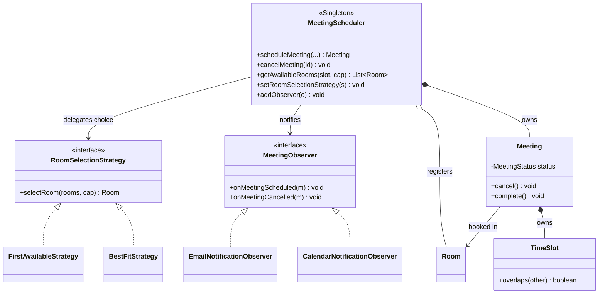
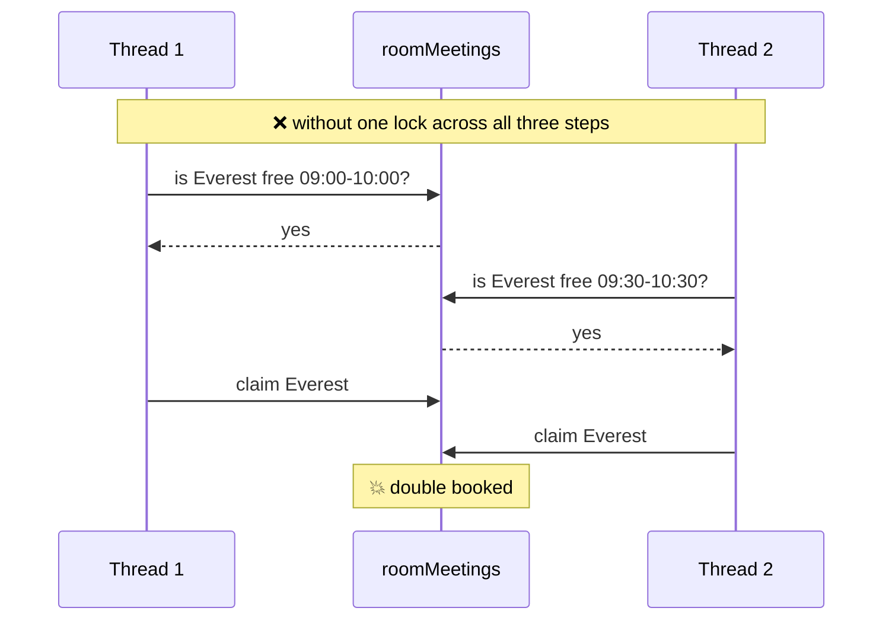

# Meeting Room Scheduler — Revision Guide

> **Read this the night before, not the whole repo.** Everything here is recall-ready:
> dense tables, the two diagrams worth memorising, and the four numbers that make the
> answer sound like you actually built it.
>
> Depth lives elsewhere and is linked where relevant:
> [problem statement](../problem/meeting-room-scheduler.md) ·
> [all diagrams](../classDiagram/) ·
> [concurrency deep-dive](concurrency-and-thread-safety.md) ·
> [tests](tests/)

---

## 0. How to use this in the time you have

| Time | Read |
|---|---|
| **60 seconds** | §1 the story, §2 the pattern map |
| **5 minutes** | + §3 classes, §5 the booking algorithm, §7 thread safety |
| **15 minutes** | + §6 overlap rule, §8 defects, §9 complexity, §10 rapid-fire |
| **30 minutes** | + §11 recall drill, then run the [simulation](tests/) and watch it |

---

## 1. The system in one story

An organisation has a fixed set of rooms of different sizes. An employee says *"I need a
room for 8 people, 10:00–11:00"* — **not** *"give me room Everest"*. The scheduler finds
every room that is **big enough and free for that window**, picks one by a swappable
policy, claims it, and tells the notification channels.

The whole design exists to protect **one invariant**:

> ### A room can host only one meeting at any instant.

That is the sentence to say first in an interview. Everything else — the singleton, the
lock, the two maps — is machinery serving it.

---

## 2. Pattern map — the memory hook

Three patterns, one per axis of change:

| Pattern | Class | Answers | Swap without touching the scheduler? |
|---|---|---|---|
| **Singleton** | `MeetingScheduler` | *Who owns the truth?* | — |
| **Strategy** | `RoomSelectionStrategy` | *Which room do I pick?* | ✅ new class only |
| **Observer** | `MeetingObserver` | *Who needs to know?* | ✅ new class only |

**Mnemonic — "One owner, one choice, many listeners."**
One scheduler owns state · one strategy makes the choice · many observers listen.

---

## 3. The classes — one line each

| Class | Responsibility | The one thing to remember |
|---|---|---|
| `MeetingScheduler` | Orchestrates everything; holds all state | `synchronized` methods = the anti-double-booking guarantee |
| `Meeting` | One booking + its lifecycle | State machine: only `SCHEDULED` may transition |
| `Room` | A physical room | Immutable; capacity is the filter |
| `TimeSlot` | A window | **Validates itself in the constructor** — an invalid slot cannot exist |
| `User` | Organizer / participant | Plain value object |
| `MeetingStatus` | `SCHEDULED → CANCELLED \| COMPLETED` | Only `SCHEDULED` blocks a room |
| `RoomType` | `CONFERENCE \| BOARD_ROOM \| HUDDLE_SPACE` | Ranges are documented but **not enforced** |
| `RoomSelectionStrategy` | The choice policy | `FirstAvailable` / `BestFit` |
| `MeetingObserver` | Notification channel | `Email` / `Calendar`, each in its own `try/catch` |
| `MeetingSchedulerException` | One domain error | Fail fast, never return `null` |

### The state, and the one subtlety worth knowing

```java
ConcurrentHashMap<String, Room>          rooms;         // roomId  → Room
ConcurrentHashMap<String, Meeting>       meetings;      // meetId  → Meeting   ← ALL meetings
ConcurrentHashMap<String, List<Meeting>> roomMeetings;  // roomId  → ACTIVE only
CopyOnWriteArrayList<MeetingObserver>    observers;
AtomicInteger                            meetingCounter; // MTG-<n>
```

> **Why two collections of meetings?** `meetings` keeps **everything** (audit trail, and
> lets `cancelMeeting` find an already-cancelled id and correctly reject it).
> `roomMeetings` keeps only **active** ones — it is the conflict index. Cancelling
> **removes from `roomMeetings` but not from `meetings`**, which is exactly what frees
> the window. If you remember one implementation detail, remember this one.

---

## 4. The class diagram worth memorising



**Draw it in this order** and it always comes out right:
1. `MeetingScheduler` box in the middle.
2. Two interfaces hanging off it (Strategy right, Observer left) + 2 impls each.
3. Domain boxes below: `Meeting` → `Room`, `Meeting` → `TimeSlot`.
4. Relationship types last: `o--` rooms (they outlive the scheduler), `*--` meetings
   and `TimeSlot` (they don't).

---

## 5. The core algorithm — booking

```
scheduleMeeting(subject, organizer, participants, slot, requiredCapacity):
  ┌─ synchronized ───────────────────────────────────────────┐
  │ 1. rooms = getAvailableRooms(slot, requiredCapacity)      │  READ
  │ 2. room  = strategy.selectRoom(rooms, requiredCapacity)   │  DECIDE
  │ 3. if room == null -> throw MeetingSchedulerException     │  (nothing mutated)
  │ 4. id = "MTG-" + counter.incrementAndGet()                │
  │ 5. meetings.put(id, meeting)                              │  WRITE
  │ 6. roomMeetings[room].add(meeting)   ← room is CLAIMED    │  WRITE
  └───────────────────────────────────────────────────────────┘
  7. notifyObservers(meeting)     ⚠️ currently INSIDE the lock — see §8
  8. return meeting
```

`getAvailableRooms` is just **two filters**:

```
for each room:
    if room.capacity < requiredCapacity      -> skip     (cheap filter first)
    if any active meeting overlaps the slot  -> skip
    else -> keep
```

`cancelMeeting(id)`: look up → `meeting.cancel()` (enforces the state machine) →
**remove from `roomMeetings`** → notify.
**Order matters:** `cancel()` runs *first*, so if the state machine rejects it, the room
is never released.

---

## 6. The overlap rule — know this cold

```java
boolean overlaps(TimeSlot other) {
    return this.start.isBefore(other.end) && other.start.isBefore(this.end);
}
```

> **`start1 < end2 && start2 < end1`** — strict `<`, so **back-to-back is allowed**.

| A | B | Overlap? |
|---|---|---|
| 09:00–10:00 | 09:30–10:30 | ✅ conflict (partial) |
| 09:00–10:00 | **10:00–11:00** | ❌ **no conflict — back-to-back** |
| 09:00–12:00 | 10:00–11:00 | ✅ conflict (contained) |
| 09:00–10:00 | 11:00–12:00 | ❌ no conflict |

`TimeSlot`'s constructor throws unless `end > start`, so zero-length and inverted slots
cannot exist anywhere downstream.

---

## 7. Thread safety — the crux

### The problem in one line

Booking is **check-then-act**: *read* free rooms → *decide* → *write* the claim. Those
three steps must be **one atomic unit**, or two threads both see the same room free.



### The five points to say

1. **`synchronized` on `scheduleMeeting` is what makes it safe** — it spans find → pick →
   claim.
2. **`ConcurrentHashMap` alone would NOT fix it.** It makes each `get`/`put` atomic, and
   says nothing about a `get` followed by a later `put`. *This is the trap question.*
3. **`volatile` + double-checked locking** on the singleton: `new MeetingScheduler()` can
   be reordered so the reference publishes before the constructor finishes; `volatile`
   forbids that.
4. **`CopyOnWriteArrayList` for observers** — the one field touched *outside* the lock
   (`addObserver` is not synchronized), and iteration must survive concurrent mutation.
5. **Observers are each wrapped in `try/catch`** — notification is a side effect, not part
   of the booking transaction.

### Redundant-but-harmless (good "what's not load-bearing?" answer)

- `AtomicInteger meetingCounter` — only ever incremented **inside** the lock.
- The `ConcurrentHashMap`s — every accessor is already `synchronized`. Defence in depth.
- `roomSelectionStrategy` is a **plain field** and that is *correct*: written and read
  under the **same monitor**, so it needs no `volatile`.

---

## 8. Known defects — the four numbers

Saying "here's what's wrong with my design, measured" is the single highest-value thing
in a design interview. All four were measured against this code
([full write-up](concurrency-and-thread-safety.md)).

| # | Defect | Measured | Fix |
|---|---|---|---|
| 1 | **Notification runs inside the lock** — one slow email serializes every booking in the building | 20 bookings in 20 *different* rooms: **1074 ms** vs ~50 ms ideal | Narrow `synchronized` to a block, notify after → **56 ms (19×)** |
| 2 | **`Meeting.complete()` is an unguarded check-then-act** on a non-volatile field, reachable with no lock | **2491 / 3000** trials had multiple threads complete the same meeting | `synchronized` methods + `volatile status` → **0 / 3000** |
| 3 | `FirstAvailableStrategy` is **non-deterministic** — iterates `ConcurrentHashMap.values()` | demo registers Everest first, books Alps | `LinkedHashMap` (safe — all access already synchronized) |
| 4 | `roomMeetings` **grows without bound** — completed/past meetings never evicted | scan cost decays with system age | evict meetings whose `endTime` has passed |

Also worth a sentence each: participants list is stored **by reference** (so `Meeting`
isn't truly immutable — use `List.copyOf`), `RoomType` capacity ranges are documented but
never enforced, and there's **no `completeMeeting(id)`** on the scheduler at all.

---

## 9. Complexity

| Operation | Cost | Note |
|---|---|---|
| `getAvailableRooms` | **O(R × M)** | R = rooms, M = active meetings per room |
| `scheduleMeeting` | O(R × M) | dominated by the scan |
| `cancelMeeting` | O(M) | list removal |
| `getInstance` | O(1) | volatile read on the fast path |

**Improve it:** per-room `TreeMap<LocalDateTime, Meeting>` keyed by start time → check
only the `floorEntry` and `ceilingEntry` neighbours → **O(log M)**. Valid because a room's
own meetings never overlap each other.

**Throughput:** one global lock serializes *all* bookings. Per-room locks with a
**re-check under the room's lock** would parallelise — but do defect #1 first and
re-measure, since it removes most of the apparent contention.

---

## 10. Rapid-fire Q&A

**"How do you prevent double-booking?"**
> Booking is check-then-act, so find → pick → claim must be atomic together.
> `scheduleMeeting` is `synchronized`. Concurrent collections alone wouldn't do it — they
> make each operation atomic, not the sequence.

**"Why is `ConcurrentHashMap` not enough?"**
> It guarantees `get` and `put` individually. The race is *between* them.

**"Why `volatile` on the singleton instance?"**
> Object construction isn't atomic — allocate, construct, assign can be reordered.
> Without `volatile` another thread can pass the first null-check and get an object whose
> maps are still null.

**"Why two checks in double-checked locking?"**
> First = fast path, no lock after init. Second = correctness, since two threads can both
> pass the first.

**"What happens if the email server is down?"**
> Nothing to the booking. Each observer is in its own `try/catch`; the failure is logged
> and the loop continues to the next channel.

**"How do you add Slack notifications / a floor-preference policy?"**
> One new class implementing `MeetingObserver` / `RoomSelectionStrategy`. The scheduler
> isn't touched — that's the Open/Closed payoff.

**"Are back-to-back meetings allowed?"**
> Yes. The comparison is strict, so a 10:00 end doesn't collide with a 10:00 start.

**"What's wrong with your design?"**
> Three things: notification holds the lock so one slow channel serializes everything
> (measured 1074 ms vs 50); `complete()` is an unsynchronized check-then-act that races
> 2491 times in 3000; and it's one global lock so unrelated rooms contend. First two are
> a few lines each.

**"How does this scale to multiple servers?"**
> It doesn't as written — `synchronized` is process-local, so "singleton" becomes one per
> node and the race returns. I'd push the invariant into the database as a range
> exclusion constraint (`EXCLUDE USING gist (room_id WITH =, during WITH &&)`), so overlap
> is impossible at the storage layer rather than depending on every path taking a lock.

---

## 11. Recall drill

Cover the right column.

| Prompt | Answer |
|---|---|
| The one invariant | A room hosts at most one meeting at any instant |
| Three patterns | Singleton, Strategy, Observer |
| What makes it thread-safe | `synchronized` spanning find→pick→claim |
| Overlap formula | `start1 < end2 && start2 < end1` |
| Back-to-back allowed? | Yes — strict `<` |
| Why two meeting collections | `meetings` = all (audit); `roomMeetings` = active (conflict index) |
| What cancel actually frees | Removal from `roomMeetings`, not `meetings` |
| Meeting id format | `MTG-<n>` from an `AtomicInteger` |
| Legal transitions | `SCHEDULED → CANCELLED`, `SCHEDULED → COMPLETED`; all else throws |
| Where is validation done | `TimeSlot` constructor — invalid slots can't exist |
| BestFit picks | Smallest capacity that fits |
| Availability complexity | O(rooms × meetings per room) |
| Biggest defect | Notification inside the lock (1074 ms → 56 ms fixed) |
| Which field is deliberately non-volatile | `roomSelectionStrategy` — same monitor both sides |

---

## 12. Extensibility — what costs what

| Change | New files | Files **modified** |
|---|---|---|
| "Prefer rooms on my floor" | `SameFloorStrategy` | none ✅ |
| "Notify Slack too" | `SlackObserver` | none ✅ |
| "Add a PROJECTOR room type" | — | `RoomType` enum only |
| "Require approval for board rooms" | — | ⚠️ core — a genuinely new workflow stage the seams don't cover |

The last row is the honest one. The extension points cover **policy** and
**notification**, not new stages in the booking lifecycle.

---

## 13. See it run

```bash
javac -d out $(find LLD/meetingRoomScheduler -name '*.java')

# 12 assertions: 10 pass, 2 XFAIL (the known defects)
java -cp out LLD.meetingRoomScheduler.solution.tests.ConcurrencyTestSuite

# 500 users, 200 rooms, 30 threads, every booking logged
java -cp out LLD.meetingRoomScheduler.solution.tests.ConcurrentBookingSimulation --summary
```

The simulation's phase 1 is the invariant made visible: 500 users contend for one 10:00
slot across 200 rooms — **exactly 200 confirmed, 300 rejected**, zero overlaps.
