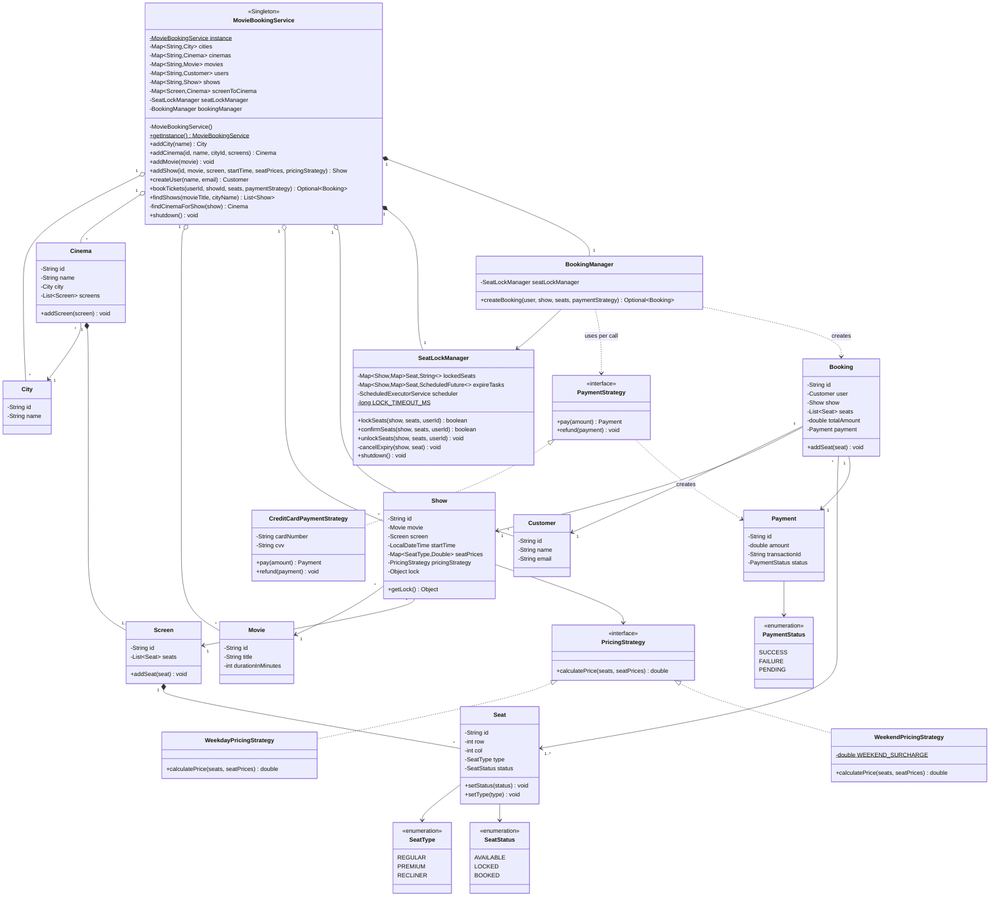
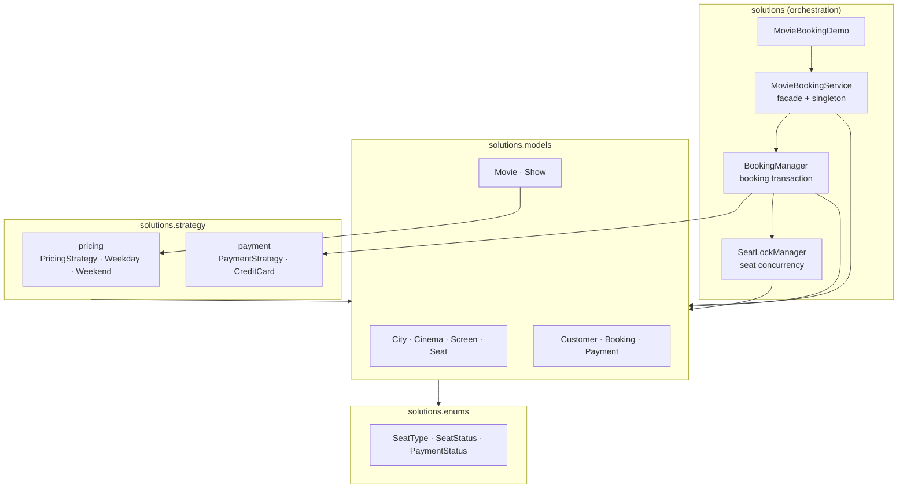
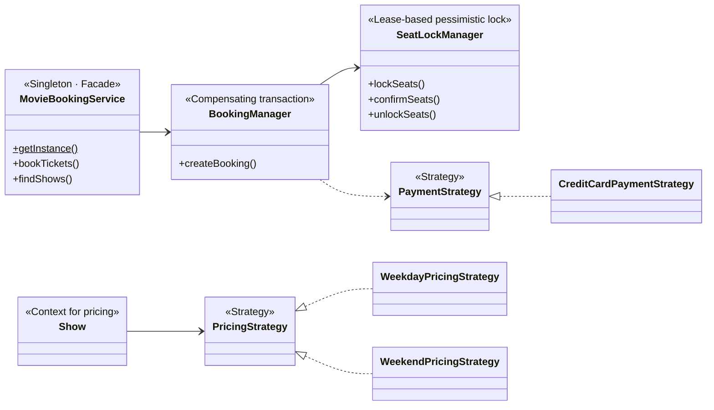
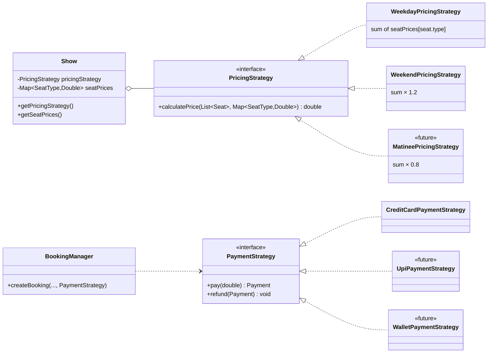
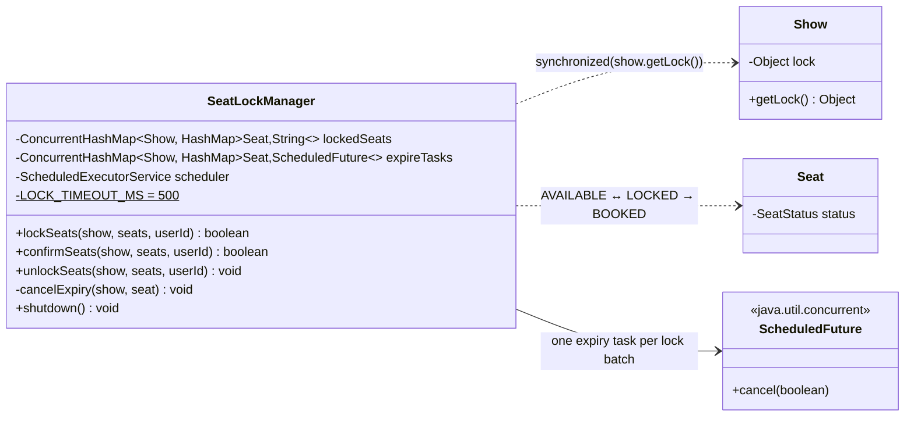
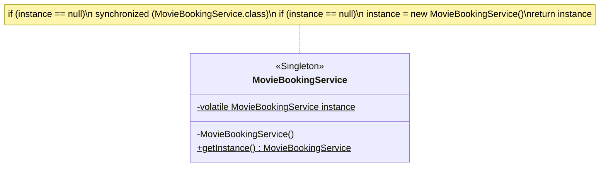

# Movie Booking System — UML Class Diagrams

> The **static structure** of the Java code in [`../solutions/`](../solutions/): every
> class, its fields and methods, and how the classes relate. Behaviour over time is in
> [04 — Sequence Diagrams](04-sequence-diagrams.md).

---

## 1. Full Class Diagram

---

## 2. Package / Layer View

Dependencies point downward only: orchestration depends on models and strategies,
models depend on enums. Nothing in `models` knows about `SeatLockManager`.

---

## 3. Design-Pattern Overlay

| Pattern | Participant(s) | Role |
|---|---|---|
| Singleton | `MovieBookingService` | One instance, one `SeatLockManager`, one source of truth for locks |
| Facade | `MovieBookingService` | Single entry point hiding `BookingManager` and `SeatLockManager` |
| Strategy | `PricingStrategy`, `PaymentStrategy` | Swappable pricing rules and payment methods |
| Lease / pessimistic lock | `SeatLockManager` | Exclusive seat hold that expires on its own |
| Compensating transaction | `BookingManager` | Unlock on payment failure, refund on lost lock |

---

## 4. Strategy Pattern Close-up

The two strategies are bound at different times. **Pricing** is fixed when the show is
scheduled (`addShow`), because it is a property of the show. **Payment** is chosen at
checkout (`bookTickets`), because it is a choice of the customer. `<<future>>` classes
are not in the code; they show where new policies plug in.

---

## 5. `SeatLockManager` Close-up

The inner `HashMap`s are not thread-safe on their own, which is fine: they are only
read or written while holding `show.getLock()` for the show that keys them.

---

## 6. The Singleton

`volatile` stops another thread from seeing the reference before the constructor has
finished, and the second `null` check stops two threads that both passed the first
check from building two instances.

---

## 7. Notation Cheatsheet

| Arrow | Meaning | Example here |
|---|---|---|
| `<\|..` | implements | `WeekdayPricingStrategy` implements `PricingStrategy` |
| `*--` | composition (part dies with whole) | `Screen *-- Seat` |
| `o--` | aggregation (held, not owned) | `MovieBookingService o-- Show` |
| `-->` | association (field reference) | `Show --> Movie` |
| `..>` | dependency (parameter / local) | `BookingManager ..> PaymentStrategy` |
| `$` | static member | `getInstance()$` |
