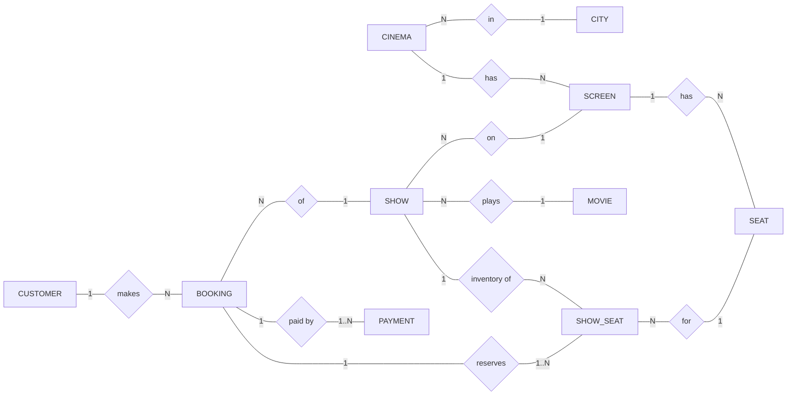
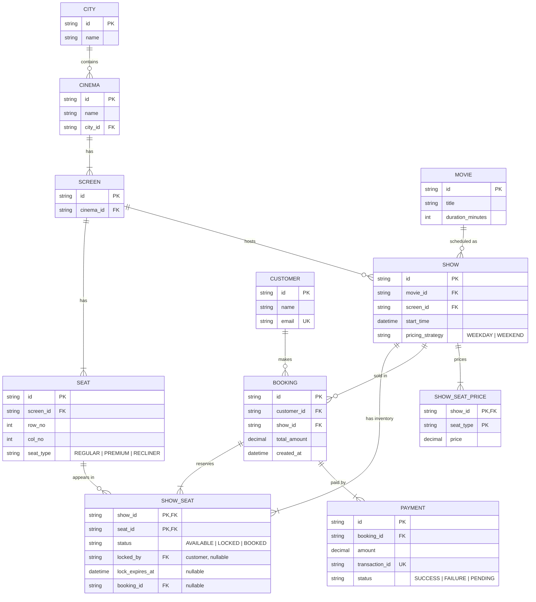
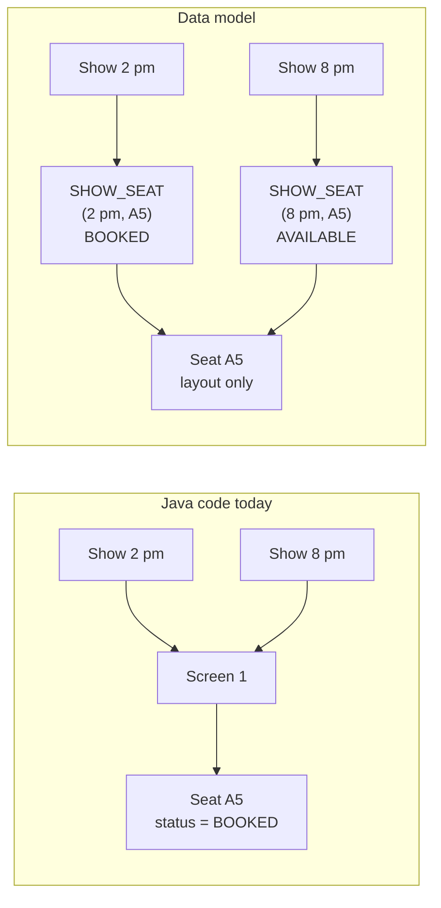

# Movie Booking System — Entity Relationship Diagrams

> The **conceptual data** view: which things exist, what describes them, and how they
> relate. There are no Java types or methods here, only entities, attributes and
> cardinalities. The physical tables, column types and indexes are in
> [03 — Database Model](03-database-model.md).

---

## 1. Conceptual ER Diagram (Chen-style, entities and relationships only)

Rectangles are entities and diamonds are relationships. The labels on each edge are the
cardinality at that end.

> **`SHOW_SEAT` is not a class in the Java code.** Today seat status lives on `Seat`,
> which is shared by every show on the screen (see
> [Known Limitations](../problems/movie-booking-system.md#known-limitations)). The data
> model fixes that: a seat's *layout* belongs to the screen, a seat's *availability*
> belongs to the show.

---

## 2. Logical ER Diagram (crow's foot)

### Reading the crow's foot

| Symbol | Meaning |
|---|---|
| `\|\|` | exactly one |
| `o\|` | zero or one |
| `\|{` | one or more |
| `o{` | zero or more |

---

## 3. Relationship & Cardinality Table

| Relationship | Cardinality | Notes |
|---|---|---|
| City – Cinema | 1 : N | A cinema is in exactly one city. |
| Cinema – Screen | 1 : N | Composition: a screen does not outlive its cinema. |
| Screen – Seat | 1 : N | The physical layout. Fixed once the screen is built. |
| Movie – Show | 1 : N | A movie runs many shows. |
| Screen – Show | 1 : N | Shows on the same screen must not overlap in time. |
| Show – ShowSeat | 1 : N | One row per seat of the show's screen, created with the show. |
| Seat – ShowSeat | 1 : N | The same physical seat, once per show. |
| Customer – Booking | 1 : N | Booking history. |
| Show – Booking | 1 : N | All bookings for a show. |
| Booking – ShowSeat | 1 : N | A ShowSeat belongs to at most one booking. |
| Booking – Payment | 1 : N | Usually one; more if a retry or refund is recorded. |

---

## 4. Resolving Seat ↔ Show (the many-to-many)

A seat is used by many shows, and a show uses many seats. Status, lock holder and
booking cannot live on either side, so they live on the association.

On the left, booking A5 for 2 pm also blocks it for 8 pm. On the right, each show has
its own copy of the seat's availability.
