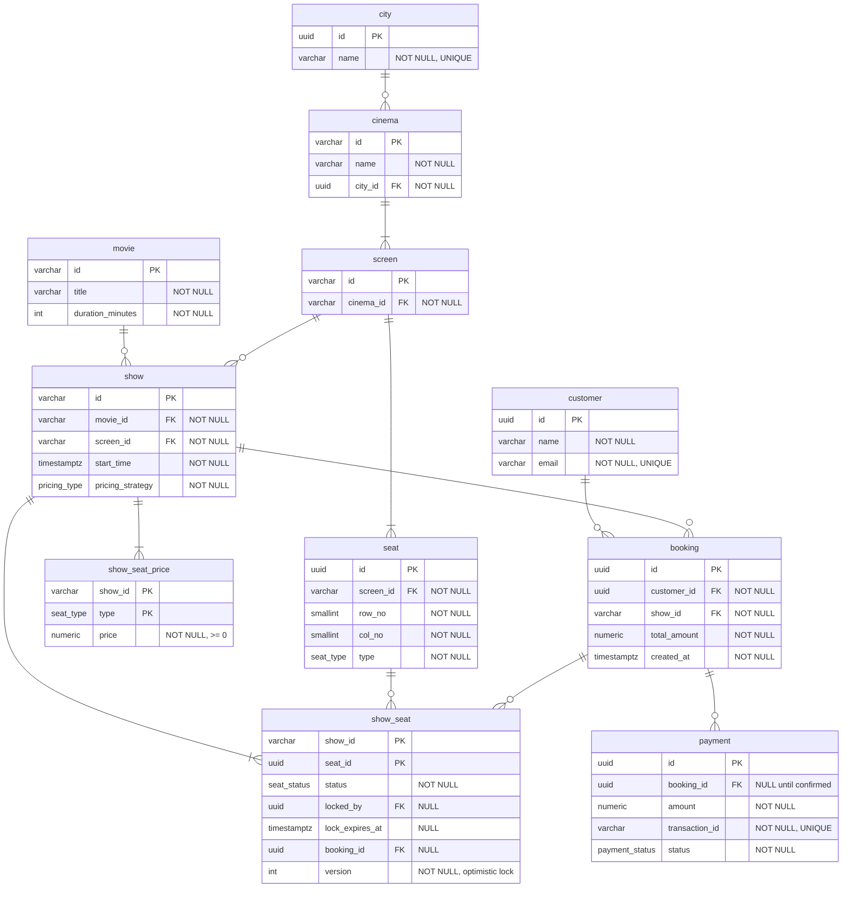
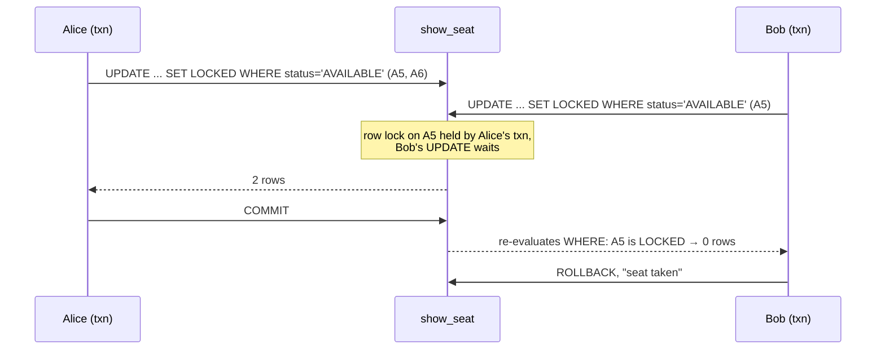
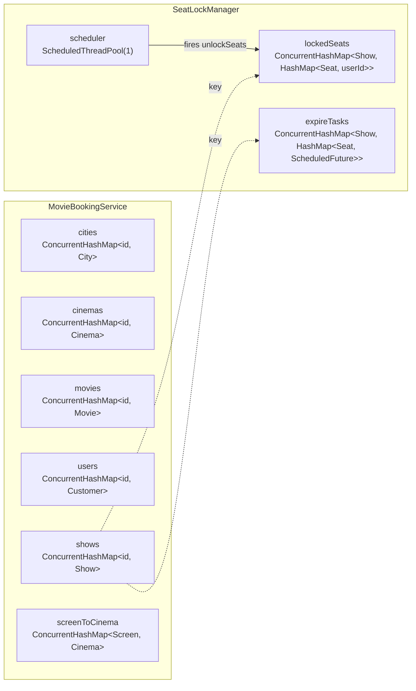

# Movie Booking System — Database Modelling

> How the in-memory design would be persisted in a relational database, and how the
> seat-locking guarantees carry over to SQL. The conceptual model is in
> [02 — ER Diagram](02-er-diagram.md).

---

## 1. Physical Schema Diagram



---

## 2. DDL (PostgreSQL)

```sql
CREATE TYPE seat_type      AS ENUM ('REGULAR', 'PREMIUM', 'RECLINER');
CREATE TYPE seat_status    AS ENUM ('AVAILABLE', 'LOCKED', 'BOOKED');
CREATE TYPE payment_status AS ENUM ('SUCCESS', 'FAILURE', 'PENDING');
CREATE TYPE pricing_type   AS ENUM ('WEEKDAY', 'WEEKEND');

CREATE TABLE city (
    id   UUID PRIMARY KEY,
    name VARCHAR(100) NOT NULL UNIQUE
);

CREATE TABLE cinema (
    id      VARCHAR(50) PRIMARY KEY,
    name    VARCHAR(200) NOT NULL,
    city_id UUID NOT NULL REFERENCES city(id)
);

CREATE TABLE screen (
    id        VARCHAR(50) PRIMARY KEY,
    cinema_id VARCHAR(50) NOT NULL REFERENCES cinema(id) ON DELETE CASCADE
);

CREATE TABLE seat (
    id        UUID PRIMARY KEY,
    screen_id VARCHAR(50) NOT NULL REFERENCES screen(id) ON DELETE CASCADE,
    row_no    SMALLINT NOT NULL,
    col_no    SMALLINT NOT NULL,
    type      seat_type NOT NULL,
    UNIQUE (screen_id, row_no, col_no)
);

CREATE TABLE movie (
    id               VARCHAR(50) PRIMARY KEY,
    title            VARCHAR(300) NOT NULL,
    duration_minutes INT NOT NULL CHECK (duration_minutes > 0)
);

CREATE TABLE show (
    id               VARCHAR(50) PRIMARY KEY,
    movie_id         VARCHAR(50) NOT NULL REFERENCES movie(id),
    screen_id        VARCHAR(50) NOT NULL REFERENCES screen(id),
    start_time       TIMESTAMPTZ NOT NULL,
    pricing_strategy pricing_type NOT NULL
);

CREATE TABLE show_seat_price (
    show_id VARCHAR(50) NOT NULL REFERENCES show(id) ON DELETE CASCADE,
    type    seat_type   NOT NULL,
    price   NUMERIC(10,2) NOT NULL CHECK (price >= 0),
    PRIMARY KEY (show_id, type)
);

CREATE TABLE customer (
    id    UUID PRIMARY KEY,
    name  VARCHAR(200) NOT NULL,
    email VARCHAR(320) NOT NULL UNIQUE
);

CREATE TABLE booking (
    id           UUID PRIMARY KEY,
    customer_id  UUID NOT NULL REFERENCES customer(id),
    show_id      VARCHAR(50) NOT NULL REFERENCES show(id),
    total_amount NUMERIC(10,2) NOT NULL,
    created_at   TIMESTAMPTZ NOT NULL DEFAULT now()
);

CREATE TABLE show_seat (
    show_id         VARCHAR(50) NOT NULL REFERENCES show(id) ON DELETE CASCADE,
    seat_id         UUID NOT NULL REFERENCES seat(id),
    status          seat_status NOT NULL DEFAULT 'AVAILABLE',
    locked_by       UUID REFERENCES customer(id),
    lock_expires_at TIMESTAMPTZ,
    booking_id      UUID REFERENCES booking(id),
    version         INT NOT NULL DEFAULT 0,
    PRIMARY KEY (show_id, seat_id),
    CHECK ( (status = 'AVAILABLE' AND locked_by IS NULL AND booking_id IS NULL)
         OR (status = 'LOCKED'    AND locked_by IS NOT NULL AND lock_expires_at IS NOT NULL)
         OR (status = 'BOOKED'    AND booking_id IS NOT NULL) )
);

CREATE TABLE payment (
    id             UUID PRIMARY KEY,
    booking_id     UUID REFERENCES booking(id),
    amount         NUMERIC(10,2) NOT NULL,
    transaction_id VARCHAR(100) NOT NULL UNIQUE,
    status         payment_status NOT NULL
);
```

The `CHECK` on `show_seat` makes the seat state machine
([05 § 1](05-state-diagrams.md#1-seat-lifecycle-per-show)) impossible to violate at the
storage layer.

---

## 3. Indexes and the Queries They Serve

| Query | Index |
|---|---|
| `findShows(title, city)` | `movie(lower(title))`, `cinema(city_id)`, `show(movie_id, start_time)` |
| Seat map for a show | PK `show_seat(show_id, seat_id)` |
| Expire stale locks | partial `show_seat(lock_expires_at) WHERE status = 'LOCKED'` |
| "My bookings" | `booking(customer_id, created_at DESC)` |
| Payment by gateway id | UNIQUE `payment(transaction_id)` |

```sql
CREATE INDEX idx_movie_title        ON movie (lower(title));
CREATE INDEX idx_cinema_city        ON cinema (city_id);
CREATE INDEX idx_show_movie_time    ON show (movie_id, start_time);
CREATE INDEX idx_show_seat_expiring ON show_seat (lock_expires_at) WHERE status = 'LOCKED';
CREATE INDEX idx_booking_customer   ON booking (customer_id, created_at DESC);
```

---

## 4. Concurrency at the Database Layer

The Java code serialises per show with `synchronized (show.getLock())`. Across many app
servers that monitor no longer exists, so the database must provide the same guarantee.

### Lock seats (all-or-nothing), conditional update

```sql
BEGIN;
UPDATE show_seat
   SET status = 'LOCKED', locked_by = :customer,
       lock_expires_at = now() + interval '10 minutes', version = version + 1
 WHERE show_id = :show
   AND seat_id = ANY(:seats)
   AND (status = 'AVAILABLE'
        OR (status = 'LOCKED' AND lock_expires_at < now()));   -- reclaim expired
-- if rows_affected <> cardinality(:seats) → ROLLBACK (someone else holds a seat)
COMMIT;
```

### Confirm after payment

```sql
UPDATE show_seat
   SET status = 'BOOKED', booking_id = :booking, locked_by = NULL, lock_expires_at = NULL
 WHERE show_id = :show AND seat_id = ANY(:seats)
   AND status = 'LOCKED' AND locked_by = :customer AND lock_expires_at >= now();
-- rows_affected <> cardinality(:seats) → ROLLBACK and refund (mirrors confirmSeats)
```



| Java mechanism | Database equivalent |
|---|---|
| `synchronized (show.getLock())` | row locks taken by the conditional `UPDATE` |
| `seat.getStatus() != AVAILABLE` check | `WHERE status = 'AVAILABLE'` |
| `lockedSeats[show][seat] = userId` | `locked_by` column |
| `ScheduledFuture` expiry | `lock_expires_at` + sweeper job, or reclaim in the `WHERE` |
| `confirmSeats` ownership re-check | `WHERE locked_by = :customer AND lock_expires_at >= now()` |

At very high contention (premiere night) the lock usually moves to Redis
(`SET seat:{show}:{seat} {customer} NX PX 600000`) with the database as the system of
record. See [07 § 4](07-usecase-component-deployment.md#4-deployment-view).

---

## 5. In-Memory Storage Map (what the Java code actually holds)



| Structure | Thread safety |
|---|---|
| Registries | `ConcurrentHashMap`, safe for concurrent put/get |
| Inner `HashMap`s in `SeatLockManager` | only touched inside `synchronized (show.getLock())` |
| `Seat.status` | plain field, only written inside the show lock; reads outside the lock (seat map display) may be momentarily stale |

---

## 6. Mapping Java → Tables

| Java | Table | Note |
|---|---|---|
| `City` | `city` | |
| `Cinema` | `cinema` | `screens` list → `screen.cinema_id` |
| `Screen` | `screen` | `seats` list → `seat.screen_id` |
| `Seat` (row, col, type) | `seat` | layout only |
| `Seat.status` | `show_seat.status` | moved to per-show table |
| `Movie` | `movie` | |
| `Show` | `show` | `seatPrices` → `show_seat_price`, strategy → enum column |
| `Customer` | `customer` | |
| `Booking` | `booking` | `seats` → `show_seat.booking_id` |
| `Payment` | `payment` | |
| `SeatLockManager.lockedSeats` | `show_seat.locked_by`, `lock_expires_at` | |
