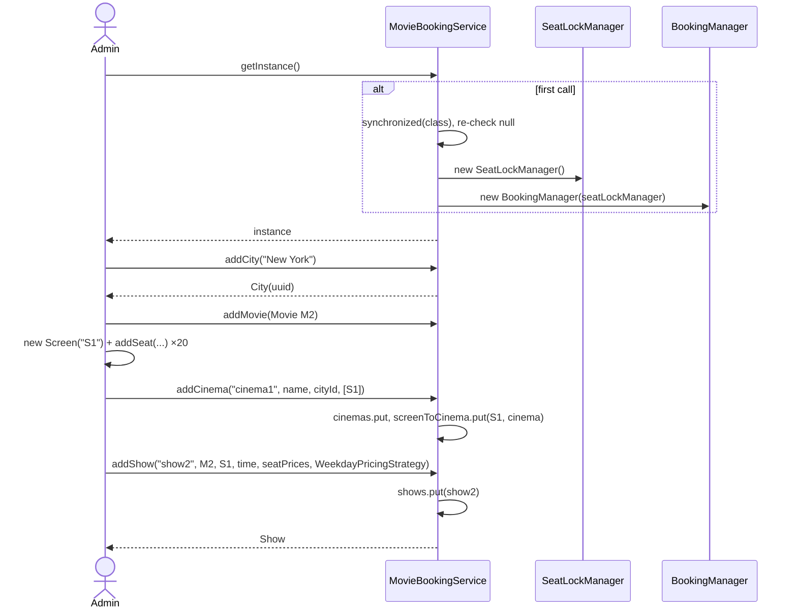
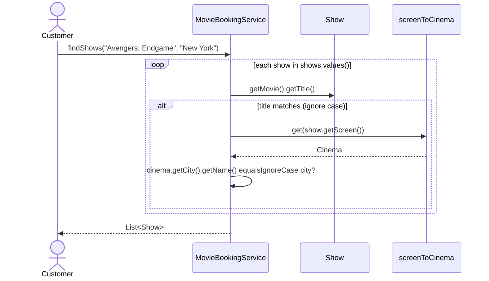
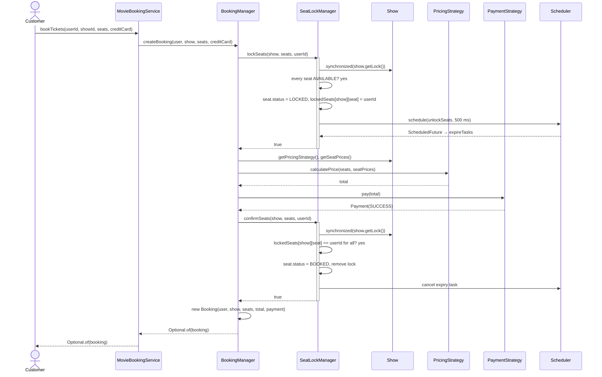
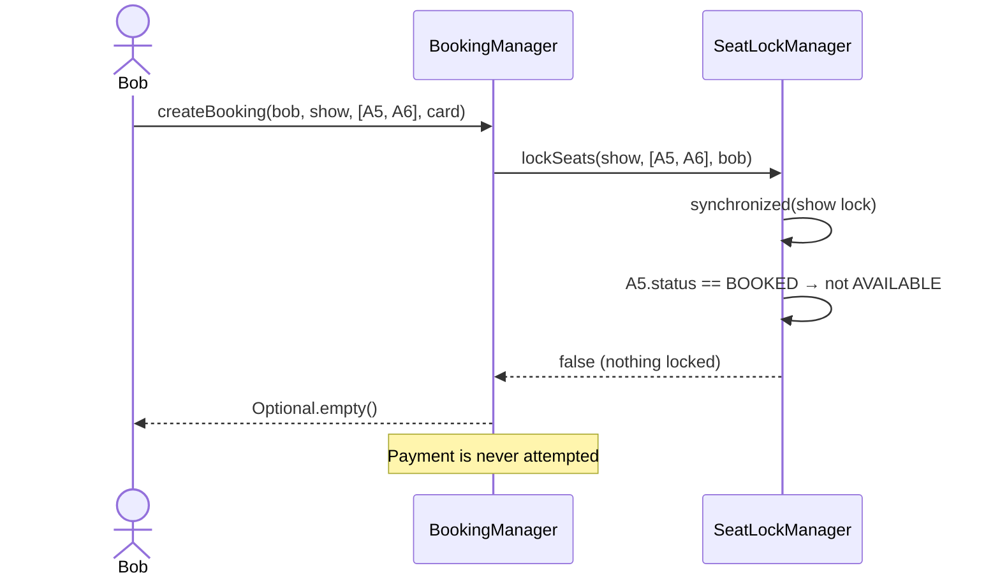
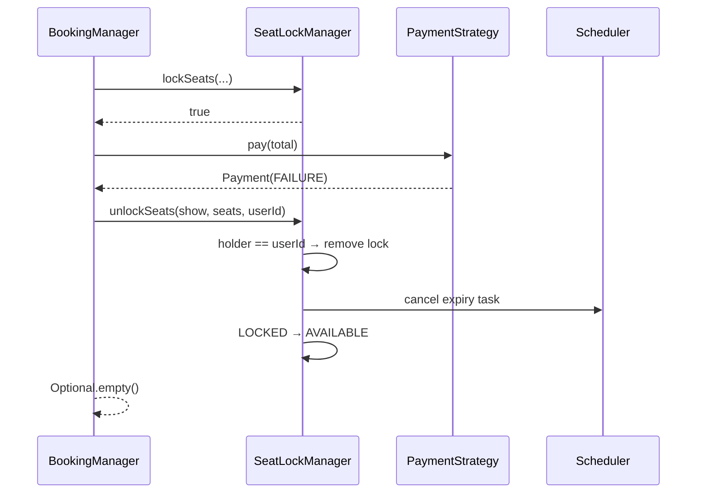
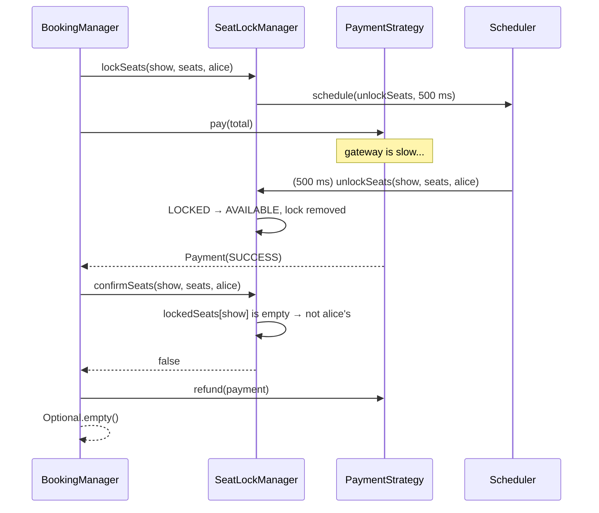
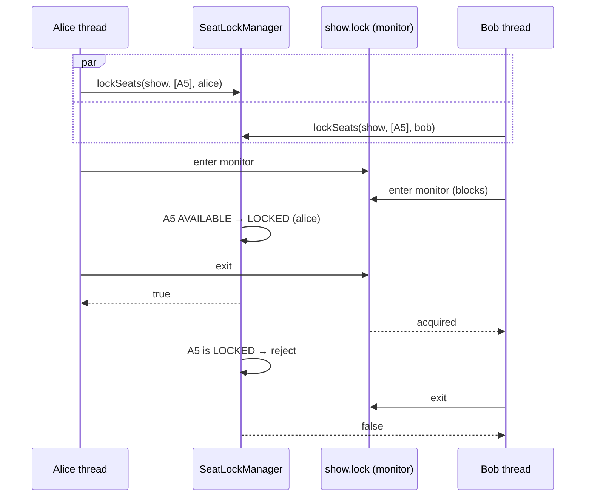
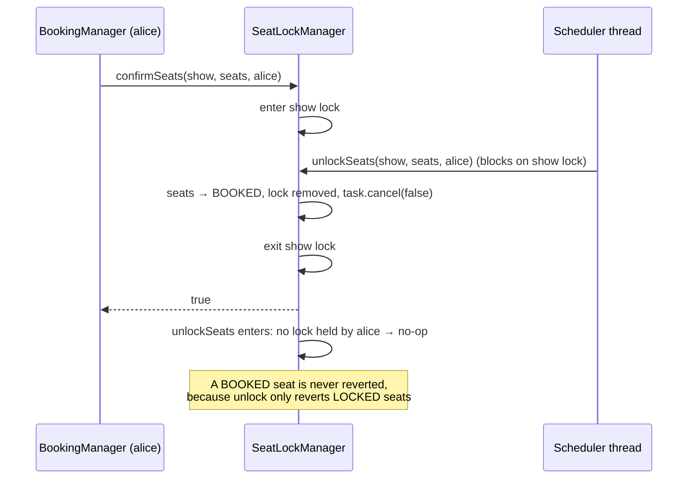
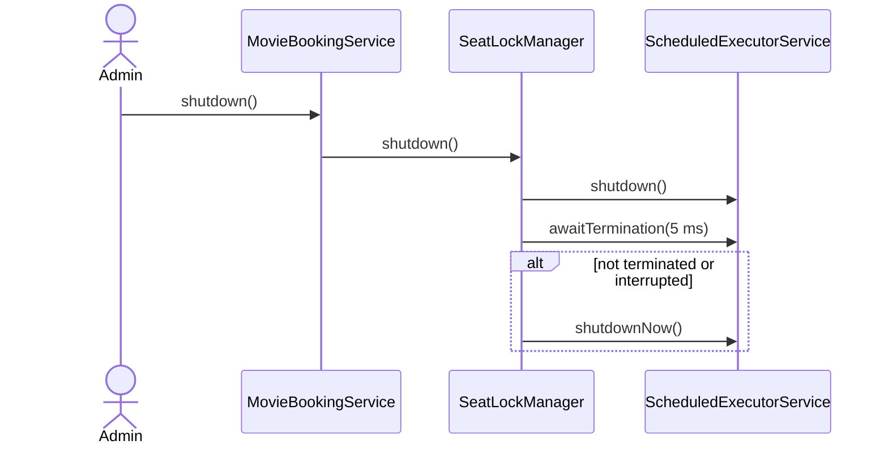
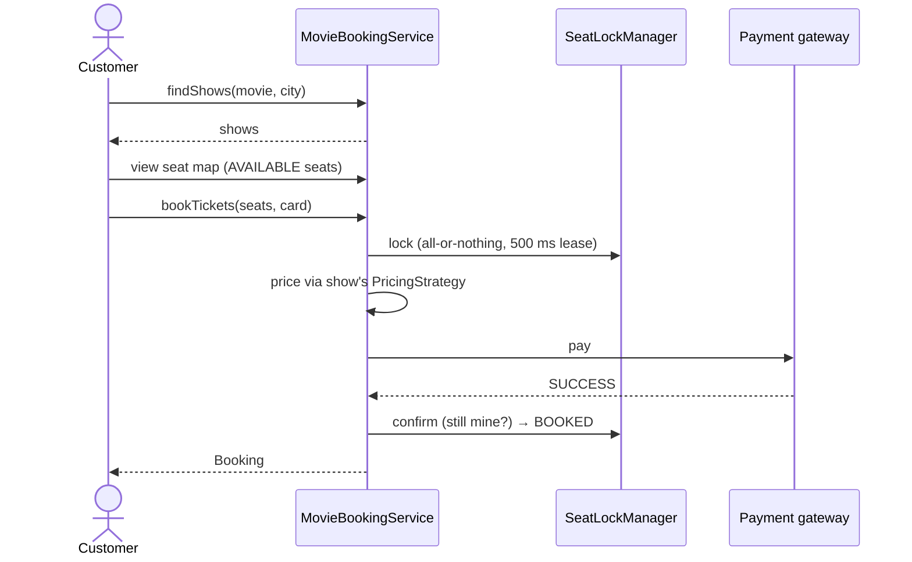

# Movie Booking System — Sequence Diagrams

> How the objects talk to each other over time, one flow per diagram. Every flow is
> traced from the code in [`../solutions/`](../solutions/).

---

## Flow 1 — Bootstrapping: singleton, catalogue setup

---

## Flow 2 — Search shows by movie and city

---

## Flow 3 — Book tickets, happy path

---

## Flow 4 — Seat already taken

---

## Flow 5 — Payment fails

---

## Flow 6 — Lock expires during a slow payment (refund)

Without the re-check in `confirmSeats`, Alice would be charged and the seat could
meanwhile be sold to someone else.

---

## Flow 7 — Race: two customers lock the same seat at once

Different shows have different monitors, so a race on show 1 never delays show 2.

---

## Flow 8 — Race: expiry fires while confirm is running

---

## Flow 9 — Shutdown

---

## Flow 10 — End-to-end (overview)

