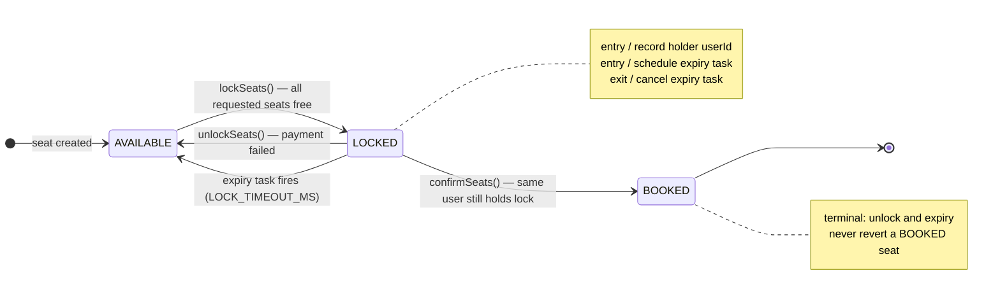
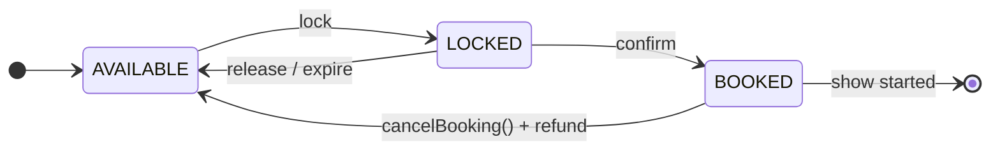
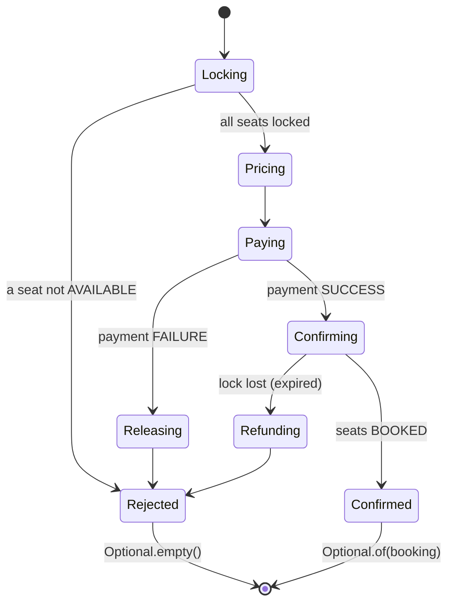
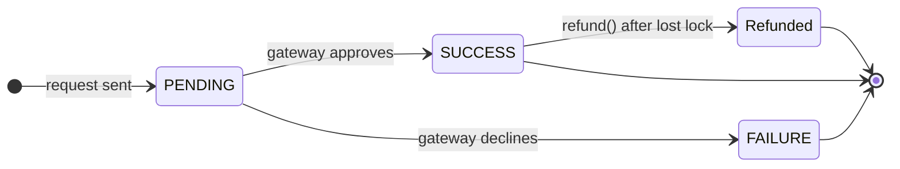
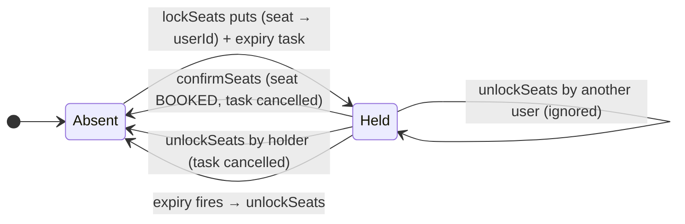
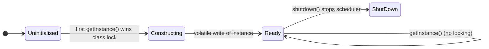
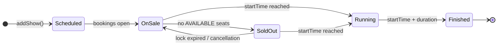

# Movie Booking System — State Diagrams

> Which objects have a lifecycle, what states they move through, and what drives each
> move. Seat status is the heart of the system. Every transition is made by
> `SeatLockManager` while holding the show's lock.

---

## 1. Seat Lifecycle (per show)

| State | Entered by | Who can leave it | Terminal |
|---|---|---|---|
| `AVAILABLE` | creation, unlock, expiry | any customer, via `lockSeats` | no |
| `LOCKED` | `lockSeats` | only the lock holder (`confirmSeats` / `unlockSeats`) or the scheduler | no |
| `BOOKED` | `confirmSeats` | nobody (no cancellation yet) | yes |

> ⚠️ In the code, `status` is a field on `Seat`, so this machine is shared by **every
> show on the screen**. Conceptually it should be one machine per `(show, seat)`. See
> [02 § 4](02-er-diagram.md#4-resolving-seat--show-the-many-to-many).

---

## 2. Seat Lifecycle with Cancellation (future)

---

## 3. Booking Attempt (inside `BookingManager.createBooking`)

There is no `Booking` object until the `Confirmed` state, so a `Booking` that exists is
always a successful one.

---

## 4. Payment Status

`CreditCardPaymentStrategy` returns `SUCCESS` or `FAILURE` directly. `PENDING` exists
in the enum for asynchronous gateways (UPI, net banking). `Refunded` is not an enum
value today; `refund()` only logs.

---

## 5. Lock Entry in `SeatLockManager`

When the last seat of a show is removed, the show's inner map is dropped, so the lock
tables do not grow with finished shows.

---

## 6. Singleton Initialisation

---

## 7. Show Timeline (domain view)

The Java `Show` has no status field. This view shows the rules a production system
would enforce, such as "no bookings after `startTime`".
