# Movie Booking System — Activity Diagrams & Flowcharts

> Step-by-step control flow of each operation, with every branch the code takes.

---

## 1. Master Flow — from "what's on?" to a ticket

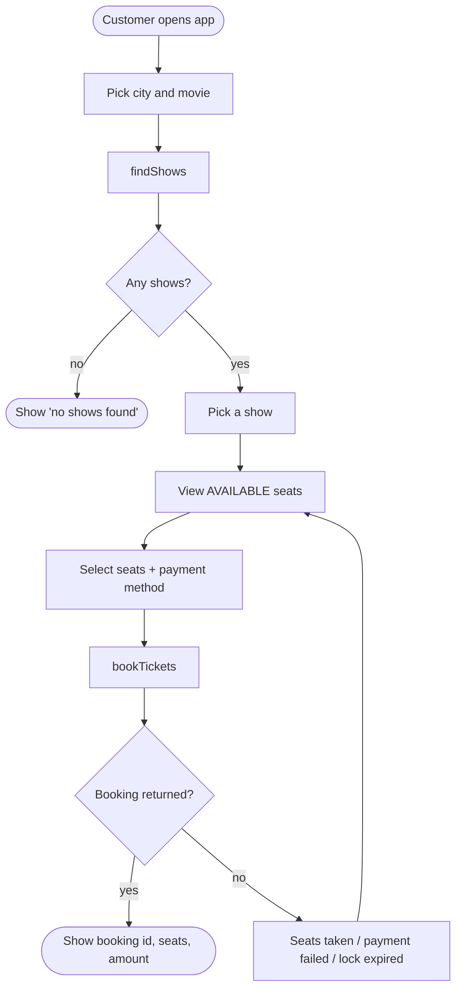

---

## 2. `BookingManager.createBooking`

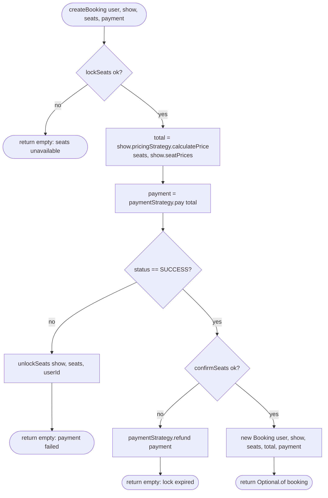

---

## 3. `SeatLockManager.lockSeats`

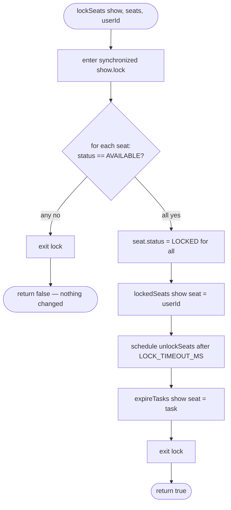

The check loop runs completely before anything is written, which is what makes the
lock all-or-nothing.

---

## 4. `SeatLockManager.confirmSeats`

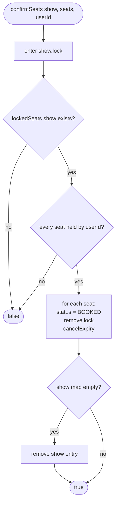

---

## 5. `SeatLockManager.unlockSeats` (also the expiry task)

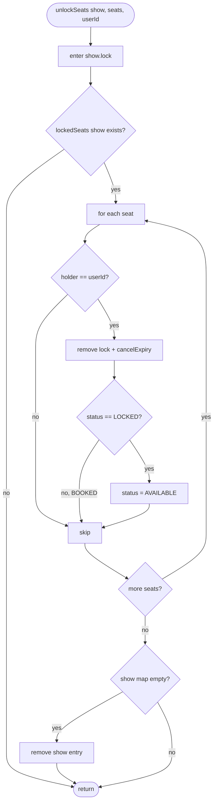

---

## 6. `MovieBookingService.findShows`

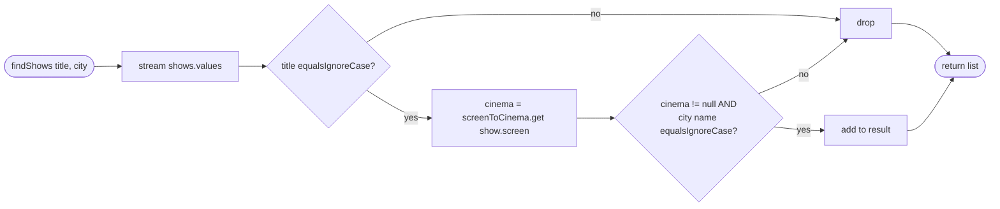

---

## 7. Pricing Strategies

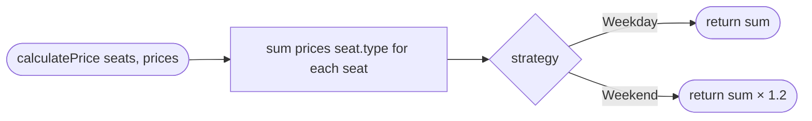

Example: 2 × `REGULAR` at 50 = 100 on a weekday, 120 on a weekend.

---

## 8. Double-Checked Locking in `getInstance`

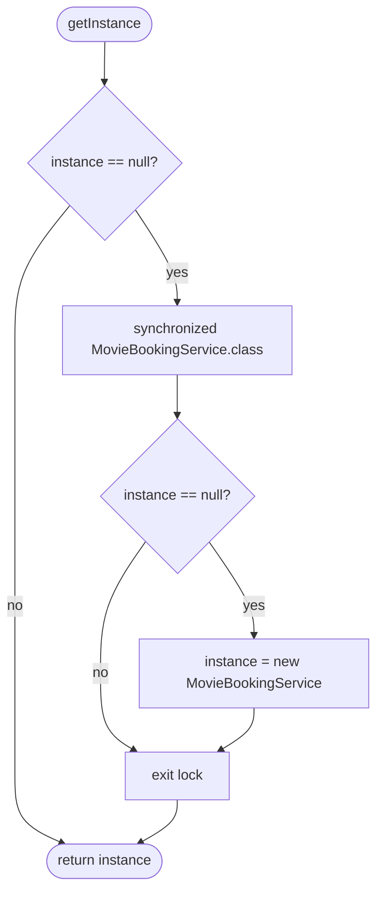

---

## 9. Activity Diagram with Swimlanes — one booking, four actors

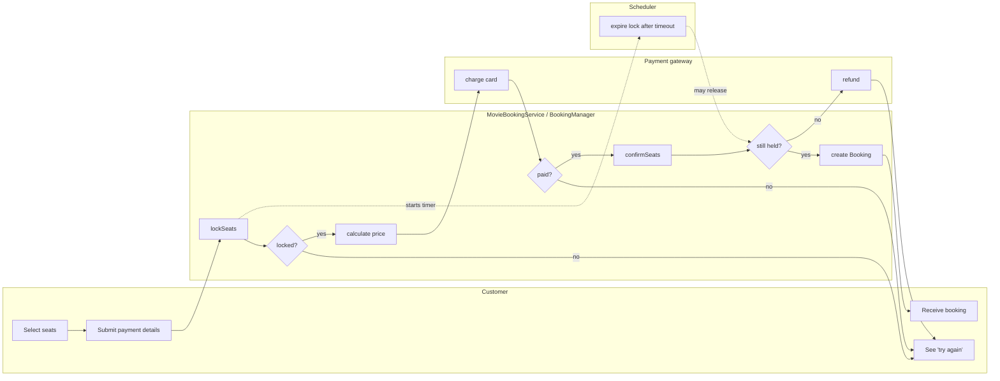

---

## 10. How to add a new pricing rule

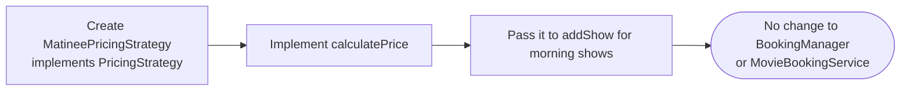

## 11. How to add a new payment method

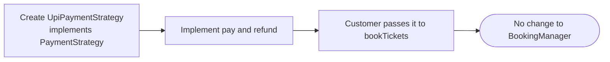
