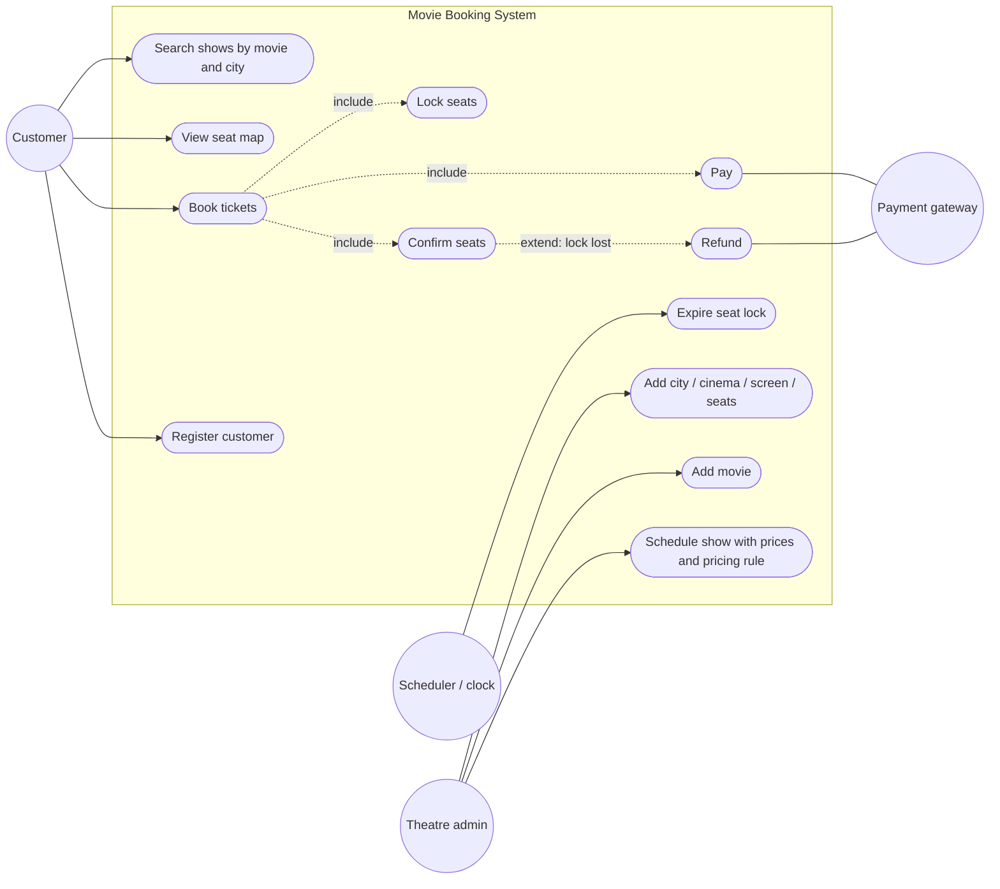
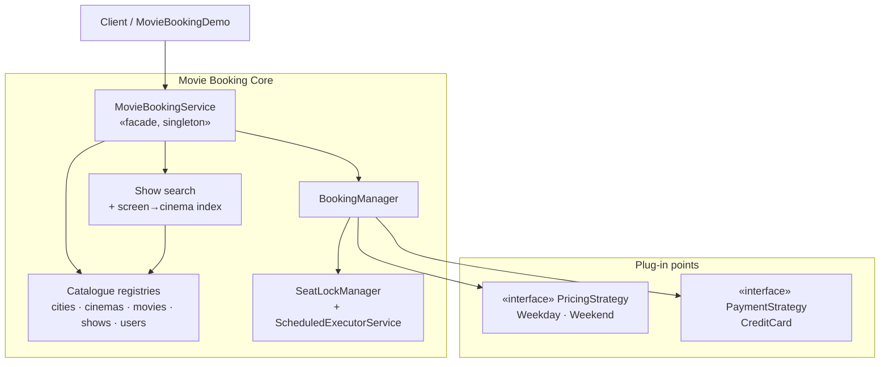
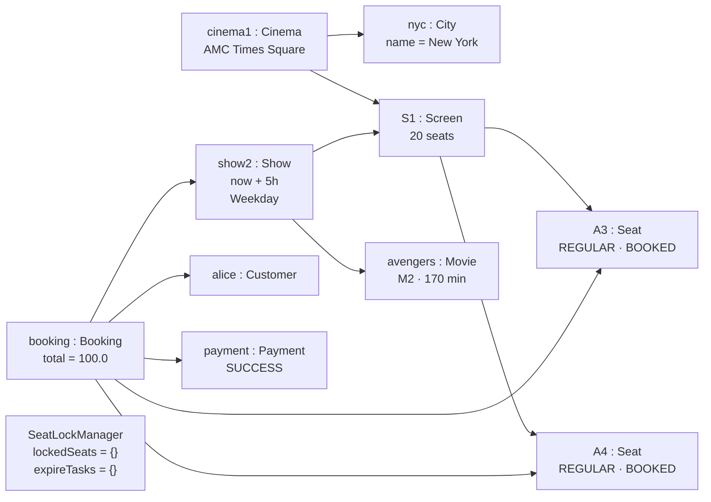
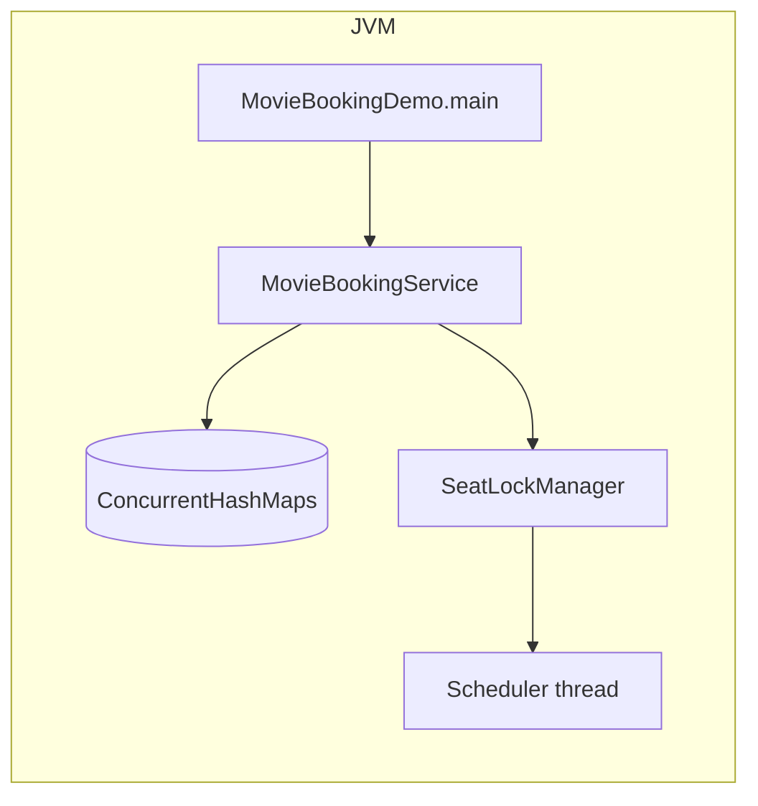
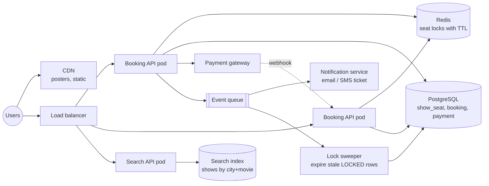
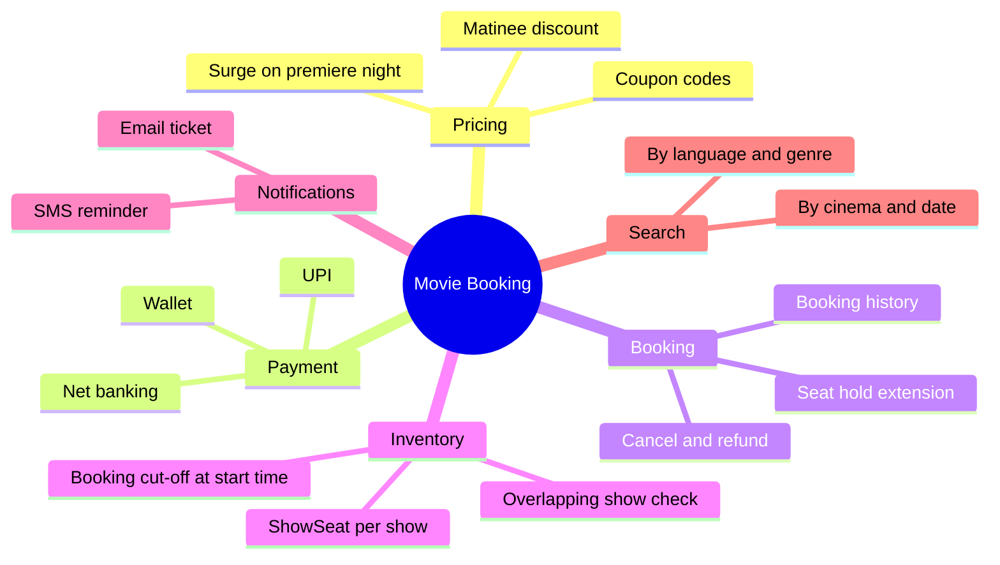

# Movie Booking System — Use Case, Component, Object & Deployment Diagrams

> The big-picture views: who uses the system, how it is split into components, a
> snapshot of live objects, and how it would run in production.

---

## 1. Use Case Diagram

---

## 2. Component Diagram

---

## 3. Object Diagram — snapshot right after Alice's booking (demo run)

After confirmation the lock tables are empty: the seats are `BOOKED`, so no lock or
expiry task is needed. Bob's later attempt on A3/A4 is rejected at `lockSeats`.

---

## 4. Deployment View

### Today — one JVM

### At scale

| In-JVM piece | Production replacement |
|---|---|
| `synchronized (show.getLock())` | Redis `SET NX PX` per seat, or conditional `UPDATE` on `show_seat` |
| `ScheduledExecutorService` expiry | Redis key TTL + DB sweeper |
| `ConcurrentHashMap` registries | PostgreSQL + cache |
| `findShows` linear scan | Search index keyed by city and movie |
| Synchronous `pay()` | Gateway redirect + webhook, payment `PENDING` until callback |

---

## 5. Extension Points

