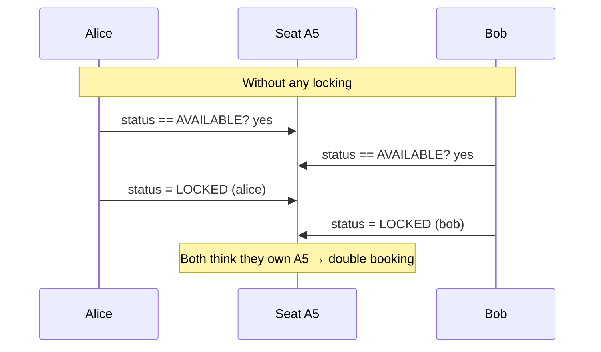
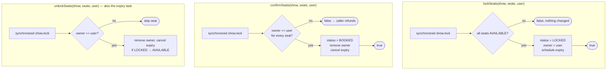
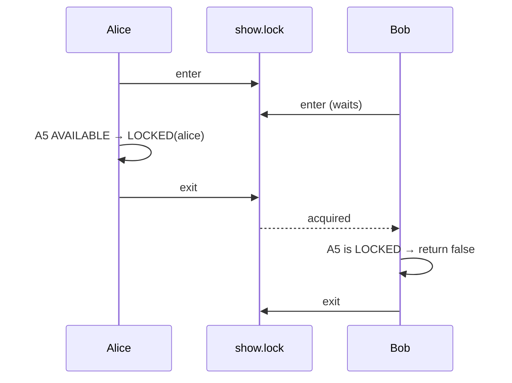
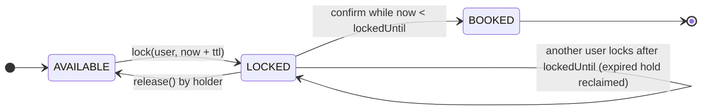
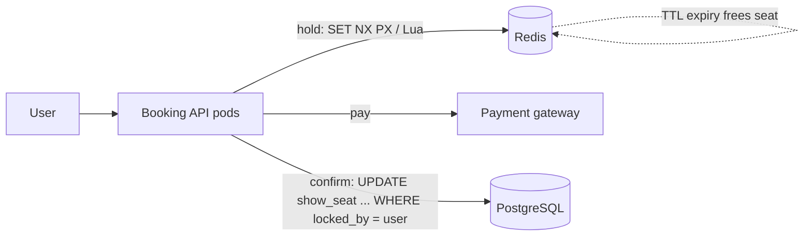
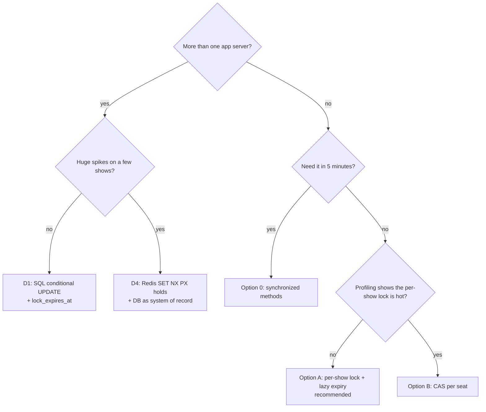

# Movie Booking System — Seat Lock Concurrency

> How [`SeatLockManager`](../solutions/SeatLockManager.java) stops two people from
> booking the same seat, where that approach has gaps, and what the alternatives are:
> from "simplest thing that is correct" to "what a real BookMyShow runs".

---

## 1. The Problem in One Picture



"Check the seat is free, then take it" is a **check-then-act** race. Any correct
design must make the check and the write one indivisible step. A seat hold must also
**expire**, because a customer can walk away mid-payment.

---

## 2. How the Current Code Does It

### 2.1 The moving parts

| Piece | Code | Purpose |
|---|---|---|
| Per-show monitor | `Show.lock` (`new Object()`), used as `synchronized (show.getLock())` | Serialises every lock / confirm / unlock **for one show** |
| Owner table | `lockedSeats: ConcurrentHashMap<Show, HashMap<Seat, String userId>>` | Who holds each seat, so only the holder can confirm or release |
| Expiry table | `expireTasks: ConcurrentHashMap<Show, HashMap<Seat, ScheduledFuture<?>>>` | The timer for each held seat, so it can be cancelled early |
| Timer | `ScheduledExecutorService` (1 thread), `LOCK_TIMEOUT_MS = 500` | Calls `unlockSeats` when a hold runs out |
| Seat state | `Seat.status`: `AVAILABLE → LOCKED → BOOKED` | What the seat map shows |

### 2.2 The three operations



### 2.3 Why it is correct (for one show)

1. **Atomic check-then-act.** The "all AVAILABLE?" loop and the "set LOCKED" loop run
   inside the same `synchronized` block, so no other thread can slip in between.
2. **All-or-nothing.** Every seat is checked before any seat is written. If one is
   taken, nothing changes.
3. **Ownership.** `confirmSeats` and `unlockSeats` compare the stored `userId`. Bob's
   unlock cannot free Alice's seat.
4. **Slow payment is safe.** Payment runs *outside* the lock (so a slow gateway blocks
   nobody). Afterwards `confirmSeats` re-checks ownership. If the timer already freed the
   seat, confirm fails and `BookingManager` refunds.
5. **Expiry vs confirm race is safe.** The expiry task also takes the show lock. If it
   runs after confirm, the owner entry is gone and the seat is `BOOKED`, so it does
   nothing. `unlockSeats` only reverts a seat that is still `LOCKED`.
6. **Fine-grained.** One monitor per show, so a rush on show 1 never slows show 2.



### 2.4 Where it falls short

| # | Gap | Consequence |
|---|---|---|
| 1 | **The lock is per show, but `Seat` is shared by every show on the screen.** Show 2 pm and show 8 pm hold *different* monitors yet write the *same* `Seat.status`. | Two threads booking A5 for two different shows on the same screen are **not** serialised against each other, and booking one show blocks the seat for the other. Inventory must be per show (`ShowSeat`). |
| 2 | `Seat.status` is a plain field read **outside** the lock (seat-map display in the demo). | Readers can see a stale status. Harmless for display, but it is not a safe "is it free?" check. Mark it `volatile` or read under the lock. |
| 3 | A timer thread plus two bookkeeping maps (`lockedSeats`, `expireTasks`) for something that is really just "held until time T". | More code, more states to keep consistent, and a scheduler that must be shut down. Timers also do not survive a restart. |
| 4 | One scheduler thread. | Fine here; at scale many expiries queue behind each other. |
| 5 | `synchronized` blocks forever, with no timeout or fairness. | Under heavy contention a caller cannot give up after, say, 200 ms. |
| 6 | In-JVM only. | With two app servers, each has its own `show.lock`, so the guarantee disappears. |

---

## 3. Better Options

### Option 0 — The easiest correct thing: one global lock

```java
public synchronized boolean lockSeats(Show show, List<Seat> seats, String userId) { ... }
public synchronized boolean confirmSeats(Show show, List<Seat> seats, String userId) { ... }
public synchronized void   unlockSeats(Show show, List<Seat> seats, String userId) { ... }
```

Put `synchronized` on the methods of the singleton `SeatLockManager`. Every booking in
the system goes through one door. It is obviously correct, fixes gap 1 for free (all
shows share the lock) and is a fine first answer in an interview, but it does not scale:
one busy show slows every other show.

### Option A — Recommended: per-show lock + lazy expiry on a `ShowSeat`

The simplest design that is correct **and** fast. Two changes:

1. **Per-show inventory.** A `ShowSeat` wraps a `Seat` for one show and owns the status.
   This fixes gap 1: the show's monitor now guards exactly the data it should.
2. **Lazy expiry.** Store `lockedUntil` instead of scheduling a task. A `LOCKED` seat
   whose time has passed simply *counts as free* the next time anyone looks. No timer,
   no `expireTasks` map, no cancellation, nothing to shut down.

```java
public class ShowSeat {
    private final Seat seat;
    private SeatStatus status = SeatStatus.AVAILABLE;
    private String lockedBy;
    private Instant lockedUntil;

    public ShowSeat(Seat seat) { this.seat = seat; }

    boolean isFree(Instant now) {
        return status == SeatStatus.AVAILABLE
            || (status == SeatStatus.LOCKED && !now.isBefore(lockedUntil)); // expired hold
    }

    boolean isHeldBy(String userId, Instant now) {
        return status == SeatStatus.LOCKED && userId.equals(lockedBy) && now.isBefore(lockedUntil);
    }

    void lock(String userId, Instant until) { status = SeatStatus.LOCKED; lockedBy = userId; lockedUntil = until; }
    void book()    { status = SeatStatus.BOOKED;    lockedBy = null; lockedUntil = null; }
    void release() { status = SeatStatus.AVAILABLE; lockedBy = null; lockedUntil = null; }
}

public class SeatLockManager {
    private final Duration ttl;
    private final Clock clock;                       // injectable → expiry is testable without sleeping

    public SeatLockManager(Duration ttl, Clock clock) { this.ttl = ttl; this.clock = clock; }

    public boolean lockSeats(Show show, List<ShowSeat> seats, String userId) {
        synchronized (show.getLock()) {
            Instant now = clock.instant();
            for (ShowSeat s : seats) if (!s.isFree(now)) return false;   // check all first
            Instant until = now.plus(ttl);
            for (ShowSeat s : seats) s.lock(userId, until);              // then write all
            return true;
        }
    }

    public boolean confirmSeats(Show show, List<ShowSeat> seats, String userId) {
        synchronized (show.getLock()) {
            Instant now = clock.instant();
            for (ShowSeat s : seats) if (!s.isHeldBy(userId, now)) return false; // expired or not mine
            for (ShowSeat s : seats) s.book();
            return true;
        }
    }

    public void unlockSeats(Show show, List<ShowSeat> seats, String userId) {
        synchronized (show.getLock()) {
            Instant now = clock.instant();
            for (ShowSeat s : seats) if (s.isHeldBy(userId, now)) s.release();
        }
    }
}
```

`Show` then holds `Map<String, ShowSeat>` built from its screen's seats when the show is
created. The seat map shows a seat as available when `isFree(now)` is true.



**Why it is better than today:** fixes the shared-seat bug, removes the scheduler and
both bookkeeping maps, and makes expiry exact and unit-testable with a fake `Clock`. The
critical section is a few field writes, so a per-show lock is not a bottleneck even for
a 300-seat hall.

### Option B — Lock-free: one `AtomicReference` per seat (CAS)

No `synchronized` at all. Each seat holds an immutable `Hold`, and every change is a
compare-and-set.

```java
record Hold(String userId, long expiresAt) {}
static final Hold BOOKED = new Hold(null, Long.MAX_VALUE);

final class ShowSeat {
    final int index;                                  // for a stable lock order
    final AtomicReference<Hold> hold = new AtomicReference<>();   // null = AVAILABLE

    boolean tryLock(String user, long now, long ttl) {
        Hold cur = hold.get();
        if (cur == BOOKED || (cur != null && cur.expiresAt() > now)) return false;
        return hold.compareAndSet(cur, new Hold(user, now + ttl));   // fails if anyone changed it
    }
    boolean release(String user) {
        Hold cur = hold.get();
        return cur != null && cur != BOOKED && user.equals(cur.userId()) && hold.compareAndSet(cur, null);
    }
    boolean confirm(String user, long now) {
        Hold cur = hold.get();
        return cur != null && cur != BOOKED && user.equals(cur.userId())
            && cur.expiresAt() > now && hold.compareAndSet(cur, BOOKED);
    }
}

// Multi-seat: take seats in a fixed order, roll back on the first failure.
static boolean lockAll(List<ShowSeat> seats, String user, long ttl) {
    List<ShowSeat> sorted = new ArrayList<>(seats);
    sorted.sort(Comparator.comparingInt(s -> s.index));
    long now = System.currentTimeMillis();
    List<ShowSeat> taken = new ArrayList<>();
    for (ShowSeat s : sorted) {
        if (!s.tryLock(user, now, ttl)) { taken.forEach(t -> t.release(user)); return false; }
        taken.add(s);
    }
    return true;
}
```

- **Pros:** no thread ever blocks, maximum throughput, contention on seat A5 does not
  touch seat B7.
- **Cons:** multi-seat is *not* atomic to observers. Another user may briefly see A5
  held and then released during a rollback. Two users after overlapping sets can both
  fail and must retry. More subtle to reason about. Use it when profiling shows the
  per-show lock is hot, which is rare.

### Option C — `ReentrantLock` per seat (or per show) with `tryLock(timeout)`

```java
Lock l = seatLocks.computeIfAbsent(seatKey, k -> new ReentrantLock(true)); // fair
if (!l.tryLock(200, TimeUnit.MILLISECONDS)) return false;   // give up instead of waiting forever
try { /* check + write */ } finally { l.unlock(); }
```

Adds what `synchronized` lacks: a **timeout**, **fairness** and interruptibility. For
several seats, acquire the locks in **sorted seat order** so two users cannot deadlock
(Alice holds A5 waiting for A6, Bob holds A6 waiting for A5). Use it when you need
"fail after 200 ms" behaviour; otherwise Option A is simpler.

### Option D — Across many servers: the database or Redis does the locking

Once more than one JVM serves bookings, an in-memory monitor protects nothing. Move the
atomic step to shared storage. Each of these has the same shape as Option A: a
**conditional write that succeeds only if the seat is free, plus an expiry time**.

**D1. SQL conditional `UPDATE` (simplest, recommended first)**

```sql
UPDATE show_seat
   SET status = 'LOCKED', locked_by = :user, lock_expires_at = now() + interval '10 minutes'
 WHERE show_id = :show AND seat_id = ANY(:seats)
   AND (status = 'AVAILABLE' OR (status = 'LOCKED' AND lock_expires_at < now()));
-- rows_affected = number of seats → COMMIT, otherwise ROLLBACK
```

The row locks taken by the `UPDATE` serialise competing transactions, and the `WHERE`
re-check is the "is it free?" test. Full schema in
[03 § 4](03-database-model.md#4-concurrency-at-the-database-layer).

**D2. `SELECT … FOR UPDATE` (pessimistic)**: lock the rows, check in code, update,
commit. Clear to read, but holds row locks longer. Order seats by id to avoid deadlocks.

**D3. Optimistic `version` column**: read seats with their `version`, then
`UPDATE … WHERE version = :v`. Zero rows means someone else won; retry or report taken.
Great when conflicts are rare, poor on premiere night when they are not.

**D4. Redis with TTL (high-traffic holds)**

```
SET hold:{show}:{seat} {userId} NX PX 600000      # set only if absent, auto-expire in 10 min
```

`NX` is the atomic check-then-set and `PX` is free expiry. For several seats, run one
Lua script that checks every key and sets them only if all are free, so the operation
stays all-or-nothing. Release and confirm must also go through a script that deletes
the key **only if the value is still this user**. The database stays the system of
record: a confirmed booking is written there with a unique constraint on
`(show_id, seat_id)` as the final safety net.



---

## 4. Side-by-side

| Approach | Correct across shows on same screen | Expiry | Blocks? | Multi-JVM | Effort | Use when |
|---|---|---|---|---|---|---|
| **Current code** | ❌ (shared `Seat`) | timer thread + 2 maps | yes, per show | ❌ | medium | — |
| **0. Global `synchronized`** | ✅ | as today | yes, everything | ❌ | lowest | first-pass interview answer, demos |
| **A. Per-show lock + lazy expiry** | ✅ | `lockedUntil` timestamp | yes, per show (tiny) | ❌ | low | **default single-JVM answer** |
| **B. CAS per seat** | ✅ | timestamp in `Hold` | never | ❌ | medium | proven lock hot spot |
| **C. `ReentrantLock` + `tryLock`** | ✅ | either | yes, with timeout | ❌ | medium | need timeout or fairness |
| **D1. SQL conditional `UPDATE`** | ✅ | `lock_expires_at` column | DB row locks | ✅ | low | any multi-server deployment |
| **D3. Optimistic `version`** | ✅ | column | never (retry) | ✅ | low | low contention |
| **D4. Redis `SET NX PX` + DB** | ✅ | key TTL | never | ✅ | higher | very high traffic, premieres |

---

## 5. Choosing an approach



---

## 6. How to prove it works

A concurrency claim needs a test that tries to break it. The pattern:

```java
CountDownLatch go = new CountDownLatch(1);
for (int t = 0; t < 64; t++) {
    String user = "u" + t;
    pool.submit(() -> {
        go.await();                                    // all threads start together
        if (mgr.lockSeats(show, List.of(a5, a6), user) && mgr.confirmSeats(show, List.of(a5, a6), user))
            winners.add(user);
        return null;
    });
}
go.countDown();
// assert: each seat has at most one winner
```

For expiry, inject a fake `Clock`, lock, move the clock past `lockedUntil`, and assert
that confirm fails and another user can lock. No `Thread.sleep` needed.

Options A and B above were run through exactly this kind of test (64 threads racing for
overlapping seat pairs, 300 rounds, plus the fake-clock expiry check) with no double
booking.

The **current** `SeatLockManager` has a full suite in
[`../solutions/tests/`](../solutions/tests/README.md): 12 scenarios, each with 500
threads across 200 users. With the `synchronized` removed from `lockSeats`, 8 of the 12
fail with real double bookings, so the suite catches the bug it exists for.
