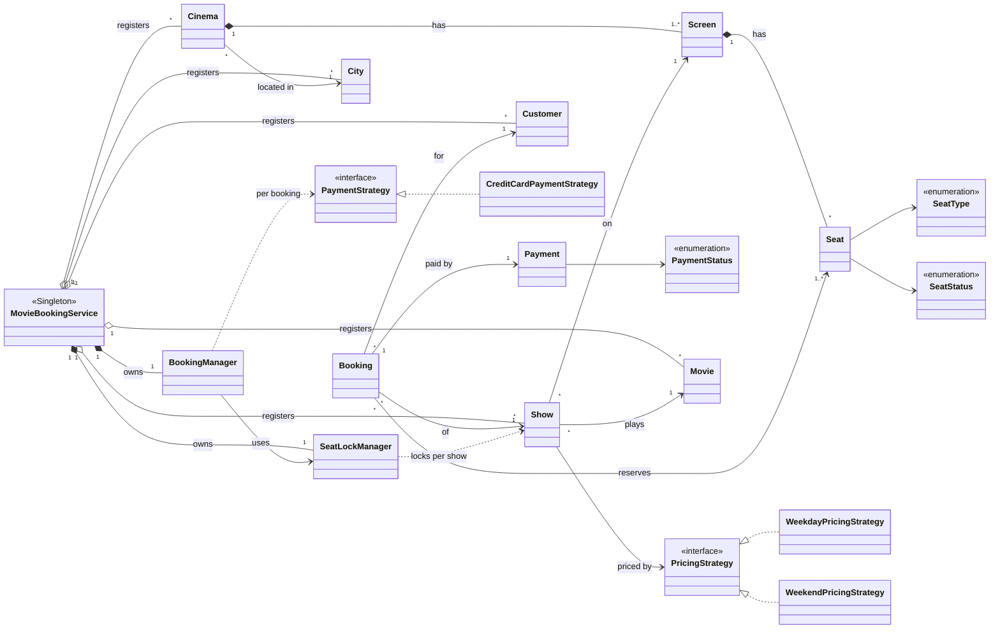

# Designing a Movie Ticket Booking System (BookMyShow / Fandango-style)

## Problem Statement

Design the core of an online movie ticket booking platform.

The platform lists **cities**, the **cinemas** in each city, the **screens** inside each
cinema, and the **seats** on each screen. **Movies** are scheduled as **shows**: one
movie, on one screen, at one start time. A customer searches for a movie in their city,
picks a show, looks at the seat map, selects one or more seats, pays, and receives a
confirmed **booking**.

The flow for a single booking is:

```
select seats → LOCK seats (with timeout) → calculate price → pay → CONFIRM (BOOKED)
                    │                                          │
                    └── seat already LOCKED/BOOKED → reject    ├── payment fails → unlock
                                                               └── lock expired  → refund
```

Three things make this more than a CRUD app.

First, **seats are a scarce, contended resource**. Hundreds of people open the same
show's seat map at the same moment, and two of them must never both end up with seat
`A5`. The "check the seat is free, then take it" step has to be atomic.

Second, **payment is slow and can fail**. A seat cannot be held forever while a user
types in card details, so it is *locked* for a limited time. If the user pays in time,
the lock turns into a booking. If they don't, or the payment fails, the seat goes back
on sale. If the lock expires *while* the payment is in flight, the system must notice
and refund rather than charge for a seat the user no longer holds.

Third, **pricing and payment methods are business policies that change**. Today it is
"weekday price" and "credit card". Tomorrow it is weekend surcharges, matinee discounts,
UPI or wallets. Adding one must not mean editing the booking flow.

---

## Functional Requirements

1. **Manage the catalogue.** The system can register cities, movies, cinemas (each in a
   city, with one or more screens), and shows. Each entity has a unique id.

2. **Screens and seats.** A screen is a list of seats. Each seat has a row, a column, a
   `SeatType` (`REGULAR`, `PREMIUM`, `RECLINER`) and a `SeatStatus`
   (`AVAILABLE`, `LOCKED`, `BOOKED`). New seats start `AVAILABLE`.

3. **Schedule a show.** A show links one movie to one screen at a start time, and
   carries its own **seat-price table** (`Map<SeatType, Double>`) and a
   **pricing strategy**. Prices are data on the show, not constants on the `SeatType`
   enum, so the same recliner can cost more on a premiere night.

4. **Register customers.** A customer has a system-generated id, a name and an email.

5. **Search shows.** Given a movie title and a city name (both case-insensitive), return
   every show of that movie in a cinema in that city.

6. **View available seats.** For a chosen show, list the seats whose status is
   `AVAILABLE`.

7. **Book tickets.** A customer books a list of seats for a show with a chosen payment
   method. The booking succeeds only if **every** requested seat can be locked:
   - **Lock.** All seats are checked and locked as one step. If any seat is not
     `AVAILABLE`, nothing is locked and the booking is rejected.
   - **Price.** The total is computed by the show's pricing strategy from its seat-price
     table.
   - **Pay.** The chosen payment strategy charges the total. If payment fails, the
     locks are released and the booking is rejected.
   - **Confirm.** The system re-checks that this customer still holds the lock on every
     seat and marks them `BOOKED`. If a lock expired during payment, the payment is
     refunded and the booking is rejected.
   - On success a `Booking` is returned with a generated id, the customer, show, seats,
     total amount and payment record.

8. **Lock expiry.** A seat lock lasts a fixed timeout (`LOCK_TIMEOUT_MS`). If the
   booking is not confirmed or released by then, the seats are automatically returned
   to `AVAILABLE`.

9. **Lock ownership.** Only the customer who holds a lock can release or confirm it. A
   `BOOKED` seat is never reverted by a late expiry or unlock.

10. **Pricing policies.** Two pricing strategies are supported:
    - `WeekdayPricingStrategy` — sum of the seat-type prices.
    - `WeekendPricingStrategy` — the same sum with a 20% surcharge.

11. **Payment methods.** Payment is pluggable through `PaymentStrategy` (`pay`,
    `refund`). `CreditCardPaymentStrategy` is provided and simulates a gateway with a
    95% success rate.

12. **Shutdown.** The service can be shut down, which stops the lock-expiry scheduler.

---

## Non-Functional Requirements

1. **No double booking (thread safety).**
   - `lockSeats`, `confirmSeats` and `unlockSeats` all run inside
     `synchronized (show.getLock())`, so for a given show the check-then-lock,
     verify-then-book and release steps are serialized. Two customers racing for the
     same seat cannot both win.
   - The lock is **per show**, not global, so bookings for different shows never wait
     on each other.
   - All registries in `MovieBookingService` and the lock tables in `SeatLockManager`
     are `ConcurrentHashMap`s.

2. **All-or-nothing seat locking.** A multi-seat request either locks every seat or
   none. A customer never ends up holding half of the seats they asked for.

3. **Bounded holds.** Locks expire through a `ScheduledExecutorService`, so an
   abandoned checkout cannot block a seat forever. When a lock is confirmed or released
   early, its expiry task is cancelled so it does not fire later.

4. **Consistency across a slow payment.** Payment happens *outside* the show lock, so a
   slow gateway never blocks other customers. Correctness is preserved by the
   re-check in `confirmSeats`: if the lock expired meanwhile, the booking is refused and
   the money refunded.

5. **Safe lazy singleton.** `MovieBookingService.getInstance()` uses double-checked
   locking on a `volatile` field, so the service is built once and no thread sees a
   half-constructed object.

6. **Open/Closed for policies.** A new pricing rule is a new `PricingStrategy`. A new
   payment method is a new `PaymentStrategy`. Neither requires editing
   `BookingManager` or `MovieBookingService`.

7. **Low latency on hot paths.** Show, customer and cinema lookups are O(1) by id.
   Finding the cinema for a show is O(1) through a `screen → cinema` index built when
   cinemas are added. Show search is O(S) over all shows, which is fine at interview
   scale and would move to an index keyed by `(city, movie)` in production.

8. **Separation of concerns.** Domain models (`models`), status vocabulary (`enums`),
   policies (`strategy/pricing`, `strategy/payment`), seat concurrency
   (`SeatLockManager`), the booking transaction (`BookingManager`) and the public API
   (`MovieBookingService`) live in separate units.

9. **Clean resource lifecycle.** `shutdown()` stops the scheduler gracefully and falls
   back to `shutdownNow()`, so the JVM can exit.

---

## Core Entities and Their Relationships

| Entity | Responsibility |
|---|---|
| `MovieBookingService` | Singleton facade. Owns the registries (cities, cinemas, movies, customers, shows), the `screen → cinema` index, and the `SeatLockManager` and `BookingManager`. Exposes catalogue setup, search and `bookTickets`. |
| `BookingManager` | Runs one booking as a transaction: lock → price → pay → confirm, with unlock on payment failure and refund on lock expiry. |
| `SeatLockManager` | Holds `show → (seat → userId)` locks and their expiry tasks. `lockSeats`, `confirmSeats` and `unlockSeats` are serialized per show. |
| `City` | A city with an id and a name. |
| `Cinema` | A cinema in one city, owning one or more screens. |
| `Screen` | A screen holding its seats. |
| `Seat` | Row, column, `SeatType` and current `SeatStatus`. |
| `Movie` | Id, title and duration. |
| `Show` | One movie on one screen at a start time, with its seat-price table, pricing strategy, and a per-show lock object. |
| `Customer` | The person booking: id, name, email. |
| `Booking` | The confirmed result: customer, show, seats, total amount and payment. |
| `Payment` | Amount, gateway transaction id and `PaymentStatus` (`SUCCESS`, `FAILURE`, `PENDING`). |
| `PricingStrategy` | Computes a total from a list of seats and a price table. Weekday and weekend implementations. |
| `PaymentStrategy` | Charges and refunds an amount. Credit card implementation. |



**Reading the arrows.** `<|..` is interface realisation, `*--` is composition (a `Seat`
belongs to its `Screen`, a `Screen` to its `Cinema`), `o--` is aggregation (the service
holds entities it did not create the identity of), `-->` is a plain association, and
`..>` is a transient dependency (the payment strategy is passed in per booking, not
stored).

---

## Design Patterns Used

| Pattern | Where | Why |
|---|---|---|
| **Singleton** | `MovieBookingService.getInstance()`, double-checked locking with a `volatile` instance and a private constructor | One owner for all registries and one `SeatLockManager`, so every caller sees the same seat locks. Two lock managers would mean two sources of truth for who holds a seat. |
| **Strategy** (pricing) | `PricingStrategy` → `WeekdayPricingStrategy`, `WeekendPricingStrategy`, set per `Show` | Pricing changes by day, time, event or promotion. Each rule is one class, chosen when the show is scheduled. |
| **Strategy** (payment) | `PaymentStrategy` → `CreditCardPaymentStrategy`, passed into `bookTickets` | The customer picks the payment method at checkout. UPI, wallet or net banking are new classes, not edits to `BookingManager`. |
| **Facade** | `MovieBookingService` | Clients call one object (`addCity`, `addCinema`, `addShow`, `createUser`, `findShows`, `bookTickets`, `shutdown`) and never touch the lock manager or booking manager directly. |
| **Pessimistic locking with timeout (lease)** | `SeatLockManager` with per-show monitors and a `ScheduledExecutorService` | Seats are held exclusively during checkout, and the hold auto-expires, so contention is resolved up front and abandoned carts free themselves. |
| **Compensating transaction** | `BookingManager.createBooking`: unlock on payment failure, `refund` when confirmation fails | The booking spans a lock and an external payment that cannot share one atomic step, so each failure path explicitly undoes what already happened. |

---

## Known Limitations

These are gaps in the current code worth raising in an interview.

1. **Seat status is shared across shows.** `SeatStatus` lives on `Seat`, and seats
   belong to the `Screen`. Every show on that screen sees the same `Seat` objects, so
   booking `A5` for the 2 pm show also marks `A5` as `BOOKED` for the 8 pm show. The fix
   is a per-show seat inventory, e.g. a `ShowSeat(show, seat, status)` or a
   `Map<Seat, SeatStatus>` on `Show`, leaving `Seat` as pure layout.
2. **The seat id passed to `Seat` is ignored.** The constructor generates a UUID
   instead, so ids like `"A5"` never appear in output.
3. **No validation of ids.** `bookTickets` with an unknown user or show id passes
   `null` into `BookingManager`, and `addCinema` with an unknown city id creates a cinema
   with a `null` city, which later breaks `findShows`. These should fail fast with a
   clear exception.
4. **Seats are not checked against the show's screen.** A caller could lock seats from
   a different screen.
5. **Money as `double`.** Prices and totals should be `BigDecimal`.
6. **No cancellation or booking history.** There is no `cancelBooking` (release seats
   and refund) and no "my bookings" lookup.
7. **Errors are printed, not returned.** Failures return `Optional.empty()` and print a
   message, so the caller cannot tell "seat taken" from "payment failed" from "lock
   expired".

---

## Implementation

#### [Java Implementation](../solutions/)
