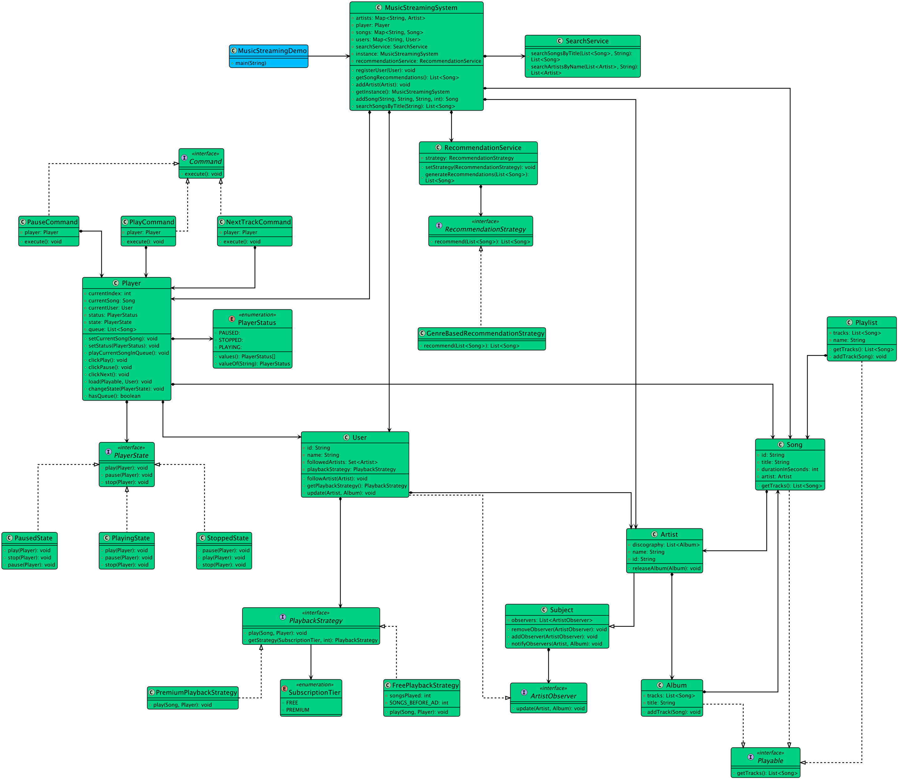

# Designing an Online Music Streaming Service Like Spotify

## Requirements
1. The music streaming service should allow users to browse and search for songs, albums, and artists.
2. Users should be able to create and manage playlists.
3. The system should support user authentication and authorization.
4. Users should be able to play, pause, skip, and seek within songs.
5. The system should recommend songs and playlists based on user preferences and listening history.
6. The system should handle concurrent requests and ensure smooth streaming experience for multiple users.
7. The system should be scalable and handle a large volume of songs and users.
8. The system should be extensible to support additional features such as social sharing and offline playback.

## UML Class Diagram

## Implementations
#### [Java Implementation](../solution/)

## Classes, Interfaces and Enumerations
1. **SubscriptionTier**: Defines the user's subscription level (FREE, PREMIUM), which dictates their playback experience.
   **PlayerStatus**: Represents the current state of the music player (PLAYING, PAUSED, STOPPED).
2. The **Song**, **Album**, and **Artist** classes implements *Playable* interface represent the basic entities in the music streaming service, with properties such as ID, title, artist, album, duration, and relationships between them. (Composite Pattern) The Playable interface allows the Player to treat individual Songs (leafs) and collections like Albums or Playlists (composites) uniformly. The player.load() method can accept any Playable object without needing to know its specific type.
3. The **Artist** represents a music artist or band. It acts as a concrete Subject, maintaining a list of followers (observers) and notifying them when a new *Album* is released.
4. The **User** class represents a user of the music streaming service, with properties like ID, username, password, and a list of playlists. It acts as a concrete Observer by implementing *ArtistObserver*, allowing it to "follow" artists. It is configured with a *PlaybackStrategy* based on its subscription tier. Its construction is handled by a nested Builder.
3. The **Playlist** class represents a user-created playlist, containing a list of songs.
4. The **MusicLibrary** class serves as a central repository for storing and managing songs, albums, and artists. It follows the Singleton pattern to ensure a single instance of the music library.
5. This pattern encapsulates a player action (e.g., "play", "pause") into a standalone object (**PlayCommand**, **PauseCommand**). This decouples the client that issues the request (e.g., a UI button) from the Player object that knows how to perform it.
6. The **PlaybackStrategy** interface is implements by **FreePlayBackStrategy** and **PremiumPlaybackStrategy** allows the playback behavior (ad-free vs. ad-supported) to be assigned to a User dynamically based on their subscription tier.
7. The **Player** class represents the music playback functionality, allowing users to play, pause, skip, and seek within songs.
8. The lifecycle of the **Player** is managed using the *State pattern*. The Player (Context) delegates its behavior to different PlayerState objects (*PlayingState*, *PausedState*, *StoppedState*). This cleanly separates state-specific logic and makes managing player actions robust.
9. This pattern encapsulates a player action (e.g., "play", "pause") into a standalone object (*PlayCommand*, *PauseCommand*). This decouples the client that issues the request (e.g., a UI button) from the Player object that knows how to perform it.
10. The **RecommendationService** class generates song recommendations based on user preferences and listening history.
11. The **MusicStreamingService** class is the main entry point of the music streaming service. It initializes the necessary components, handles user requests, and manages the overall functionality of the service. *Singleton & Facade*