# Music Streaming System — LLD Revision Guide

> **Purpose:** Complete revision reference. Read this instead of the entire codebase.
> Covers: problem statement, all design patterns (why + without analysis), entity/class/sequence diagrams, concurrency strategy, application flow, and known bugs.

---

## Table of Contents
1. [Problem Statement](#1-problem-statement)
2. [System Overview](#2-system-overview)
3. [Entity Relationship Diagram](#3-entity-relationship-diagram)
4. [Class Diagram](#4-class-diagram)
5. [Design Patterns — Deep Dive](#5-design-patterns--deep-dive)
6. [Concurrency Strategy](#6-concurrency-strategy)
7. [Sequence Diagrams — Key Flows](#7-sequence-diagrams--key-flows)
8. [Application Flow](#8-application-flow)
9. [Quick Revision Cheatsheet](#9-quick-revision-cheatsheet)

---

## 1. Problem Statement

Design a **Spotify-like Music Streaming Service** where:

- Users can **browse and search** for songs, albums, and artists
- Users can **create and manage playlists**
- The system supports **user authentication and authorization** (via subscription tiers: FREE vs PREMIUM)
- Users can **play, pause, skip** tracks and the player has a defined lifecycle
- The system **recommends songs** based on user preferences and listening history
- The system handles **concurrent requests** and ensures smooth streaming for multiple users
- The design is **scalable** for large volumes of songs and users
- The design is **extensible** for features like social sharing and offline playback

### Core Entities

| Entity | Responsibility |
|---|---|
| `Song` | Leaf playable unit — title, artist, duration |
| `Album` | Composite of Songs, released by an Artist |
| `Playlist` | User-created composite of Songs |
| `Artist` | Subject in Observer pattern — maintains follower list and discography |
| `User` | Observer + strategy holder — follows artists, has subscription tier |
| `Player` | Context for State pattern — manages queue and playback state |
| `MusicStreamingSystem` | Singleton + Facade — central access point for all subsystems |

---

## 2. System Overview

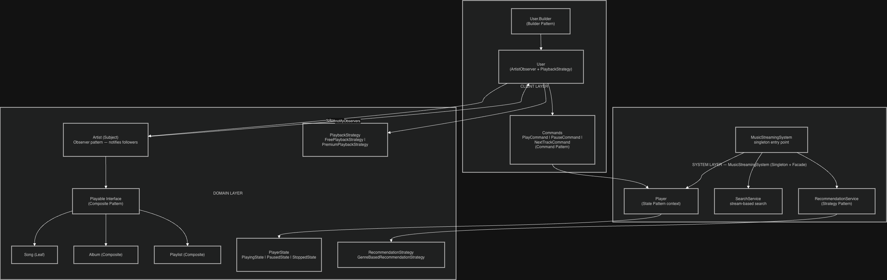

---

## 3. Entity Relationship Diagram

### Relationship Legend
- **||--||** One-to-one
- **||--|{** One-to-many (composition — child owned by parent)
- **||--o{** One-to-many (association — independent lifecycle)
- **}|..|{** Implements interface

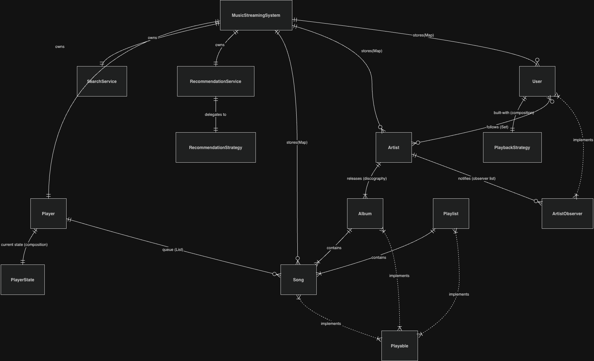

### Key Relationship Decisions

| Relationship | Type | Why |
|---|---|---|
| `User` → `PlaybackStrategy` | **Composition** | Strategy is created for this specific user at `build()` time and cannot be shared or exist without a user. |
| `Artist` → `ArtistObserver` list | **Association** | Observers (Users) exist independently — Artist just holds references to notify. |
| `Player` → `PlayerState` | **Composition** | State objects are created by the Player itself during transitions; lifecycle is fully internal. |
| `MusicStreamingSystem` → `Player/Services` | **Composition** | These are created in the constructor and cannot exist without the system. |
| `Song` → `Artist` | **Association** | Artist exists independently on the exchange; Song just references who made it. |
| `RecommendationService` → `RecommendationStrategy` | **Association** | Strategy can be swapped at runtime via `setStrategy()` — loosely held. |

---

## 4. Class Diagram

> Reference image: `../class-diagram/musicstreamingservice-class-diagram.png`

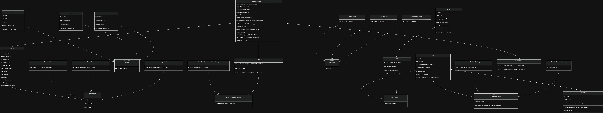

---

## 5. Design Patterns — Deep Dive

---

### 5.1 Singleton + Facade — `MusicStreamingSystem`

**What it does:**
Ensures a single music library/player instance system-wide. Also acts as a Facade by hiding `Player`, `SearchService`, and `RecommendationService` behind one clean interface.

**Implementation — Double-Checked Locking:**
```java
private static volatile MusicStreamingSystem instance;

public static MusicStreamingSystem getInstance() {
    if (instance == null) {                          // Fast path — no lock if already created
        synchronized (MusicStreamingSystem.class) {  // Slow path — only one thread enters
            if (instance == null) {                  // Second check — prevents double creation
                instance = new MusicStreamingSystem();
            }
        }
    }
    return instance;
}
```

**Why `volatile`?**
Without `volatile`, the JVM can reorder instructions — Thread A may publish the reference to `instance` BEFORE the constructor finishes. Thread B reads a non-null but half-initialized object. `volatile` creates a **memory barrier** ensuring the constructor completes before the reference is visible.

**Why Facade?**
Clients call `system.searchSongsByTitle()` without knowing that `SearchService` exists. The subsystem complexity is hidden — callers depend only on `MusicStreamingSystem`.

**Known Bug:**
```java
// Constructor is public — anyone can bypass the Singleton:
MusicStreamingSystem system1 = new MusicStreamingSystem(); // separate library
MusicStreamingSystem system2 = new MusicStreamingSystem(); // another separate library
// Alice's music is in system1, Bob's in system2 — no shared catalog

// Fix: make constructor private
private MusicStreamingSystem() { ... }
```

**Without Singleton + Facade:**
```java
// Every caller creates their own separate music system
MusicStreamingSystem s1 = new MusicStreamingSystem(); // its own player, songs, users
MusicStreamingSystem s2 = new MusicStreamingSystem(); // completely separate system
// Songs added to s1 are invisible to s2 — broken shared catalog
```

---

### 5.2 Builder Pattern — `User.Builder`

**What it does:**
Constructs a `User` with a readable, named parameter chain. Injects the correct `PlaybackStrategy` at build time based on the subscription tier.

**Implementation highlights:**
```java
User freeUser = new User.Builder("Alice")
    .withSubscription(SubscriptionTier.FREE, 0)   // sets strategy at build time
    .build();

User premiumUser = new User.Builder("Bob")
    .withSubscription(SubscriptionTier.PREMIUM, 0)
    .build();
```

**Key design decision — strategy created in `withSubscription()`, not later:**
`withSubscription()` calls `PlaybackStrategy.getStrategy(tier, songsPlayed)` immediately. By the time `build()` is called, the strategy is already set. This prevents a User existing without a playback strategy.

**Without Builder:**
```java
// Positional constructor — which arg is the name? which is the strategy?
new User("uuid", "Alice", freePlaybackStrategy);
// If someone calls: new User("uuid", freePlaybackStrategy, "Alice") — compiles, silently broken
```

---

### 5.3 Observer Pattern — `Artist` / `User` / `ArtistObserver`

**What it does:**
When an Artist releases a new Album, all following Users are automatically notified. Artists don't need to know about Users at all — they just notify their observer list.

**Three participants:**
- **Subject** (abstract class): manages the `observers` list — `addObserver`, `removeObserver`, `notifyObservers`
- **Artist** (Concrete Subject): extends `Subject`, calls `notifyObservers(this, album)` in `releaseAlbum()`
- **User** (Concrete Observer): implements `ArtistObserver`, prints notification in `update()`

**The `followArtist()` method does two things atomically:**
```java
public void followArtist(Artist artist) {
    followedArtists.add(artist);    // track who the user follows (for user's reference)
    artist.addObserver(this);       // register user as observer on the artist (for notification)
}
```
Both must happen together. Adding to `followedArtists` without `addObserver` = user tracks follow but never receives notifications. Calling `addObserver` without tracking = notifications arrive but user can't list who they follow.

**Without Observer Pattern:**
```java
// Artist.releaseAlbum() would need to know about User:
public void releaseAlbum(Album album) {
    // Tightly coupled: Artist must query the user database
    for (User user : UserDatabase.getAllUsers()) {
        if (user.getFollowedArtists().contains(this)) {
            user.sendNotification("New album released: " + album.getTitle());
        }
    }
}
// Adding a new notification target (e.g., PodcastListener) requires editing Artist
```

---

### 5.4 State Pattern — `Player`

**What it does:**
Encapsulates player lifecycle behavior. Each state class knows exactly what's legal from that state — no `if/else` chains in `Player`.

**States and transitions:**

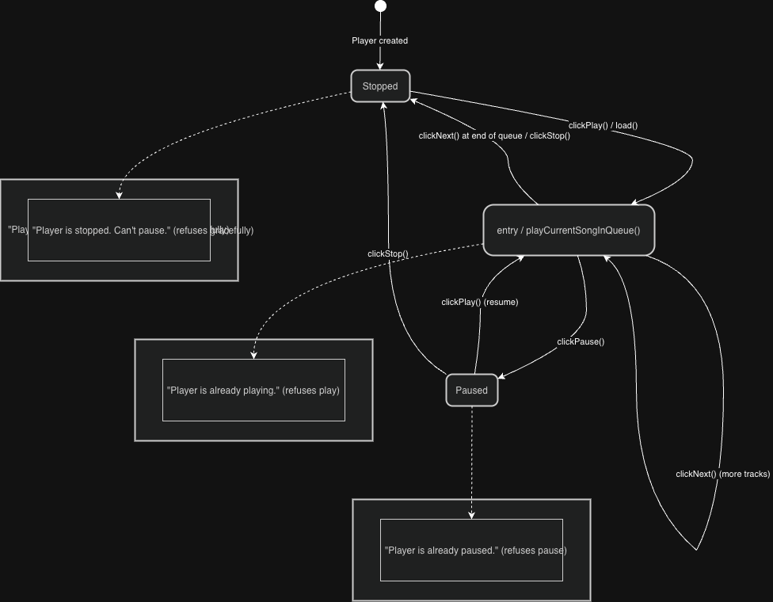

**How delegation works:**
```java
// Player delegates to its current state — zero if/else:
public void clickPlay() {
    state.play(this);   // StoppedState.play() → transitions to PlayingState
}                       // PlayingState.play() → prints "already playing"
                        // PausedState.play()  → transitions to PlayingState
```

**Known Bug:**
```java
// PlayerStatus.java has a typo:
public enum PlayerStatus {
    PLAUSED,  // ← Should be PAUSED
    STOPPED,
    PLAYING
}
```

**Without State Pattern:**
```java
// Player.clickPlay() becomes an if/else mess:
public void clickPlay() {
    if (status == STOPPED) {
        status = PLAYING;
        // ... start playback
    } else if (status == PAUSED) {
        status = PLAYING;
        // ... resume playback
    } else if (status == PLAYING) {
        System.out.println("already playing");
    }
    // Every new status = new branch in EVERY method (clickPlay, clickPause, clickStop, clickNext)
}
```

---

### 5.5 Command Pattern — `PlayCommand`, `PauseCommand`, `NextTrackCommand`

**What it does:**
Wraps a player operation as a first-class object. Decouples the caller (e.g. a UI button click) from the `Player` object. Enables passing commands around, storing them, or executing them on a schedule.

**Three participants:**
- **Command** (interface): `execute()`
- **Concrete Commands**: hold a reference to `Player`, delegate to its methods
- **Client** (Demo): creates and executes commands

```java
PlayCommand play         = new PlayCommand(player);
PauseCommand pause       = new PauseCommand(player);
NextTrackCommand next    = new NextTrackCommand(player);

play.execute();   // → player.clickPlay()
next.execute();   // → player.clickNext()
pause.execute();  // → player.clickPause()
```

**Note vs Stock Broker implementation:**
This implementation has NO `Invoker` class (unlike `OrderInvoker` in the stock broker). Commands are created and executed directly by the demo. For production use, an `Invoker` would provide queuing, audit logging, and undo support.

**Without Command Pattern:**
```java
// UI code directly couples to Player internals:
button.setOnClick(() -> player.clickPlay());
// Cannot queue: no way to "schedule this play for later"
// Cannot audit: no record of what was pressed and when
// Cannot undo: no handle to reverse the operation
```

---

### 5.6 Strategy Pattern — `PlaybackStrategy` + `RecommendationStrategy`

**What it does:**
Encapsulates algorithms (playback behavior, recommendation logic) and makes them interchangeable at runtime without changing `Player` or `User`.

#### PlaybackStrategy

**Two concrete strategies:**

```
FreePlaybackStrategy
  - Tracks songsPlayed count
  - Every 3rd song: prints advertisement first, then plays
  - songsPlayed++ after each play

PremiumPlaybackStrategy
  - Plays immediately — no ad, no tracking
```

**Simple Factory embedded in the Strategy interface:**
```java
// PlaybackStrategy.java — static factory method on the interface itself
static PlaybackStrategy getStrategy(SubscriptionTier tier, int songsPlayed) {
    return tier == SubscriptionTier.PREMIUM
        ? new PremiumPlaybackStrategy()
        : new FreePlaybackStrategy(songsPlayed);
}
```
This keeps strategy selection in one place — `User.Builder.withSubscription()` calls this without needing to know the concrete class names.

#### RecommendationStrategy

- `RecommendationService` holds a `RecommendationStrategy` and allows runtime swap via `setStrategy()`
- `GenreBasedRecommendationStrategy` currently simulates via random shuffle + limit(5) — designed to be replaced with a real ML-based strategy

**Without Strategy Pattern:**
```java
// Player.playCurrentSongInQueue() would have subscription logic baked in:
if (currentUser.getTier() == FREE) {
    if (songsPlayed % 3 == 0) { System.out.println("Advertisement!"); }
    // ...
} else if (currentUser.getTier() == PREMIUM) {
    // ...
}
// Adding a new tier (STUDENT, FAMILY) = modifying Player — violates Open/Closed Principle
```

---

### 5.7 Composite Pattern — `Playable`

**What it does:**
Allows `Player.load()` to accept a `Song`, an `Album`, or a `Playlist` uniformly — the Player doesn't need to know which type it received.

**Interface:**
```java
public interface Playable {
    List<Song> getTracks();  // Every Playable can produce a list of Songs
}
```

**Three implementations:**

| Class | Type | `getTracks()` returns |
|---|---|---|
| `Song` | Leaf | `Collections.singletonList(this)` — just itself |
| `Album` | Composite | `List.copyOf(tracks)` — all album tracks |
| `Playlist` | Composite | `List.copyOf(tracks)` — all playlist tracks |

**Player usage:**
```java
public void load(Playable playable, User user) {
    this.queue = playable.getTracks();  // Works for Song, Album, or Playlist identically
    this.currentIndex = 0;
}
```

**Known Bug in Album.java:**
```java
// Bug: tracks field is declared but NEVER initialized
private List<Song> tracks;        // ← null!

public void addTrack(Song song) {
    tracks.add(song);             // ← NullPointerException at runtime
}

// Fix:
private List<Song> tracks = new ArrayList<>();
```

**Without Composite Pattern:**
```java
// Player would need type-specific overloads:
public void load(Song song, User user) { queue = List.of(song); }
public void load(Album album, User user) { queue = album.getTracks(); }
public void load(Playlist playlist, User user) { queue = playlist.getTracks(); }
// Adding a new playable type (Radio, Podcast) = editing Player — violates Open/Closed Principle
```

---

## 6. Concurrency Strategy

### 6.1 What the Current Implementation Does

The implementation is **single-threaded demo scope**. The only thread-safety mechanism present is the **Singleton double-checked locking** in `MusicStreamingSystem`.

| Component | Mechanism | Scope |
|---|---|---|
| `MusicStreamingSystem.instance` | `volatile` + `synchronized` (DCL) | Prevents half-initialized Singleton |
| `Artist.discography` | `List.copyOf()` on read | Defensive copy — but ArrayList itself isn't thread-safe for writes |
| `Album.getTracks()` | `List.copyOf()` on read | Defensive copy |
| `Playlist.getTracks()` | `List.copyOf()` on read | Defensive copy |

### 6.2 What Would Break Under Concurrent Load

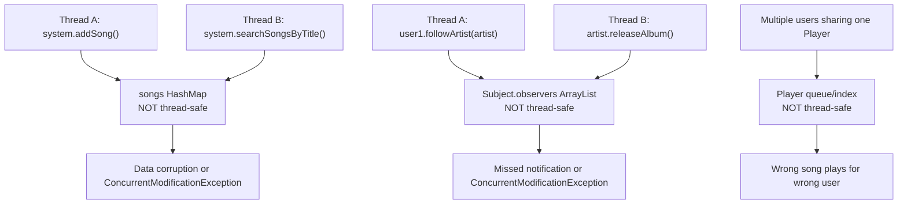

### 6.3 Production Fixes Required

| Component | Problem | Fix |
|---|---|---|
| `songs`, `artists`, `users` maps | `HashMap` — not thread-safe for concurrent read/write | `ConcurrentHashMap` |
| `Subject.observers` | `ArrayList` — not thread-safe for concurrent follow + notify | `CopyOnWriteArrayList` |
| `Player` | Single shared instance for all users | Per-user `Player` instances (move Player into User) |
| `MusicStreamingSystem()` constructor | `public` — bypasses Singleton | Make `private` |
| `FreePlaybackStrategy.songsPlayed` | Not thread-safe counter | `AtomicInteger` |

### 6.4 How Singleton DCL Works (the one real concurrency mechanism)

```java
private static volatile MusicStreamingSystem instance;

// Thread A and Thread B both call getInstance() simultaneously:

// STEP 1: Both threads check: instance == null → true (first time)
// STEP 2: Both try to enter synchronized block — only ONE gets the lock
// STEP 3: Winner creates instance, sets it, releases lock
// STEP 4: Loser acquires lock, checks AGAIN: instance != null → returns existing
// volatile ensures: winner's write is visible to loser IMMEDIATELY (no stale cache)
```

---

## 7. Sequence Diagrams — Key Flows

### Flow 1: User Follows Artist → Artist Releases Album → User Gets Notified

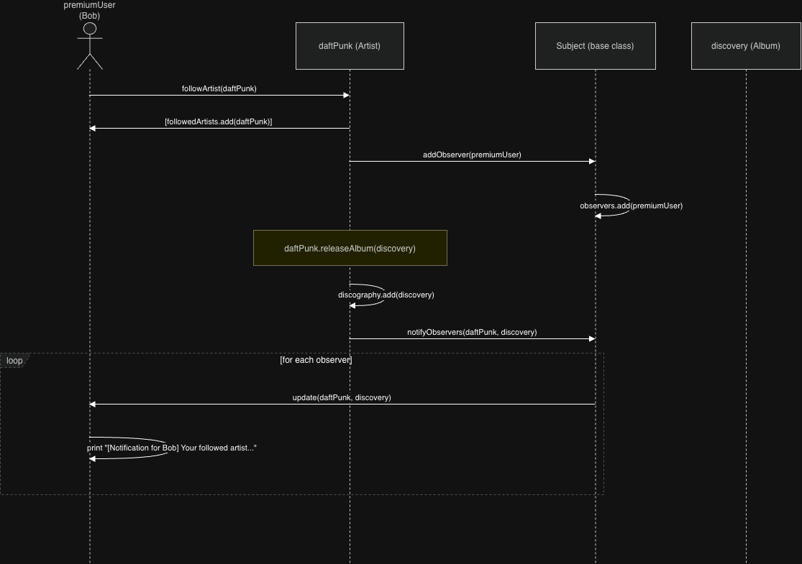

---

### Flow 2: Free User Playback — Ad After Every 3 Songs

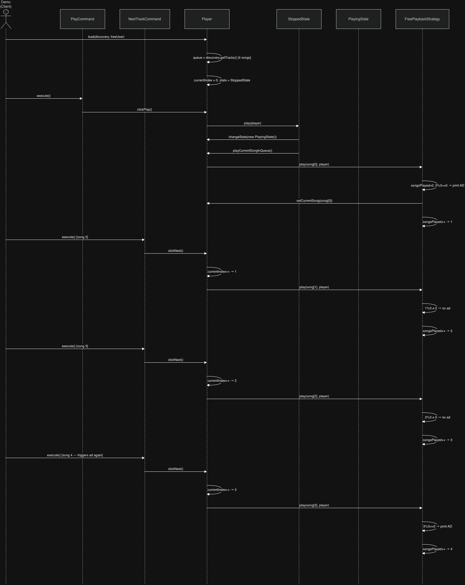

---

### Flow 3: Search and Recommendations

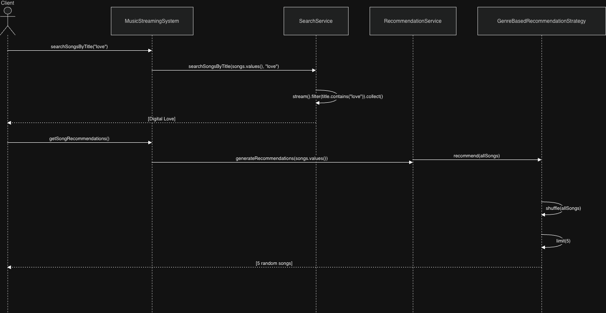

---

## 8. Application Flow

### Player State Machine

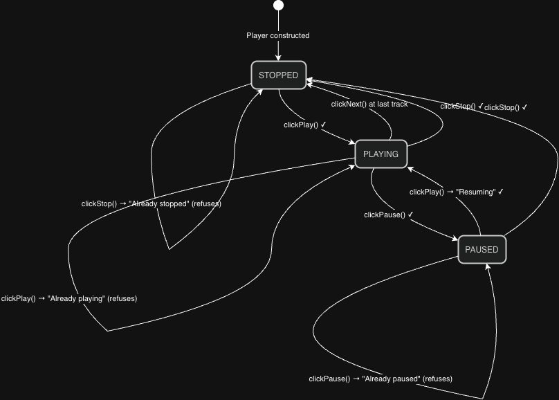

---

### Subscription Tier Decision Flow

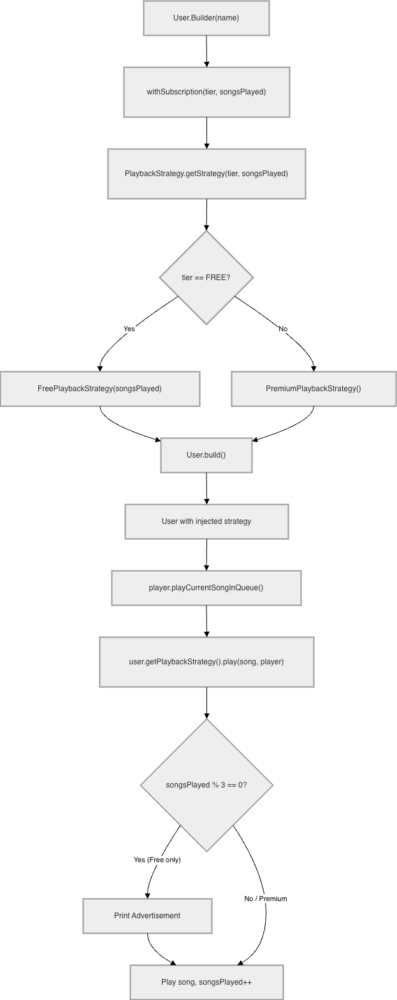

---

### Composite Playable Resolution Flow

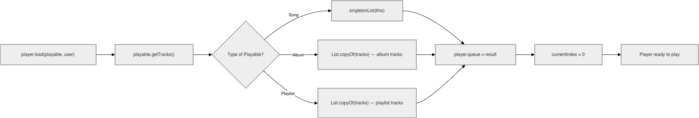

---

## 9. Quick Revision Cheatsheet

### Design Patterns at a Glance

| Pattern | Class(es) | Problem Solved | Without It |
|---|---|---|---|
| **Singleton** | `MusicStreamingSystem` | One shared music library across JVM | Multiple disconnected catalogs — searches and plays don't share data |
| **Facade** | `MusicStreamingSystem` | Single entry point hiding Player, SearchService, RecommendationService | Clients directly couple to subsystems — brittle and hard to refactor |
| **Builder** | `User.Builder` | Safe, readable User construction with strategy injection | Positional constructor — swap name/tier, wrong strategy assigned silently |
| **Observer** | `Artist`, `Subject`, `User`, `ArtistObserver` | Push album release notifications to followers | Artist must query User database — tight coupling, polling required |
| **State** | `Player`, `PlayingState`, `PausedState`, `StoppedState` | State-specific behavior without if/else chains | Every clickPlay/clickPause needs if/else for all statuses — missed cases |
| **Command** | `PlayCommand`, `PauseCommand`, `NextTrackCommand` | Decouple UI from Player; enable queuing and future undo | UI couples directly to Player — can't queue, audit, or undo operations |
| **Strategy** | `PlaybackStrategy`, `FreePlaybackStrategy`, `PremiumPlaybackStrategy`, `RecommendationStrategy` | Swap playback/recommendation algorithm per user at runtime | Ad logic and tier checks baked into Player — adding new tier breaks Player |
| **Composite** | `Playable`, `Song`, `Album`, `Playlist` | Player treats Song/Album/Playlist uniformly | Separate `load(Song)`, `load(Album)`, `load(Playlist)` overloads in Player |

---

### Known Bugs

| Bug | Location | Effect | Fix |
|---|---|---|---|
| `tracks` field not initialized | `Album.java:7` | `NullPointerException` on `addTrack()` | `private List<Song> tracks = new ArrayList<>()` |
| `PLAUSED` typo | `PlayerStatus.java:3` | Wrong enum name used throughout Player states | Rename to `PAUSED` |
| Constructor is `public` | `MusicStreamingSystem.java` | Anyone can bypass `getInstance()` and create a separate system | Make constructor `private` |

---

### Extensibility Hooks

| To add... | Where to add | Existing code changes |
|---|---|---|
| New subscription tier (STUDENT, FAMILY) | New class implementing `PlaybackStrategy` | Only `PlaybackStrategy.getStrategy()` needs a new branch |
| New recommendation algorithm | New class implementing `RecommendationStrategy` | Call `recommendationService.setStrategy(newStrategy)` — nothing else |
| New player state (BUFFERING, ERROR) | New class implementing `PlayerState` | Only the triggering states need to `changeState(new BufferingState())` |
| New player command (SeekCommand, ShuffleCommand) | New class implementing `Command` | Nothing — just create and call `execute()` |
| New playable type (Podcast, Radio) | New class implementing `Playable` | Nothing — `Player.load()` already accepts any `Playable` |

---

### Scalability Considerations (Production Gaps in This Implementation)

| Concern | Current State | Production Solution |
|---|---|---|
| Concurrent catalog reads/writes | `HashMap` (not thread-safe) | `ConcurrentHashMap` |
| Concurrent observer registration + notification | `ArrayList` (not thread-safe) | `CopyOnWriteArrayList` |
| Multiple users sharing one Player | Single Player in system | Per-user Player (move into User or session) |
| Recommendation for large catalogs | Full catalog shuffle in memory | Streaming/pagination + distributed cache (Redis) |
| Search on large catalog | Linear stream filter O(n) | Inverted index (Elasticsearch) |
| Song storage | In-memory `HashMap` | Distributed database + CDN for audio files |
