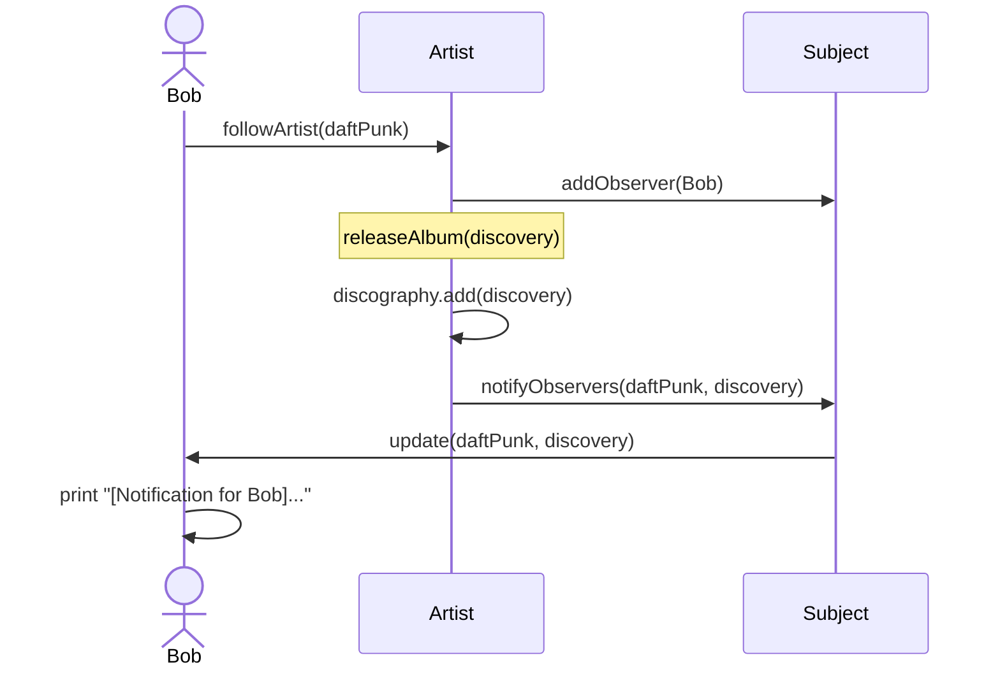
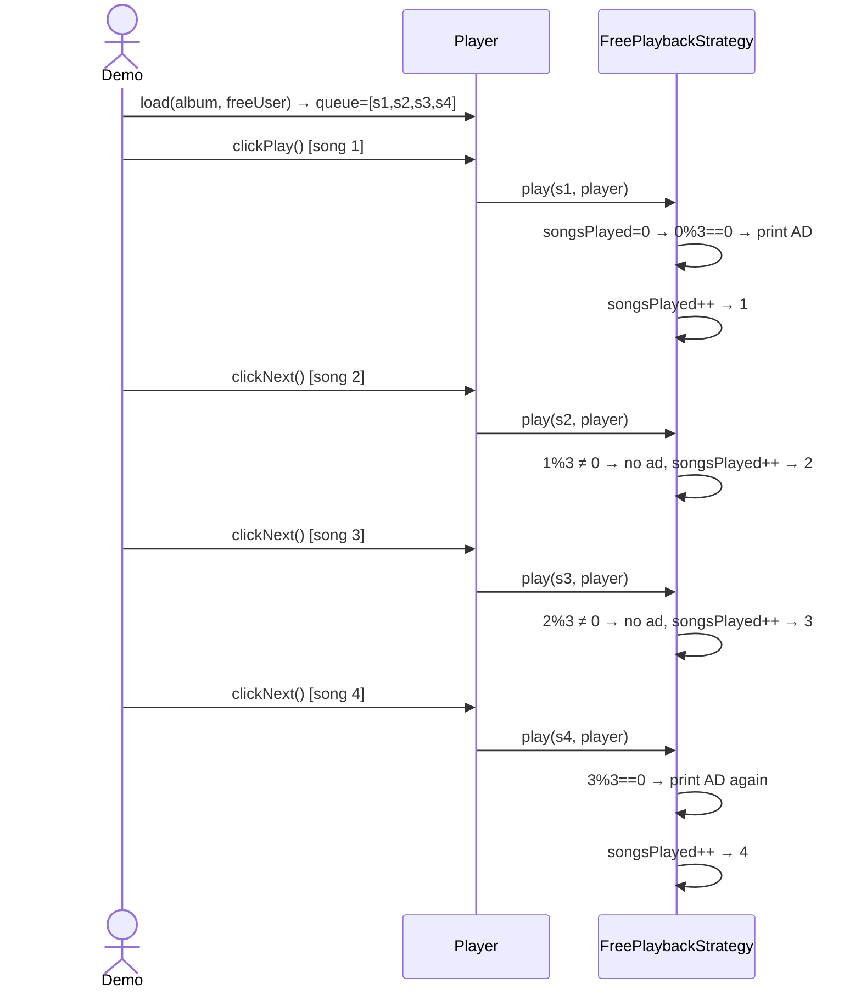
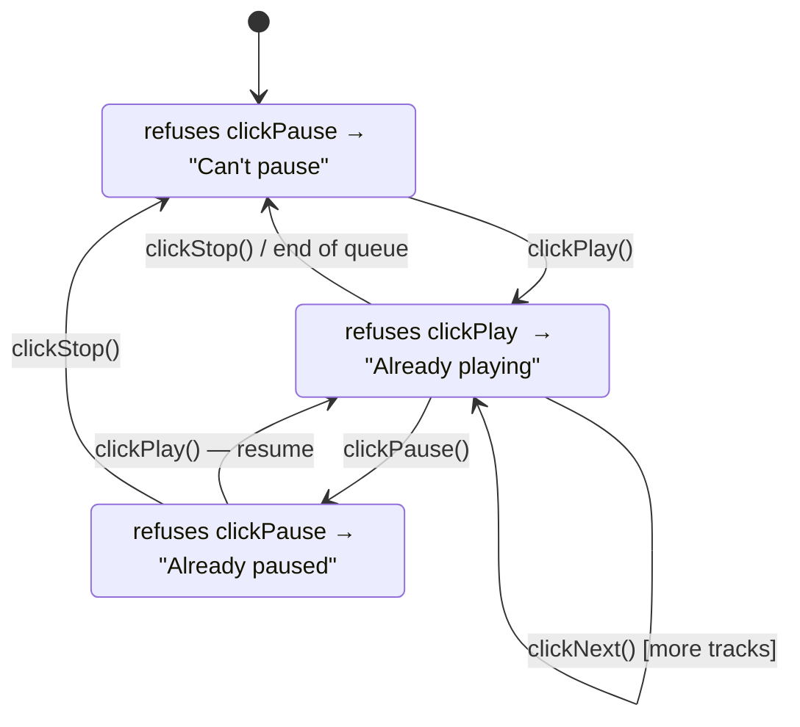

# Music Streaming System — LLD Revision Guide

> **Read once. Recall everything.**
> 7 design patterns · 28 classes · Spotify-like streaming service

---

## Table of Contents
1. [System in One Story](#1-system-in-one-story)
2. [Pattern Map — Memory Hook](#2-pattern-map--memory-hook)
3. [Class Responsibility Cheatsheet](#3-class-responsibility-cheatsheet)
4. [Draw the Class Diagram in 5 Steps](#4-draw-the-class-diagram-in-5-steps)
5. [Design Patterns — Deep Dive](#5-design-patterns--deep-dive)
6. [Key Flows — Sequence Diagrams](#6-key-flows--sequence-diagrams)
7. [Player State Machine](#7-player-state-machine)
8. [Concurrency & Known Bugs](#8-concurrency--known-bugs)
9. [Quick Revision Cheatsheet](#9-quick-revision-cheatsheet)

---

## 1. System in One Story

> A `User` is **built** (Builder) with a subscription tier that determines their `PlaybackStrategy` (Strategy — Free gets ads, Premium doesn't). The `MusicStreamingSystem` (Singleton + Facade) is the one global entry point. `Artist` is a Subject — when it releases an `Album`, all following `User`s get notified (Observer). The `Player` (State — Playing/Paused/Stopped) loads a `Playable` object — a `Song`, `Album`, or `Playlist` all work the same way (Composite). UI triggers `PlayCommand`, `PauseCommand`, `NextTrackCommand` — all decouple from `Player` (Command).

**Mnemonic — 7 patterns: "SB-OSC-SC"**
- **S**ingleton + Facade → `MusicStreamingSystem`
- **B**uilder → `User.Builder`
- **O**bserver → `Artist` notifies `User`
- **S**tate → `Player` lifecycle
- **C**ommand → Play/Pause/Next
- **S**trategy → Free/Premium playback + Recommendations
- **C**omposite → `Song`/`Album`/`Playlist` all implement `Playable`

---

## 2. Pattern Map — Memory Hook

| Pattern | Interface / Abstract | Concrete Classes | One-line Why |
|---|---|---|---|
| Singleton + Facade | — | `MusicStreamingSystem` | One shared catalog; hides Player/Search/Recommendation complexity |
| Builder | — | `User.Builder` | Inject correct strategy at build time; avoid positional constructor |
| Observer | `ArtistObserver` (interface), `Subject` (abstract) | `Artist` (Subject), `User` (Observer) | Artist notifies followers on album release — zero coupling to User class |
| State | `PlayerState` (interface) | `PlayingState`, `PausedState`, `StoppedState` | Player delegates play/pause/stop to current state — no if/else chains |
| Command | `Command` (interface) | `PlayCommand`, `PauseCommand`, `NextTrackCommand` | Decouple UI from Player; wrap each action as an object |
| Strategy | `PlaybackStrategy`, `RecommendationStrategy` (interfaces) | `FreePlaybackStrategy`, `PremiumPlaybackStrategy`, `GenreBasedRecommendationStrategy` | Swap ad-logic and recommendation algorithm without changing Player/User |
| Composite | `Playable` (interface) | `Song` (leaf), `Album` (composite), `Playlist` (composite) | `player.load(Playable)` works for all three — uniform `getTracks()` |

---

## 3. Class Responsibility Cheatsheet

> **All 28 classes — one-liner each.**

### Enums (2)
| Class | Role |
|---|---|
| `SubscriptionTier` | `FREE` or `PREMIUM` — drives strategy selection |
| `PlayerStatus` | `PLAYING`, `PAUSED` (typo: `PLAUSED`), `STOPPED` — mirrors active state |

### Model / Composite (6)
| Class | Role |
|---|---|
| `Playable` *(interface)* | Contract: `getTracks() → List<Song>` — unified interface for all playable units |
| `Song` | Leaf — wraps itself in a singleton list for `getTracks()` |
| `Album` | Composite — ordered list of Songs released by an Artist |
| `Playlist` | Composite — user-curated list of Songs |
| `User` | Observer + strategy holder; built via `User.Builder`; follows artists |
| `Player` | State-machine context; holds queue + currentIndex; delegates all actions to `PlayerState` |

### Observer (3)
| Class | Role |
|---|---|
| `ArtistObserver` *(interface)* | `update(artist, album)` — implemented by any follower |
| `Subject` *(abstract)* | Manages `List<ArtistObserver>`; add/remove/notify helpers |
| `Artist` | Extends `Subject`; `releaseAlbum()` adds to discography and fires `notifyObservers()` |

### State (4)
| Class | Role |
|---|---|
| `PlayerState` *(interface)* | `play(player)`, `pause(player)`, `stop(player)` |
| `PlayingState` | play → "already playing"; pause → `PausedState`; stop → `StoppedState` |
| `PausedState` | play → resume → `PlayingState`; pause → "already paused"; stop → `StoppedState` |
| `StoppedState` | play → start → `PlayingState`; pause → "can't pause"; stop → "already stopped" |

### Command (4)
| Class | Role |
|---|---|
| `Command` *(interface)* | `execute()` |
| `PlayCommand` | Wraps `player.clickPlay()` |
| `PauseCommand` | Wraps `player.clickPause()` |
| `NextTrackCommand` | Wraps `player.clickNext()` |

### Strategy (5)
| Class | Role |
|---|---|
| `PlaybackStrategy` *(interface)* | `play(song, player)` + static factory `getStrategy(tier, songsPlayed)` |
| `FreePlaybackStrategy` | Tracks `songsPlayed`; inserts ad every 3rd song (`songsPlayed % 3 == 0`) |
| `PremiumPlaybackStrategy` | Plays immediately — no tracking, no ads |
| `RecommendationStrategy` *(interface)* | `recommend(allSongs) → List<Song>` |
| `GenreBasedRecommendationStrategy` | Simulates: shuffle all songs, return first 5 |

### Services (2)
| Class | Role |
|---|---|
| `SearchService` | Stream-filters songs by title / artists by name (case-insensitive `contains`) |
| `RecommendationService` | Holds a `RecommendationStrategy`; delegates `generateRecommendations()` to it; swappable via `setStrategy()` |

### System (2)
| Class | Role |
|---|---|
| `MusicStreamingSystem` | Singleton + Facade; owns `Map<id, Song/Artist/User>`, `Player`, `SearchService`, `RecommendationService` |
| `MusicStreamingDemo` | Main — wires everything together; exercises all 7 patterns |

---

## 4. Draw the Class Diagram in 5 Steps

> Follow this order and you'll reconstruct the full diagram without missing a class.

**Step 1 — Draw the 5 interfaces (your skeleton)**
```
Playable          PlayerState       Command
  └─ getTracks()    └─ play/pause/stop  └─ execute()

PlaybackStrategy            RecommendationStrategy    ArtistObserver
  └─ play(song, player)       └─ recommend(songs)       └─ update(artist, album)
  └─ getStrategy() [factory]
```

**Step 2 — Hang concrete classes off each interface**
```
Playable  ◄── Song (leaf), Album (composite), Playlist (composite)
PlayerState ◄── PlayingState, PausedState, StoppedState
Command ◄── PlayCommand, PauseCommand, NextTrackCommand
PlaybackStrategy ◄── FreePlaybackStrategy, PremiumPlaybackStrategy
RecommendationStrategy ◄── GenreBasedRecommendationStrategy
ArtistObserver ◄── User
```

**Step 3 — Build the Observer chain**
```
Subject (abstract)
  └─ observers: List<ArtistObserver>
  └─ add/remove/notifyObservers()
      ▲
   Artist (extends Subject)
      └─ discography: List<Album>
      └─ releaseAlbum() → notifyObservers()
```

**Step 4 — Build User and Player (the two stateful actors)**
```
User (implements ArtistObserver)
  ├─ playbackStrategy: PlaybackStrategy  [COMPOSITION — built in User.Builder]
  └─ followedArtists: Set<Artist>        [ASSOCIATION]

User.Builder (inner class)
  └─ withSubscription(tier, songsPlayed) → PlaybackStrategy.getStrategy(...)
  └─ build() → new User(...)

Player
  ├─ state: PlayerState                 [COMPOSITION — Player creates states]
  ├─ status: PlayerStatus
  ├─ queue: List<Song>                  [loaded from any Playable]
  ├─ currentUser: User                  [ASSOCIATION]
  └─ clickPlay/clickPause/clickNext() → delegates to state
```

**Step 5 — Wrap in the Facade**
```
MusicStreamingSystem (Singleton)
  ├─ player: Player                     [COMPOSITION]
  ├─ searchService: SearchService       [COMPOSITION]
  ├─ recommendationService: RecommendationService  [COMPOSITION]
  ├─ songs: Map<String, Song>
  ├─ artists: Map<String, Artist>
  └─ users: Map<String, User>

RecommendationService
  └─ strategy: RecommendationStrategy  [ASSOCIATION — swappable via setStrategy()]
```

> **Tip:** Composition = created inside, dies with parent. Association = created outside, passed in, independent lifecycle.

---

## 5. Design Patterns — Deep Dive

---

### 5.1 Singleton + Facade — `MusicStreamingSystem`

**Key implementation — Double-Checked Locking:**
```java
private static volatile MusicStreamingSystem instance;  // volatile = memory barrier

public static MusicStreamingSystem getInstance() {
    if (instance == null) {                         // 1. Fast path — skip lock after init
        synchronized (MusicStreamingSystem.class) { // 2. Only one thread creates
            if (instance == null) {                 // 3. Second check: two threads can both pass #1
                instance = new MusicStreamingSystem();
            }
        }
    }
    return instance;
}
```

**Why `volatile`:** Without it, JVM instruction reordering can expose a half-constructed object to another thread — `instance != null` but constructor hasn't finished.

**Facade role:** `system.searchSongsByTitle()` — caller never touches `SearchService`. `system.getSongRecommendations()` — caller never touches `RecommendationService`. One interface, all subsystems hidden.

**Bug:** Constructor is `public` → anyone can call `new MusicStreamingSystem()` and get a separate catalog. Fix: `private MusicStreamingSystem() {}`

---

### 5.2 Builder — `User.Builder`

```java
User alice = new User.Builder("Alice")
    .withSubscription(SubscriptionTier.FREE, 0)   // → FreePlaybackStrategy(0)
    .build();                                       // → new User(id, name, strategy)
```

**Why:** User needs 3+ fields (id, name, strategy). Strategy depends on both `tier` AND `songsPlayed` — a single constructor call can't express this cleanly. Builder names each concern explicitly.

**Key insight:** `withSubscription()` calls `PlaybackStrategy.getStrategy(tier, songsPlayed)` immediately. Strategy is set before `build()` — User can never be created without a strategy.

---

### 5.3 Observer — `Artist` / `Subject` / `User`

```
Artist.releaseAlbum(album)
  ├─ discography.add(album)
  └─ notifyObservers(this, album)
       └─ for each observer: observer.update(artist, album)
                                 └─ User.update() → print "[Notification for Bob]..."
```

**`followArtist()` does TWO things — both required:**
```java
public void followArtist(Artist artist) {
    followedArtists.add(artist);   // User tracks who they follow
    artist.addObserver(this);      // Artist knows to notify this user
}
// Miss the second line → user follows but NEVER gets notifications
// Miss the first line  → user gets notifications but can't list followed artists
```

**Without Observer:** `Artist.releaseAlbum()` would query the user database directly — coupling Artist to User, requiring a database scan on every release.

---

### 5.4 State — `Player`

**State transition table (memorize this grid):**

| Action | `StoppedState` | `PlayingState` | `PausedState` |
|---|---|---|---|
| `clickPlay()` | → `PlayingState` ✓ | "already playing" ✗ | → `PlayingState` (resume) ✓ |
| `clickPause()` | "can't pause" ✗ | → `PausedState` ✓ | "already paused" ✗ |
| `clickStop()` | "already stopped" ✗ | → `StoppedState` ✓ | → `StoppedState` ✓ |
| `clickNext()` | N/A | → next song or `StoppedState` | N/A |

**How delegation works — zero if/else in Player:**
```java
public void clickPause() {
    state.pause(this);  // PlayingState.pause() → changeState(new PausedState())
}                       // PausedState.pause()  → "already paused" (no-op)
                        // StoppedState.pause() → "can't pause" (refuses)
```

**Without State:** `clickPlay()` needs `if (status == STOPPED) {...} else if (status == PAUSED) {...} else if (status == PLAYING) {...}` — every method, every new status = missed branches = silent bugs.

---

### 5.5 Command — `PlayCommand`, `PauseCommand`, `NextTrackCommand`

```java
Command play = new PlayCommand(player);   // created by UI / client
play.execute();                           // → player.clickPlay()
```

All three commands are thin wrappers. They store a `Player` reference and delegate in `execute()`. No Invoker class in this implementation (unlike Stock Broker system — no queuing or undo here).

**Without Command:** UI directly calls `player.clickPlay()` — no interception point for queuing, scheduling, or undo support later.

---

### 5.6 Strategy — `PlaybackStrategy` + `RecommendationStrategy`

**PlaybackStrategy — ads every 3 songs:**
```java
// FreePlaybackStrategy.play():
if (songsPlayed > 0 && songsPlayed % SONGS_BEFORE_AD == 0) {  // SONGS_BEFORE_AD = 3
    System.out.println(">>> Advertisement <<<");
}
player.setCurrentSong(song);
songsPlayed++;

// PremiumPlaybackStrategy.play():
player.setCurrentSong(song);  // that's it — no tracking, no ads
```

**Simple Factory embedded in the interface:**
```java
// PlaybackStrategy.java — static method on the interface itself
static PlaybackStrategy getStrategy(SubscriptionTier tier, int songsPlayed) {
    return tier == PREMIUM ? new PremiumPlaybackStrategy()
                           : new FreePlaybackStrategy(songsPlayed);
}
```
This is a **Simple Factory disguised as a static interface method** — creation logic lives with the abstraction, not scattered in callers.

**RecommendationService is Strategy-swappable at runtime:**
```java
service.setStrategy(new CollaborativeFilteringStrategy()); // swap without touching callers
```

---

### 5.7 Composite — `Playable`

```java
// Leaf:
class Song implements Playable {
    public List<Song> getTracks() { return Collections.singletonList(this); }
}

// Composite (same interface):
class Album implements Playable {
    public List<Song> getTracks() { return List.copyOf(tracks); }
}

// Player doesn't care which type:
public void load(Playable playable, User user) {
    this.queue = playable.getTracks();  // works for Song, Album, Playlist identically
}
```

**Bug:** `Album.tracks` is declared as `private List<Song> tracks;` — never initialized. Calling `album.addTrack(song)` throws `NullPointerException`. Fix: `= new ArrayList<>()`.

**Without Composite:** `Player` needs `load(Song)`, `load(Album)`, `load(Playlist)` — every new playable type (podcast, radio) adds an overload to `Player`.

---

## 6. Key Flows — Sequence Diagrams

### Flow 1: Follow Artist → Release Album → Get Notified



---

### Flow 2: Free User — Ad Injection Every 3 Songs



---

## 7. Player State Machine



---

## 8. Concurrency & Known Bugs

### Concurrency: What's Thread-Safe vs What Isn't

| Component | Thread-Safe? | Why / Fix |
|---|---|---|
| `MusicStreamingSystem.instance` | ✅ | `volatile` + DCL |
| `Album/Playlist/Artist` getters | ✅ (reads) | `List.copyOf()` defensive copy |
| `songs/artists/users` `HashMap` | ❌ | Concurrent reads+writes corrupt map → use `ConcurrentHashMap` |
| `Subject.observers` `ArrayList` | ❌ | Concurrent follow + notify → `ConcurrentModificationException` → use `CopyOnWriteArrayList` |
| `Player` (single shared instance) | ❌ | Multiple users sharing one player → wrong song for wrong user → make per-user |
| `FreePlaybackStrategy.songsPlayed` | ❌ | `int` not atomic → use `AtomicInteger` |
| `MusicStreamingSystem()` constructor | ❌ (design) | `public` → bypass Singleton → make `private` |

### Known Bugs (3)

| # | Bug | File | Symptom | Fix |
|---|---|---|---|---|
| 1 | `tracks` not initialized | `Album.java:7` | `NullPointerException` on first `addTrack()` | `private List<Song> tracks = new ArrayList<>()` |
| 2 | Typo `PLAUSED` | `PlayerStatus.java:3` | Enum value mismatch with `PAUSED` logic | Rename to `PAUSED` |
| 3 | Public constructor | `MusicStreamingSystem.java` | Singleton can be bypassed with `new` | `private MusicStreamingSystem()` |

---

## 9. Quick Revision Cheatsheet

### All 7 Patterns at a Glance

| Pattern | Class(es) | Without It |
|---|---|---|
| **Singleton + Facade** | `MusicStreamingSystem` | Multiple disconnected catalogs; callers know subsystem internals |
| **Builder** | `User.Builder` | Positional constructor — silently wrong strategy assignment |
| **Observer** | `Artist`, `Subject`, `User` | Artist queries user DB on release — tight coupling |
| **State** | `Player`, 3 State classes | `if/else` explosion in every Player method |
| **Command** | 3 Command classes | UI tightly coupled to Player — no future queue/undo |
| **Strategy** | `FreePlaybackStrategy`, `PremiumPlaybackStrategy`, `GenreBasedRecommendationStrategy` | Ad logic baked into Player — new tier = edit Player |
| **Composite** | `Song`, `Album`, `Playlist` | `player.load()` needs 3 overloads; new types break Player |

### Extensibility — Where to Add New Stuff

| Feature | Add This | Touch Nothing Else |
|---|---|---|
| New subscription tier (STUDENT) | New `PlaybackStrategy` subclass + branch in `getStrategy()` | Player, User, Demo untouched |
| New recommendation algorithm | New `RecommendationStrategy` subclass | Call `service.setStrategy(new Algo())` |
| New player state (BUFFERING) | New `PlayerState` subclass | Only triggering states call `changeState(new BufferingState())` |
| New player action (Seek, Shuffle) | New `Command` subclass | Nothing — create and `execute()` |
| New playable type (Podcast, Radio) | Implement `Playable` | `Player.load()` already handles it |

### How to Answer "How Does the System Work?" in 30 Seconds

```
MusicStreamingSystem (Singleton) ← one global entry point
  │
  ├─ User (Builder) ← knows tier → gets PlaybackStrategy (Strategy)
  │    └─ follows Artist (Observer) ← notified on album release
  │
  ├─ Player (State: Playing/Paused/Stopped)
  │    ├─ load(Playable) ← Song / Album / Playlist all work (Composite)
  │    └─ commanded by PlayCommand / PauseCommand / NextTrackCommand (Command)
  │
  ├─ SearchService ← stream filter on in-memory maps
  └─ RecommendationService ← delegates to RecommendationStrategy (Strategy)
```
