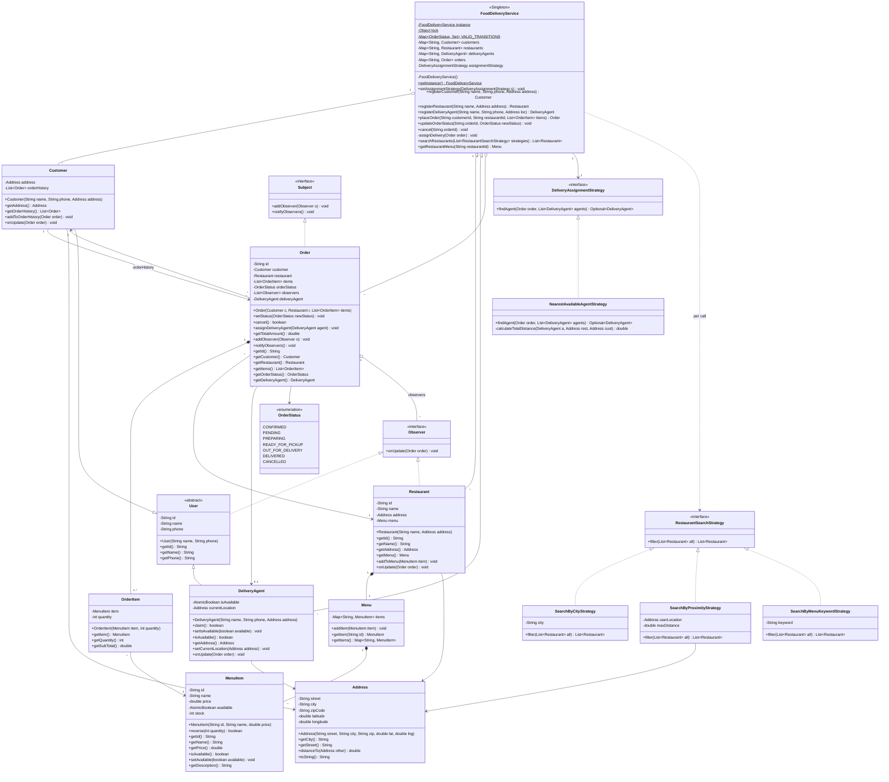
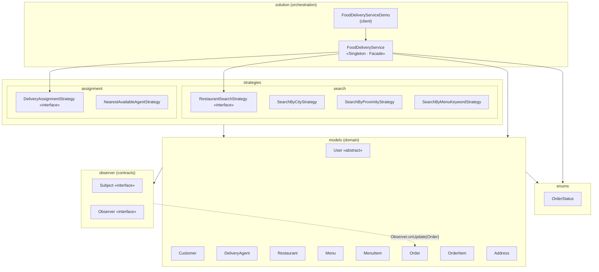
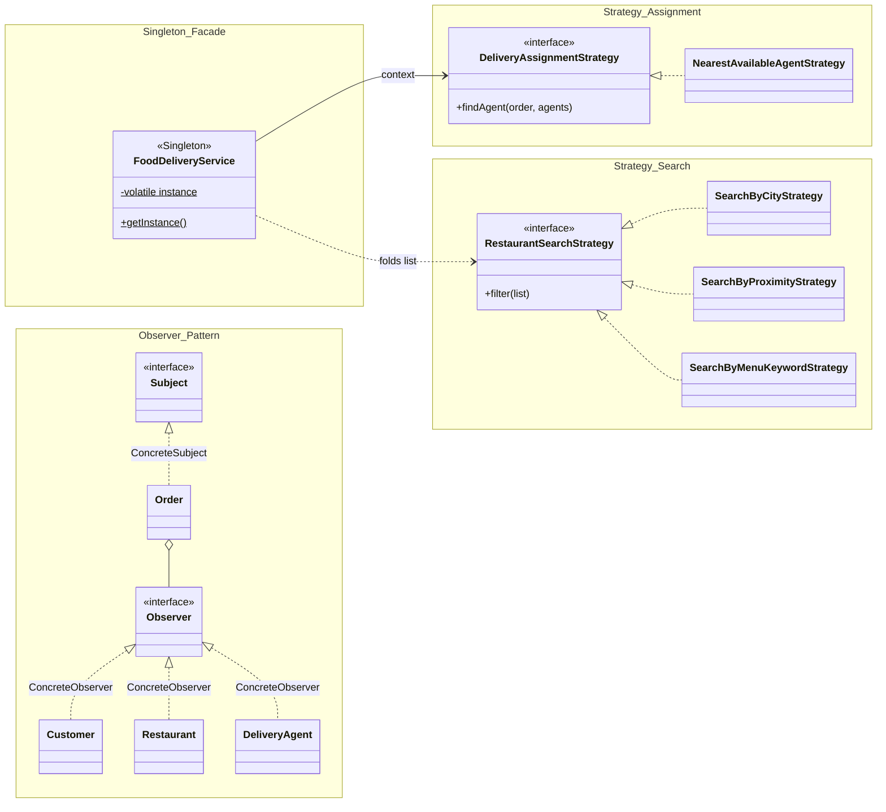
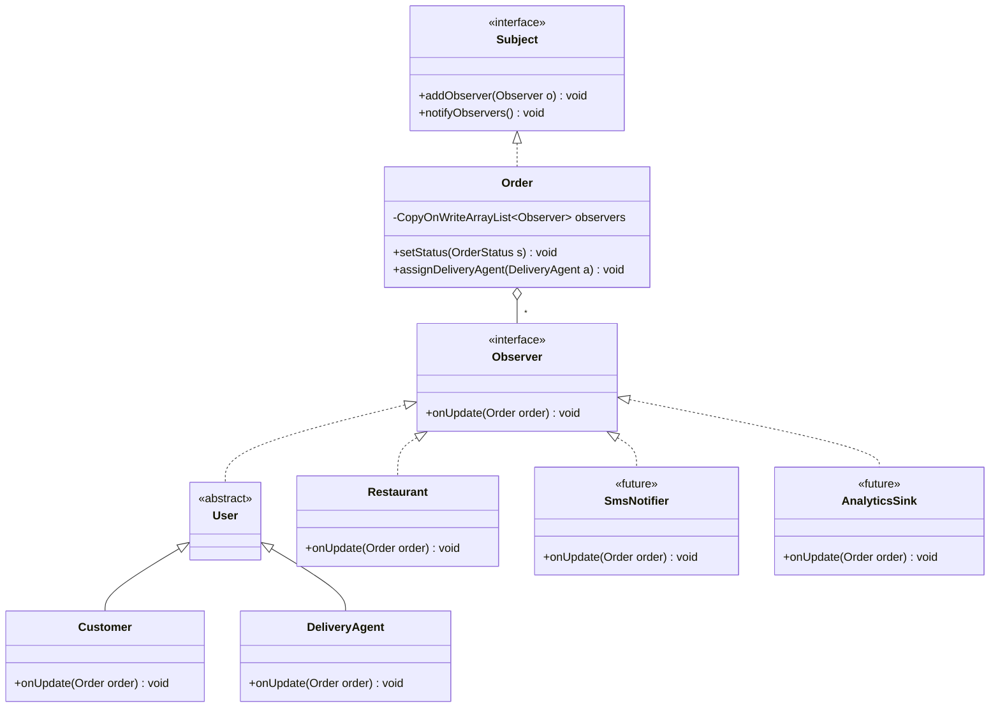
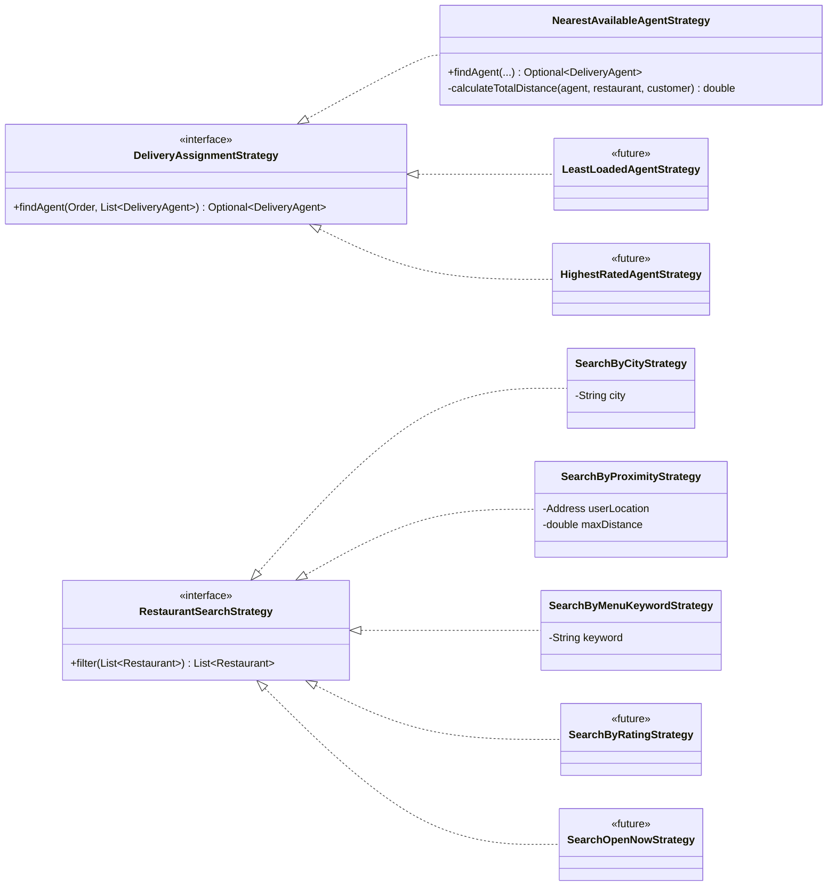
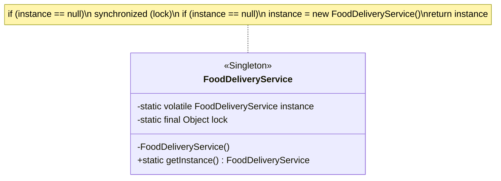

# Online Food Delivery Service — UML Class Diagrams

> The structural view. Every field, method and relationship below mirrors the Java
> sources in [`../solution/`](../solution/). ⚠️ marks code that diverges from the
> intended design. See the
> [known gaps](../problems/online-food-delivery-service.md#known-gaps-and-how-they-were-fixed).

---

## 1. Full Class Diagram



> **Note.** `Customer ↔ Order` is a **bidirectional** association: the order points to
> its customer and the customer keeps the order in `orderHistory`. It is the only cycle
> in the model. It makes "my orders" O(1) but means both sides must be kept in sync.

---

## 2. Package / Layer View



> The `observer` package depends on `models.Order` (`onUpdate(Order)`) and `models`
> depends on `observer`. That is a **package cycle**. A generic
> `Observer<T>` or an `OrderEvent` DTO in the `observer` package would break it.

---

## 3. Design-Pattern Overlay



| Pattern | Role → Class |
|---|---|
| Singleton | Instance holder → `FoodDeliveryService` |
| Facade | Facade → `FoodDeliveryService`. Subsystems → registries, strategies, `Order` |
| Strategy (assignment) | Context → `FoodDeliveryService`. Strategy → `DeliveryAssignmentStrategy`. Concrete → `NearestAvailableAgentStrategy` |
| Strategy (search) | Context → `searchRestaurants`. Strategy → `RestaurantSearchStrategy`. Concrete → City / Proximity / MenuKeyword |
| Observer | Subject → `Subject`. ConcreteSubject → `Order`. Observer → `Observer`. ConcreteObservers → `Customer`, `DeliveryAgent`, `Restaurant` |

---

## 4. Observer Pattern Close-up



| Subscribed when | Observer |
|---|---|
| `Order` constructor | `Customer`, `Restaurant` |
| `Order.assignDeliveryAgent` | `DeliveryAgent` |
| never removed | ⚠️ there is no `removeObserver`, so an agent keeps receiving updates for a delivered order forever (harmless today because `DELIVERED` is terminal) |

This is the **push-the-subject** variant: observers receive the whole `Order` and pull
what they need (`getId()`, `getOrderStatus()`).

---

## 5. Strategy Pattern Close-up



- **Assignment** strategy is *held* (a field, swappable with `setAssignmentStrategy`).
  ⚠️ The field is not `volatile`, so a swap on one thread is not guaranteed to be
  visible to another.
- **Search** strategies are *passed per call* as a list and folded left-to-right, which
  gives AND-composition for free. Putting the cheapest, most selective filter first
  (city) shrinks the input for the expensive ones (menu scan).

---

## 6. The Singleton (correctly implemented)



Unlike the ticket system in this repo, this one is right: the field is `volatile` (so
the constructor's writes cannot be reordered after the reference is published), it is
actually **assigned** inside the lock, and the constructor is `private`. A simpler
alternative with the same guarantees is the *initialization-on-demand holder* idiom:

```java
private static class Holder { static final FoodDeliveryService I = new FoodDeliveryService(); }
public static FoodDeliveryService getInstance() { return Holder.I; }
```

---

## 7. Notation Cheatsheet

| Mermaid | UML meaning | Example here |
|---|---|---|
| `A <\|-- B` | B **extends** A | `User <\|-- Customer` |
| `A <\|.. B` | B **implements** A | `Observer <\|.. Restaurant` |
| `A *-- B` | **Composition**: B's lifetime is bound to A | `Restaurant *-- Menu` |
| `A o-- B` | **Aggregation**: A holds B, B lives independently | `FoodDeliveryService o-- Customer` |
| `A --> B` | **Association**: A has a field of type B | `Order --> Restaurant` |
| `A ..> B` | **Dependency**: A uses B transiently | `FoodDeliveryService ..> RestaurantSearchStrategy` |
| `+` / `-` / `#` | public / private / protected | |
| `$` suffix | static member | `getInstance()$` |
| `~T~` | generic type parameter | `List~Order~` |
