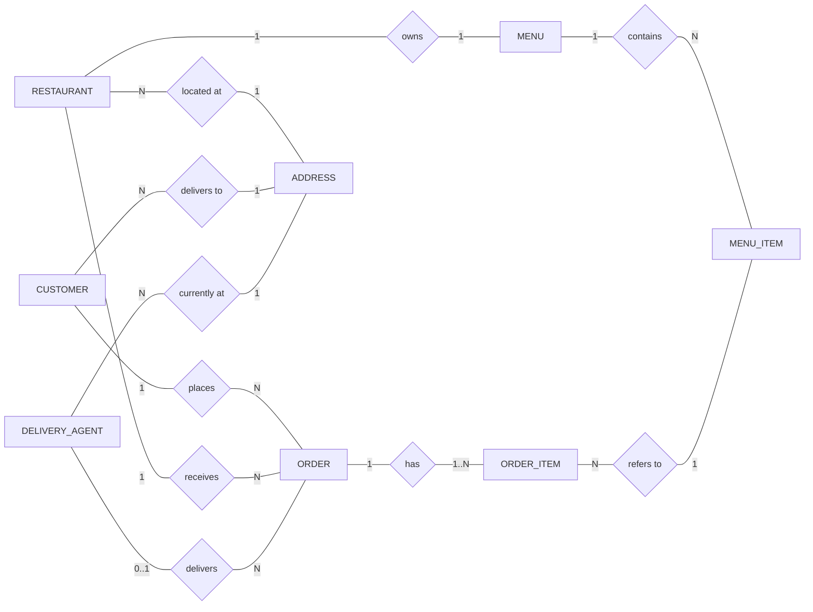
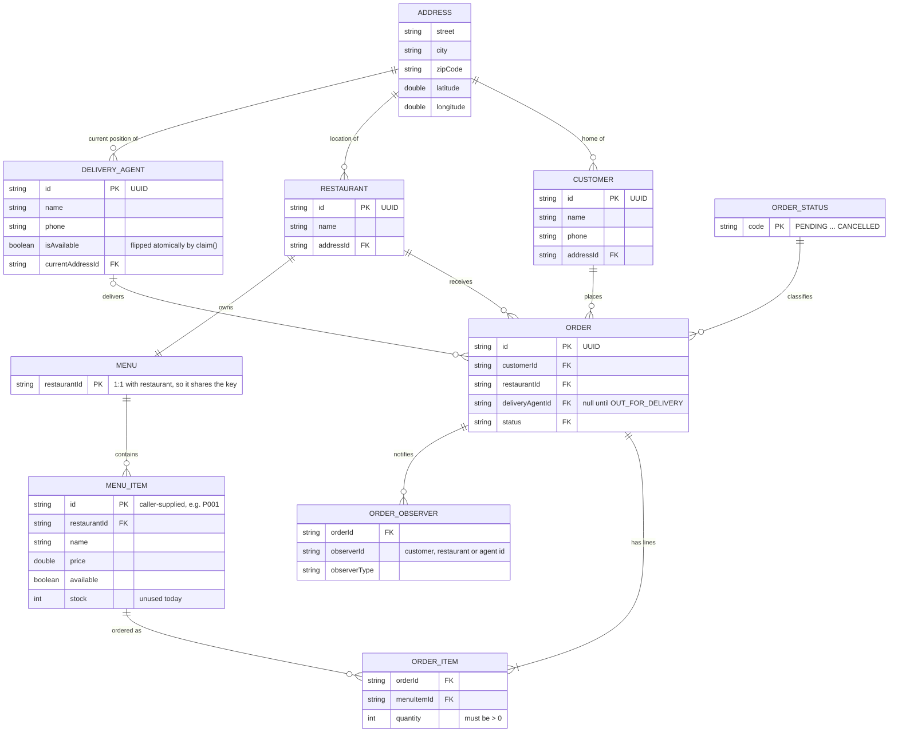
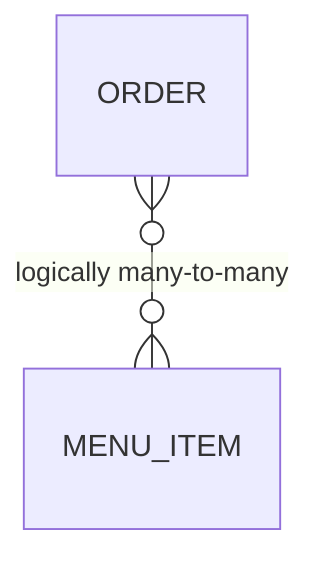
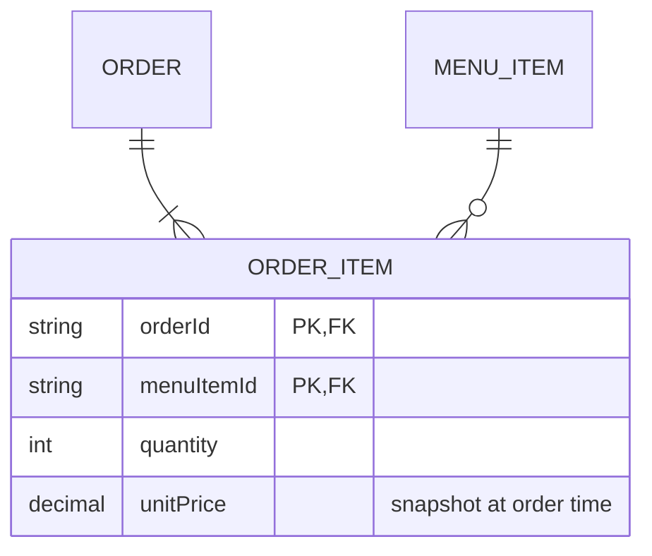

# Online Food Delivery Service — Entity Relationship Diagrams

> The **conceptual data** view: which things exist, what describes them, and how they
> relate. There are no Java types or methods here, only entities, attributes and
> cardinalities. The physical tables, column types and indexes are in
> [03 — Database Model](03-database-model.md).

---

## 1. Conceptual ER Diagram (Chen-style, entities and relationships only)

Rectangles are entities and diamonds are relationships. The labels on each edge are the
cardinality at that end.

---

## 2. Logical ER Diagram (crow's foot)

### Reading the crow's foot

| Symbol | Meaning |
|---|---|
| `\|\|` | exactly one |
| `\|o` | zero or one |
| `\|{` | one or more |
| `o{` | zero or more |

---

## 3. Relationship & Cardinality Table

| Relationship | Cardinality | Mandatory? | Where it lives in Java |
|---|---|---|---|
| Customer places Order | 1 : N | Order → Customer mandatory | `Order.customer` (final) and `Customer.orderHistory` |
| Restaurant receives Order | 1 : N | Order → Restaurant mandatory | `Order.restaurant` (final) |
| DeliveryAgent delivers Order | 0..1 : N | optional until pickup | `Order.deliveryAgent` (mutable, set once) |
| Restaurant owns Menu | 1 : 1 | yes, created in the constructor | `Restaurant.menu` (final) |
| Menu contains MenuItem | 1 : N | a menu may be empty | `Menu.items` map |
| Order has OrderItem | 1 : 1..N | at least one line (validated) | `Order.items` (final list) |
| OrderItem refers to MenuItem | N : 1 | yes | `OrderItem.item` (final) |
| Customer / Restaurant / Agent → Address | N : 1 | yes | embedded value object |
| Order notifies Observer | 1 : N | customer and restaurant always, agent later | `Order.observers` |

### Is `ADDRESS` an entity or a value object?

In Java `Address` has **no id**. Two equal addresses are interchangeable, and it is
shared by reference (the demo passes `aliceAddress` to both the customer and a search
strategy). That makes it a **value object**. The logical ER diagram draws it as a
separate box for clarity. The physical model in [03](03-database-model.md) embeds it
as columns for restaurants and agents, and gives customers an `address` table because
a real customer has several saved addresses (Home, Work).

---

## 4. Many-to-Many Resolution

`ORDER ↔ MENU_ITEM` is conceptually many-to-many (an order has many items, and an item
appears in many orders). `ORDER_ITEM` is the **associative entity** that resolves it
and carries the relationship's own attributes (`quantity`, and in the physical model
`unit_price`):

> **Why snapshot the price?** `OrderItem.getSubTotal()` reads `item.getPrice()` live.
> The price is `final` today so it is safe, but the moment a restaurant can edit prices,
> an old order's total would silently change. Persisted orders must copy the price at
> checkout.
