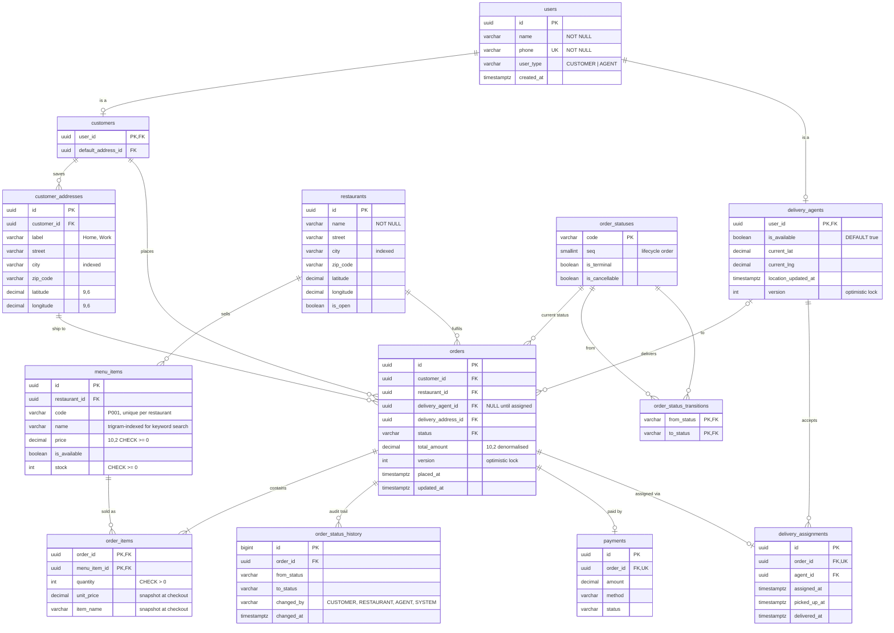
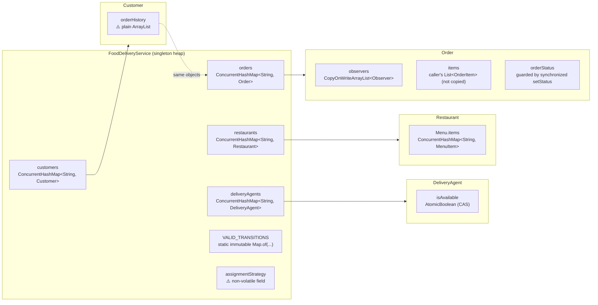

# Online Food Delivery Service — Database Modelling

> The **physical** model: how you would persist this system in a relational database.
> Column types, keys, constraints, indexes and the queries they exist to serve. The
> conceptual view is in [02 — ER Diagram](02-er-diagram.md). The in-memory structures
> the Java code actually uses are in § 5.

---

## 1. Physical Schema Diagram



`payments`, `delivery_assignments` and `order_status_history` are **not** in the Java
model. They are what production adds on top. They are included because "how would you
persist it?" is usually followed by "and how would you audit it?".

---

## 2. DDL (PostgreSQL)

```sql
CREATE TABLE order_statuses (
    code           VARCHAR(20) PRIMARY KEY,
    seq            SMALLINT    NOT NULL UNIQUE,
    is_terminal    BOOLEAN     NOT NULL,
    is_cancellable BOOLEAN     NOT NULL
);
INSERT INTO order_statuses VALUES
  ('PENDING',1,false,true), ('CONFIRMED',2,false,true), ('PREPARING',3,false,false),
  ('READY_FOR_PICKUP',4,false,false), ('OUT_FOR_DELIVERY',5,false,false),
  ('DELIVERED',6,true,false), ('CANCELLED',7,true,false);

-- The Java VALID_TRANSITIONS map, as data.
CREATE TABLE order_status_transitions (
    from_status VARCHAR(20) REFERENCES order_statuses(code),
    to_status   VARCHAR(20) REFERENCES order_statuses(code),
    PRIMARY KEY (from_status, to_status)
);
INSERT INTO order_status_transitions VALUES
  ('PENDING','CONFIRMED'), ('PENDING','CANCELLED'),
  ('CONFIRMED','PREPARING'), ('CONFIRMED','CANCELLED'),
  ('PREPARING','READY_FOR_PICKUP'),
  ('READY_FOR_PICKUP','OUT_FOR_DELIVERY'),
  ('OUT_FOR_DELIVERY','DELIVERED');

CREATE TABLE users (
    id         UUID PRIMARY KEY,
    name       VARCHAR(100) NOT NULL,
    phone      VARCHAR(20)  NOT NULL UNIQUE,
    user_type  VARCHAR(10)  NOT NULL CHECK (user_type IN ('CUSTOMER','AGENT')),
    created_at TIMESTAMPTZ  NOT NULL DEFAULT now()
);

CREATE TABLE customers (
    user_id            UUID PRIMARY KEY REFERENCES users(id),
    default_address_id UUID
);

CREATE TABLE customer_addresses (
    id          UUID PRIMARY KEY,
    customer_id UUID NOT NULL REFERENCES customers(user_id),
    label       VARCHAR(30),
    street      VARCHAR(200) NOT NULL,
    city        VARCHAR(80)  NOT NULL,
    zip_code    VARCHAR(12)  NOT NULL,
    latitude    NUMERIC(9,6) NOT NULL,
    longitude   NUMERIC(9,6) NOT NULL
);
ALTER TABLE customers ADD FOREIGN KEY (default_address_id) REFERENCES customer_addresses(id);

CREATE TABLE delivery_agents (
    user_id             UUID PRIMARY KEY REFERENCES users(id),
    is_available        BOOLEAN      NOT NULL DEFAULT true,
    current_lat         NUMERIC(9,6),
    current_lng         NUMERIC(9,6),
    location_updated_at TIMESTAMPTZ,
    version             INT          NOT NULL DEFAULT 0
);

CREATE TABLE restaurants (
    id        UUID PRIMARY KEY,
    name      VARCHAR(120) NOT NULL,
    street    VARCHAR(200) NOT NULL,
    city      VARCHAR(80)  NOT NULL,
    zip_code  VARCHAR(12)  NOT NULL,
    latitude  NUMERIC(9,6) NOT NULL,
    longitude NUMERIC(9,6) NOT NULL,
    is_open   BOOLEAN      NOT NULL DEFAULT true
);

CREATE TABLE menu_items (
    id            UUID PRIMARY KEY,
    restaurant_id UUID          NOT NULL REFERENCES restaurants(id) ON DELETE CASCADE,
    code          VARCHAR(20)   NOT NULL,
    name          VARCHAR(120)  NOT NULL,
    price         NUMERIC(10,2) NOT NULL CHECK (price >= 0),
    is_available  BOOLEAN       NOT NULL DEFAULT true,
    stock         INT           NOT NULL DEFAULT 0 CHECK (stock >= 0),
    UNIQUE (restaurant_id, code)
);

CREATE TABLE orders (
    id                  UUID PRIMARY KEY,
    customer_id         UUID          NOT NULL REFERENCES customers(user_id),
    restaurant_id       UUID          NOT NULL REFERENCES restaurants(id),
    delivery_agent_id   UUID          REFERENCES delivery_agents(user_id),
    delivery_address_id UUID          NOT NULL REFERENCES customer_addresses(id),
    status              VARCHAR(20)   NOT NULL REFERENCES order_statuses(code),
    total_amount        NUMERIC(10,2) NOT NULL CHECK (total_amount >= 0),
    version             INT           NOT NULL DEFAULT 0,
    placed_at           TIMESTAMPTZ   NOT NULL DEFAULT now(),
    updated_at          TIMESTAMPTZ   NOT NULL DEFAULT now(),
    -- an agent exists exactly when the order has left the kitchen
    CONSTRAINT agent_iff_dispatched CHECK (
        (status IN ('OUT_FOR_DELIVERY','DELIVERED')) = (delivery_agent_id IS NOT NULL)
    )
);

CREATE TABLE order_items (
    order_id     UUID          NOT NULL REFERENCES orders(id) ON DELETE CASCADE,
    menu_item_id UUID          NOT NULL REFERENCES menu_items(id),
    quantity     INT           NOT NULL CHECK (quantity > 0),
    unit_price   NUMERIC(10,2) NOT NULL,
    item_name    VARCHAR(120)  NOT NULL,
    PRIMARY KEY (order_id, menu_item_id)
);

CREATE TABLE order_status_history (
    id          BIGSERIAL PRIMARY KEY,
    order_id    UUID        NOT NULL REFERENCES orders(id),
    from_status VARCHAR(20),
    to_status   VARCHAR(20) NOT NULL,
    changed_by  VARCHAR(20) NOT NULL,
    changed_at  TIMESTAMPTZ NOT NULL DEFAULT now()
);
```

> `CHECK agent_iff_dispatched` encodes a rule the Java code only implies. It would have
> caught gap #1 at the database: an order in `OUT_FOR_DELIVERY` with no agent cannot be
> written.

---

## 3. Indexes and the Queries They Serve

| Index | Serves | Java equivalent |
|---|---|---|
| `restaurants (city)` | `SearchByCityStrategy` | linear stream filter |
| `GIST (ll_to_earth(latitude, longitude))` or PostGIS `geography` | `SearchByProximityStrategy` | linear stream + sort |
| `GIN (name gin_trgm_ops)` on `menu_items` | `SearchByMenuKeywordStrategy` (`ILIKE '%pizza%'`) | nested stream over every menu |
| `delivery_agents (is_available) WHERE is_available` (partial) plus a geo index | `NearestAvailableAgentStrategy` | stream over all agents |
| `orders (customer_id, placed_at DESC)` | "my orders" | `Customer.orderHistory` |
| `orders (restaurant_id, status)` | restaurant dashboard: "what's cooking?" | none |
| `order_status_history (order_id, changed_at)` | order timeline | none |

```sql
-- Burger joints near Alice (the demo's combined search)
SELECT DISTINCT r.*
FROM restaurants r
JOIN menu_items mi ON mi.restaurant_id = r.id
WHERE earth_distance(ll_to_earth(r.latitude, r.longitude),
                     ll_to_earth(:lat, :lng)) <= :radius_m
  AND mi.name ILIKE '%' || :keyword || '%'
ORDER BY earth_distance(ll_to_earth(r.latitude, r.longitude), ll_to_earth(:lat, :lng));
```

---

## 4. Concurrency at the Database Layer

The two races the Java code guards (or should guard) map onto two SQL idioms.

**Claiming an agent** (the `AtomicBoolean.compareAndSet(true,false)` equivalent). This
is a conditional update, and the row count tells you whether you won:

```sql
UPDATE delivery_agents SET is_available = false, version = version + 1
WHERE user_id = :agentId AND is_available = true;      -- 1 row = claimed, 0 = lost the race
```

For "pick the nearest free agent and claim it" in one step without two orders fighting
over the same row:

```sql
SELECT user_id FROM delivery_agents
WHERE is_available
ORDER BY earth_distance(...)
LIMIT 1
FOR UPDATE SKIP LOCKED;
```

**Transitioning an order** (fixes gap #4, where validate-then-set is not atomic). The
transition table *is* the validator, and it runs in the same statement as the write:

```sql
UPDATE orders o SET status = :to, version = o.version + 1, updated_at = now()
WHERE o.id = :orderId
  AND EXISTS (SELECT 1 FROM order_status_transitions t
              WHERE t.from_status = o.status AND t.to_status = :to);
-- 0 rows → either unknown order or illegal transition; re-read to tell which
```

---

## 5. In-Memory Storage Map (what the Java code actually holds)



| Structure | Thread-safe? | Note |
|---|---|---|
| Four registries | ✅ | `ConcurrentHashMap` |
| `Menu.items` | ✅ | `ConcurrentHashMap` |
| `Order.observers` | ✅ | `CopyOnWriteArrayList`, cheap because writes are rare (≤ 3 per order) |
| `Order.orderStatus` | ⚠️ partly | writes synchronized, but reads in `updateOrderStatus` and `cancel` are not |
| `Order.items` | ⚠️ | the caller's list is stored by reference. `List.of(...)` in the demo is immutable, but a mutable list could be changed after checkout |
| `Customer.orderHistory` | ❌ | `ArrayList` |
| `DeliveryAgent.isAvailable` | ✅ | `AtomicBoolean` |
| `DeliveryAgent.currentLocation` | ⚠️ | not `volatile`, so location updates may be stale when read on another thread |

---

## 6. Mapping Java → Tables

| Java | Table(s) | Mapping note |
|---|---|---|
| `User` (abstract) | `users` | **Class-table inheritance**: shared columns in `users`, subtype columns in `customers` / `delivery_agents` |
| `Customer.address` | `customer_addresses` + `default_address_id` | 1 → N in the DB (saved addresses) |
| `Restaurant.address`, `DeliveryAgent.currentLocation` | embedded columns | value object flattened into the owner |
| `Restaurant.menu` | *(no table)* | 1:1 with no attributes of its own, so `menu_items.restaurant_id` is enough |
| `OrderStatus` enum | `order_statuses` lookup | stored by **code**, never by ordinal (gap #12) |
| `VALID_TRANSITIONS` | `order_status_transitions` | the rule as data, as discussed in "why not State" |
| `Order.observers` | *(not persisted)* | derived: customer, restaurant and agent are already FKs on `orders`. Extra channels would be a `order_subscriptions` table |
