# Online Food Delivery Service — Sequence Diagrams

> The **behavioural** view over time: who calls whom, in what order, for each use case.
> Flows 1–6 are the happy and validation paths. Flows 7–10 are where the design is
> tested: failures, races and the two ⚠️ bugs the demo hides.

---

## Flow 1 — Bootstrapping: singleton, strategy, registration

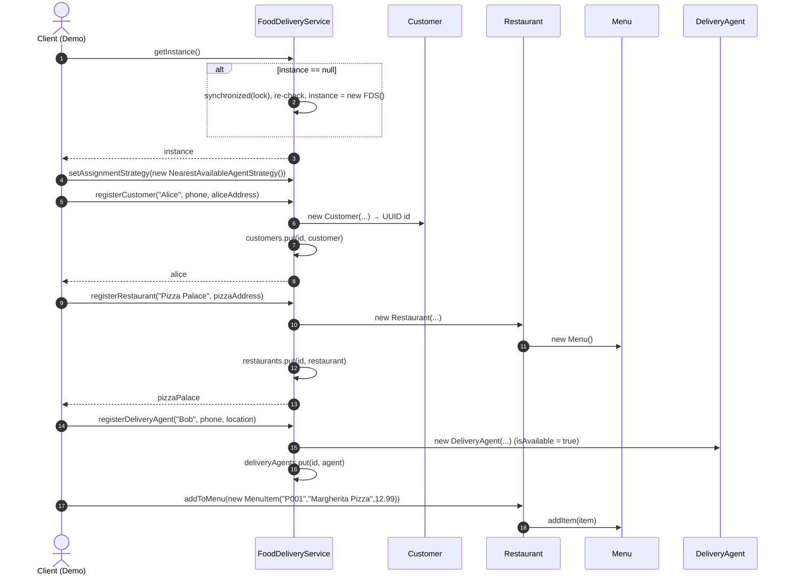

---

## Flow 2 — Composed restaurant search (Strategy pipeline)

The demo's query *"burger joints near Alice"*.

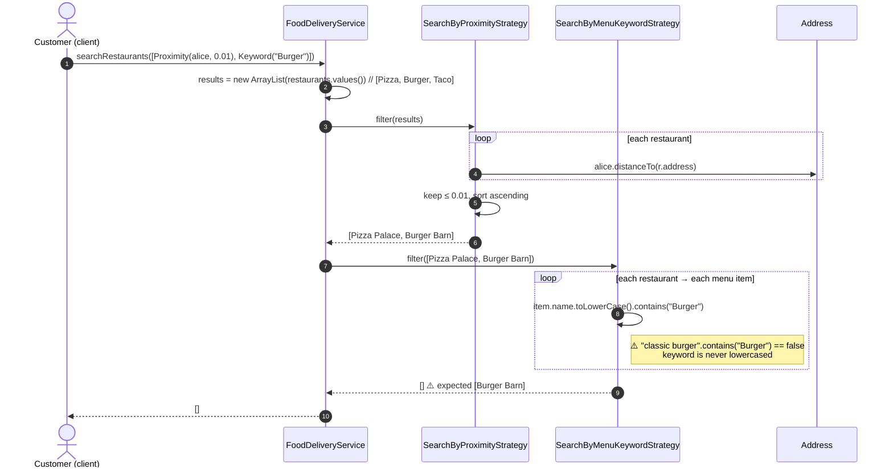

The output of each filter is the input to the next: AND-composition by folding.
Putting the most selective, cheapest filter first minimises work downstream.

---

## Flow 3 — Place an order

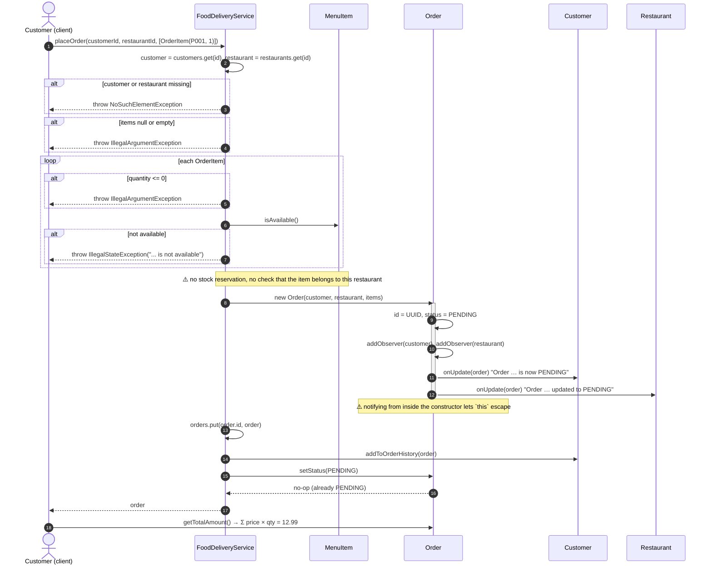

---

## Flow 4 — Restaurant advances the order (validated transition + broadcast)

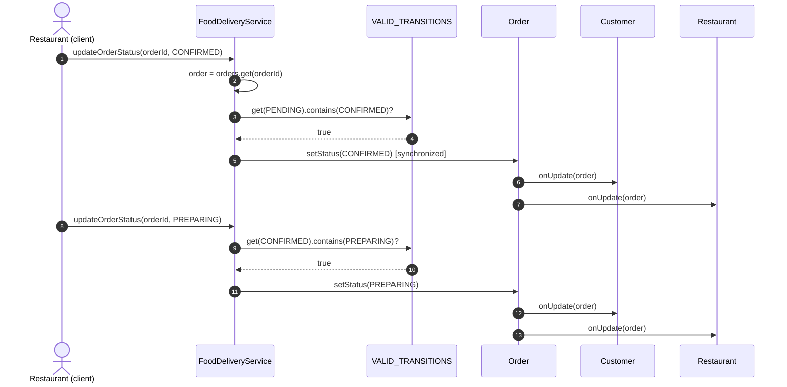

---

## Flow 5 — Illegal transition is rejected

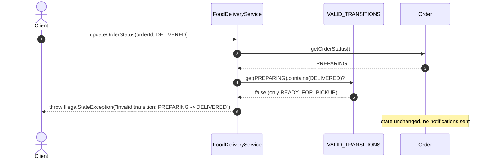

---

## Flow 6 — Cancel an order

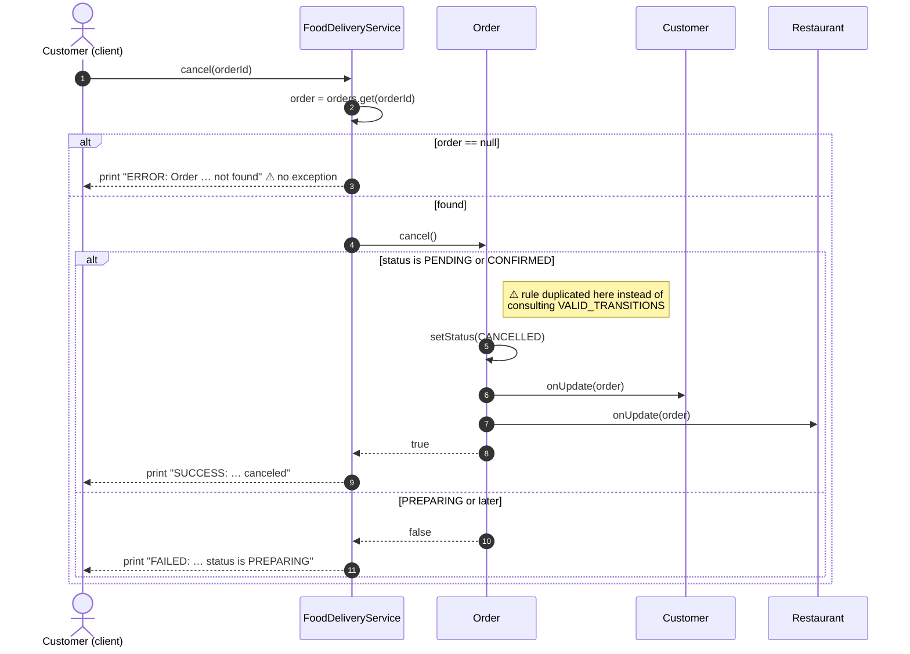

---

## Flow 7 — Ready for pickup → automatic assignment (intended design)

What the code is *meant* to do once gap #1 is fixed (customer address taken from
`order.getCustomer()`).

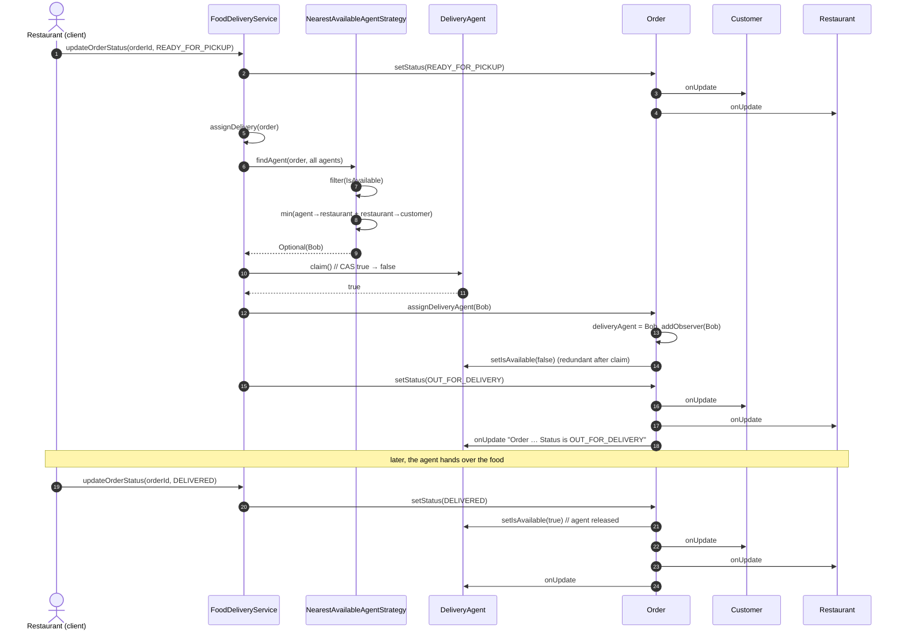

---

## Flow 8 — What actually happens today: NPE during assignment

Reproduced by forcing the demo past the broken keyword search.

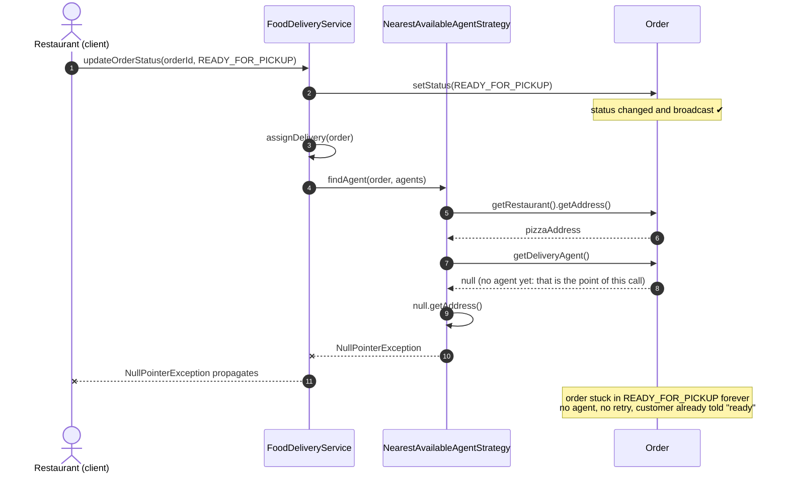

**Two lessons.** (1) The bug: `order.getDeliveryAgent()` should be
`order.getCustomer()`. (2) The design flaw it exposes: the status is committed and
broadcast *before* the dependent step, with no compensation or retry. Even with the
bug fixed, "no agent free" leads to the same stuck order.

---

## Flow 9 — Race: two orders ready at once, one agent free

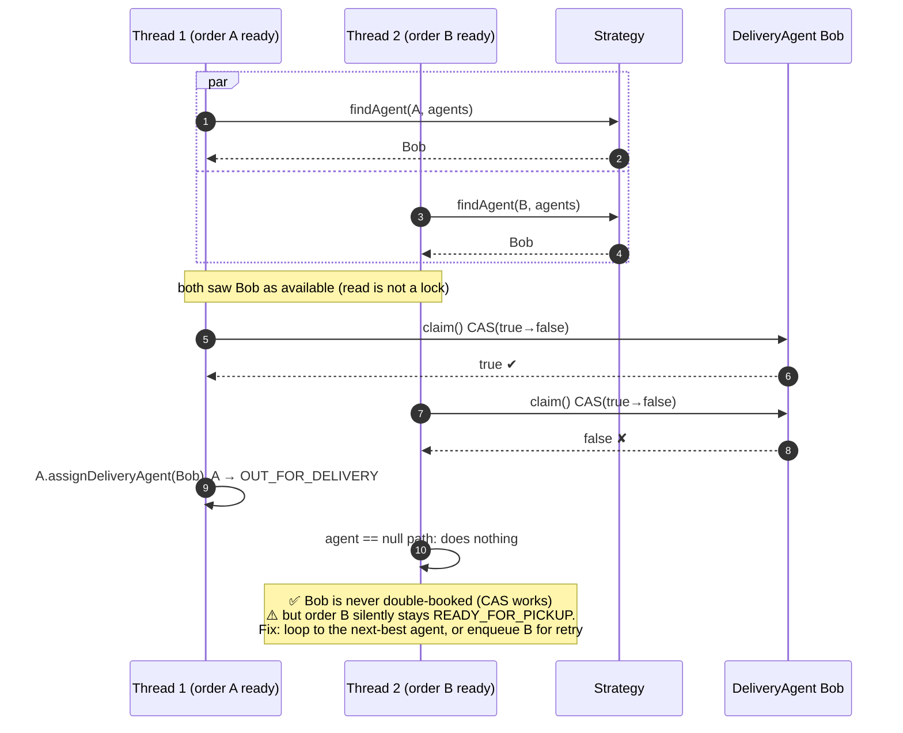

---

## Flow 10 — Race: restaurant starts cooking while customer cancels

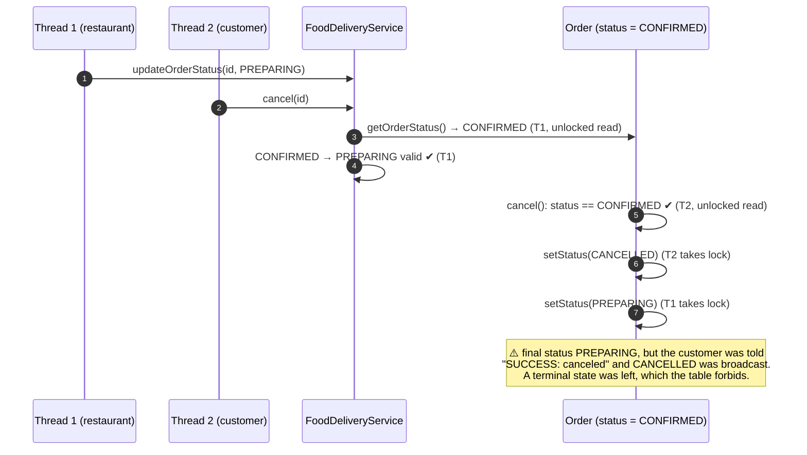

**Fix.** Make check-and-set one atomic step inside `Order`:

```java
public synchronized void transitionTo(OrderStatus next) {
    if (!VALID_TRANSITIONS.get(orderStatus).contains(next))
        throw new IllegalStateException(orderStatus + " -> " + next);
    orderStatus = next;
}   // then notify observers *outside* the lock
```

---

## Flow 11 — End-to-end happy path (overview)

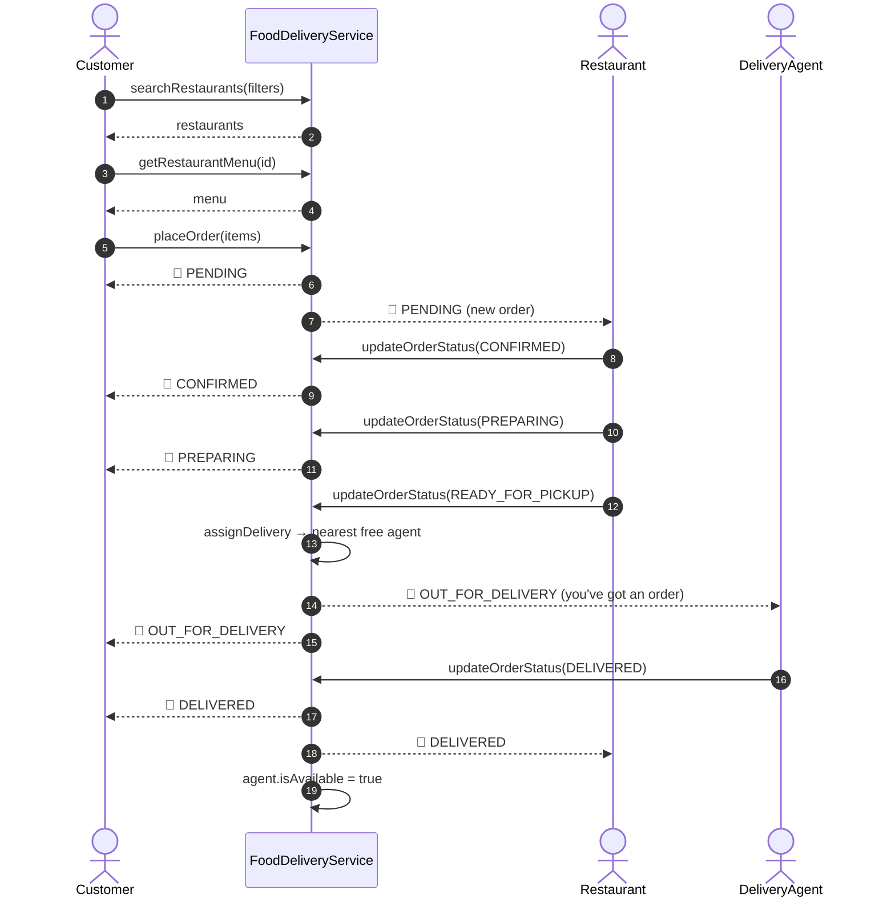
