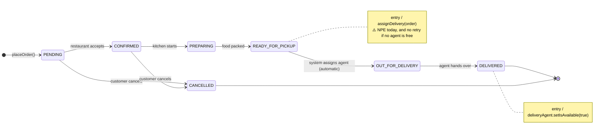
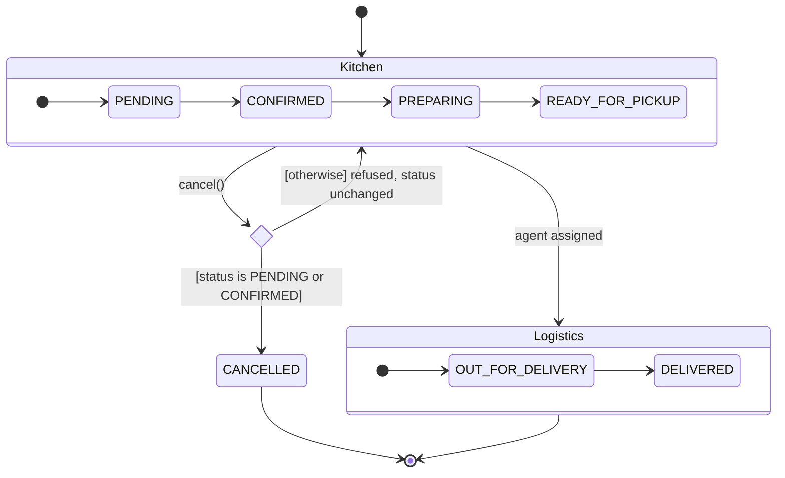
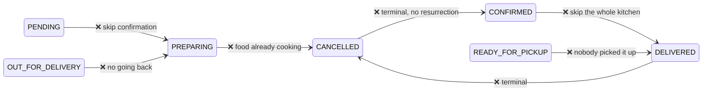
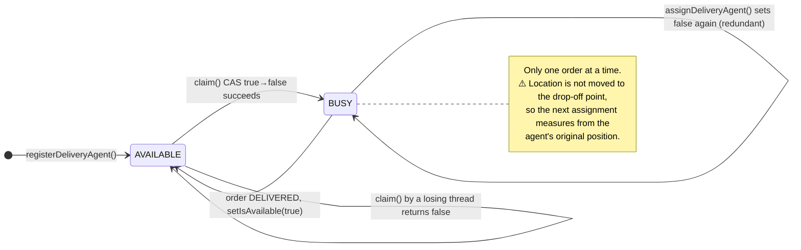
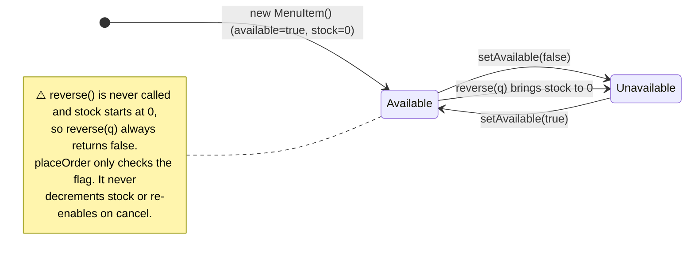
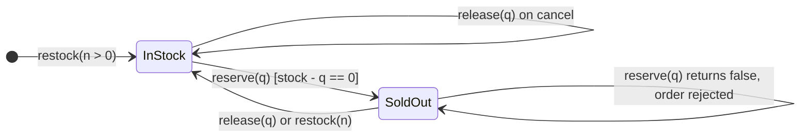
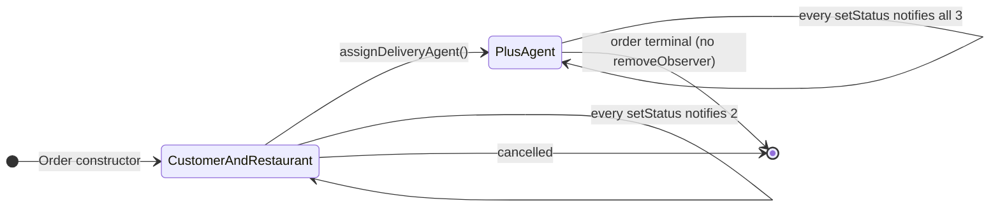
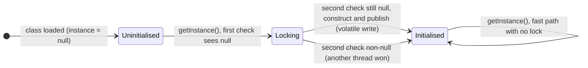
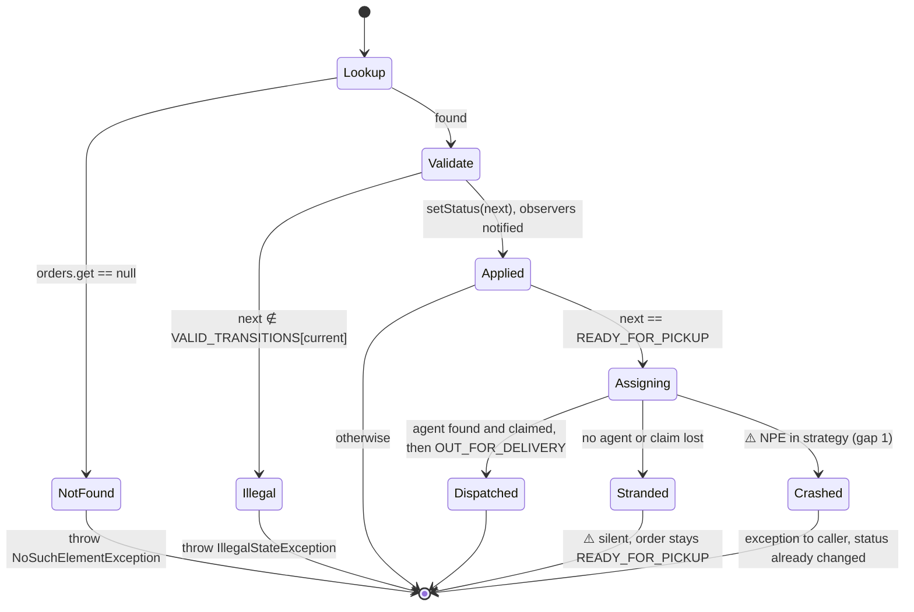

# Online Food Delivery Service — State Diagrams

> Which objects have a lifecycle, what states they move through, and what drives each
> move. The order lifecycle is enforced by the `VALID_TRANSITIONS` table, **not** by
> the State pattern. The reasons are in the
> [problem statement](../problems/online-food-delivery-service.md#why-the-state-pattern-was-not-used).

---

## 1. Order Lifecycle

| State | Driven by | Entry side effect | Terminal |
|---|---|---|---|
| `PENDING` | customer (`placeOrder`) | notify customer and restaurant | no |
| `CONFIRMED` | restaurant | notify | no |
| `PREPARING` | restaurant | notify, and cancellation is no longer allowed | no |
| `READY_FOR_PICKUP` | restaurant | **assign delivery agent** | no |
| `OUT_FOR_DELIVERY` | system (inside `assignDelivery`) | agent subscribed and notified | no |
| `DELIVERED` | agent | **release agent** | ✅ |
| `CANCELLED` | customer (`cancel`) or `updateOrderStatus` | notify | ✅ |

---

## 2. Order Lifecycle Grouped by Phase (composite states)

The **point of no return** is `PREPARING`. That boundary is exactly where the
restaurant begins spending money on the order.

---

## 3. Transition Matrix (the `VALID_TRANSITIONS` table)

Rows are the current status and columns are the requested status. ✅ means allowed,
and every blank cell throws `IllegalStateException("Invalid transition: X -> Y")`.

| from \ to | PENDING | CONFIRMED | PREPARING | READY | OUT_FOR_DEL | DELIVERED | CANCELLED |
|---|---|---|---|---|---|---|---|
| **PENDING** | | ✅ | | | | | ✅ |
| **CONFIRMED** | | | ✅ | | | | ✅ |
| **PREPARING** | | | | ✅ | | | |
| **READY_FOR_PICKUP** | | | | | ✅ | | |
| **OUT_FOR_DELIVERY** | | | | | | ✅ | |
| **DELIVERED** | | | | | | | |
| **CANCELLED** | | | | | | | |

7 legal transitions out of 49 pairs. Self-transitions (`X → X`) are rejected by the
table in `updateOrderStatus`, but `Order.setStatus(X)` on its own treats them as a
silent no-op. That is why `placeOrder`'s `setStatus(PENDING)` does nothing.

---

## 4. Rejected Transitions (what the table protects against)

---

## 5. Delivery Agent Availability

`AtomicBoolean.compareAndSet(true, false)` makes `AVAILABLE → BUSY` a single atomic
step, so two threads can never both win the same agent (see
[04 Flow 9](04-sequence-diagrams.md#flow-9--race-two-orders-ready-at-once-one-agent-free)).

---

## 6. Menu Item Availability (and the unused stock model)

**Intended stock lifecycle** (once `reserve` is wired in):

---

## 7. Observer Subscription per Order

---

## 8. Singleton Initialisation

---

## 9. Request Lifecycle of `updateOrderStatus`

