# Online Food Delivery Service — Activity Diagrams & Flowcharts

> Control flow *inside* each operation: every branch, guard and exit. Sequence diagrams
> ([04](04-sequence-diagrams.md)) show *who* talks to whom. These show *how* a single
> method decides.

---

## 1. Master Flow — from hungry to fed

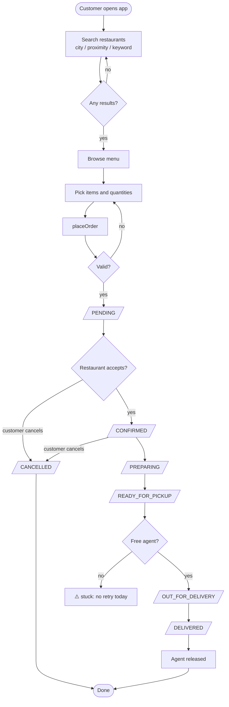

---

## 2. `placeOrder(customerId, restaurantId, items)`

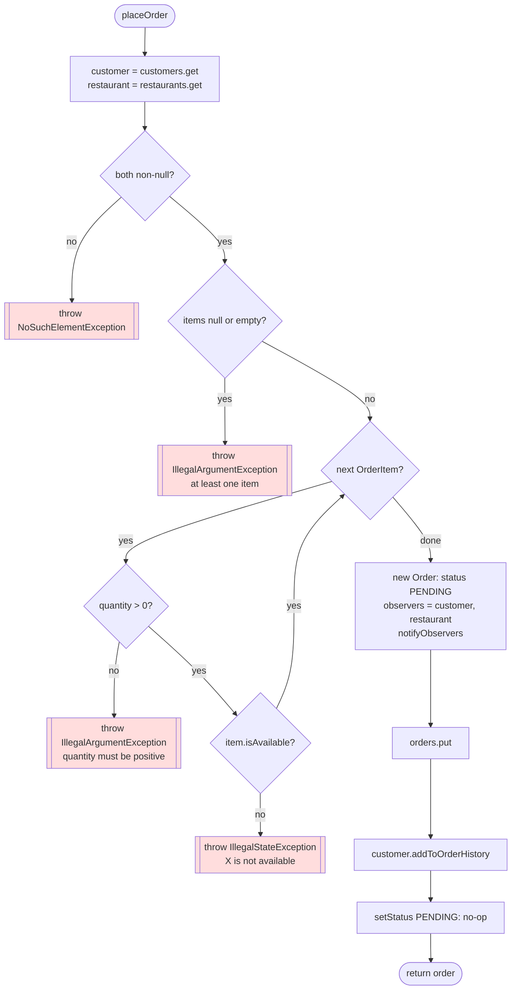

Missing checks (⚠️): the item belongs to this restaurant, stock is reserved, and the
restaurant is open.

---

## 3. `updateOrderStatus(orderId, newStatus)`

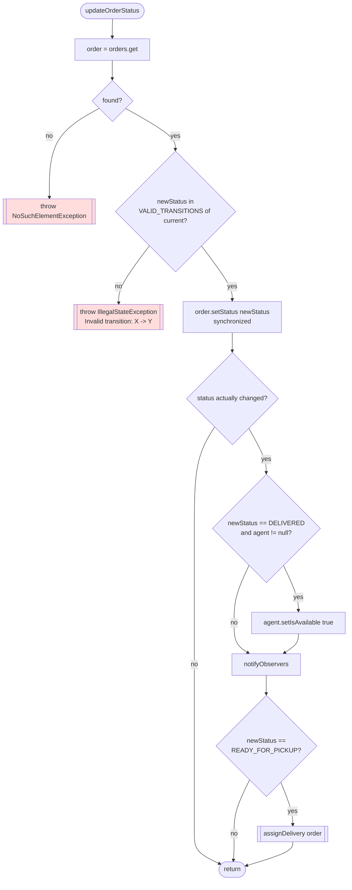

⚠️ The decision at `C` and the write at `D` are not inside the same lock (see
[04 Flow 10](04-sequence-diagrams.md#flow-10--race-restaurant-starts-cooking-while-customer-cancels)).

---

## 4. `assignDelivery(order)` + `NearestAvailableAgentStrategy.findAgent`

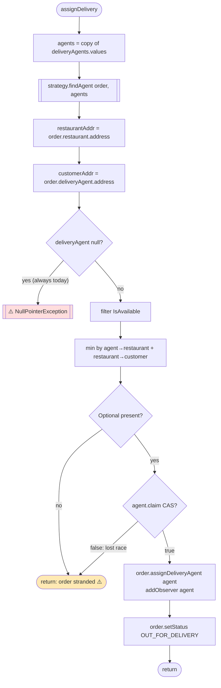

Note that `restaurant → customer` is the same for every agent, so it cannot change the
ranking. Only `agent → restaurant` matters. The term would matter for batched
multi-drop routing.

**Corrected version:**

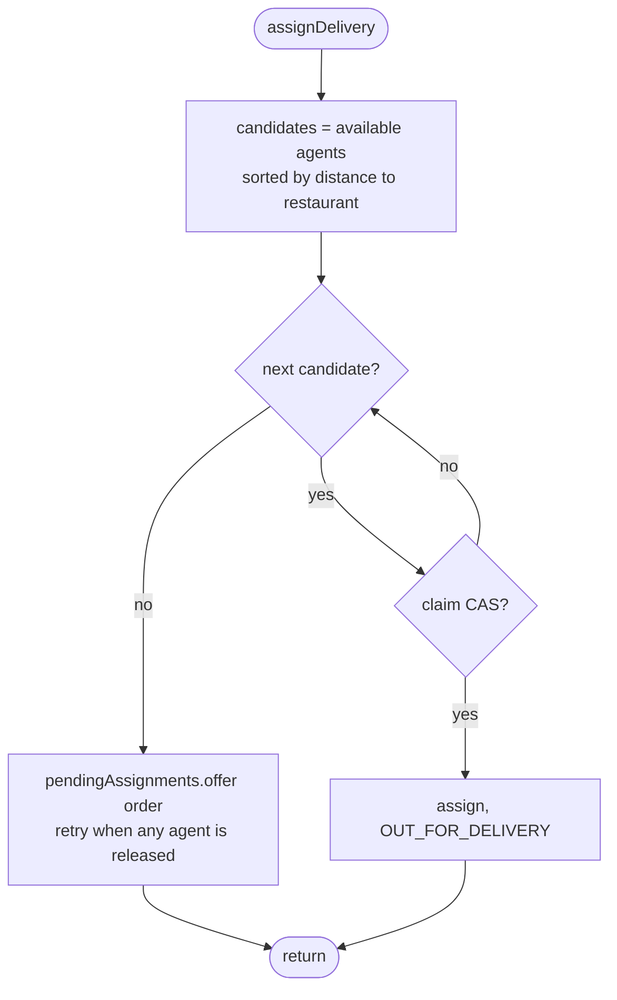

---

## 5. `searchRestaurants(strategies)`: the filter fold

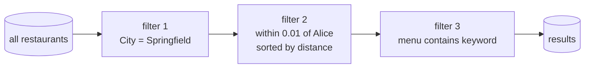

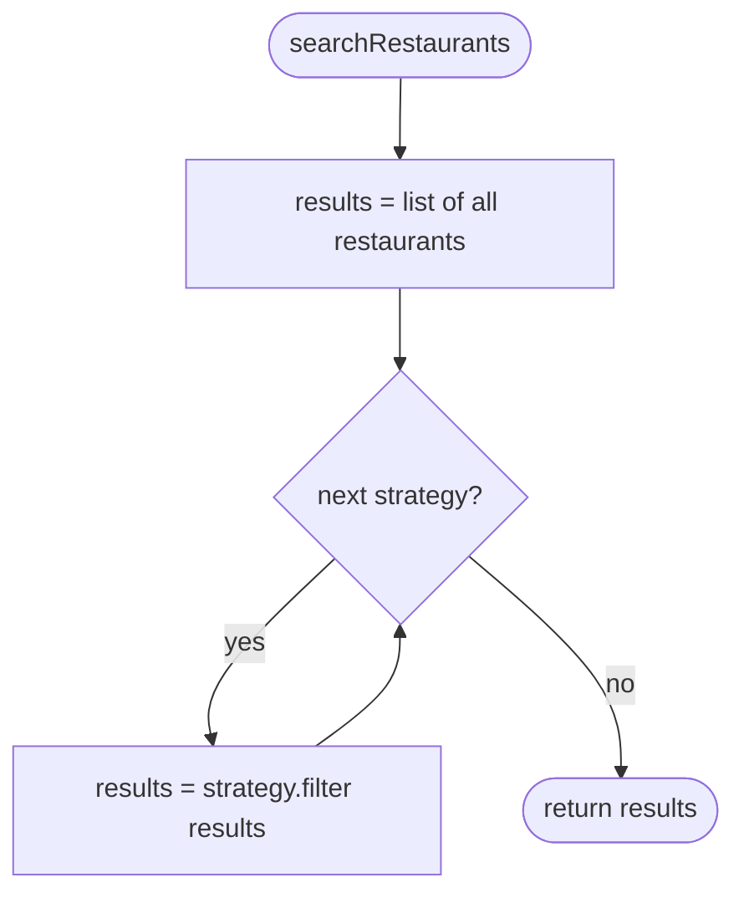

An empty strategy list returns every restaurant. Order matters only for cost (and for
ordering: a proximity filter sorts, and later filters keep that order).

---

## 6. `cancel(orderId)`

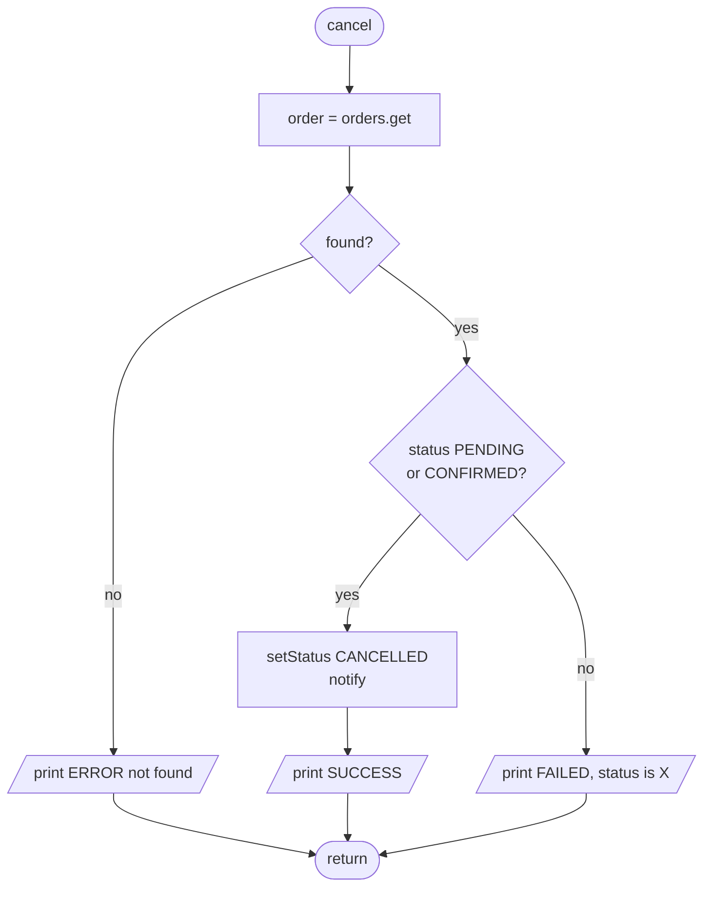

⚠️ This path prints where every other path throws, and it re-states the rule instead of
using `VALID_TRANSITIONS`.

---

## 7. Double-Checked Locking in `getInstance`

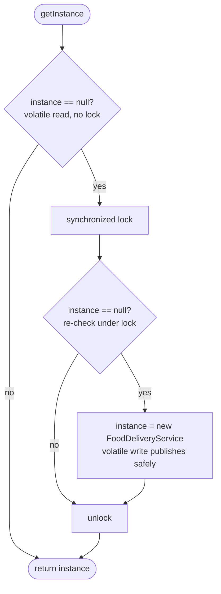

---

## 8. Activity Diagram with Swimlanes — one order, four actors

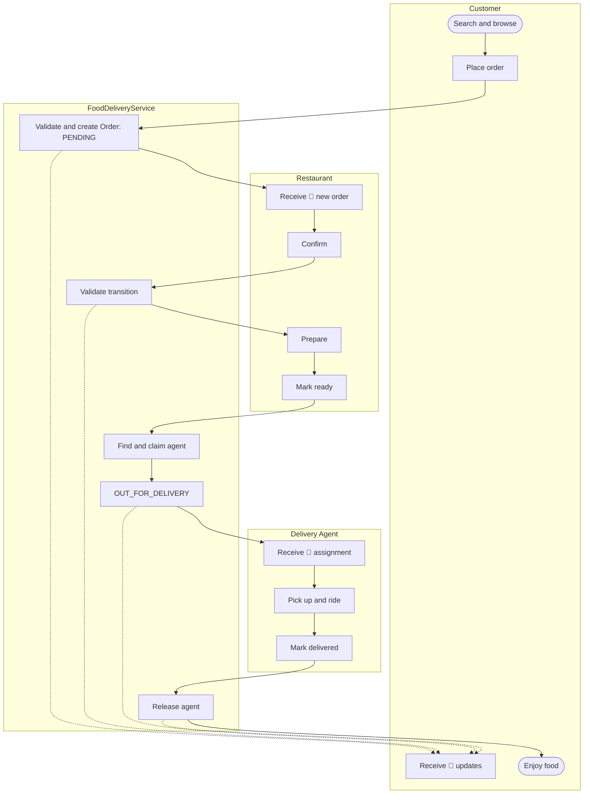

---

## 9. How to add a new status (`PICKED_UP`) with the table approach

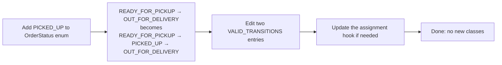

Compare with the State pattern, where the same change is a new `PickedUpState` class
plus edits to `ReadyForPickupState` to point at it.

## 10. How to add a new assignment policy

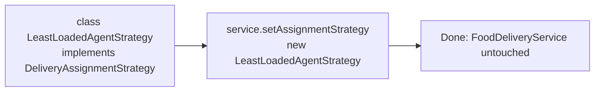
