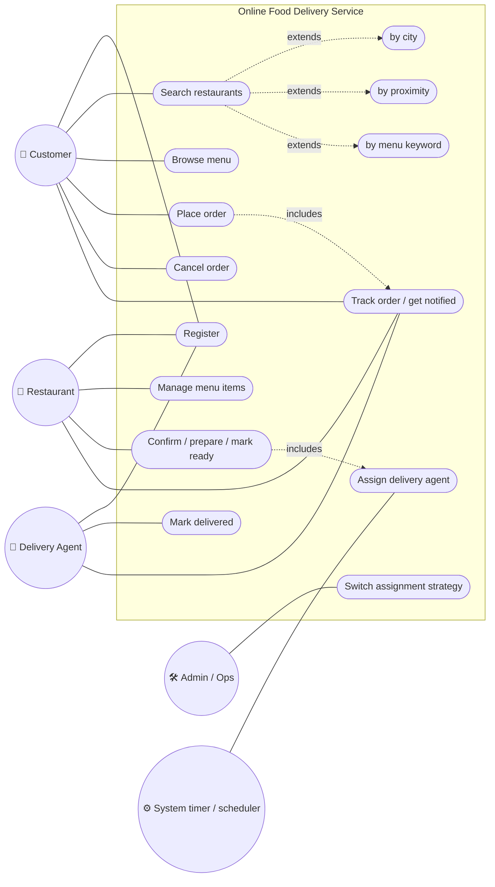
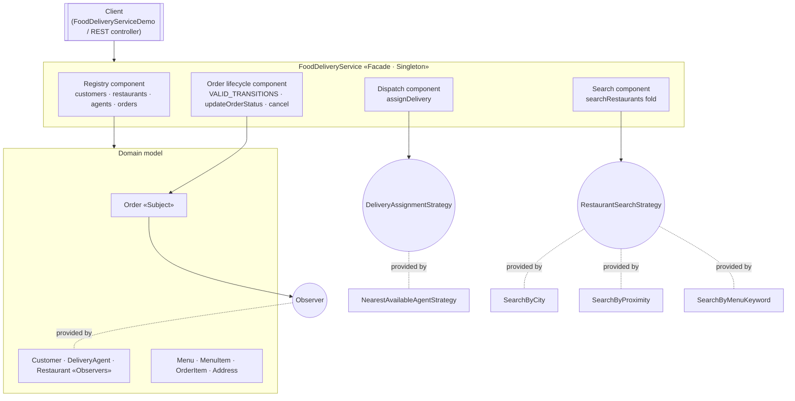
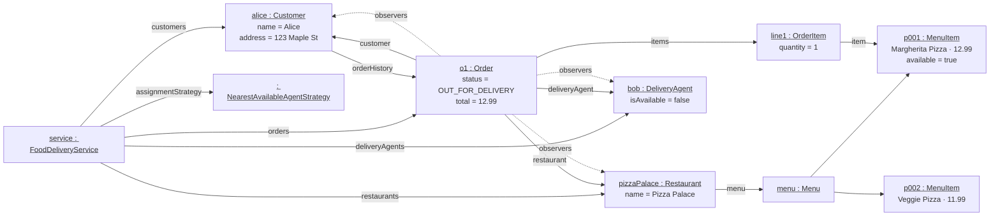
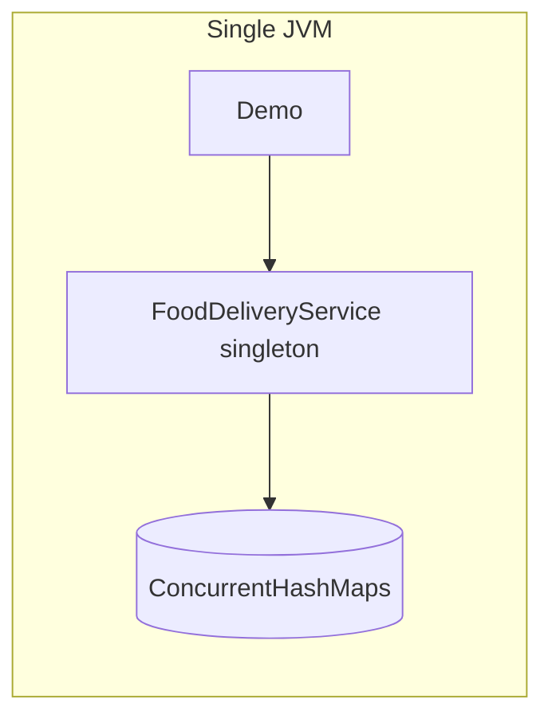
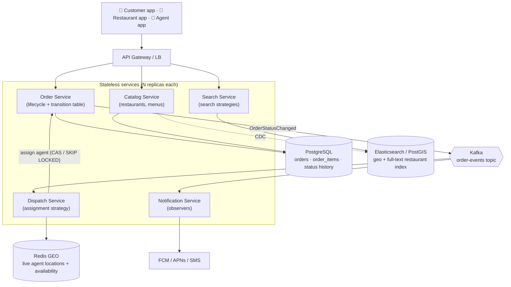
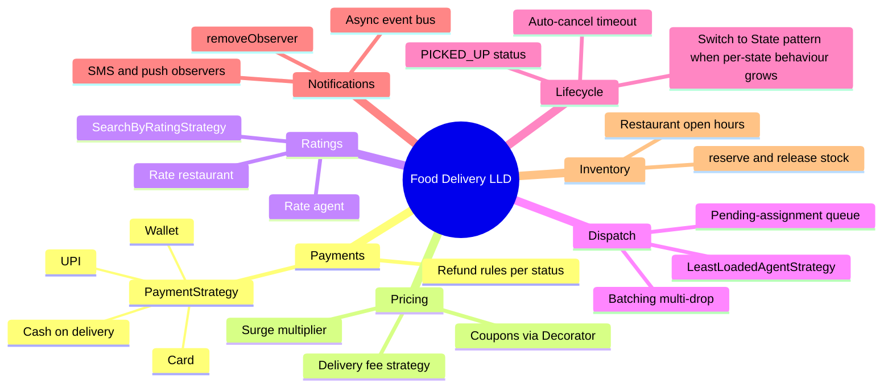

# Online Food Delivery Service — Use Case, Component, Object & Deployment Diagrams

> The outside-in views: who uses the system for what (§ 1), how the code splits into
> replaceable parts (§ 2), a snapshot of live objects (§ 3), how it would run at scale
> (§ 4), and where it extends (§ 5).

---

## 1. Use Case Diagram

Mermaid has no native use-case diagram, so actors are drawn as rounded nodes and use
cases as stadium nodes inside the system boundary.

| Use case | API | Actor |
|---|---|---|
| Register | `registerCustomer / registerRestaurant / registerDeliveryAgent` | all |
| Search | `searchRestaurants(List<RestaurantSearchStrategy>)` | customer |
| Browse menu | `getRestaurantMenu(id)` | customer |
| Place order | `placeOrder(customerId, restaurantId, items)` | customer |
| Cancel | `cancel(orderId)` | customer |
| Advance order | `updateOrderStatus(id, CONFIRMED / PREPARING / READY_FOR_PICKUP)` | restaurant |
| Assign agent | `assignDelivery` (private, triggered by READY_FOR_PICKUP) | system |
| Mark delivered | `updateOrderStatus(id, DELIVERED)` | agent |
| Get notified | `Observer.onUpdate(order)` | customer, restaurant, agent |
| Change policy | `setAssignmentStrategy(...)` | admin |

---

## 2. Component Diagram

| Plug-in point (interface) | To add… | Files touched |
|---|---|---|
| `DeliveryAssignmentStrategy` | least-loaded, rating-based, batching | 1 new class |
| `RestaurantSearchStrategy` | open-now, rating, cuisine, price range | 1 new class |
| `Observer` | SMS, push, email, analytics, ETA service | 1 new class + an `addObserver` call |
| `OrderStatus` + `VALID_TRANSITIONS` | new status | enum + map ⚠️ (closed for modification only by convention) |
| Payments, ratings, promotions | new capability | ⚠️ no seam today, needs a new component |

---

## 3. Object Diagram — snapshot just after `READY_FOR_PICKUP` (intended flow)

---

## 4. Deployment View — from one JVM to production

**Today:** everything lives in one JVM process, in-memory, with the singleton as the
only store.

**At scale:** the singleton becomes a set of stateless services. Each pattern maps onto
a piece of infrastructure.

| In-process design | Distributed equivalent |
|---|---|
| `FoodDeliveryService` singleton | stateless replicas behind a load balancer. "One instance" becomes "one source of truth" (the DB) |
| `ConcurrentHashMap` registries | PostgreSQL tables ([03](03-database-model.md)) |
| `synchronized setStatus` | conditional `UPDATE … WHERE status = :from` / optimistic `version` |
| Observer list on `Order` | Kafka topic `order-events`. Each consumer group is an "observer", with retries and isolation for free |
| `AtomicBoolean.claim()` | Redis `SET agent:{id}:busy NX` or `SELECT … FOR UPDATE SKIP LOCKED` |
| Linear `SearchByProximity` | geo index (Redis GEO / PostGIS / Elasticsearch `geo_distance`) |
| Stuck `READY_FOR_PICKUP` order | Dispatch consumer retries with back-off, and escalates after N attempts |

---

## 5. Extension Points

