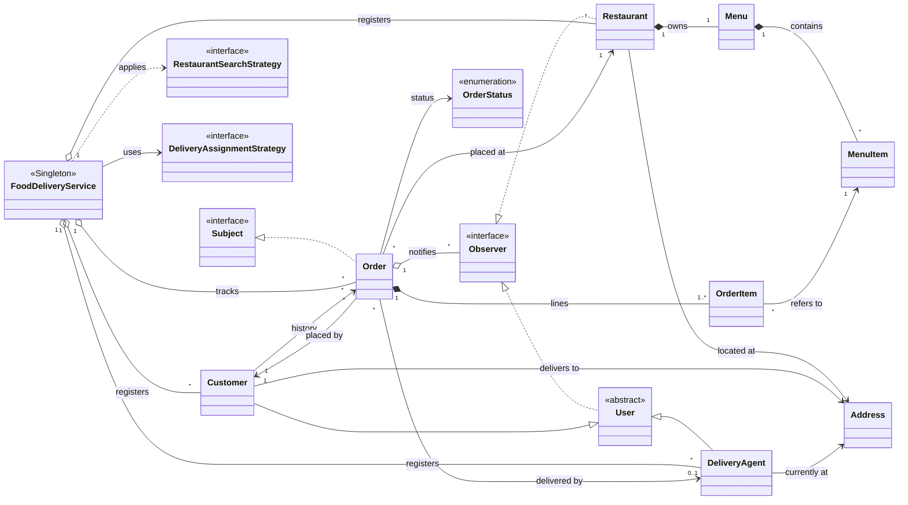

# Designing an Online Food Delivery Service (Swiggy / Zomato / DoorDash-style)

## Problem Statement

Design the core of an online food delivery platform: the part that connects a hungry
**customer**, a **restaurant** that cooks, and a **delivery agent** who carries the food
between them.

A customer searches for restaurants (by city, by distance from where they are, by what
is on the menu, or by any combination of those), browses a restaurant's menu, and places
an order for one or more items. The order then moves through a fixed lifecycle:

```
PENDING → CONFIRMED → PREPARING → READY_FOR_PICKUP → OUT_FOR_DELIVERY → DELIVERED
   └──────────┴──→ CANCELLED   (only before the kitchen starts cooking)
```

The restaurant confirms and cooks the order. The moment the food is ready, the system
must **automatically find a delivery agent** and send them out. When the order is
delivered, that agent becomes free for the next order.

Three things make this more than a CRUD app.

First, **everyone involved in an order has to hear about every change to it**. The
customer wants "your food is being prepared". The restaurant wants to know an order was
cancelled. The agent wants to know the order they picked up has been marked delivered.
The `Order` must not have a hard-coded list of who to call. People who care about an
order subscribe to it, and the order broadcasts its changes to them.

Second, **how restaurants are searched and how agents are chosen are business policies
that change**. Today search means "same city" and agent selection means "nearest free
agent". Tomorrow it might be "open now", "rating ≥ 4", "least busy agent", or "agent
with an insulated bag for ice-cream orders". Adding a policy must not mean editing the
service class that uses it.

Third, **it is a concurrent system**. Hundreds of orders become ready at the same time,
and two of them must never grab the same free delivery agent.

---

## Functional Requirements

1. **Register participants.** The system registers **customers** (name, phone,
   delivery address), **restaurants** (name, address, menu) and **delivery agents**
   (name, phone, current location). Each gets a system-generated unique id.

2. **Manage menus.** A restaurant owns exactly one menu, made up of menu items (id,
   name, price, stock, availability). Items can be added, switched on or off, and
   restocked. An item can be ordered only while it is switched on *and* has stock.

3. **Search restaurants.** A customer can search restaurants with one or more
   composable filters:
   - **By city.** Exact city match.
   - **By proximity.** Within a radius in kilometres of a given address, nearest
     first. Distance is great-circle (Haversine).
   - **By menu keyword.** Restaurants serving at least one item whose name contains
     the keyword (case-insensitive).

   Filters are applied in sequence, so `[proximity, keyword]` means "burger places
   near me".

4. **Browse a menu.** Fetch the full menu of a restaurant by restaurant id.

5. **Place an order.** A customer orders one or more `(menuItem, quantity)` lines from
   a single restaurant. The system rejects the order if:
   - the customer or restaurant does not exist,
   - there are no items,
   - any quantity is ≤ 0,
   - any item is not on that restaurant's menu,
   - any item is switched off or does not have enough stock.

   Stock for every line is reserved **all-or-nothing**: if one line cannot be
   reserved, the lines already reserved are given back. On success the order is
   created in `PENDING`, added to the customer's order history, and its total is the
   exact (`BigDecimal`) sum of `unitPrice × quantity`, with each line's unit price
   copied at checkout.

6. **Order lifecycle.** An order moves only along these transitions:

   | From | Allowed next states |
   |---|---|
   | `PENDING` | `CONFIRMED`, `CANCELLED` |
   | `CONFIRMED` | `PREPARING`, `CANCELLED` |
   | `PREPARING` | `READY_FOR_PICKUP` |
   | `READY_FOR_PICKUP` | `OUT_FOR_DELIVERY` |
   | `OUT_FOR_DELIVERY` | `DELIVERED` |
   | `DELIVERED` | *(terminal)* |
   | `CANCELLED` | *(terminal)* |

   Any other transition is rejected with an error naming the illegal `from → to` pair.
   `OUT_FOR_DELIVERY` cannot be requested by a caller: only the dispatcher sets it, in
   the same step that attaches an agent.

7. **Cancel an order.** A customer can cancel an order only while it is `PENDING` or
   `CONFIRMED`. Cancellation uses the same transition table as every other change.
   Once the kitchen has started (`PREPARING` and later) it is refused with an
   `IllegalStateException`. A successful cancellation gives the reserved stock back.

8. **Automatic delivery assignment.** When an order becomes `READY_FOR_PICKUP` the
   system picks a delivery agent using a pluggable **assignment strategy**, claims
   that agent atomically, attaches them to the order, and moves the order to
   `OUT_FOR_DELIVERY`. The default strategy picks the available agent with the
   smallest `agent → restaurant + restaurant → customer` distance.
   - If another order claims that agent first, the next best agent is tried.
   - If no agent can be claimed, the order waits in a **pending-assignment queue**
     and is dispatched automatically as soon as an agent is registered or freed.

9. **Release the agent on delivery.** When an order becomes `DELIVERED`, its agent is
   unsubscribed from the order, moved to the drop-off address, marked available, and
   immediately offered any queued orders.

10. **Notifications.** Every status change is pushed to all parties subscribed to that
    order: the customer and restaurant from creation, and the delivery agent from the
    moment they are assigned until delivery. Each notification carries the status it
    announces. Observers can also unsubscribe.

11. **Look up orders.** Fetch an order by id, and a customer's order history by
    customer id.

12. **Single point of control.** One `FoodDeliveryService` instance owns every registry
    (customers, restaurants, agents, orders), the pending-assignment queue and the
    active assignment strategy. It is reached through a static accessor, and the
    strategy can be swapped at runtime.

---

## Non-Functional Requirements

1. **Open/Closed for policies.** A new search filter is a new class implementing
   `RestaurantSearchStrategy`. A new agent-selection policy is a new class implementing
   `DeliveryAssignmentStrategy`. Neither requires editing `FoodDeliveryService`.

2. **Loose coupling of notifications.** `Order` knows only the `Observer` interface.
   Adding SMS, push, email or an analytics sink means implementing `Observer`, not
   touching the order lifecycle.

3. **Thread safety.**
   - All registries are `ConcurrentHashMap`s, and the pending-assignment queue is a
     `ConcurrentLinkedQueue`.
   - An agent is claimed with an atomic compare-and-set (`AtomicBoolean.compareAndSet(true, false)`),
     so two orders becoming ready at the same instant can never both win the same agent.
   - `Order.transitionTo` validates and writes the status under the order's lock as
     **one step**, so a restaurant starting to cook and a customer cancelling can never
     both succeed. `Order.dispatch` attaches the agent and sets `OUT_FOR_DELIVERY`
     under the same lock.
   - `MenuItem.reserve` is a synchronized check-and-decrement, so the last portion is
     sold exactly once.
   - Observers and order history live in `CopyOnWriteArrayList`s, so subscribing or
     ordering mid-broadcast cannot throw `ConcurrentModificationException`.
   - The strategy field and the order's status and agent are `volatile`, so a change on
     one thread is visible to the others.

4. **Safe lazy singleton.** `getInstance()` uses double-checked locking on a `volatile`
   field, so the service is built once and no thread sees a half-constructed object.

5. **Fail fast on bad input.** Unknown ids, empty orders, non-positive quantities,
   unavailable items and illegal transitions raise specific exceptions
   (`NoSuchElementException`, `IllegalArgumentException`, `IllegalStateException`)
   rather than returning `null`.

6. **Single source of truth for the lifecycle.** The legal transitions live in one
   immutable `Map<OrderStatus, Set<OrderStatus>>` inside `OrderStatus`, exposed as
   `canTransitionTo`. Every change, cancellation included, is checked against it. It
   can be read at a glance, tested exhaustively, and changed in one place.

7. **Low latency for the hot paths.** Order lookup, restaurant lookup and agent claim
   are O(1). Search is O(R) over restaurants per filter. That is fine for an interview
   scale, and sections 3 and 7 of the diagrams show how it would move to a geo-index at
   production scale.

8. **Separation of concerns.** Domain models (`models`), lifecycle vocabulary
   (`enums`), notification contracts (`observer`), policies (`strategies/search`,
   `strategies/assignment`) and orchestration (`FoodDeliveryService`) live in separate
   packages. Cross-object side effects (freeing an agent, releasing stock) are done by
   the service, never hidden inside an entity's setter.

9. **Notification is a side effect, never part of the transition.** Observers are
   called after the order's lock is released, each in its own `try/catch`. A slow
   observer cannot block the order, and a failing one cannot stop the others from
   hearing about a change that has already happened.

10. **Exact money, real distances.** Prices and totals are `BigDecimal`. Distances are
    Haversine kilometres.

11. **Tested.** Unit, end-to-end flow and concurrency suites run with plain
    `javac`/`java` (see [Tests](#tests)).

---

## Core Entities and Their Relationships

| Entity | Responsibility |
|---|---|
| `FoodDeliveryService` | Singleton facade. Owns all registries and the pending-assignment queue, drives the order lifecycle and its side effects (stock release, dispatch, agent release), runs searches. |
| `User` *(abstract)* | Common identity (`id`, `name`, `phone`) for people. Implements `Observer`. |
| `Customer` | A `User` with a delivery `Address` and an order history. |
| `DeliveryAgent` | A `User` with a current location and an atomic availability flag (`claim` / `release` / `unclaim`). |
| `Restaurant` | Has an `Address` and exactly one `Menu`. Implements `Observer` to hear about its orders. Knows which items it `sells`. |
| `Menu` | A map of `MenuItem`s keyed by item id. |
| `MenuItem` | Id, name, `BigDecimal` price, stock, and a manual on/off switch. `reserve` / `release` / `restock` change stock atomically. |
| `Order` | The `Subject`. Links one customer, one restaurant, an immutable list of `OrderItem`s, an optional `DeliveryAgent`, a status and its observers. Changes status only through `transitionTo` and `dispatch`. |
| `OrderItem` | One order line: a `MenuItem`, a quantity, and the unit price copied at checkout. |
| `Address` | Value object: street, city, zip, lat/long, and Haversine `distanceTo` (km). |
| `OrderStatus` | The seven lifecycle values, in lifecycle order, plus the transition table (`canTransitionTo`, `isTerminal`). |
| `RestaurantSearchStrategy` | Filter over a list of restaurants. Three implementations. |
| `DeliveryAssignmentStrategy` | Picks an agent for an order. `NearestAvailableAgentStrategy` is the default. |



**Reading the arrows.** `<|--` is inheritance, `<|..` is interface realisation, `*--`
is composition (the part cannot exist without the whole: a `Menu` dies with its
`Restaurant`, an `OrderItem` with its `Order`), `o--` is aggregation (the service holds
customers but did not give them their identity), `-->` is a plain association, and
`..>` is a transient dependency (search strategies are passed in per call, not stored).

---

## Design Patterns Used

| Pattern | Where | Why |
|---|---|---|
| **Singleton** | `FoodDeliveryService.getInstance()`, double-checked locking with a `volatile` instance and a private constructor | One owner for all registries, so an order placed through one caller is visible to every other caller. |
| **Strategy** (assignment) | `DeliveryAssignmentStrategy` → `NearestAvailableAgentStrategy`, injected with `setAssignmentStrategy` | Agent selection is a business policy that can be swapped at runtime (nearest, least-loaded, highest-rated, round-robin) without editing the service. |
| **Strategy** (search), composed like a pipeline | `RestaurantSearchStrategy` → `SearchByCity`, `SearchByProximity`, `SearchByMenuKeyword` | Each filter is a small class. `searchRestaurants` folds a list of them over the restaurant set, so combined searches need no new code. It works like a Chain of Responsibility / Specification pattern without the ceremony. |
| **Observer** | `Order` implements `Subject`. `Customer`, `DeliveryAgent` (via `User`) and `Restaurant` implement `Observer` | The order broadcasts status changes without knowing who is listening. A new notification channel is a new `Observer`. |
| **Facade** | `FoodDeliveryService` | Clients call one object with a handful of methods (`register*`, `placeOrder`, `updateOrderStatus`, `cancel`, `searchRestaurants`, `getRestaurantMenu`) and never touch registries or strategies directly. |
| **Table-driven state machine** | `OrderStatus.VALID_TRANSITIONS: Map<OrderStatus, Set<OrderStatus>>`, applied atomically by `Order.transitionTo` | The order lifecycle is enforced as data, not as a class per state. See the next section for why. |

---

## Why the State Pattern Was *Not* Used

The order clearly *has* states, so the obvious question in an interview is: "Why not a
`PendingState`, `ConfirmedState` and so on, as in the ticket management system in this
same repo?" Here is the answer.

**1. The State pattern pays off when behaviour differs per state. Here only legality
differs.** In the ticket system, `Ticket` exposes three different operations
(`assignTo`, `markInProgress`, `resolveTicket`), and each one *means something
different* in each state: reassign here, no-op there, reject somewhere else. That is
3 × 4 = 12 behaviours, and a state object per row is the clean way to hold them.
`Order` exposes effectively one operation, "move to status X", and the only question
every state answers is *"is X in my allowed set?"*. That is a lookup, not polymorphism.
Seven state classes that each contain `return allowed.contains(next)` would be
boilerplate hiding a table.

**2. The lifecycle is a linear pipeline with one side exit.** Six forward steps and a
single `CANCELLED` branch available from two states. Every rule fits in the seven-line
`VALID_TRANSITIONS` map, which you can read in five seconds and print as a table (see
FR 6). With the State pattern the same information is spread across seven files, and
answering "which states can be cancelled?" means opening all of them.

**3. Transitions are driven from outside by different actors, through one API.** The
restaurant moves `CONFIRMED → PREPARING → READY_FOR_PICKUP`, the system moves
`READY_FOR_PICKUP → OUT_FOR_DELIVERY`, the agent moves `→ DELIVERED`, and the customer
moves `→ CANCELLED`. All of them go through `updateOrderStatus(orderId, newStatus)`.
The State pattern is strongest when the *object itself* decides where it goes next in
response to method calls. Here an external actor names the target and the system only
has to validate it.

**4. Side effects are few and attached to a target status, not to a source state.**
There are exactly three: *entering* `READY_FOR_PICKUP` triggers agent assignment,
*entering* `DELIVERED` frees the agent, and *entering* `CANCELLED` gives the stock
back. A three-case `switch (newStatus)` in `updateOrderStatus` expresses that
directly. With the State pattern they would become `onEnter()` methods on three of the
seven classes, and the other four would be empty.

**5. Data-driven rules are easier to test, persist and change.** One exhaustive
parameterised test over the 7 × 7 status pairs covers the whole lifecycle. The same map
can be loaded from config or stored as a `order_status_transition` table (see the
database model), which a class hierarchy cannot. Adding a status such as
`PICKED_UP` between `READY_FOR_PICKUP` and `OUT_FOR_DELIVERY` is one enum constant and
two map entries.

**6. No class explosion, no extra indirection.** The enum is also what gets
serialised, logged, shown in the UI and stored in the database. With the State pattern
you would still need that enum for persistence *plus* a mapping from enum to state
object, which is two representations of the same fact.

### When I would switch to the State pattern

The trade-off flips as soon as states start behaving differently rather than merely
allowing different successors. Signals to watch for:

- **Cancellation cost depends on the state.** Free in `PENDING`, restaurant fee in
  `CONFIRMED`, partial refund in `PREPARING`, not allowed after pickup.
- **States gain timers or entry/exit work.** Auto-cancel a `PENDING` order the
  restaurant ignores for 5 minutes, start live GPS tracking on `OUT_FOR_DELIVERY` and
  stop it on exit, escalate a `READY_FOR_PICKUP` order that no agent accepts.
- **More operations per order.** `modifyItems()`, `addTip()`, `changeAddress()`,
  `reportIssue()`, each allowed or behaving differently depending on the stage.

At that point every new operation would add another `switch (status)` across the
service. That growing conditional is exactly the smell the State pattern removes, and
`Order` should then delegate to an `OrderState` object the way `Ticket` does.

### The cost of the table approach, and how it was paid

One discipline comes with a table: **every** transition must go through it, and the
check and the write must be one atomic step. The original code broke both rules:

- `Order.cancel()` re-implemented the rule inline (`PENDING || CONFIRMED`), which gave
  the lifecycle two sources of truth.
- The service checked the table *outside* the order's lock, so two threads could both
  pass the check.

Both are fixed. The table now lives in `OrderStatus`, `cancel` is just
`updateOrderStatus(id, CANCELLED)`, and `Order.transitionTo` validates and writes under
one lock. The State pattern would have needed exactly the same lock, so this is not an
argument for it, but it is the discipline a table demands.

---

## Known Gaps and How They Were Fixed

The first version of this design was reviewed against its own code, and 15 gaps were
found. The first two were confirmed by running the demo, which crashed with a
`NullPointerException` once the search bug was worked around. All 15 are now fixed,
and each fix is pinned by at least one test (see [Tests](#tests)).

| # | Gap in the original code | Effect | Fix | Where |
|---|---|---|---|---|
| 1 | Customer address read from `order.getDeliveryAgent()` before any agent was assigned | `NullPointerException` on every dispatch. The order was stuck in `READY_FOR_PICKUP`. | Read `order.getCustomer().getAddress()`. | `NearestAvailableAgentStrategy` |
| 2 | Item name lowercased, keyword not | Searching `"Pizza"` found nothing, and the demo silently skipped ordering. | Keyword lowercased (`Locale.ROOT`) in the constructor. | `SearchByMenuKeywordStrategy` |
| 3 | No handling for "no agent free" or "lost the claim" | Orders stranded in `READY_FOR_PICKUP` forever. | A lost claim tries the next best agent. If none is free, the order joins a pending-assignment queue that is retried whenever an agent registers or is freed. The queue is re-checked right after enqueueing, to close the gap with a concurrent release. | `FoodDeliveryService.tryAssign`, `assignOrQueue`, `retryPendingAssignments` |
| 4 | Validate-then-set not atomic | A cook and a cancel from `CONFIRMED` could both succeed. | `Order.transitionTo` checks and writes under the order's lock. `Order.dispatch` attaches the agent and sets `OUT_FOR_DELIVERY` in the same step. Callers cannot request `OUT_FOR_DELIVERY` directly. | `Order`, `FoodDeliveryService.updateOrderStatus` |
| 5 | `cancel()` had its own rule and printed instead of throwing | Two sources of truth, and an inconsistent error model. | `cancel(id)` delegates to `updateOrderStatus(id, CANCELLED)`, so it uses the table and throws `NoSuchElementException` / `IllegalStateException` like everything else. | `FoodDeliveryService.cancel` |
| 6 | Stock defaulted to 0 and `reverse()` was never called | No inventory control, and a check-then-act availability test. | `MenuItem(id, name, price, stock)`. `reserve` is a synchronized check-and-decrement. `placeOrder` reserves all lines all-or-nothing, and cancelling releases them. | `MenuItem`, `FoodDeliveryService.reserveStock` / `releaseStock` |
| 7 | Items not checked against the chosen restaurant | You could order a Burger Barn item "from" Pizza Palace. | `Restaurant.sells(item)` requires the exact item object on this menu. | `Restaurant`, `placeOrder` |
| 8 | Observers notified inside the lock, with no per-observer `try/catch` | A slow observer held the lock. A throwing one hid the change from the rest. | Notify after the lock is released, each observer in its own `try/catch`. `Observer.onUpdate(order, status)` receives the status it is announcing. | `Order.notifyObservers`, `Observer` |
| 9 | `Order` notified from its constructor, and `placeOrder` made a no-op `setStatus(PENDING)` call | `this` escaped during construction, plus dead code. | The constructor only subscribes. The service publishes `PENDING` after the order is stored. | `Order`, `placeOrder` |
| 10 | `orderHistory` was a plain `ArrayList` | Concurrent orders could corrupt it. | `CopyOnWriteArrayList`, exposed read-only. | `Customer` |
| 11 | Redundant `setIsAvailable(false)`, and the agent was released inside `Order.setStatus` and never moved | A hidden cross-aggregate side effect, and stale agent locations. | The service releases the agent on `DELIVERED`, moves them to the drop-off address, unsubscribes them, and retries the queue. `unclaim` undoes a claim whose dispatch was refused. | `FoodDeliveryService.completeDelivery`, `DeliveryAgent` |
| 12 | `OrderStatus` declared `CONFIRMED` before `PENDING` | `ordinal()` and `compareTo` did not follow the lifecycle. | Declared in lifecycle order. | `OrderStatus` |
| 13 | `double` money, Euclidean distance on degrees | Rounding errors, and distances wrong away from the equator. | `BigDecimal` prices, subtotals and totals, with the unit price snapshotted per line. Haversine kilometres. | `MenuItem`, `OrderItem`, `Order`, `Address` |
| 14 | Naming: `IsAvailable()`, `reverse()` | Broke Java conventions. | `isAvailable()`, `reserve()`. | `DeliveryAgent`, `MenuItem` |
| 15 | No `removeObserver` or order lookups | Agents kept receiving updates forever, and there was no "my orders". | `Subject.removeObserver`. `getOrder(id)`, `getOrdersForCustomer(id)`, `getPendingAssignmentCount()`. | `Subject`, `Order`, `FoodDeliveryService` |

Other hardening done along the way:

- the strategy field is `volatile` and rejects `null`
- `Order` copies its item list
- `DeliveryAgent.currentLocation` and `Order`'s status and agent are `volatile`

### Still out of scope

Payments, ratings, ETAs, delivery fees and restaurant opening hours are extensions,
not defects. See [07 § 5](../class_diagrams/07-usecase-component-deployment.md#5-extension-points).
The `observer` ↔ `models` package cycle (`Observer.onUpdate(Order, …)`) remains. An
`OrderEvent` DTO would break it.

---

## Tests

Plain `javac`/`java`, no JUnit. See [`solution/tests/README.md`](../solution/tests/README.md).

| Suite | Scenarios | Covers |
|---|---|---|
| `UnitTests` | 22 | Transition table (all 49 pairs), Haversine, stock, money, observers, agents, strategies |
| `EndToEndFlowTests` | 12 | Full journeys: search → order → cook → dispatch → deliver, cancellation, validation, rollback, queue, handoff |
| `ConcurrencyTests` | 10 | Agent claim races, fleet dispatch, last-portion and limited-stock races, cook-vs-cancel, duplicate confirm, slow observer, history, singleton |

```bash
javac -d out $(find LLD/online_food_Delivery_Service/solution -name '*.java')
java -cp out LLD.online_food_Delivery_Service.solution.tests.UnitTests
java -cp out LLD.online_food_Delivery_Service.solution.tests.EndToEndFlowTests
java -cp out LLD.online_food_Delivery_Service.solution.tests.ConcurrencyTests
```

---

## Implementation

#### [Java Implementation](../solution/)

## Diagrams

#### [Design Diagrams](../class_diagrams/)

> The diagrams were drawn from the original code, and their ⚠️ marks refer to the
> gaps in the table above, all of which are now fixed.
