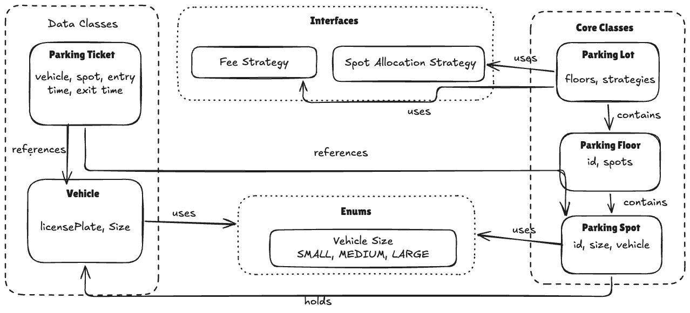
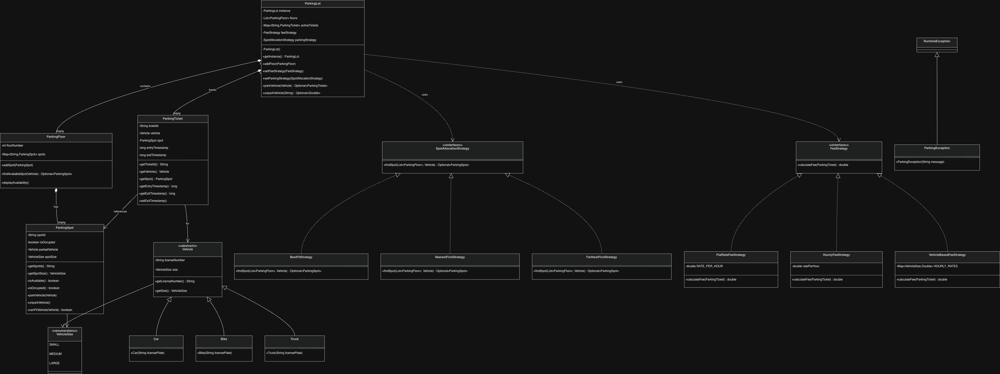
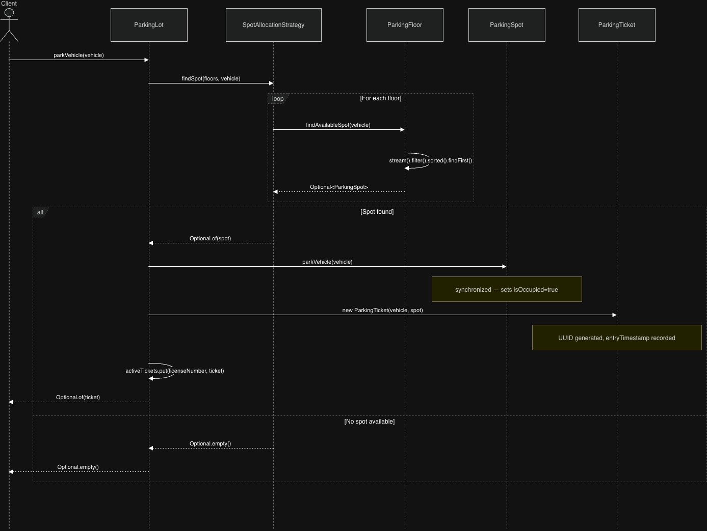
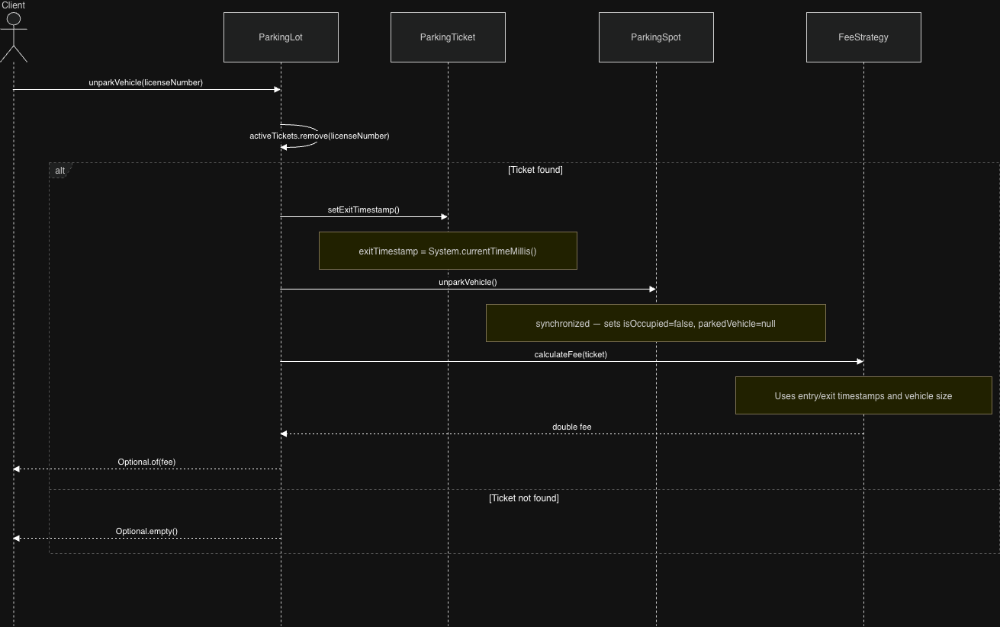
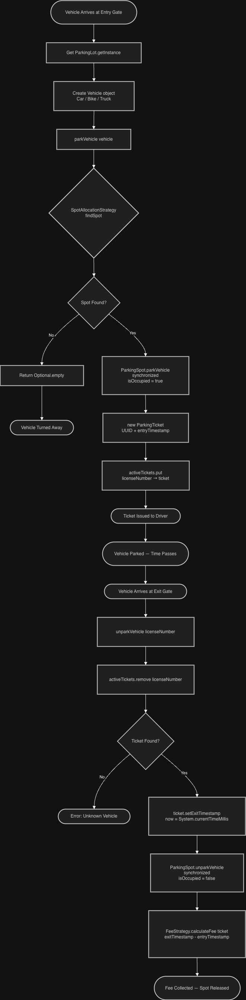
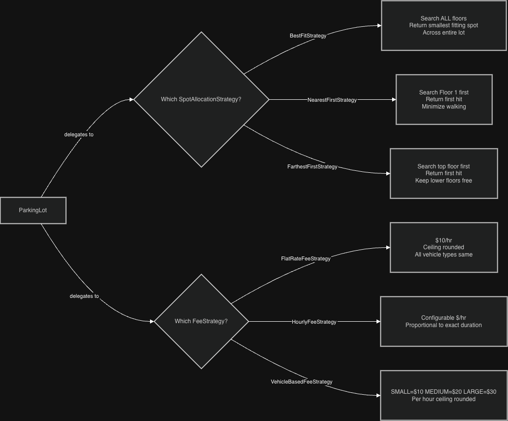

# Parking Lot — LLD Revision Guide

> **Purpose:** Complete revision reference. Read this instead of the entire codebase.
> Covers: problem statement, all design patterns (why + ❌ without analysis), entity/class/sequence diagrams, concurrency strategy, and application flow. All diagrams are Mermaid.

---

## Table of Contents
1. [Problem Statement](#1-problem-statement)
2. [System Overview](#2-system-overview)
3. [Entity Relationship Diagram](#3-entity-relationship-diagram)
4. [Class Diagram](#4-class-diagram)
5. [Design Patterns — Deep Dive](#5-design-patterns--deep-dive)
6. [Concurrency Strategy](#6-concurrency-strategy)
7. [Spot Compatibility Rules](#7-spot-compatibility-rules)
8. [Sequence Diagrams](#8-sequence-diagrams)
9. [Application Flow](#9-application-flow)
10. [Quick Revision Cheatsheet](#10-quick-revision-cheatsheet)

---

## 1. Problem Statement

Design a **Parking Lot Management System** where:

- The lot has **multiple floors**, each with a configurable number of spots
- The system supports **different vehicle types** — Car (medium), Bike (small), Truck (large)
- Each **parking spot** accommodates a specific vehicle size
- On **entry**, the system assigns the best available spot and issues a **ticket**
- On **exit**, the system calculates the **fee** based on duration and releases the spot
- The system tracks **real-time availability** of spots per floor
- Multiple **entry and exit points** operate concurrently — thread safety is required

### Core Entities

| Entity | Responsibility |
|--------|----------------|
| `ParkingLot` | Single-instance controller: manages floors, delegates spot-finding, issues and closes tickets |
| `ParkingFloor` | Manages all spots on one floor; thread-safe spot search within the floor |
| `ParkingSpot` | Individual spot state: occupied/free, size, parked vehicle |
| `ParkingTicket` | Immutable record of a parking session: vehicle, spot, entry/exit timestamps, UUID |
| `Vehicle` | Abstract base: license number + size contract; subclasses fix their VehicleSize |

---

## 2. System Overview

```
┌──────────────────────────────────────────────────────────────────────┐
│                         CLIENT LAYER                                 │
│                                                                      │
│   ParkingLotDemo ──────────────► ParkingLot.getInstance()           │
│                                   (Singleton)                        │
│                                        │                             │
│                           ┌───────────┴───────────┐                 │
│                    parkVehicle()            unparkVehicle()          │
└───────────────────────────┼───────────────────────┼─────────────────┘
                            │                       │
┌───────────────────────────▼───────────────────────▼─────────────────┐
│                       STRATEGY LAYER                                 │
│                                                                      │
│   SpotAllocationStrategy (interface)    FeeStrategy (interface)     │
│   ├── BestFitStrategy                   ├── FlatRateFeeStrategy     │
│   ├── NearestFirstStrategy              ├── HourlyFeeStrategy       │
│   └── FarthestFirstStrategy             └── VehicleBasedFeeStrategy │
└───────────────────────────┬─────────────────────────────────────────┘
                            │ findSpot() / calculateFee()
┌───────────────────────────▼─────────────────────────────────────────┐
│                        ENTITY LAYER                                  │
│                                                                      │
│   ParkingFloor (ConcurrentHashMap<spotId, ParkingSpot>)             │
│        │                                                             │
│        └──► ParkingSpot (synchronized park/unpark)                 │
│                  ▲                                                   │
│   ParkingTicket ─┘  (UUID + Vehicle + ParkingSpot + timestamps)     │
│                                                                      │
│   Vehicle (abstract)                                                 │
│   ├── Car    → VehicleSize.MEDIUM                                   │
│   ├── Bike   → VehicleSize.SMALL                                    │
│   └── Truck  → VehicleSize.LARGE                                    │
└──────────────────────────────────────────────────────────────────────┘
```

---

## 3. Entity Relationship Diagram



### Key Relationship Decisions

| Relationship | Type | Why |
|---|---|---|
| `ParkingLot` → `ParkingFloor` | **Composition** | Floors cannot exist outside a lot. Lifecycle tied. |
| `ParkingFloor` → `ParkingSpot` | **Composition** | Spots cannot exist outside a floor. Floor owns them. |
| `ParkingLot` → `ParkingTicket` | **Composition** | Active tickets are owned and managed by the lot. |
| `ParkingTicket` → `ParkingSpot` | **Association** | Spot exists independently; ticket just references it. |
| `ParkingTicket` → `Vehicle` | **Association** | Vehicle exists independently; ticket just records who parked. |
| `ParkingLot` → `SpotAllocationStrategy` | **Dependency** | Strategy is pluggable; lot delegates to it, doesn't own its lifecycle. |
| `ParkingLot` → `FeeStrategy` | **Dependency** | Fee model is pluggable and interchangeable at runtime. |

---

## 4. Class Diagram



---

## 5. Design Patterns — Deep Dive

---

### 5.1 Singleton Pattern — `ParkingLot`

**What it does:**
Ensures only ONE instance of `ParkingLot` exists across the entire JVM. All floors, all active tickets, and all strategies live in this single instance.

**Implementation:**
```java
public class ParkingLot {
    private static ParkingLot instance;          // single reference
    private final List<ParkingFloor> floors;
    private final Map<String, ParkingTicket> activeTickets;

    private ParkingLot() {                        // private constructor
        this.feeStrategy = new FlatRateFeeStrategy();
        this.parkingStrategy = new BestFitStrategy();
        this.activeTickets = new ConcurrentHashMap<>();
    }

    public static synchronized ParkingLot getInstance() {
        if (instance == null) {                   // create only once
            instance = new ParkingLot();
        }
        return instance;
    }
}
```

**Key design decisions:**

1. **Why `synchronized` on `getInstance()` (not Double-Checked Locking):**
   The lot is initialized once at startup — `getInstance()` is NOT called on a hot path like matching orders. The overhead of `synchronized` on every call is negligible. DCL (Double-Checked Locking) adds `volatile` + two null checks. That complexity is only warranted when the singleton is on a high-frequency code path. Here, simplicity wins.

2. **Why `ConcurrentHashMap` for `activeTickets` (not `HashMap`):**
   Multiple entry gates call `parkVehicle()` and multiple exit gates call `unparkVehicle()` concurrently. Both write to `activeTickets`. A plain `HashMap` would have race conditions on its internal structure. `ConcurrentHashMap` allows concurrent writes without a global lock.

3. **Why default strategies are wired in the private constructor:**
   The lot is always usable out-of-the-box. Callers can override with `setFeeStrategy()` / `setParkingStrategy()` — but they don't have to. No external factory or configuration needed for basic use.

**❌ Without Singleton:**
```java
// Gate 1 creates its own lot
ParkingLot lot1 = new ParkingLot();
lot1.addFloor(floor1);

// Gate 2 creates a different lot — no shared state
ParkingLot lot2 = new ParkingLot();

// Car parks through Gate 1 — ticket goes into lot1.activeTickets
lot1.parkVehicle(car); // ticket stored in lot1

// Car exits through Gate 2 — looks in lot2.activeTickets
lot2.unparkVehicle("C-456"); // Ticket not found — car can never exit and pay
```
Two instances = two separate floor registries, two separate ticket maps. A vehicle parked via Gate 1 "doesn't exist" when it tries to exit via Gate 2.

---

### 5.2 Strategy Pattern — `SpotAllocationStrategy` (×3)

**What it does:**
Encapsulates the algorithm for choosing which spot to assign to a vehicle. `ParkingLot` delegates to the strategy — it knows nothing about HOW the spot is chosen.

**Interface:**
```java
public interface SpotAllocationStrategy {
    Optional<ParkingSpot> findSpot(List<ParkingFloor> floors, Vehicle vehicle);
}
```

**Three implementations:**

`BestFitStrategy` — smallest compatible spot across ALL floors:
```java
for (ParkingFloor floor : floors) {
    Optional<ParkingSpot> spotOnThisFloor = floor.findAvailableSpot(vehicle);
    if (spotOnThisFloor.isPresent()) {
        if (bestSpot.isEmpty()) {
            bestSpot = spotOnThisFloor;
        } else if (spotOnThisFloor.get().getSpotSize().ordinal()
                    < bestSpot.get().getSpotSize().ordinal()) {
            bestSpot = spotOnThisFloor;  // smaller ordinal = tighter fit
        }
    }
}
```

`NearestFirstStrategy` — first available spot from Floor 1 upward:
```java
for (ParkingFloor floor : floors) {
    Optional<ParkingSpot> spot = floor.findAvailableSpot(vehicle);
    if (spot.isPresent()) return spot;  // stop at first hit
}
```

`FarthestFirstStrategy` — first available spot from the top floor downward:
```java
List<ParkingFloor> reversedFloors = new ArrayList<>(floors);
Collections.reverse(reversedFloors);  // copy then reverse — original list unchanged
for (ParkingFloor floor : reversedFloors) {
    Optional<ParkingSpot> spot = floor.findAvailableSpot(vehicle);
    if (spot.isPresent()) return spot;
}
```

**Key design decisions:**

1. **Why enum ordinal for size comparison in BestFit:**
   `VehicleSize` is declared `SMALL, MEDIUM, LARGE` — ordinals 0, 1, 2. A smaller ordinal = a tighter fit = best fit. No separate comparator needed; the enum declaration order itself encodes the ordering.

2. **Why `Collections.reverse()` on a copy (not original):**
   `floors` is the lot's own list passed by reference. Reversing in-place would permanently reorder the lot's floor list, breaking subsequent calls. Copying first (O(n)) is essential.

3. **Why runtime switching via `setParkingStrategy()`:**
   A mall lot uses `NearestFirst` during business hours (minimize walking). A long-term airport lot uses `FarthestFirst` (keep close spots open for short-stay). Same system, different policy, zero code changes.

**❌ Without Strategy Pattern:**
```java
// ParkingLot.parkVehicle() becomes a god method:
public Optional<ParkingTicket> parkVehicle(Vehicle vehicle) {
    if (allocationMode == BEST_FIT) {
        // 20 lines of best-fit logic
    } else if (allocationMode == NEAREST_FIRST) {
        // 10 lines of nearest-first logic
    } else if (allocationMode == FARTHEST_FIRST) {
        // 10 lines of farthest-first logic
    } else if (allocationMode == RANDOM) {  // new type added later
        // 15 lines of random logic
    }
    // ParkingLot now understands ALL allocation algorithms
    // Adding a new strategy = modifying ParkingLot = risk of breaking existing ones
    // Impossible to unit-test individual algorithms in isolation
}
```

---

### 5.3 Strategy Pattern — `FeeStrategy` (×3)

**What it does:**
Encapsulates the fee calculation algorithm. `ParkingLot.unparkVehicle()` calls `feeStrategy.calculateFee(ticket)` without knowing which model is active.

**Interface:**
```java
public interface FeeStrategy {
    double calculateFee(ParkingTicket ticket);
}
```

**Three implementations:**

`FlatRateFeeStrategy` — fixed rate per hour, ceiling-rounded:
```java
private static final double RATE_PER_HOUR = 10.0;

public double calculateFee(ParkingTicket ticket) {
    long duration = ticket.getExitTimestamp() - ticket.getEntryTimestamp();
    long hours = (duration / (1000 * 60 * 60)) + 1;  // +1 = ceil to nearest hour
    return hours * RATE_PER_HOUR;
}
```

`HourlyFeeStrategy` — configurable rate, proportional to exact duration:
```java
public double calculateFee(ParkingTicket ticket) {
    long duration = ticket.getExitTimestamp() - ticket.getEntryTimestamp();
    return duration * ratePerHour;  // no ceiling — charged for exact time
}
```

`VehicleBasedFeeStrategy` — rate depends on vehicle size:
```java
private static final Map<VehicleSize, Double> HOURLY_RATES = Map.of(
    VehicleSize.SMALL,  10.0,   // bikes — cheapest
    VehicleSize.MEDIUM, 20.0,   // cars
    VehicleSize.LARGE,  30.0    // trucks — most expensive
);

public double calculateFee(ParkingTicket parkingTicket) {
    long duration = parkingTicket.getExitTimestamp() - parkingTicket.getEntryTimestamp();
    long hours = (duration / (1000 * 60 * 60)) + 1;
    return hours * HOURLY_RATES.get(parkingTicket.getVehicle().getSize());
}
```

**Key design decisions:**

1. **Why `(duration / (1000 * 60 * 60)) + 1` instead of `Math.ceil()`:**
   Duration is in milliseconds (integer arithmetic). Dividing and adding 1 achieves ceiling rounding without floating-point math. A 61-minute stay becomes `(0) + 1 = 1 hour` with `Math.ceil` or `+1` — same result, but the +1 approach avoids casting to double mid-calculation.

2. **Why `Map.of()` for HOURLY_RATES (static final):**
   Rates are constants — they never change per instance. `Map.of()` creates an immutable map at class load time. Attempting to `put()` on it throws `UnsupportedOperationException`, preventing accidental mutation.

3. **Why `FlatRateFeeStrategy` is the default in `ParkingLot`:**
   Simplest model — predictable for both customers and operators. The operator can call `setFeeStrategy(new VehicleBasedFeeStrategy())` to upgrade without restarting.

**❌ Without Strategy Pattern:**
```java
public Optional<Double> unparkVehicle(String licenseNumber) {
    ...
    double fee;
    if (feeMode == FLAT_RATE) {
        long hours = (duration / (1000 * 60 * 60)) + 1;
        fee = hours * 10.0;
    } else if (feeMode == VEHICLE_BASED) {
        long hours = (duration / (1000 * 60 * 60)) + 1;
        fee = hours * getRateForSize(vehicle.getSize());
    } else if (feeMode == SUBSCRIPTION) {  // new fee model added later
        fee = isSubscribed(vehicle) ? 0.0 : fallbackRate;
    }
    // ParkingLot grows with each new billing model
    // Billing team can't develop new models without touching core controller
}
```

---

### 5.4 Template Method / Abstract Class — `Vehicle`

**What it does:**
Defines the contract for all vehicles: every vehicle has a `licenseNumber` and a `VehicleSize`. Concrete subclasses only specify their size — all validation lives in the abstract base.

**Implementation:**
```java
public abstract class Vehicle {
    private final String licenseNumber;
    private final VehicleSize size;

    protected Vehicle(String licenseNumber, VehicleSize size) {
        if (licenseNumber == null || licenseNumber.trim().isEmpty()) {
            throw new IllegalArgumentException("License number cannot be null or empty");
        }
        this.licenseNumber = licenseNumber;
        this.size = size;
    }
}

// Subclass only passes its fixed size:
public class Car extends Vehicle {
    public Car(String licensePlate) {
        super(licensePlate, VehicleSize.MEDIUM);  // size is hardcoded by type
    }
}
```

**Key design decisions:**

1. **Why `protected` constructor (not `public`) on `Vehicle`:**
   Prevents external code from constructing a raw `Vehicle` without specifying a concrete type. Forces callers to go through `Car`, `Bike`, or `Truck`. Compile-time guarantee that every vehicle has a known type.

2. **Why `final` fields for `licenseNumber` and `size`:**
   A vehicle's identity (plate) and physical class (size) never change after creation. `final` enforces this invariant at the JVM level — no setter possible, no accidental mutation.

3. **Why validation in the abstract constructor (not each subclass):**
   `Car`, `Bike`, and `Truck` all call `super(licensePlate, size)`. The check runs once in the base class. If validation lived in each subclass, a developer adding `Van extends Vehicle` could forget it — allowing `null` plates to reach `ParkingLot.activeTickets`.

**❌ Without Abstract Class:**
```java
public class Car {
    private String licensePlate;
    private VehicleSize size = VehicleSize.MEDIUM;
    // validation duplicated here...
}
public class Bike {
    private String licensePlate;
    private VehicleSize size = VehicleSize.SMALL;
    // ...and here, but developer forgot it
}
// ParkingSpot.canFitVehicle(vehicle) now needs to accept Object
// ParkingLot can't work with a unified Vehicle type
// Adding 'Van' means touching ParkingSpot, ParkingFloor, and ParkingLot
```

---

### 5.5 Optional — Safe Nullable Returns

**What it does:**
`parkVehicle()` and `unparkVehicle()` return `Optional<T>` instead of `null`. Callers are forced by the type system to consider the "no result" case.

**Implementation:**
```java
// ParkingLot.parkVehicle() — no spot found → Optional.empty()
if (availableSpot.isPresent()) {
    ...
    return Optional.of(ticket);
}
return Optional.empty();   // explicit: no spot available

// Caller in demo — cannot accidentally use a null ticket:
Optional<ParkingTicket> ticketOpt = parkingLot.parkVehicle(bike);
// ticketOpt.get() without isPresent() check → NoSuchElementException at runtime
// ticketOpt.ifPresent(t -> ...) → safe, idiomatic
```

**Key design decisions:**

1. **Why `Optional` (not returning `null`):**
   `null` is invisible — a caller can call `ticket.getTicketId()` without ever checking. The NPE arrives later, in an unrelated method, with a stack trace that doesn't point to where the null originated. `Optional` makes "absence" a first-class type: the caller must `isPresent()` or `ifPresent()` — the compiler guides them.

2. **Why NOT `throw ParkingException` when no spot is found:**
   "No spot available" is an expected, normal operating condition (the lot is full). Exceptions are for unexpected failures. Using `Optional` communicates: this is a normal outcome that callers should plan for, not an error to be caught.

**❌ Without Optional:**
```java
ParkingTicket ticket = parkingLot.parkVehicle(bike);  // returns null if full
System.out.println("Ticket: " + ticket.getTicketId()); // NullPointerException
// The bug is silent until production. The full lot is a normal scenario, not a bug.
```

---

## 6. Concurrency Strategy

The system handles concurrent access from multiple entry and exit gates. Here is every concurrency mechanism and why it's there.

### 6.1 Overview Table

| Component | Mechanism | Why |
|---|---|---|
| `ParkingLot.getInstance()` | `synchronized` method | Safe singleton initialization — create only once |
| `ParkingFloor.spots` | `ConcurrentHashMap` | Multiple entry gates scan different floors in parallel |
| `ParkingLot.activeTickets` | `ConcurrentHashMap` | Multiple gates park/unpark concurrently without a global lock |
| `ParkingFloor.findAvailableSpot()` | `synchronized` method | Atomic filter-sort-return — spot found must still be free at park time |
| `ParkingSpot.isAvailable()` | `synchronized` method | Check must be atomic with the subsequent park action |
| `ParkingSpot.parkVehicle()` | `synchronized` method | Prevent two threads double-booking the same spot |
| `ParkingSpot.unparkVehicle()` | `synchronized` method | Prevent concurrent unpark leaving the spot in inconsistent state |

---

### 6.2 Why `ConcurrentHashMap` is Not Enough Alone

This is the most important concurrency insight in the system.

```java
// ConcurrentHashMap makes individual put() and get() atomic.
// But check-then-act is NOT atomic:

// Thread A (Gate 1):                   Thread B (Gate 2):
spot.isAvailable()  → true             spot.isAvailable()  → true
                                        spot.parkVehicle(car2) ← parks first
spot.parkVehicle(car1) ← parks second  // DOUBLE BOOKING — two cars in one spot
```

**The fix — `synchronized` on the spot's methods:**
```java
public synchronized void parkVehicle(Vehicle vehicle) {
    this.parkedVehicle = vehicle;   // these two writes happen atomically
    this.isOccupied = true;
}

public synchronized boolean isAvailable() {
    return !isOccupied;             // read and the act it guards are on the same lock
}
```

When Thread A holds the lock on `parkVehicle()`, Thread B's call to `isAvailable()` blocks. By the time Thread B gets the lock, `isOccupied` is already `true` — it correctly sees the spot is taken.

---

### 6.3 Why `findAvailableSpot()` on `ParkingFloor` is `synchronized`

```java
public synchronized Optional<ParkingSpot> findAvailableSpot(Vehicle vehicle) {
    return spots.values().stream()
        .filter(spot -> !spot.isOccupied() && spot.canFitVehicle(vehicle))
        .sorted(Comparator.comparing(ParkingSpot::getSpotSize))
        .findFirst();
}
```

The stream pipeline is three steps: filter → sort → find. Between `filter` and `findFirst()`, another thread could park on the found spot. `synchronized` on the entire method makes the pipeline atomic at the floor level. While Floor 1 is being searched for Gate 1, Gate 2 cannot search Floor 1 simultaneously.

**Why ConcurrentHashMap on `spots` is still needed:**
`findAvailableSpot()` is `synchronized` on the floor object, but `addSpot()` is not. A background admin thread adding spots to a floor shouldn't block all entry gates. `ConcurrentHashMap` makes `addSpot()` (a write) and `findAvailableSpot()` (iteration) safe to interleave without a global method-level lock on `addSpot()`.

---

### 6.4 Why `ConcurrentHashMap` for `activeTickets`

```java
// Gate 1 parks Car A:
activeTickets.put("C-456", ticketA);    // thread-safe write

// Gate 2 parks Car B simultaneously:
activeTickets.put("B-123", ticketB);    // no lock contention — different key

// Gate 3 exits Car A simultaneously:
activeTickets.remove("C-456");          // no lock contention with Gate 2's put
```

`ConcurrentHashMap` segments its internal buckets. Two threads writing different keys operate on different segments — truly parallel, no blocking. A plain `HashMap` would corrupt its internal linked list under concurrent writes, causing infinite loops or lost entries.

---

### 6.5 Singleton Initialization — `synchronized getInstance()`

```java
public static synchronized ParkingLot getInstance() {
    if (instance == null) {
        instance = new ParkingLot();  // called exactly once
    }
    return instance;
}
```

**Why synchronize the whole method (not DCL):**
`getInstance()` is called once at startup — not 10,000 times per second like `matchOrders()` in a trading system. The `synchronized` overhead on every call is ~50ns — negligible for an initialization method. DCL with `volatile` would also work, but adds cognitive overhead with no measurable benefit here.

---

## 7. Spot Compatibility Rules

```java
public boolean canFitVehicle(Vehicle vehicle) {
    if (isOccupied) return false;
    switch (vehicle.getSize()) {
        case SMALL:  return spotSize == VehicleSize.SMALL;
        case MEDIUM: return spotSize == VehicleSize.MEDIUM || spotSize == VehicleSize.LARGE;
        case LARGE:  return spotSize == VehicleSize.LARGE;
        default:     return false;
    }
}
```

### Compatibility Matrix

| Vehicle Size | SMALL Spot | MEDIUM Spot | LARGE Spot |
|---|---|---|---|
| SMALL (Bike) | ✅ | ❌ | ❌ |
| MEDIUM (Car) | ❌ | ✅ | ✅ |
| LARGE (Truck) | ❌ | ❌ | ✅ |

**Why SMALL vehicle cannot use MEDIUM/LARGE spots:**
A bike in a car spot wastes space — another car could use that spot. The system enforces best utilization: bikes use bike spots only.

**Why MEDIUM vehicle can use LARGE spots:**
A car physically fits in a truck bay. When no MEDIUM spot is available, the car can use a LARGE spot rather than being turned away. This is the "overflow" rule.

**Why LARGE vehicle cannot use MEDIUM spots:**
A truck physically does not fit in a car spot — this is a hard physical constraint.

**How `BestFitStrategy` leverages this:**
`ParkingFloor.findAvailableSpot()` sorts by `spotSize` ordinal (SMALL=0, MEDIUM=1, LARGE=2). For a MEDIUM vehicle, the sorted stream returns a MEDIUM spot before a LARGE spot — ensuring the car gets the tighter fit, not the truck bay.

---

## 8. Sequence Diagrams

### 8.1 Park Vehicle Flow



---

### 8.2 Unpark Vehicle Flow



---

## 9. Application Flow

### Full Entry-to-Exit Lifecycle



### Strategy Selection Flow



---

## 10. Quick Revision Cheatsheet

### Design Patterns at a Glance

| Pattern | Class(es) | Problem Solved | Without It |
|---|---|---|---|
| **Singleton** | `ParkingLot` | One shared floor registry and ticket map | Two instances → vehicles park in one, "not found" on exit |
| **Strategy (Allocation)** | `SpotAllocationStrategy`, `BestFitStrategy`, `NearestFirstStrategy`, `FarthestFirstStrategy` | Pluggable spot-selection algorithm | God method in ParkingLot with if/else for every strategy |
| **Strategy (Fee)** | `FeeStrategy`, `FlatRateFeeStrategy`, `HourlyFeeStrategy`, `VehicleBasedFeeStrategy` | Pluggable fee calculation model | Switch statement in unparkVehicle — billing team modifies core controller |
| **Abstract Class (Template Method)** | `Vehicle`, `Car`, `Bike`, `Truck` | Shared validation + size contract | Duplicated null checks in every subclass — miss one → NPE |
| **Optional** | Return types of `parkVehicle`, `unparkVehicle` | Safe "no result" signaling | Null returns → NPE when caller skips null check |

---

### Concurrency at a Glance

| Mechanism | Where | Why |
|---|---|---|
| `synchronized` method | `ParkingLot.getInstance()` | Safe singleton init — create once |
| `ConcurrentHashMap` | `ParkingFloor.spots` | Parallel floor scans from multiple gates |
| `ConcurrentHashMap` | `ParkingLot.activeTickets` | Concurrent park/unpark from multiple gates |
| `synchronized` method | `ParkingFloor.findAvailableSpot()` | Atomic filter-sort-return pipeline |
| `synchronized` method | `ParkingSpot.parkVehicle()` | Prevent double-booking same spot |
| `synchronized` method | `ParkingSpot.unparkVehicle()` | Prevent concurrent unpark corruption |
| `synchronized` method | `ParkingSpot.isAvailable()` | Atomic check before park decision |

---

### Spot Compatibility Matrix (quick ref)

| Vehicle | SMALL spot | MEDIUM spot | LARGE spot |
|---|---|---|---|
| Bike (SMALL) | ✅ | ❌ | ❌ |
| Car (MEDIUM) | ❌ | ✅ | ✅ |
| Truck (LARGE) | ❌ | ❌ | ✅ |

---

### Default Configuration

```
ParkingLot default:
  - SpotAllocationStrategy = BestFitStrategy
  - FeeStrategy            = FlatRateFeeStrategy ($10/hr, ceiling)

Override at runtime:
  parkingLot.setFeeStrategy(new VehicleBasedFeeStrategy());
  parkingLot.setParkingStrategy(new NearestFirstStrategy());
```

---

### Extension Points (How to Add Without Breaking Existing Code)

| Extension | What to do | What NOT to touch |
|---|---|---|
| New vehicle type (e.g. Van) | Add `Van extends Vehicle` with `VehicleSize.MEDIUM` | ParkingLot, ParkingFloor, ParkingSpot |
| New spot allocation algorithm | Implement `SpotAllocationStrategy` | ParkingLot, existing strategies |
| New fee model | Implement `FeeStrategy` | ParkingLot, existing fee strategies |
| New floor | `parkingLot.addFloor(new ParkingFloor(...))` | Everything else |
| New spot on existing floor | `floor.addSpot(new ParkingSpot(...))` | Everything else |

> **Open/Closed Principle in action:** Every extension point above adds a new class; none require modifying existing classes.
