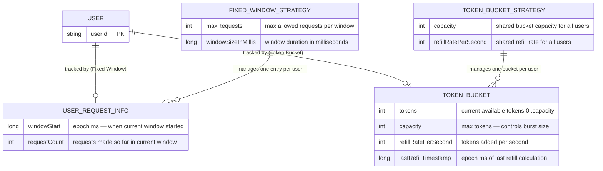
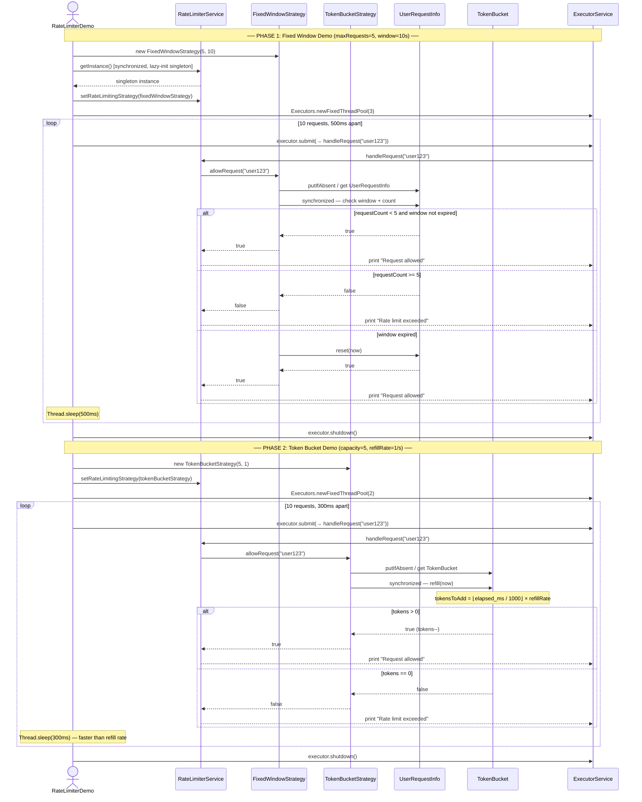
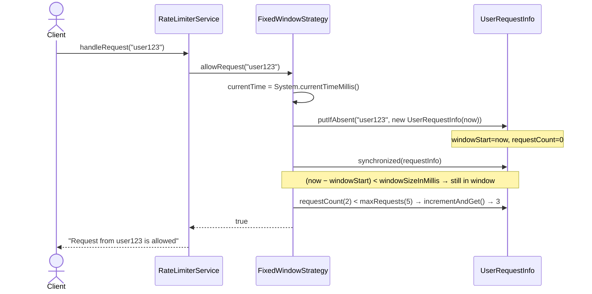
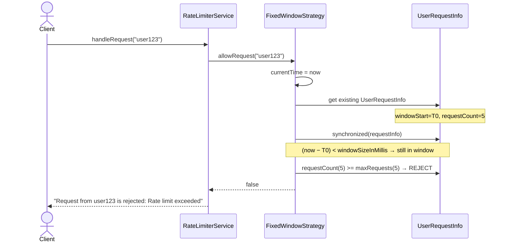
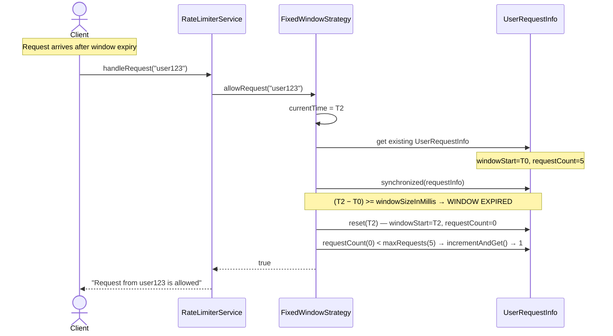
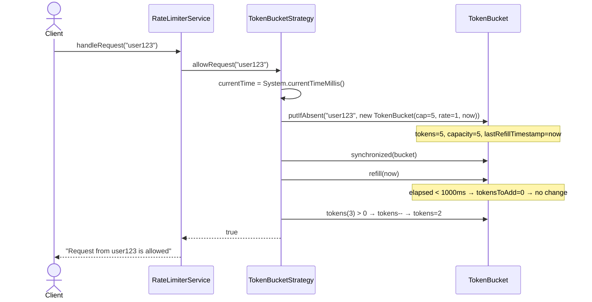
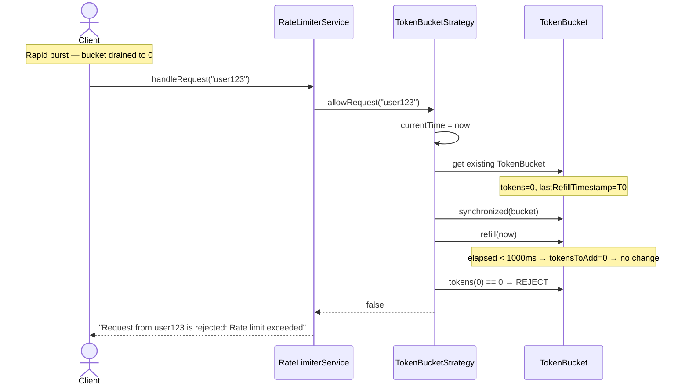
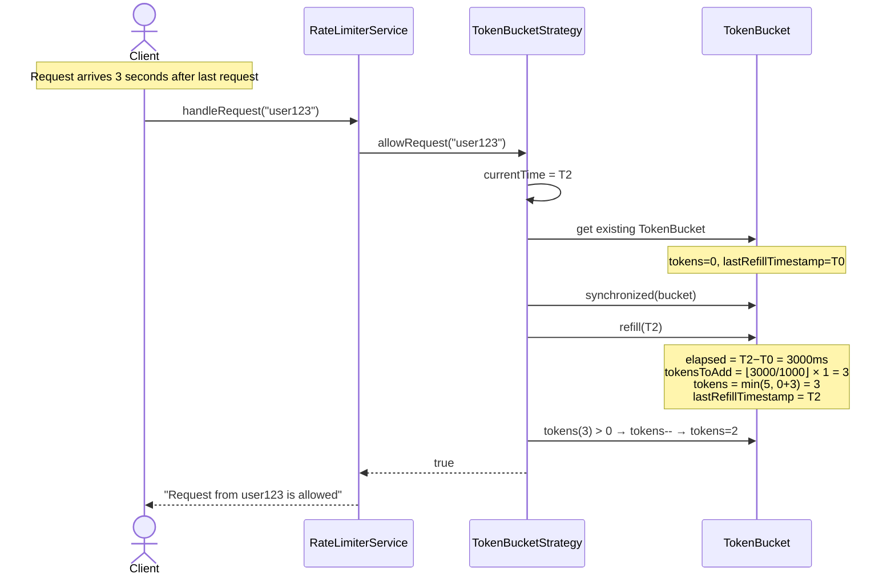
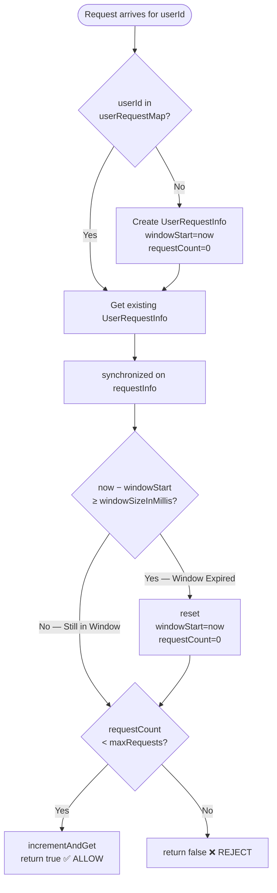
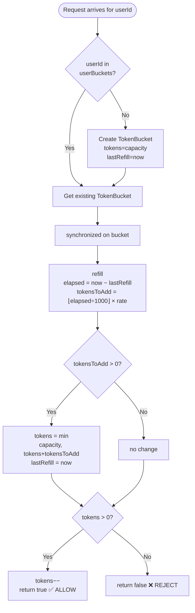

# Rate Limiter — LLD

> **Read once. Recall everything.**
> 2 design patterns · 7 classes · Thread-safe per-user request throttling

---

## Table of Contents

1. [Problem Statement](#1-problem-statement)
2. [Requirements](#2-requirements)
3. [Design Patterns Used](#3-design-patterns-used)
4. [Class Diagram](#4-class-diagram)
5. [Entity Diagram](#5-entity-diagram)
6. [Complete Application Flow — End to End](#6-complete-application-flow--end-to-end)
7. [Key Flows — Sequence Diagrams](#7-key-flows--sequence-diagrams)
8. [Algorithm Flowcharts](#8-algorithm-flowcharts)
9. [Thread Safety Analysis](#9-thread-safety-analysis)

---

## 1. Problem Statement

Design a **Rate Limiter** that controls how many requests a user can make to a service within a given time period. When a user exceeds the allowed rate, subsequent requests must be rejected until the limit resets or tokens are replenished.

### Context

In modern distributed systems, APIs are exposed to many concurrent users. Without rate limiting:
- A single abusive client can exhaust server resources.
- Downstream services get overwhelmed unexpectedly.
- Fair usage guarantees for other users break down.
- SLA/cost boundaries cannot be enforced.

A Rate Limiter sits in front of a service and enforces per-user request quotas. The limiting algorithm must be **configurable**, **swappable at runtime**, and **thread-safe** under concurrent access.

### Core Capabilities Required

| Capability | Description |
|---|---|
| Allow request | Let a request through if within the allowed rate |
| Reject request | Block a request if the rate limit is exceeded |
| Per-user tracking | Each user has their own independent rate-limit state |
| Strategy swap | The algorithm can be changed at runtime without changing client code |
| Concurrency safety | Correct behavior under simultaneous multi-threaded access |

---

## 2. Requirements

### Functional Requirements

- Accept or reject incoming requests per user based on a configurable rate-limit policy.
- Support two rate-limiting algorithms:
  - **Fixed Window** — Allow up to `N` requests within a fixed time window (e.g., 5 req / 10 sec). Counter resets when the window expires.
  - **Token Bucket** — Each user has a bucket of capacity `C`. Tokens refill at rate `R` per second. Each request consumes one token. Request is rejected if the bucket is empty.
- Each algorithm maintains per-user state (separate limit tracking per user ID).
- The rate-limiting strategy must be injectable and swappable at runtime.
- The service must be a singleton — one shared instance manages all requests.

### Non-Functional Requirements

- **Thread Safety** — Multiple threads may call `handleRequest()` for the same user concurrently; state must not be corrupted.
- **Performance** — Per-request overhead must be O(1).
- **Extensibility** — New algorithms can be added without modifying existing classes (Open/Closed Principle).
- **Scalability** — Per-user state is stored in a map; new users are initialized lazily on first request.

---

## 3. Design Patterns Used

| Pattern | Where Applied | Purpose |
|---|---|---|
| **Strategy** | `RateLimitingStrategy` interface + implementations | Allows the rate-limiting algorithm to be selected and swapped at runtime without changing `RateLimiterService` |
| **Singleton** | `RateLimiterService.getInstance()` | Ensures only one service instance exists; centralizes all request routing |

**Why Strategy?** Different algorithms (Fixed Window, Token Bucket, Sliding Window, Leaky Bucket) have completely different internal state and logic. Strategy decouples *policy selection* (done in config/main) from *policy enforcement* (done inside the strategy). `RateLimiterService` only ever knows the `RateLimitingStrategy` interface.

**Why Singleton?** The `RateLimiterService` holds a reference to the active strategy and is the single gate for all requests. Singleton ensures no ambiguity about which instance holds the live strategy.

---

## 4. Class Diagram

```mermaid
classDiagram
    class RateLimiterService {
        -RateLimiterService instance$
        -RateLimitingStrategy rateLimitingStrategy
        -RateLimiterService()
        +getInstance()$ RateLimiterService
        +setRateLimitingStrategy(RateLimitingStrategy) void
        +handleRequest(String userId) void
    }

    class RateLimitingStrategy {
        <<interface>>
        +allowRequest(String userId) boolean
    }

    class FixedWindowStrategy {
        -int maxRequests
        -long windowSizeInMillis
        -Map~String, UserRequestInfo~ userRequestMap
        +FixedWindowStrategy(int maxRequests, long windowSizeInSeconds)
        +allowRequest(String userId) boolean
    }

    class UserRequestInfo {
        +long windowStart
        +AtomicInteger requestCount
        +UserRequestInfo(long startTime)
        +reset(long newStart) void
    }

    class TokenBucketStrategy {
        -int capacity
        -int refillRatePerSecond
        -Map~String, TokenBucket~ userBuckets
        +TokenBucketStrategy(int capacity, int refillRatePerSecond)
        +allowRequest(String userId) boolean
    }

    class TokenBucket {
        +int tokens
        +int capacity
        +int refillRatePerSecond
        +long lastRefillTimestamp
        +TokenBucket(int capacity, int refillRatePerSecond, long currentTimeMillis)
        +refill(long currentTime) void
    }

    class RateLimiterDemo {
        +main(String[] args)$ void
        -runFixedWindowDemo(String userId)$ void
        -runTokenBucketDemo(String userId)$ void
    }

    RateLimiterService --> RateLimitingStrategy : delegates to
    RateLimitingStrategy <|.. FixedWindowStrategy : implements
    RateLimitingStrategy <|.. TokenBucketStrategy : implements
    FixedWindowStrategy +-- UserRequestInfo : inner class
    TokenBucketStrategy +-- TokenBucket : inner class
    RateLimiterDemo --> RateLimiterService : uses
    RateLimiterDemo --> FixedWindowStrategy : creates
    RateLimiterDemo --> TokenBucketStrategy : creates
```

---

## 5. Entity Diagram

The entities are in-memory data objects that hold per-user rate-limit state. Each strategy maintains its own `ConcurrentHashMap` keyed by `userId`.



---

## 6. Complete Application Flow — End to End

> The full `RateLimiterDemo.main()` call chain — both strategies, in order.



---

## 7. Key Flows — Sequence Diagrams

### Flow 1 — Fixed Window: Request Allowed



---

### Flow 2 — Fixed Window: Request Rejected (Limit Hit)



---

### Flow 3 — Fixed Window: Window Expired, Counter Reset, Request Allowed



---

### Flow 4 — Token Bucket: Request Allowed (Tokens Available)



---

### Flow 5 — Token Bucket: Request Rejected (Bucket Empty)



---

### Flow 6 — Token Bucket: Refill Then Allow



---

## 8. Algorithm Flowcharts

### Fixed Window Counter



**Boundary burst problem:** A user can make `2 × maxRequests` requests across a window boundary — e.g., 5 at T=9.9s, then 5 again at T=10.1s. Use Sliding Window to fix this.

---

### Token Bucket



**Key properties:**
- Allows bursting up to `capacity` tokens immediately.
- Smooth continuous refill — no hard window boundary.
- Lazy refill: tokens are recalculated only when a request arrives.

---

## 9. Thread Safety Analysis

| Component | Mechanism | Reason |
|---|---|---|
| `RateLimiterService.getInstance()` | `synchronized` method | Prevents two threads from each creating a new instance during startup |
| `FixedWindowStrategy.userRequestMap` | `ConcurrentHashMap` | Lock-free concurrent reads; atomic `putIfAbsent` for new user initialization |
| `UserRequestInfo` operations | `synchronized(requestInfo)` block | Window check + counter increment must be atomic per user; avoids TOCTOU race |
| `UserRequestInfo.requestCount` | `AtomicInteger` | Atomic increment (also guarded by `synchronized` block above — defense in depth) |
| `TokenBucketStrategy.userBuckets` | `ConcurrentHashMap` | Lock-free concurrent reads; atomic `putIfAbsent` for new user initialization |
| `TokenBucket` operations | `synchronized(bucket)` block | Refill + token consume must be atomic; prevents two threads both seeing `tokens > 0` and both consuming |

**Why lock on the object, not the map?**

`synchronized(userRequestMap)` serializes all users — user A's request blocks user B's check. Locking on the per-user object (`synchronized(requestInfo)` / `synchronized(bucket)`) means threads for different users run in parallel while threads for the same user are serialized. This is **fine-grained locking** and eliminates contention between unrelated users at scale.
