# Rate Limiter — LLD Revision Guide

> **Purpose:** Complete revision reference. Read this instead of the entire codebase.
> 2 design patterns · 7 classes · 5 rate-limiting algorithms explained · Thread-safe per-user throttling

---

## Table of Contents

1. [System in One Story](#1-system-in-one-story)
2. [Pattern Map — Memory Hook](#2-pattern-map--memory-hook)
3. [Class Responsibility Cheatsheet](#3-class-responsibility-cheatsheet)
4. [Draw the Class Diagram in 4 Steps](#4-draw-the-class-diagram-in-4-steps)
5. [Entity Relationship Diagram](#5-entity-relationship-diagram)
6. [Class Diagram](#6-class-diagram)
7. [Design Patterns — Deep Dive](#7-design-patterns--deep-dive)
8. [Rate Limiting Algorithms — All 5 Explained](#8-rate-limiting-algorithms--all-5-explained)
9. [Complete Application Flow — End to End](#9-complete-application-flow--end-to-end)
10. [Key Flows — Sequence Diagrams](#10-key-flows--sequence-diagrams)
11. [Thread Safety Analysis](#11-thread-safety-analysis)
12. [Quick Revision Cheatsheet](#12-quick-revision-cheatsheet)

---

## 1. System in One Story

> A `RateLimiterService` (Singleton) is the one shared gate for all incoming requests. It holds a `RateLimitingStrategy` (Strategy) — either a `FixedWindowStrategy` or a `TokenBucketStrategy`. When `handleRequest(userId)` is called, the service delegates entirely to the active strategy's `allowRequest(userId)`. Each strategy maintains a `ConcurrentHashMap` of per-user state: `FixedWindowStrategy` tracks a counter inside a time window; `TokenBucketStrategy` tracks a replenishing pool of tokens. Both use fine-grained locking on the per-user object — not the whole map — so requests for different users proceed in parallel. The `RateLimiterDemo` shows how to swap strategies at runtime without changing any client code.

**Mnemonic — 2 patterns: "S·S"**
- **S**ingleton → `RateLimiterService` — one gate, one active strategy
- **S**trategy → `RateLimitingStrategy` — plug in Fixed Window or Token Bucket without touching the gate

---

## 2. Pattern Map — Memory Hook

| Pattern | Interface / Class | Concrete Classes | One-line Why |
|---|---|---|---|
| **Singleton** | — | `RateLimiterService` | One shared gate; no ambiguity about which instance holds the live strategy |
| **Strategy** | `RateLimitingStrategy` | `FixedWindowStrategy`, `TokenBucketStrategy` | Swap the algorithm at runtime; service never knows which algorithm runs |

---

## 3. Class Responsibility Cheatsheet

> **All 7 classes — one-liner each.**

### Service (1)
| Class | Role |
|---|---|
| `RateLimiterService` | Singleton gate — receives all requests, delegates to current strategy, prints allow/reject |

### Strategy Layer (3)
| Class | Role |
|---|---|
| `RateLimitingStrategy` *(interface)* | Contract: `allowRequest(userId) → boolean` — implemented by every algorithm |
| `FixedWindowStrategy` | Allows up to `maxRequests` per fixed time window; resets counter when window expires |
| `TokenBucketStrategy` | Each user has a token bucket; tokens refill at a fixed rate; one token consumed per request |

### State Holders — Inner Classes (2)
| Class | Role |
|---|---|
| `UserRequestInfo` *(inner of FixedWindowStrategy)* | Holds `windowStart` (epoch ms) + `requestCount` (AtomicInteger) for one user |
| `TokenBucket` *(inner of TokenBucketStrategy)* | Holds `tokens`, `capacity`, `refillRatePerSecond`, `lastRefillTimestamp` for one user |

### Demo (1)
| Class | Role |
|---|---|
| `RateLimiterDemo` | Wires both strategies, spins up thread pools, fires 10 concurrent requests each |

---

## 4. Draw the Class Diagram in 4 Steps

> Follow this order and you'll reconstruct the full diagram without missing anything.

**Step 1 — Draw the interface (your skeleton)**
```
RateLimitingStrategy
  └─ allowRequest(userId: String): boolean
```

**Step 2 — Hang the two strategies off the interface**
```
RateLimitingStrategy ◄── FixedWindowStrategy
                     ◄── TokenBucketStrategy
```

**Step 3 — Add inner state classes and their maps**
```
FixedWindowStrategy
  └─ userRequestMap: ConcurrentHashMap<String, UserRequestInfo>
       └─ UserRequestInfo (inner)
            ├─ windowStart: long
            ├─ requestCount: AtomicInteger
            └─ reset(newStart)

TokenBucketStrategy
  └─ userBuckets: ConcurrentHashMap<String, TokenBucket>
       └─ TokenBucket (inner)
            ├─ tokens: int
            ├─ capacity: int
            ├─ refillRatePerSecond: int
            ├─ lastRefillTimestamp: long
            └─ refill(currentTime)
```

**Step 4 — Wrap in the Singleton service**
```
RateLimiterService (Singleton)
  └─ rateLimitingStrategy: RateLimitingStrategy  [ASSOCIATION — injected via setter]
       └─ delegates allowRequest() call to it

RateLimiterDemo
  └─ creates FixedWindowStrategy → injects into RateLimiterService
  └─ creates TokenBucketStrategy → injects into RateLimiterService
```

> **Tip:** The strategies are *associated* with the service (passed in via `setRateLimitingStrategy()`), not *composed* — the service does not create or own the strategy objects.

---

## 5. Entity Relationship Diagram

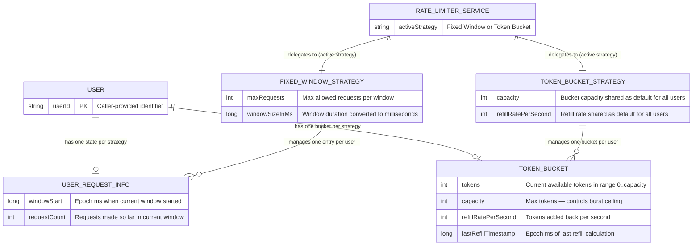

---

## 6. Class Diagram

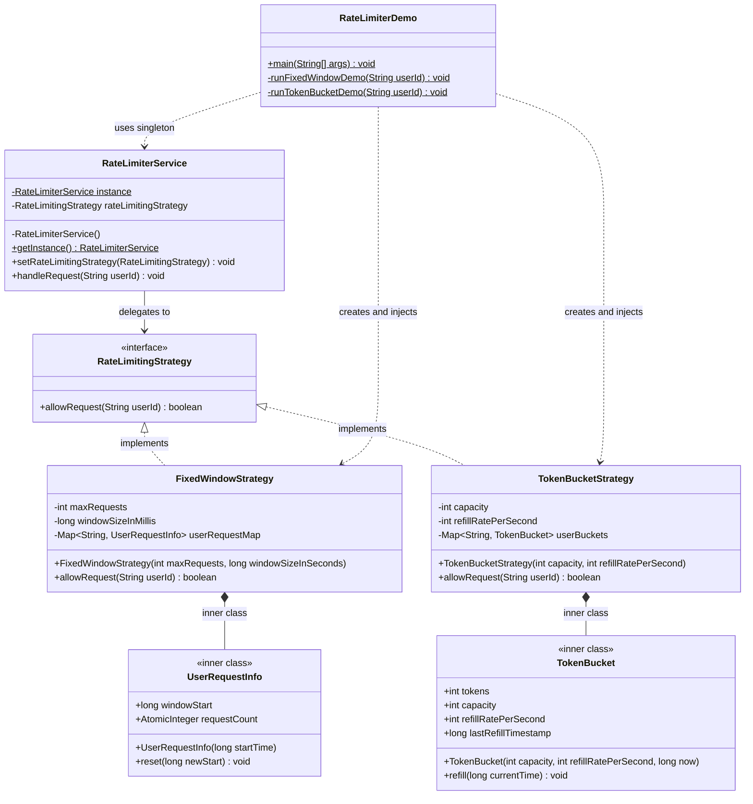

---

## 7. Design Patterns — Deep Dive

---

### 7.1 Singleton Pattern — `RateLimiterService`

**What it does:**
A single `RateLimiterService` instance is shared across all callers. It holds the currently active `RateLimitingStrategy` and is the only entry point for all `handleRequest()` calls.

**Key implementation — Lazy synchronized init:**
```java
private static RateLimiterService instance;          // not volatile — simpler impl

public static synchronized RateLimiterService getInstance() {
    if (instance == null) {
        instance = new RateLimiterService();         // only one thread creates it
    }
    return instance;
}
```

**vs. Double-Checked Locking (DCL):**
The implemented version uses a fully `synchronized` method — simpler, correct, but every `getInstance()` call acquires the lock even after init. DCL with `volatile` avoids the lock on the fast path. For a rate limiter where `getInstance()` is called once in setup, the simpler approach is fine.

**Without Singleton:** Every caller creates their own `RateLimiterService` with its own strategy — two callers could hold different strategies, creating split-brain rate limiting. No single authority over request decisions.

**Strategy injection:**
```java
service.setRateLimitingStrategy(new FixedWindowStrategy(5, 10));
// Strategy is swapped here — next handleRequest() uses the new algorithm
service.setRateLimitingStrategy(new TokenBucketStrategy(5, 1));
```

---

### 7.2 Strategy Pattern — `RateLimitingStrategy`

**What it does:**
The rate-limiting algorithm is encapsulated behind a single interface. `RateLimiterService` delegates the allow/reject decision entirely to whatever strategy is currently injected — it never inspects or knows the algorithm's internals.

**The interface contract:**
```java
public interface RateLimitingStrategy {
    boolean allowRequest(String userId);
}
```

**How delegation works — zero algorithm logic in the service:**
```java
public void handleRequest(String userId) {
    if (rateLimitingStrategy.allowRequest(userId)) {   // ← Strategy decides everything
        System.out.println("Request from user " + userId + " is allowed");
    } else {
        System.out.println("Request from user " + userId + " is rejected: Rate limit exceeded");
    }
}
```

**Runtime swap — the key benefit:**
```java
// Phase 1: Fixed Window
service.setRateLimitingStrategy(new FixedWindowStrategy(5, 10));
runDemo(service);

// Phase 2: Token Bucket — zero changes to service or caller
service.setRateLimitingStrategy(new TokenBucketStrategy(5, 1));
runDemo(service);
```

**Extensibility — adding Sliding Window:**
```java
public class SlidingWindowLogStrategy implements RateLimitingStrategy {
    @Override
    public boolean allowRequest(String userId) { ... }
}
// Zero changes to RateLimiterService, RateLimiterDemo, or any existing strategy
service.setRateLimitingStrategy(new SlidingWindowLogStrategy(5, 10));
```

**Without Strategy:** All algorithm logic lives inside `handleRequest()` as a giant if/else block. Adding Token Bucket means editing the service class, re-testing all paths, and breaking the Open/Closed Principle.

---

## 8. Rate Limiting Algorithms — All 5 Explained

> The codebase implements **Fixed Window** and **Token Bucket**. All 5 algorithms are explained here for interview completeness.

---

### 8.1 Fixed Window Counter ✅ Implemented

**Concept:** Divide time into fixed-size windows. Keep a counter per user per window. Reject when the counter hits the limit. Reset the counter when the window expires.

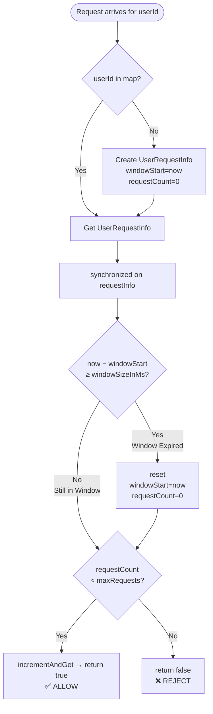

**Timeline example** — maxRequests=5, window=10s:
```
│◄─── Window 1 ───►│◄─── Window 2 ───►│
T=0               T=10              T=20
●  ●  ●  ●  ●  ✗  ✗     ●  ●  ●
1  2  3  4  5  6  7     1  2  3   ← counter resets at T=10
```

**Boundary burst problem — the critical flaw:**
```
T=9.9s  → 5 requests  (end of Window 1)  ✅ all allowed
T=10.1s → 5 requests  (start of Window 2) ✅ all allowed
= 10 requests in 0.2 seconds — 2× the intended limit
```

**State per user:**

| Field | Type | Purpose |
|---|---|---|
| `windowStart` | `long` | Epoch ms when current window started |
| `requestCount` | `AtomicInteger` | Requests made so far in this window |

**Pros:** O(1) time, O(1) space per user. Simple to implement.
**Cons:** Boundary burst allows 2× traffic spike at window edges.

---

### 8.2 Token Bucket ✅ Implemented

**Concept:** Each user has a bucket with a maximum capacity. Tokens refill at a constant rate (up to capacity). Each request consumes one token. If the bucket is empty, the request is rejected.

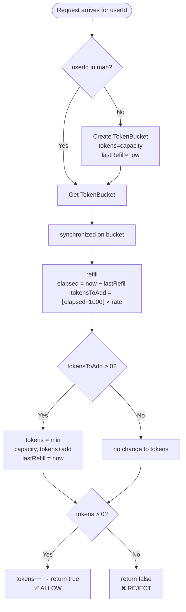

**Refill formula:**
```
elapsed      = currentTime − lastRefillTimestamp        (ms)
tokensToAdd  = ⌊elapsed / 1000⌋ × refillRatePerSecond
newTokens    = min(capacity, currentTokens + tokensToAdd)
```

**Timeline example** — capacity=5, refillRate=1/s, requests every 300ms:
```
T=0.0s  tokens=5 → req ● → tokens=4
T=0.3s  tokens=4 → req ● → tokens=3
T=0.6s  tokens=3 → req ● → tokens=2
T=0.9s  tokens=2 → req ● → tokens=1
T=1.2s  tokens=1 → req ● → tokens=0  (1 token refilled since T=0)
T=1.5s  tokens=0 → req ✗  (elapsed=300ms, no new token yet)
T=2.5s  tokens=1 → req ● → tokens=0  (1 more token since last refill)
```

**State per user:**

| Field | Type | Purpose |
|---|---|---|
| `tokens` | `int` | Current available tokens |
| `capacity` | `int` | Maximum tokens — controls burst ceiling |
| `refillRatePerSecond` | `int` | Tokens added per second |
| `lastRefillTimestamp` | `long` | When refill was last calculated |

**Key insight — lazy refill:** Tokens are not added on a background timer. They are calculated *on-demand* when a request arrives, using elapsed time since the last calculation.

**Pros:** Handles bursts up to `capacity`. Smooth continuous refill — no hard window resets. O(1) per request.
**Cons:** Allows burst of `capacity` tokens at any point — could still spike traffic.

---

### 8.3 Sliding Window Log ❌ Not Implemented

**Concept:** Maintain a log (sorted list) of request timestamps per user. On each request, remove all timestamps older than the window, then check if the log size is within the limit.

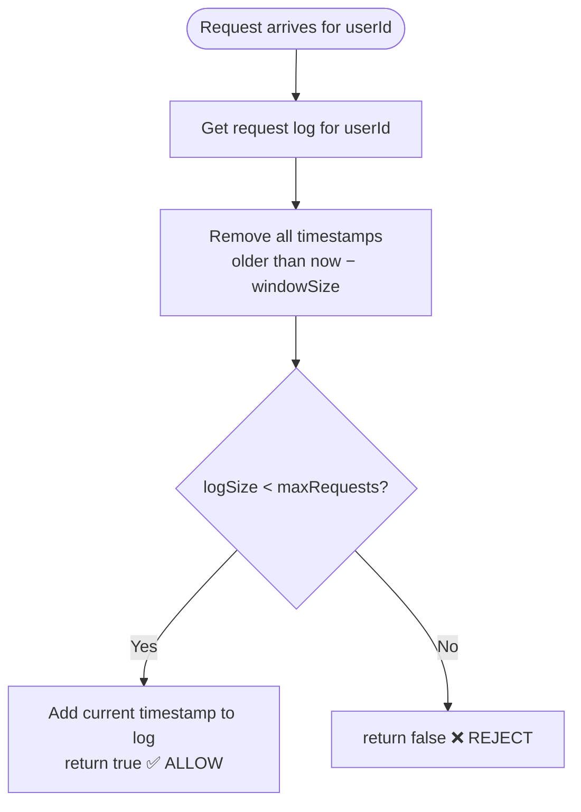

**Timeline example** — maxRequests=3, window=10s:
```
T=1s   log=[1]         → size=1 < 3 ✅
T=5s   log=[1,5]       → size=2 < 3 ✅
T=9s   log=[1,5,9]     → size=3 == 3 ✅
T=11s  log=[5,9,11]    → evict T=1 (11-1=10≥10), size=3 ✅
T=12s  log=[5,9,11,12] → evict T=5 would not work (12-5=7<10), size=4 ❌ REJECT
```

**Fixes the boundary burst problem** — the window slides with every request. No hard reset.

**State per user:** A sorted set of timestamps (e.g., `TreeMap<Long, Integer>` for counts, or a `LinkedList<Long>`).

**Pros:** Perfectly accurate. No boundary burst.
**Cons:** Memory grows with request volume — O(maxRequests) per user. Timestamp eviction is O(log n).

---

### 8.4 Sliding Window Counter ❌ Not Implemented

**Concept:** Hybrid of Fixed Window + Sliding Window Log. Store counters for the current and previous fixed windows. Estimate the effective request count using a weighted average based on how far into the current window you are.

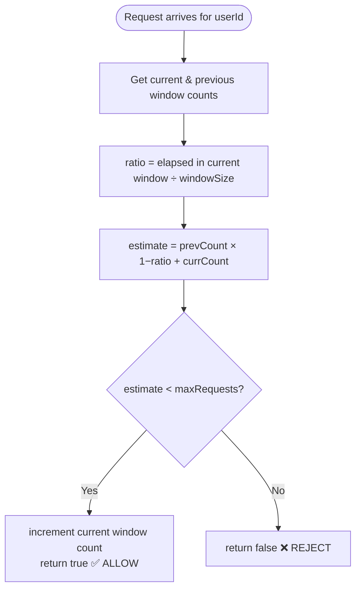

**Formula:**
```
ratio        = (now − currentWindowStart) / windowSizeMs
weightedCount = previousWindowCount × (1 − ratio) + currentWindowCount
```

**Example** — maxRequests=10, window=60s, we are 25% into the current window:
```
previousWindowCount = 8
currentWindowCount  = 3
ratio               = 0.25
estimate            = 8 × (1 − 0.25) + 3 = 6 + 3 = 9 < 10 → ALLOW
```

**Pros:** O(1) space per user (only two counters). Approximates Sliding Window Log with 0.003% error rate (per Cloudflare research). No boundary burst in practice.
**Cons:** Approximate — theoretically allows slight overcounting at window boundaries.

---

### 8.5 Leaky Bucket ❌ Not Implemented

**Concept:** Requests enter a queue (the "bucket"). A fixed-rate processor drains the queue one request at a time. If the queue is full, incoming requests overflow and are rejected.

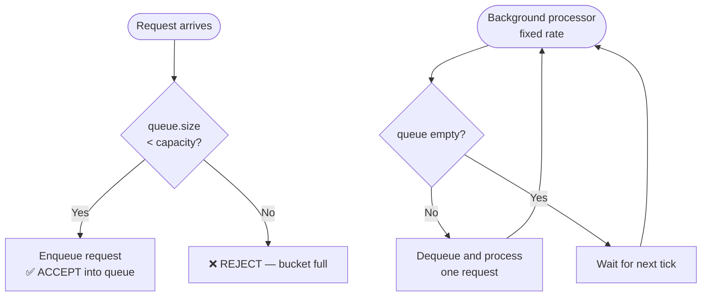

**Comparison with Token Bucket:**

| Aspect | Token Bucket | Leaky Bucket |
|---|---|---|
| Burst handling | Allows burst up to `capacity` | Smooths all bursts — constant output rate |
| Output rate | Variable (consumes on demand) | Constant (drains at fixed rate) |
| Implementation | Counter + timestamp (stateless drain) | Queue + background thread |
| Use case | API rate limiting with burst tolerance | Network traffic shaping |

**Pros:** Guarantees a constant output rate — ideal for smoothing traffic to downstream systems.
**Cons:** Requires a background processing thread. Queue adds latency. Legitimate burst traffic is still delayed even if capacity allows.

---

### Algorithm Comparison Table

| Algorithm | Memory per User | Accuracy | Burst Handling | Boundary Burst | Complexity |
|---|---|---|---|---|---|
| Fixed Window | O(1) | Approximate | ❌ No (hard reset) | ✅ Yes — up to 2× | O(1) |
| Token Bucket | O(1) | Approximate | ✅ Yes (up to capacity) | ❌ No hard boundary | O(1) |
| Sliding Window Log | O(maxRequests) | Exact | ❌ No | ❌ No | O(log n) |
| Sliding Window Counter | O(1) | ~99.997% | ❌ No | Minimal | O(1) |
| Leaky Bucket | O(capacity) | Exact | Delays (smooths) | ❌ No | O(1) drain |

**Interview answer — which to use?**
- **API rate limiting** (most common): Token Bucket or Sliding Window Counter
- **Traffic shaping** (downstream protection): Leaky Bucket
- **Simple quota enforcement** (daily/hourly limits): Fixed Window is fine
- **Strict accuracy required**: Sliding Window Log

---

## 9. Complete Application Flow — End to End

> The full `RateLimiterDemo.main()` call chain — both phases, all threads, in order.

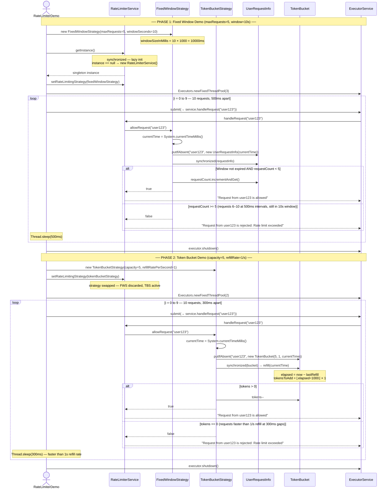

---

## 10. Key Flows — Sequence Diagrams

### Flow 1 — Fixed Window: Request Allowed (Window Active, Below Limit)

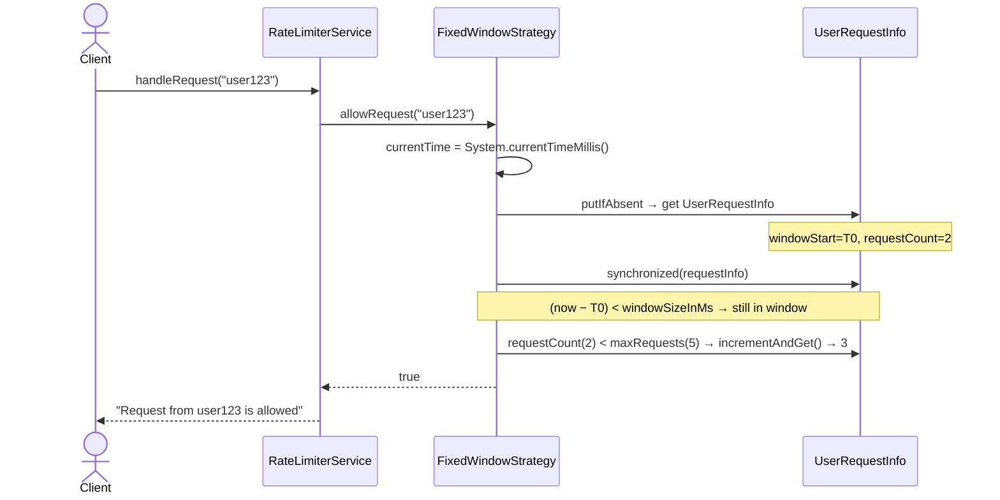

---

### Flow 2 — Fixed Window: Request Rejected (Limit Hit)

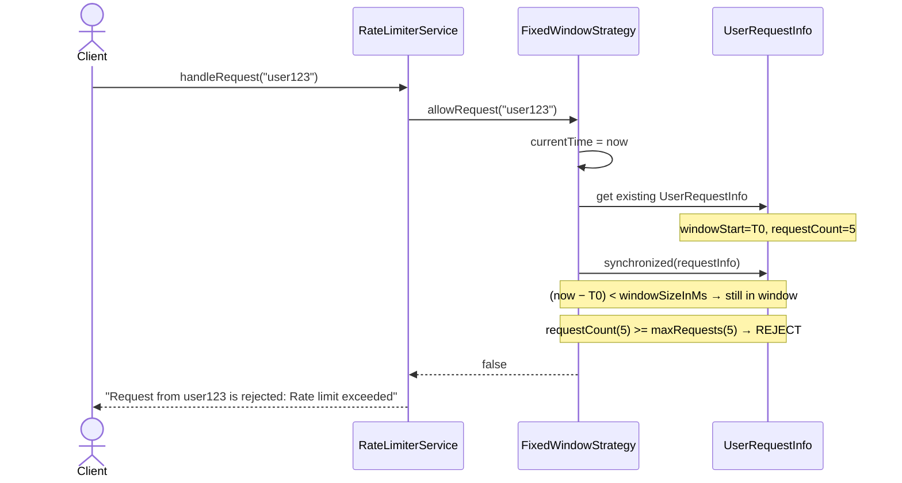

---

### Flow 3 — Fixed Window: Window Expired → Reset → Allow

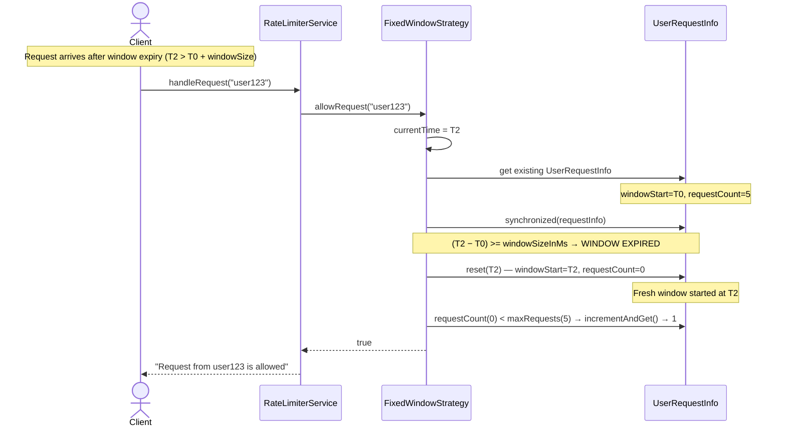

---

### Flow 4 — Token Bucket: First Request (Bucket Created, Token Consumed)

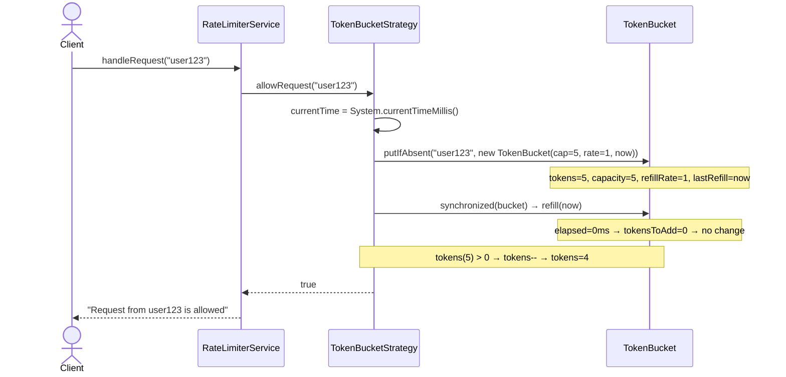

---

### Flow 5 — Token Bucket: Bucket Drained → Request Rejected

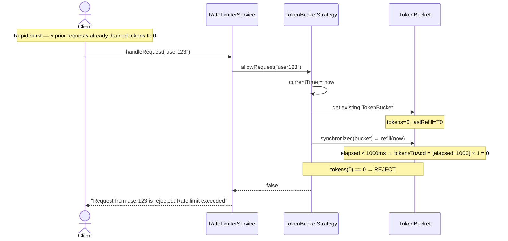

---

### Flow 6 — Token Bucket: Time Passes → Refill → Allow

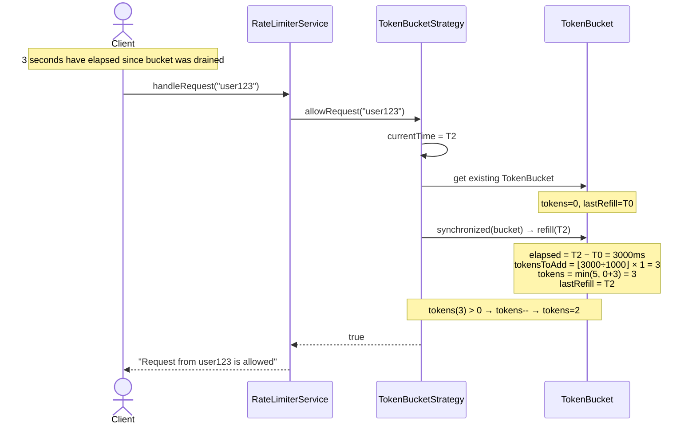

---

## 11. Thread Safety Analysis

### What's Thread-Safe and Why

| Component | Mechanism | Why This Mechanism |
|---|---|---|
| `RateLimiterService.getInstance()` | `synchronized` method | Prevents two threads from each creating a new instance on startup |
| `FixedWindowStrategy.userRequestMap` | `ConcurrentHashMap` | Lock-free concurrent reads; atomic `putIfAbsent` prevents duplicate user-init |
| `UserRequestInfo` window check + increment | `synchronized(requestInfo)` block | Window expiry check and counter increment must be one atomic operation — avoids TOCTOU race where two threads both see count=4 and both increment to 5 |
| `UserRequestInfo.requestCount` | `AtomicInteger` | Atomic increment without needing an extra lock (also guarded by `synchronized` above) |
| `TokenBucketStrategy.userBuckets` | `ConcurrentHashMap` | Lock-free concurrent reads; atomic `putIfAbsent` for new user bucket creation |
| `TokenBucket` refill + consume | `synchronized(bucket)` block | Refill calculation and token decrement must be one atomic operation — prevents two threads both seeing `tokens=1` and both consuming it |

### Why Lock on the User Object, Not the Map?

```
❌ synchronized(userRequestMap)   → serializes ALL users
                                    user-A's request blocks user-B's check

✅ synchronized(requestInfo)      → serializes only requests for the SAME user
                                    user-A and user-B proceed in parallel
```

This is **fine-grained locking**. Locking on the per-user object means contention only occurs when the same user fires concurrent requests — the common case of many users is fully parallel.

### The TOCTOU Race — Why Both Lines Must Be Inside `synchronized`

```java
// ❌ WRONG — race condition between check and increment
if (requestInfo.requestCount.get() < maxRequests) {    // Thread A reads count=4
    // Thread B also reads count=4 here — both pass the check!
    requestInfo.requestCount.incrementAndGet();         // Both increment → count becomes 5 then 6
}

// ✅ CORRECT — check and increment are atomic together
synchronized (requestInfo) {
    if (requestInfo.requestCount.get() < maxRequests) {
        requestInfo.requestCount.incrementAndGet();    // Only one thread reaches here at a time
        return true;
    }
    return false;
}
```

---

## 12. Quick Revision Cheatsheet

### Both Patterns at a Glance

| Pattern | Class | Without It |
|---|---|---|
| **Singleton** | `RateLimiterService` | Multiple instances → split-brain rate limiting → no consistent policy enforcement |
| **Strategy** | `RateLimitingStrategy` | Algorithm baked into service → changing algorithm requires editing and re-testing the service class |

### Inner Classes — Why Inner, Not Top-Level?

`UserRequestInfo` and `TokenBucket` are private inner classes because:
1. They are implementation details of their enclosing strategy — no other class should touch them.
2. Being `private static` inner classes means they don't hold a reference to the outer class instance — no memory leak.
3. They model state that is meaningless outside the strategy that created them.

### Algorithm Selection — The One-Liner Summary

```
Fixed Window   → simple quota; beware 2× burst at window boundary
Token Bucket   → smooth refill with burst tolerance; best for API rate limiting
Sliding Log    → exact accuracy; memory cost O(maxRequests) per user
Sliding Counter→ best accuracy/cost tradeoff; Cloudflare's choice
Leaky Bucket   → constant output rate; best for downstream traffic shaping
```

### Request Lifecycle — State Diagram

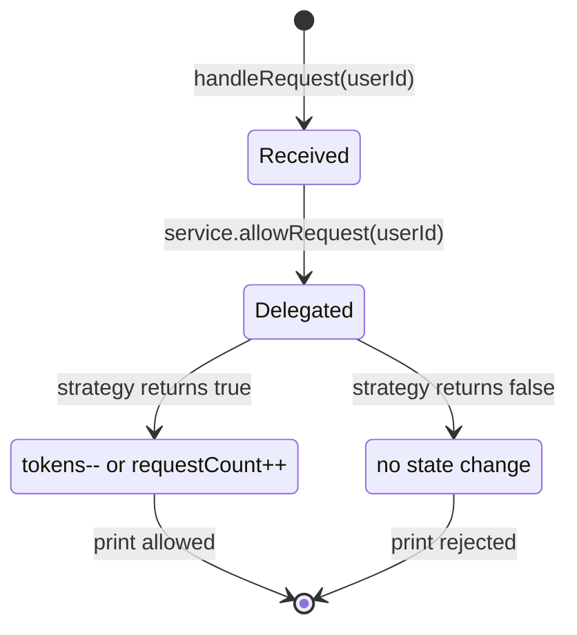

### How to Answer "How Does the Rate Limiter Work?" in 30 Seconds

```
RateLimiterService (Singleton) ← single gate for all requests
  │
  └─ delegates to RateLimitingStrategy (Strategy)
       │
       ├─ FixedWindowStrategy
       │    └─ ConcurrentHashMap<userId, UserRequestInfo>
       │         └─ synchronized(info): check window, increment count
       │
       └─ TokenBucketStrategy
            └─ ConcurrentHashMap<userId, TokenBucket>
                 └─ synchronized(bucket): refill on arrival, consume token
```

### Extensibility — Where to Add New Stuff

| Feature | Add This | Touch Nothing Else |
|---|---|---|
| New algorithm (Sliding Window) | New class implementing `RateLimitingStrategy` | `RateLimiterService` untouched — just inject the new class |
| Per-endpoint limits | Pass endpoint ID alongside `userId` as composite key | Strategy internals only |
| Distributed rate limiting (Redis-backed) | New `RedisRateLimitingStrategy` implementing the interface | All other classes untouched |
| Rate limit headers in response | Return a result object instead of `boolean` from `allowRequest()` | Requires interface change — plan for it upfront |
