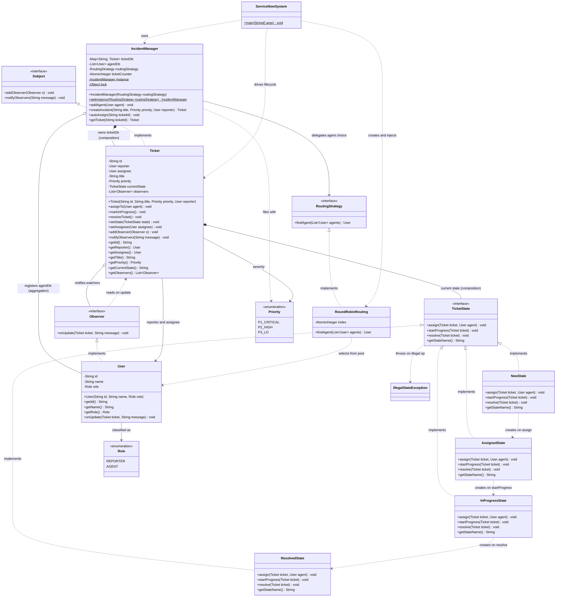
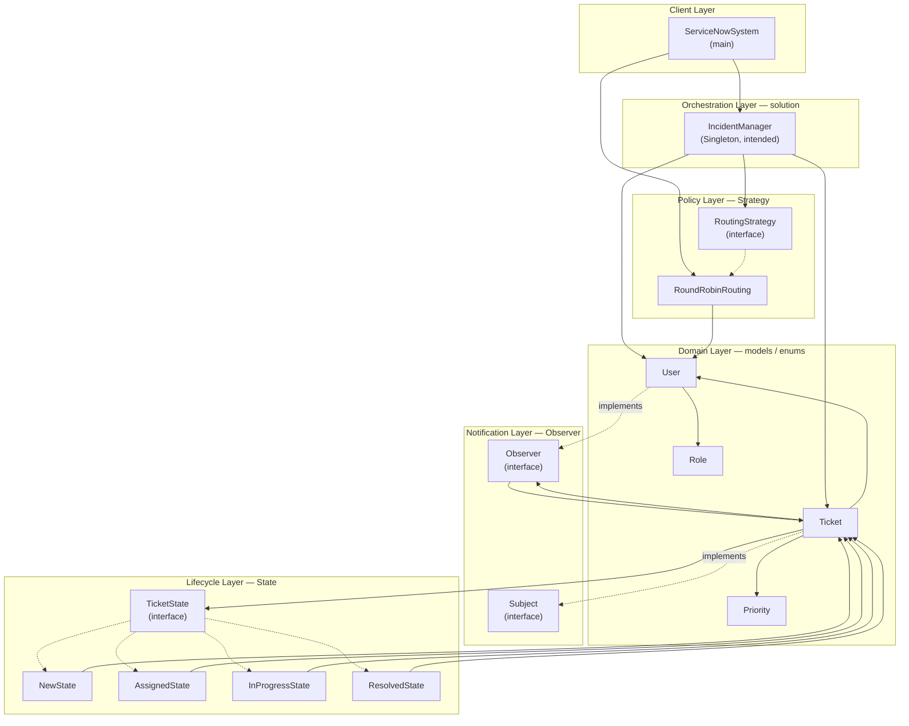
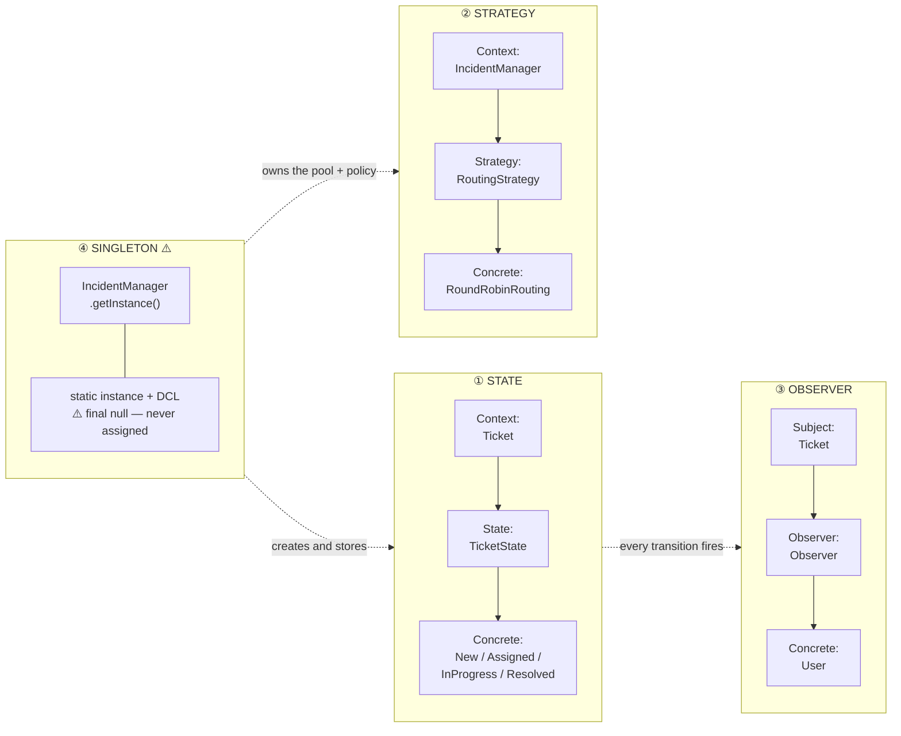
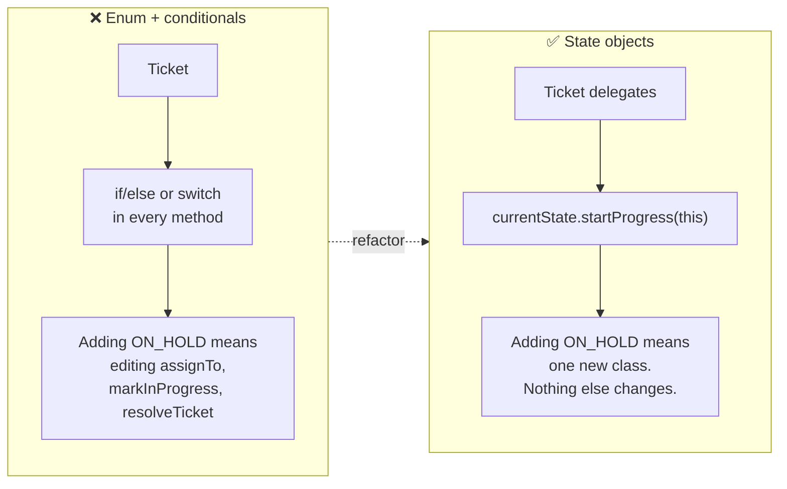

# Ticket Management System — Class Diagram

> Structural view of the system. Every field, method and relationship below mirrors the
> Java sources in [`../solution/`](../solution/).

---

## 1. Full Class Diagram



> **Note on `ticketDb` / `agentDb`** — their true types are
> `ConcurrentHashMap<String, Ticket>` and
> `Collections.synchronizedList(new ArrayList<User>())`. The boxes show the declared
> interface types, since that is what the rest of the code programs against.

> ⚠️ **Note on `instance`** — declared `private static final IncidentManager instance = null;`.
> Because it is `final` and initialised to `null`, it can never be assigned, so
> `getInstance` returns a **brand-new manager on every call**. See
> [§ 5](#5-the-singleton-that-isnt) and
> [04 § 4](04-state-diagrams.md#4-singleton-initialisation--intended-vs-actual).

---

## 2. Layered / Package View

How the classes group into packages, and which direction the dependencies point.



**The one cycle worth naming.** `models` ↔ `State` is bidirectional: `Ticket` holds a
`TicketState`, and every state takes a `Ticket` back as a parameter. That is inherent to
the State pattern — the state must be able to move its context on — and is why
`Ticket.setState` and `Ticket.setAssignee` are public rather than private.

---

## 3. Design-Pattern Overlay

The same classes, grouped by the pattern each one plays a role in.



| Pattern | Role in this system | Extend without touching existing code? |
|---|---|---|
| **State** | Each lifecycle state owns the rules for what may happen in it | ✅ add a class implementing `TicketState` |
| **Strategy** | Makes agent routing an interchangeable policy | ✅ add a class implementing `RoutingStrategy` |
| **Observer** | Decouples a ticket's transitions from who hears about them | ✅ add a class implementing `Observer` |
| **Singleton** | One point of control over tickets, agents and policy | ⚠️ currently broken — see § 5 |

---

## 4. Why State, and not a `status` field

The alternative every first draft reaches for:

```java
// ❌ What the State pattern replaces
public void markInProgress() {
    if (status == NEW)              throw new IllegalStateException("...");
    else if (status == ASSIGNED)    status = IN_PROGRESS;
    else if (status == IN_PROGRESS) System.out.println("Already in progress.");
    else if (status == RESOLVED)    throw new IllegalStateException("...");
}
```



Three operations × four states = twelve rules. As conditionals they are one tangle
spread across three methods; as state objects they are four small classes of four
methods each, and each rule sits next to the state it constrains.

---

## 5. The Singleton That Isn't

```java
private static final IncidentManager instance = null;   // ⚠️ final, pinned to null
private static Object lock = new Object();              // ⚠️ not final

public IncidentManager(RoutingStrategy routingStrategy) { ... }   // ⚠️ public

public static IncidentManager getInstance(RoutingStrategy s) {
    if (instance == null) {                    // always true — final null
        synchronized (lock) {
            if (instance == null) {            // always true
                return new IncidentManager(s); // ⚠️ returns, never assigns
            }
        }
    }
    return instance;                           // unreachable; would return null
}
```

Every call allocates a fresh manager with its own empty `ticketDb`, its own `agentDb`
and its own counter — so two callers' tickets are invisible to each other, and both
issue `INC-0001`.

The corrected shape:

```java
private static volatile IncidentManager instance;   // volatile, not final
private static final Object lock = new Object();

private IncidentManager(RoutingStrategy routingStrategy) { ... }  // private

public static IncidentManager getInstance(RoutingStrategy s) {
    if (instance == null) {
        synchronized (lock) {
            if (instance == null) {
                instance = new IncidentManager(s);  // assign, then fall through
            }
        }
    }
    return instance;
}
```

`volatile` is what makes the *first* (unlocked) check safe: without it, a second thread
can see a non-null reference to an object whose fields are not yet visible to it.

---

## 6. Relationship Notation Cheatsheet

| Mermaid | UML meaning | Example here | Why |
|---|---|---|---|
| `*--` | Composition — the part dies with the whole | `Ticket *-- TicketState` | A state object is created by and for one ticket; it has no life outside it |
| `o--` | Aggregation — the part outlives the whole | `IncidentManager o-- User` | Agents are people; they exist whether or not the manager does |
| `-->` | Association — holds a reference | `Ticket --> User` | A ticket points at its reporter and assignee |
| `<\|..` | Realization — implements an interface | `TicketState <\|.. NewState` | State / Strategy / Observer implementations |
| `..>` | Dependency — uses transiently | `NewState ..> AssignedState` | Constructed and handed off, never stored by the creator |
