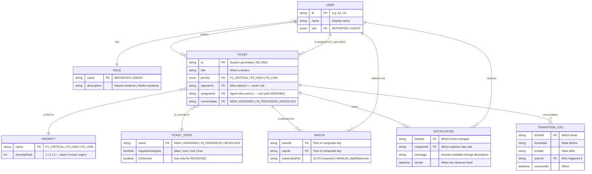
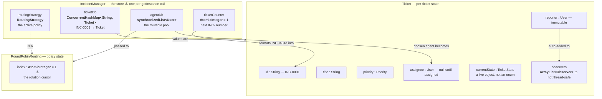
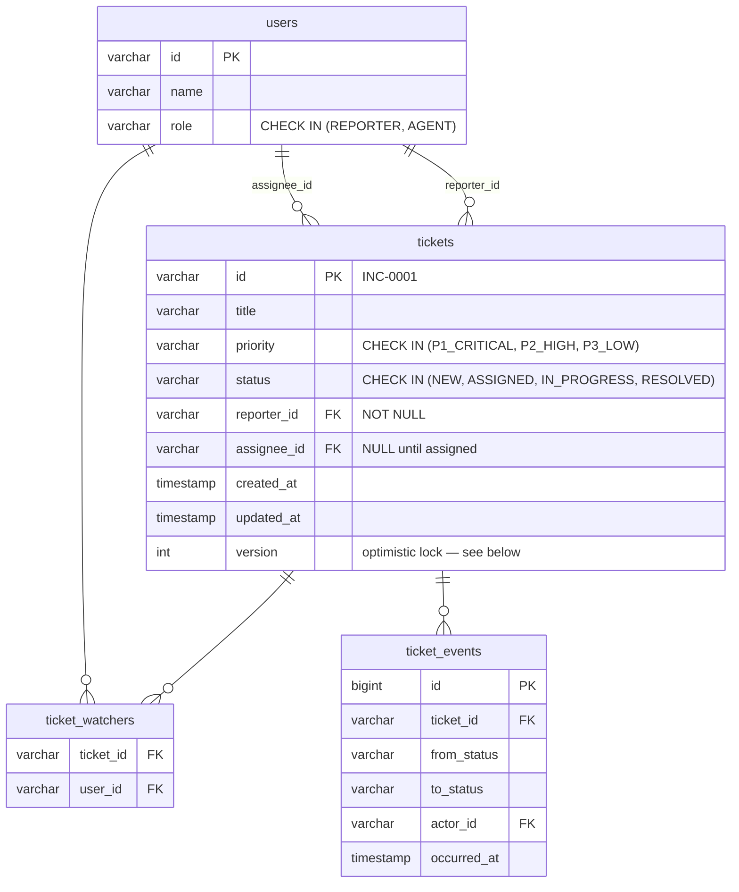
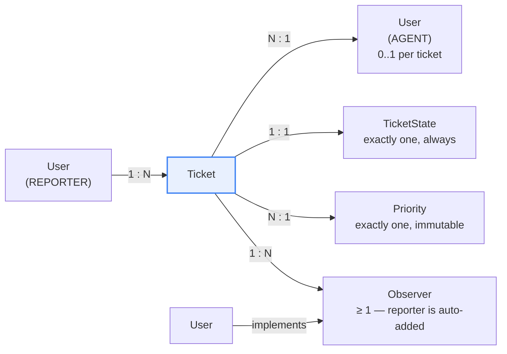

# Ticket Management System — Entity Relationship Diagram

> The **data** view: what is stored, with what attributes, and how the records relate.
> Where the class diagram shows behaviour, this shows shape — it is the diagram you
> would hand to someone asked to persist this system in a database.

---

## 1. Core ER Diagram

**Reading the crow's feet**

| Relationship | Cardinality | Meaning |
|---|---|---|
| `USER \|\|--o{ TICKET` (reports) | one-to-many | One user raises zero or more tickets; each ticket has **exactly one** reporter, set at construction and never changed |
| `USER \|\|--o{ TICKET` (assigned) | one-to-many, optional | One agent owns many tickets; a ticket has **zero or one** assignee — `null` while `NEW` |
| `TICKET }o--\|\| TICKET_STATE` | many-to-one | The state is a lookup value; in code it is a *polymorphic object*, not a column — see § 3 |
| `TICKET \|\|--o{ WATCH }o--\|\| USER` | many-to-many | Resolved through a junction table: a ticket has many watchers, a user watches many tickets |
| `TICKET \|\|--o{ NOTIFICATION` | one-to-many | Every transition × every watcher produces one row |

**Rows that exist in the model but not in the code.** `NOTIFICATION` and
`TRANSITION_LOG` are shown because any real service desk persists them — an SLA clock
and an audit trail are the first two features asked for after the happy path works.
Today they are `System.out.println` calls inside `User.onUpdate` and are never stored.
`WATCH.subscribedVia` distinguishes the reporter, auto-subscribed in the `Ticket`
constructor, from anyone added later through `addObserver`.

---

## 2. In-Memory Storage Map

What actually holds state at runtime, and in which object.

### The key invariant

> **A ticket's state is an object, not a value.** `currentState` holds a live
> `NewState` / `AssignedState` / `InProgressState` / `ResolvedState` instance. Reading it
> means calling `getStateName()`. Changing it means *replacing the object*. This is the
> single structural difference between this model and a `status` column, and everything
> in [04](04-state-diagrams.md) follows from it.

Three consequences worth stating out loud:

1. **Persisting is asymmetric.** Writing a ticket to a database stores
   `getCurrentState()` — the `String` name. Reading it back requires a factory that maps
   `"IN_PROGRESS"` → `new InProgressState()`. The object graph does not round-trip on
   its own.
2. **State objects are stateless.** None of the four hold a field, so they *could* be
   shared singletons rather than allocated per transition. The code allocates a new one
   each time (`new AssignedState()`), which is harmless but avoidable.
3. **`observers` is per-ticket, not global.** The reporter of `INC-0001` hears nothing
   about `INC-0002`. That is the Observer pattern applied at the right granularity — the
   subject is the ticket, not the manager.

---

## 3. What a Relational Schema Would Look Like

If this were backed by Postgres rather than hash maps:

**The constraints that encode the lifecycle rules**

| Rule from the problem statement | How the schema enforces it |
|---|---|
| A ticket in `NEW` has no assignee | `CHECK (status <> 'NEW' OR assignee_id IS NULL)` |
| Every non-`NEW` ticket has an assignee | `CHECK (status = 'NEW' OR assignee_id IS NOT NULL)` |
| `RESOLVED` is terminal | Enforced in the transition query, not the schema: `UPDATE ... WHERE status = 'IN_PROGRESS'` and assert one row affected |
| Two threads must not transition the same ticket at once | `version` column + `WHERE version = :expected`, or `SELECT ... FOR UPDATE` |
| The reporter always watches their ticket | Insert into `ticket_watchers` in the same transaction as the ticket insert |

That last row is the distributed-system answer to the in-memory concern raised in
[03 § 6](03-sequence-diagrams.md#flow-6--the-concurrency-race-on-a-single-ticket):
a single JVM serialises transitions with a lock; several JVMs serialise them with a
row version.

---

## 4. Cardinality at a Glance

| Entity pair | Min | Max | Enforced where |
|---|---|---|---|
| Ticket → reporter | 1 | 1 | Constructor parameter; field never reassigned |
| Ticket → assignee | 0 | 1 | `setAssignee`, called only from `NewState.assign` / `AssignedState.assign` |
| Ticket → state | 1 | 1 | Constructor sets `new NewState()`; `setState` always replaces |
| Ticket → observers | 1 | N | Constructor auto-adds the reporter, so the list is never empty |
| Ticket → priority | 1 | 1 | Constructor parameter; no setter exists |
| Manager → tickets | 0 | N | `ticketDb`, keyed by generated id |
| Manager → agents | 0 | N | `agentDb` — ⚠️ **may be empty**, which is what makes `RoundRobinRouting` throw |
