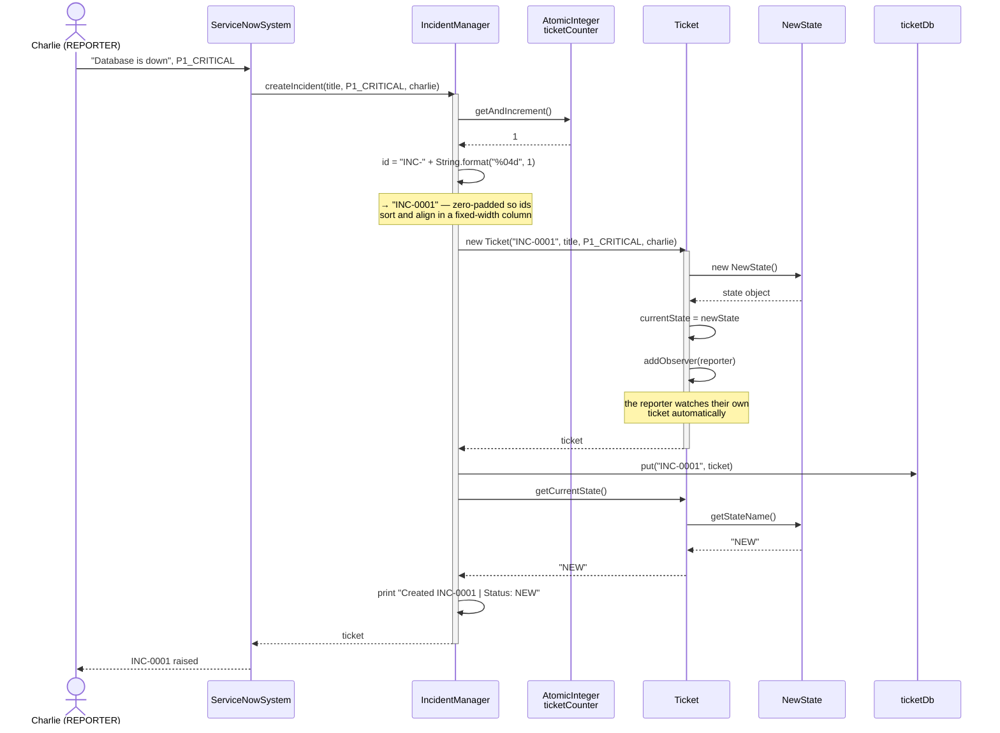
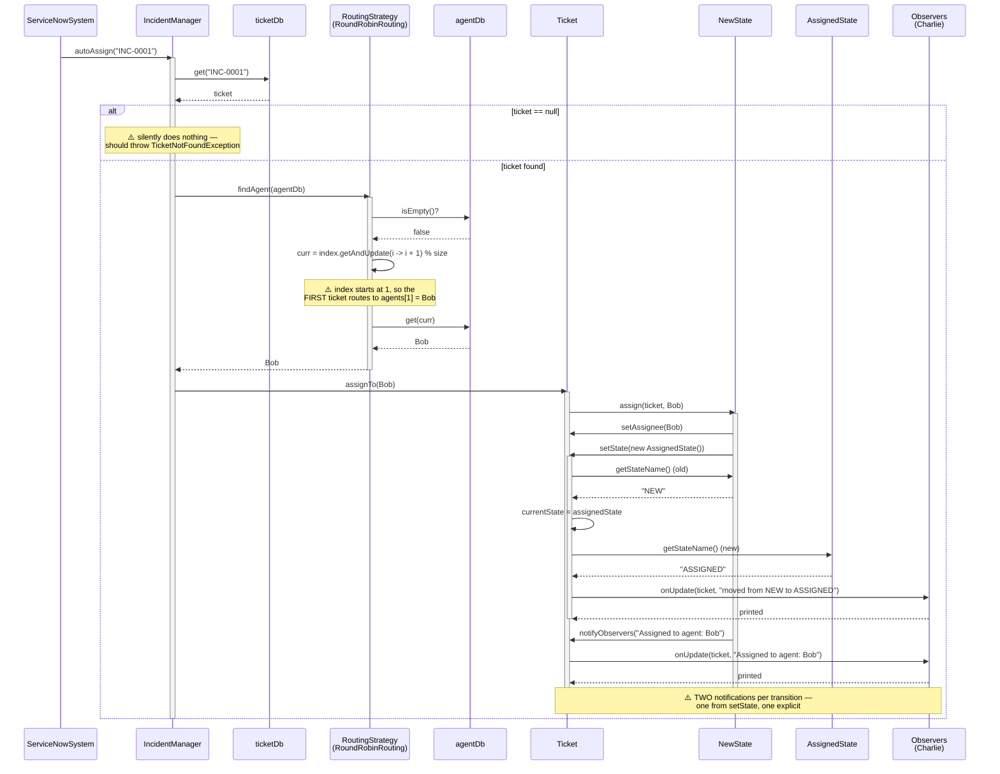
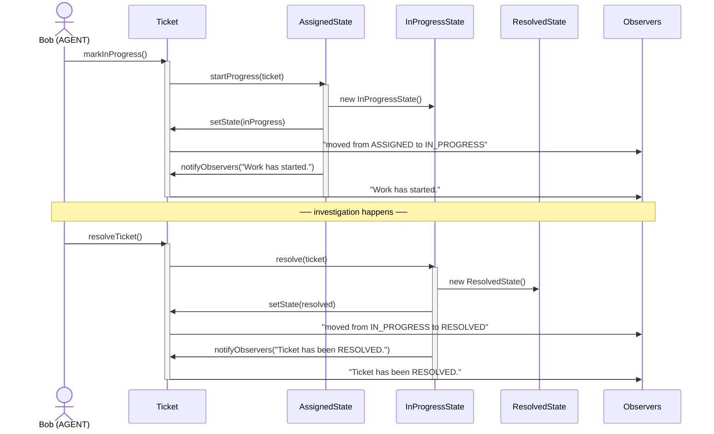
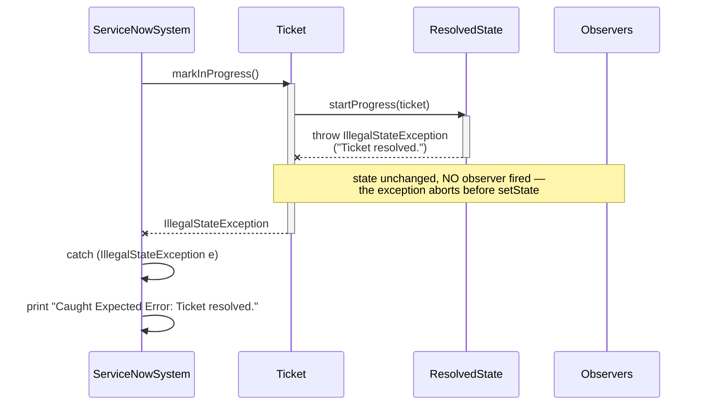
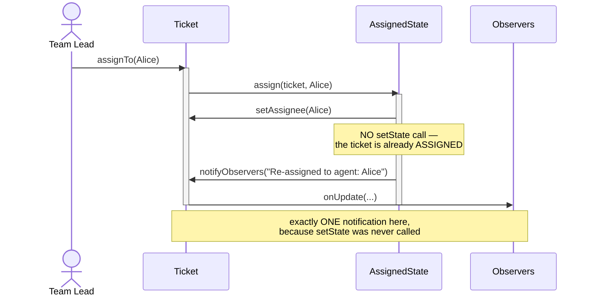
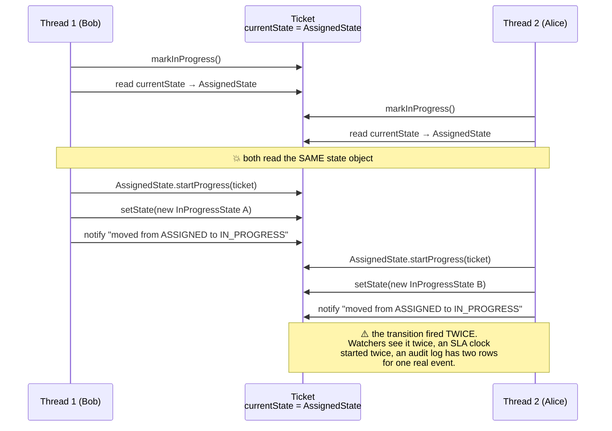
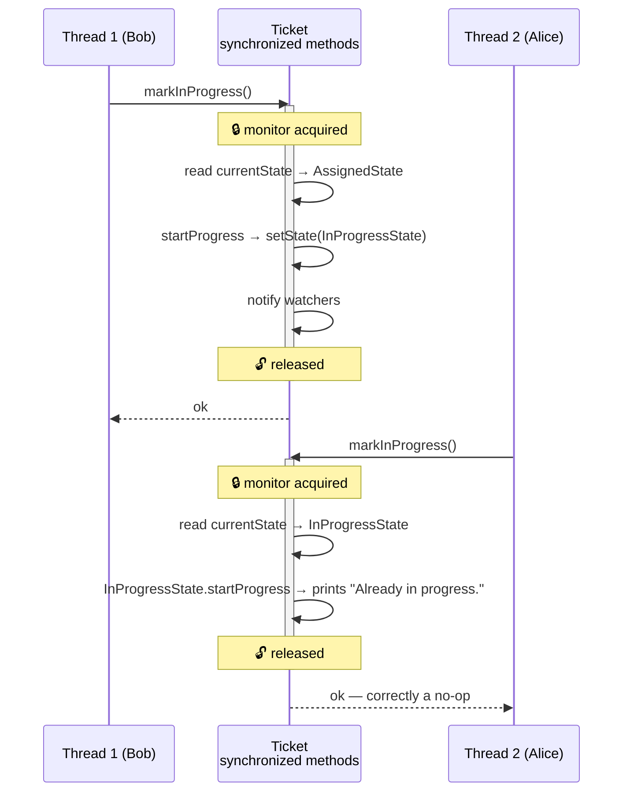
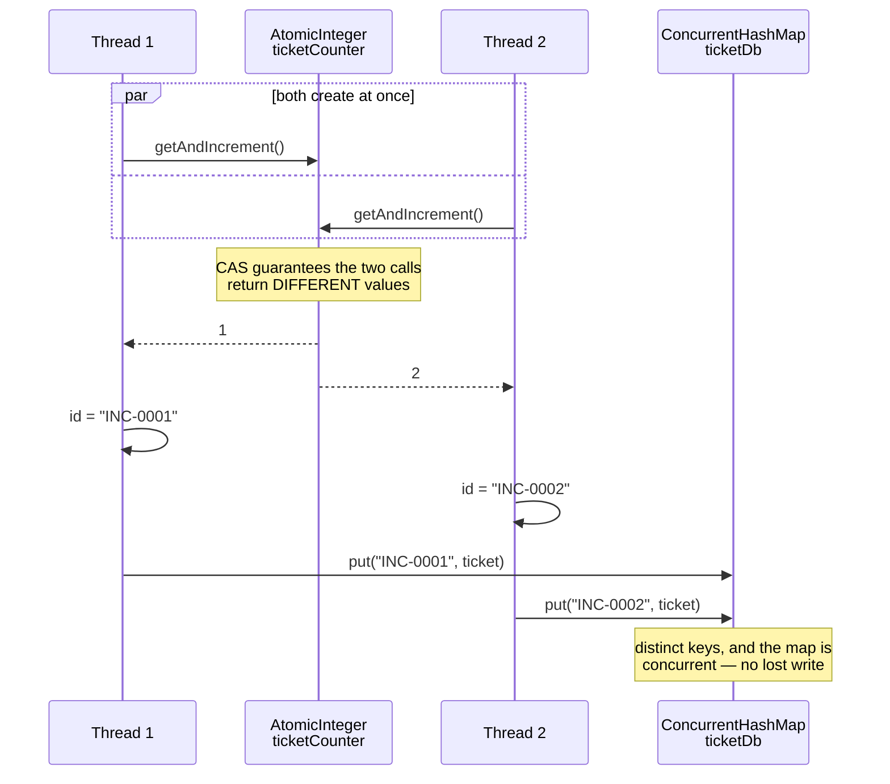
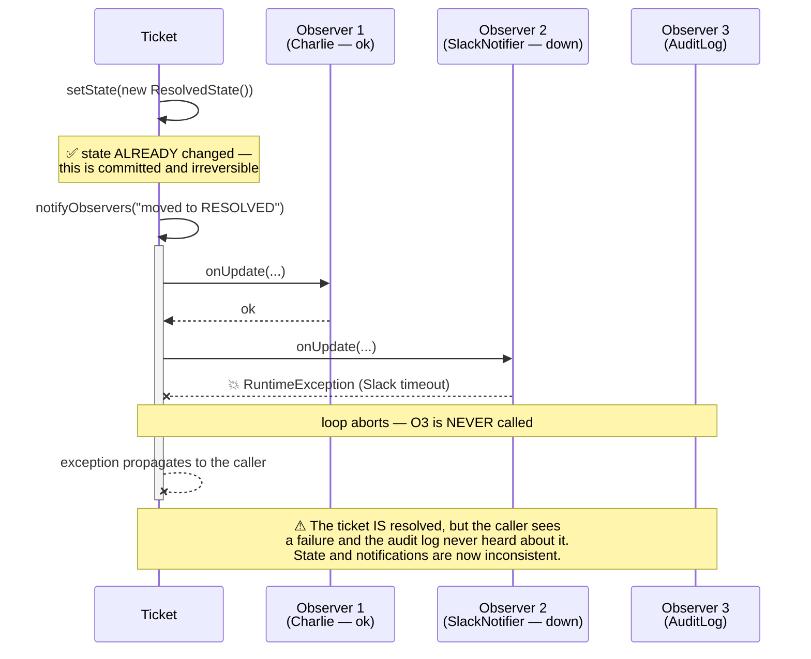

# Ticket Management System — Sequence Diagrams

> The **interaction** view: who calls whom, in what order, for each significant flow.
> Eight flows, from raising an incident through to the races and failure modes the
> current code does *not* yet handle.

---

## Flow 1 — Raise an Incident (Happy Path)

Creating a ticket. Note that the reporter subscribes to their own ticket inside the
constructor — nobody has to remember to do it.



**Why no notification fires here.** The constructor registers the reporter *after*
setting `currentState` directly (not via `setState`), so ticket creation is silent.
That is deliberate: there is no transition to announce, and the return value already
tells the caller the ticket exists.

---

## Flow 2 — Auto-Assign via the Routing Strategy

The Strategy pattern in one picture: the manager knows *that* an agent is chosen,
never *how*.



---

## Flow 3 — Start Work, Then Resolve

The two remaining forward transitions, back to back.



**The delegation is total.** `Ticket.markInProgress()` is one line —
`currentState.startProgress(this)`. It contains no `if`, no `switch`, and no knowledge
of which states permit the call. Adding `ON_HOLD` would not change this method.

---

## Flow 4 — Illegal Transition Rejected

What the demo exercises last: calling `markInProgress()` on a resolved ticket.



**The full rejection matrix** — every throw in `State/`:

| Current state | `assignTo` | `markInProgress` | `resolveTicket` |
|---|---|---|---|
| `NewState` | ✅ → `ASSIGNED` | ❌ *"Cannot start progress on unassigned ticket."* | ❌ *"Cannot resolve ticket directly from NEW."* |
| `AssignedState` | ✅ reassign, stays `ASSIGNED` | ✅ → `IN_PROGRESS` | ❌ *"Cannot resolve ticket directly from NEW."* ⚠️ **wrong message — copy-paste from `NewState`** |
| `InProgressState` | ❌ *"Cannot reassign while in progress."* | ⚪ no-op, prints *"Already in progress."* | ✅ → `RESOLVED` |
| `ResolvedState` | ❌ *"Ticket resolved."* | ❌ *"Ticket resolved."* | ⚪ no-op, prints *"Already resolved."* |

✅ transition · ❌ `IllegalStateException` · ⚪ idempotent no-op

The two ⚪ cells are a deliberate design choice, not an oversight: the caller's intent
("make it in progress", "make it resolved") is already satisfied, so throwing would
punish a harmless retry.

---

## Flow 5 — Reassignment Inside `ASSIGNED`

Reassignment is the one operation that fires an observer without changing state.



Contrast with Flow 2, where the same `assignTo` call produced *two* notifications
because `NewState.assign` does call `setState`. The inconsistency is the symptom of
notifying from two places; centralising it in `setState` fixes both.

---

## Flow 6 — The Concurrency Race on a Single Ticket

Two agents acting on the same ticket at the same instant. `Ticket`'s methods are not
synchronized, so the check (which state am I in?) and the act (replace the state) can
interleave.

### ❌ What can happen today



The damage here is duplicated side effects rather than a corrupted state — both threads
happen to install an equivalent `InProgressState`. Swap one of them for
`resolveTicket()` and it gets worse: a ticket can land in `RESOLVED` while a second
thread is still mid-`startProgress`, and the losing transition's notification describes
a move that no longer reflects reality.

### ✅ The fix



```java
// Ticket — make check-then-act atomic
public synchronized void assignTo(User agent)  { currentState.assign(this, agent); }
public synchronized void markInProgress()      { currentState.startProgress(this); }
public synchronized void resolveTicket()       { currentState.resolve(this); }
```

Locking the *ticket* rather than the *manager* is the right granularity: two threads
working on two different tickets never contend.

---

## Flow 7 — Concurrent Incident Creation (This One Is Safe)

By contrast, id generation is already correct, and the diagram shows why.



⚠️ **But only within one manager.** Because `getInstance` returns a *new*
`IncidentManager` every call ([01 § 5](01-class-diagram.md#5-the-singleton-that-isnt)),
two callers that each fetched "the" manager have two counters, and both mint `INC-0001`.
The atomicity is real; the uniqueness guarantee is not.

---

## Flow 8 — Observer Failure Is Not Isolated

A watcher that throws takes the rest of the notification loop down with it — *after*
the state has already changed.



```java
// Ticket.notifyObservers — contain each observer's failure
@Override
public void notifyObservers(String message) {
    for (Observer o : observers) {          // CopyOnWriteArrayList
        try {
            o.onUpdate(this, message);
        } catch (RuntimeException e) {
            System.err.println("Observer failed for " + id + ": " + e.getMessage());
        }
    }
}
```

**The principle.** Notification is a side effect that happens *after* the transition
commits. It can never fail the transition, because the transition is already done —
so the only honest options are to contain the failure or to move notification out of
the transaction entirely (an outbox row, drained by a separate worker).
