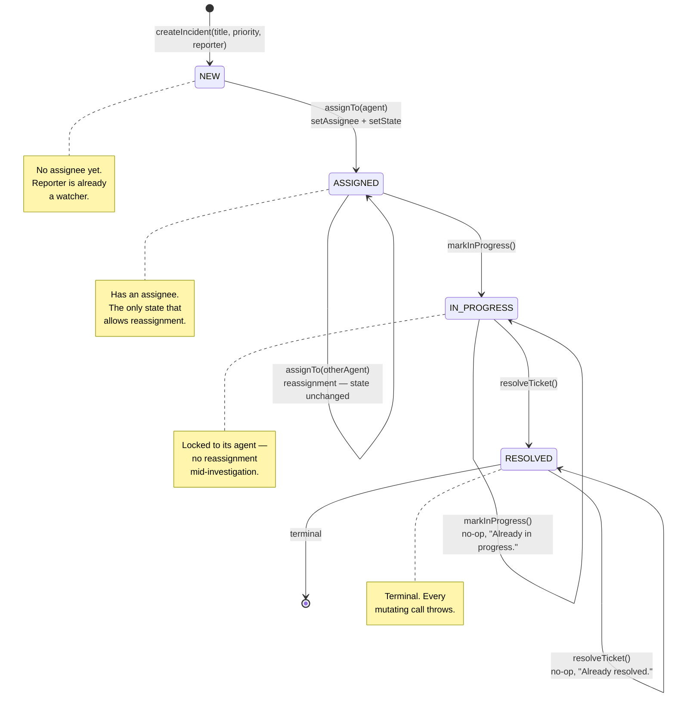
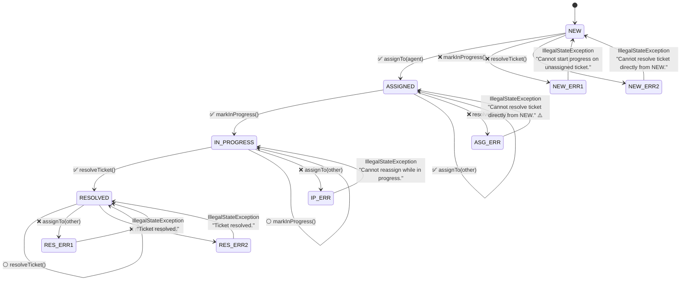
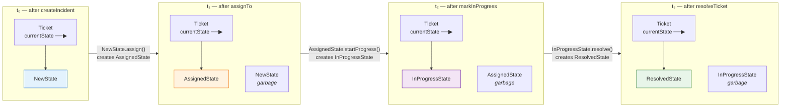
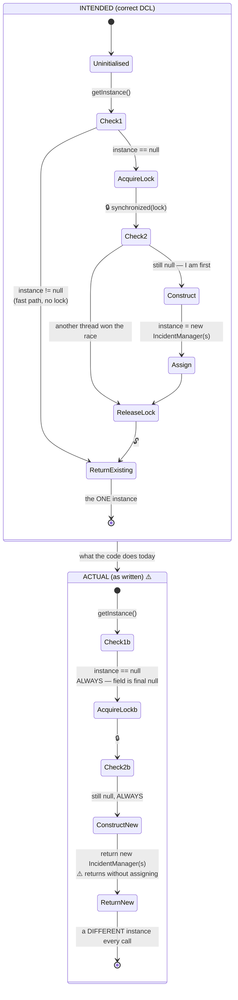
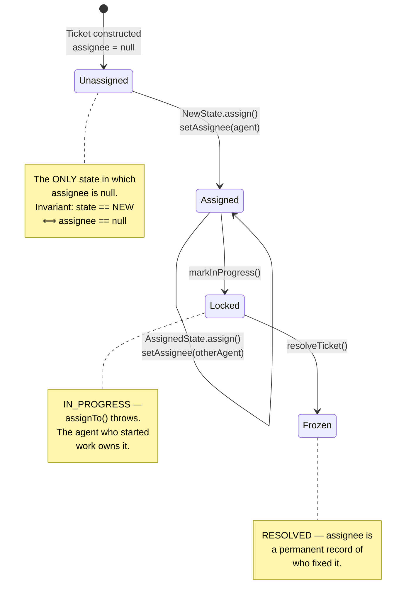
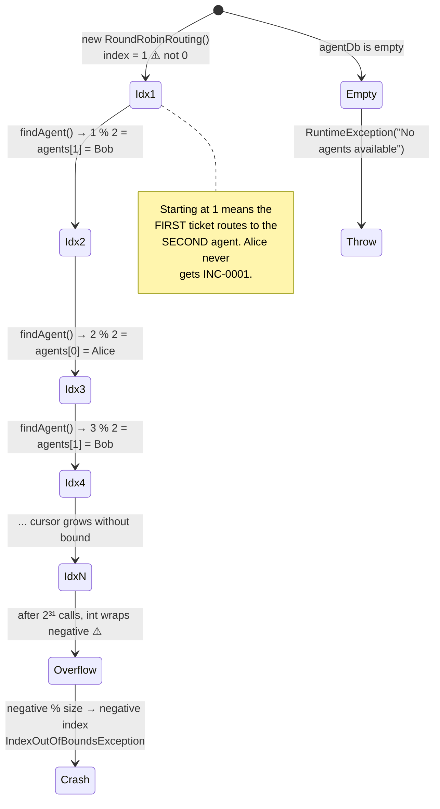
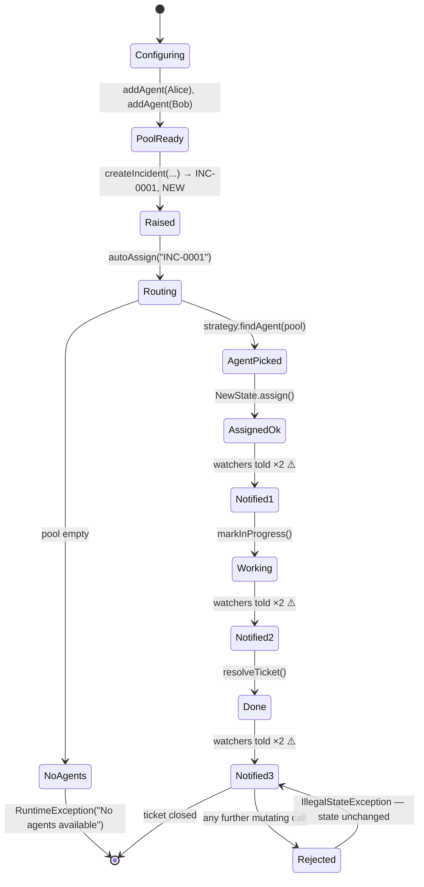

# Ticket Management System — State Diagrams

> The **lifecycle** view. This is the heart of the design: the State pattern exists
> because the rules below are too many, and too likely to grow, to live as conditionals
> inside `Ticket`.

---

## 1. Ticket Lifecycle

The four states and the three operations, exactly as `State/` implements them.

Each box is one class implementing `TicketState`; each labelled arrow is a method on
that class that calls `ticket.setState(...)`.

---

## 2. Rejected Transitions

The same machine with every *illegal* call drawn in, since those are what the design is
really for.

**Every rejected call leaves the state untouched.** The exception is thrown *before*
`setState` is reached, so a caught `IllegalStateException` means the ticket is exactly
where it was — and no watcher was notified of anything.

⚠️ `AssignedState.resolve` throws the message *"Cannot resolve ticket directly from
NEW."* — copy-pasted from `NewState`. The behaviour is right; the text names the wrong
state and will mislead whoever reads the log at 3am.

---

## 3. The State Objects Behind the Machine

The lifecycle above, redrawn as what it actually is at runtime: a reference being
replaced.

**Who performs the transition matters.** The old state constructs its successor and
calls `setState` on the ticket. `Ticket` never decides where it goes next — that
knowledge lives in the state being left. This is what makes adding `ON_HOLD` a purely
additive change: `InProgressState` gains a `hold()` path, and nothing else moves.

*(Note: the four state classes hold no fields, so they could be shared immutable
singletons instead of being allocated per transition. The code allocates; the cost is
trivial and the diagram shows it honestly.)*

---

## 4. Singleton Initialisation — Intended vs Actual

### Why both checks exist (in the correct version)

| Check | Runs | Purpose |
|---|---|---|
| **First**, outside the lock | Every call | Fast path — once initialised, no thread ever pays for the monitor |
| **Second**, inside the lock | Only when the first saw `null` | Correctness — two threads can both pass check 1; only one may construct |

`volatile` on the field is what makes the first check *safe*. Without it, a thread can
observe a non-null reference to an object whose constructor has not finished publishing
its fields — it would get a manager with a null `ticketDb`.

### Why the shipped version fails

`private static final IncidentManager instance = null;` — `final` means the field can
never be assigned after class initialisation, and it was initialised to `null`. So
`instance == null` is a compile-time-constant truth, both checks always pass, and the
method returns a freshly constructed manager without ever populating `instance`. See
[01 § 5](01-class-diagram.md#5-the-singleton-that-isnt) for the corrected code.

---

## 5. Assignee Slot Lifecycle

A smaller machine, worth drawing because it is the invariant a database `CHECK`
constraint would encode ([02 § 3](02-entity-relationship-diagram.md#3-what-a-relational-schema-would-look-like)).

---

## 6. Round-Robin Cursor

The routing policy's own tiny state machine, and the two bugs hiding in it.

| Defect | Consequence | Fix |
|---|---|---|
| `index` starts at `1` | First ticket goes to `agents[1]`, not `agents[0]` | Initialise to `0` |
| Unbounded growth, then `int` overflow | `%` on a negative value yields a negative index → `IndexOutOfBoundsException` | `Math.floorMod(index.getAndIncrement(), size)` |
| Pool read without holding its lock | `agents.size()` and `agents.get(curr)` are two separate operations on a `synchronizedList`; a concurrent `addAgent` between them can shift the list | Snapshot the pool, or wrap the read in `synchronized (agents)` |

---

## 7. Request Lifecycle — End to End

Everything above, in the order the demo drives it.

