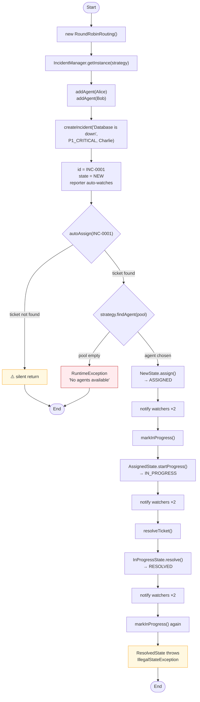
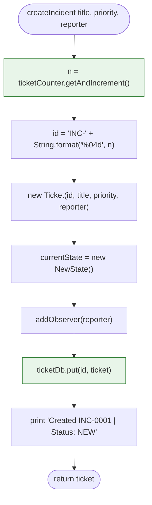
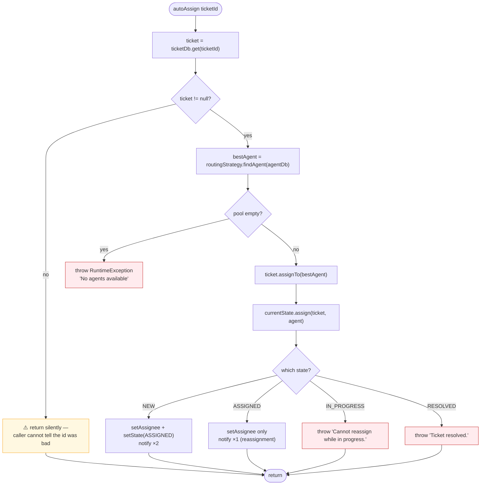
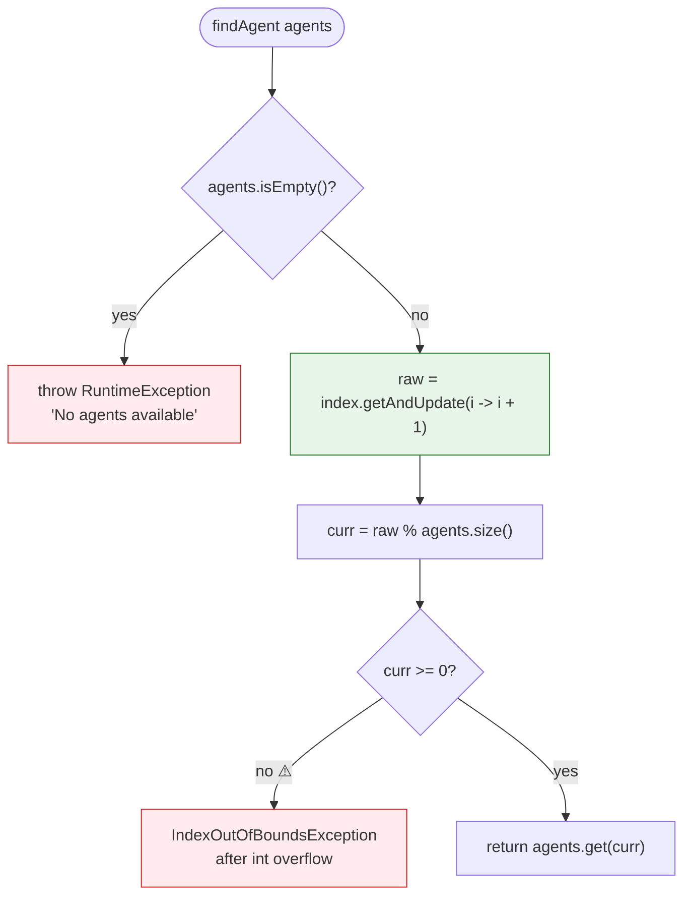
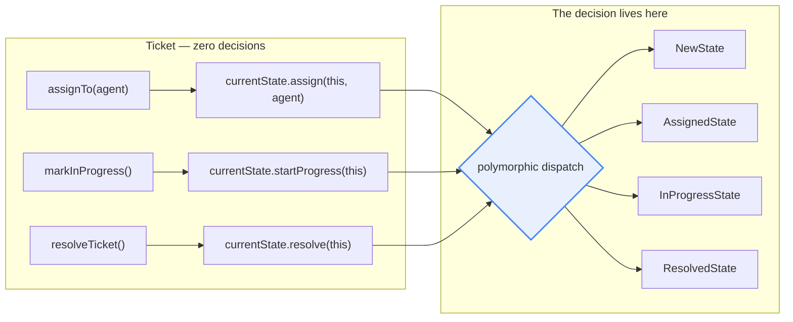
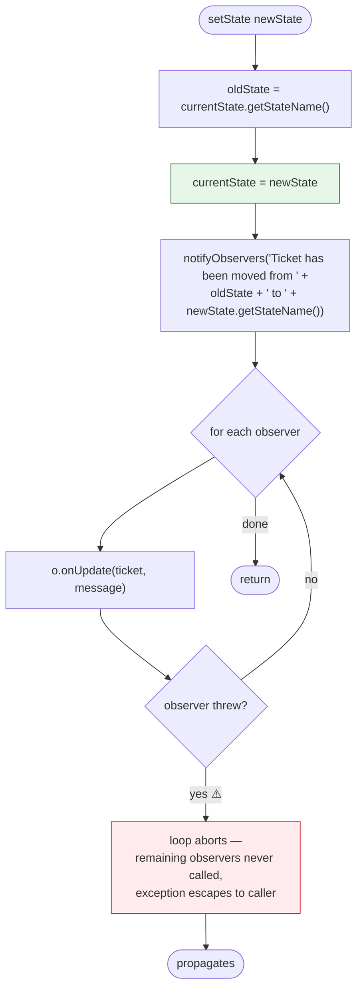
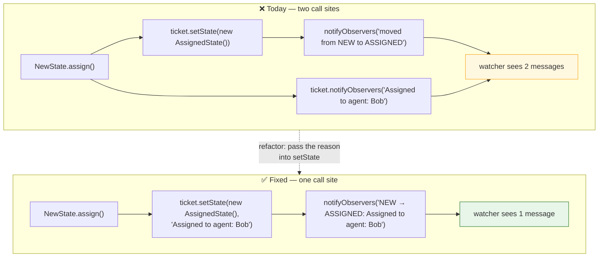
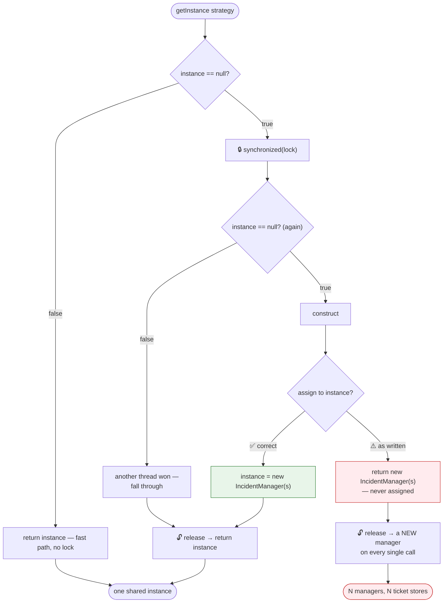
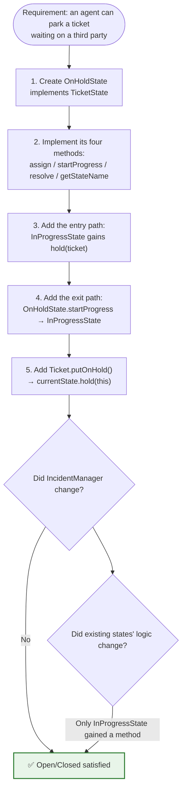
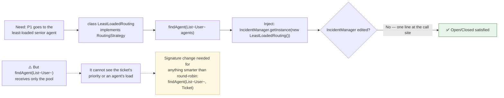

# Ticket Management System — Flowcharts

> The **algorithm** view: one flowchart per method that makes a decision. Where the
> sequence diagrams show *who* talks to *whom*, these show the branches taken inside a
> single call.

---

## 1. Master Flow — End to End



---

## 2. `createIncident` — Filing a Ticket



| Step | Cost | Thread safety |
|---|---|---|
| `getAndIncrement` | O(1) | ✅ CAS — two threads never get the same `n` |
| `String.format` | O(1) | ✅ no shared state |
| `new Ticket` | O(1) | ✅ nothing shared until published |
| `ticketDb.put` | O(1) avg | ✅ `ConcurrentHashMap` |

**No branches at all** — creation cannot fail. There is no validation of `title`
(empty and `null` are both accepted) and no null check on `reporter`, though a `null`
reporter would be added to `observers` and NPE on the *first* transition rather than
here. Fail-fast validation is the obvious hardening.

---

## 3. `autoAssign` — Route and Assign



**The asymmetry to notice.** An unknown ticket id returns silently; an empty agent pool
throws. Both are caller errors, and they should be reported the same way — a
`TicketNotFoundException` on the first. As written, a typo'd id looks like success.

---

## 4. `RoundRobinRouting.findAgent` — The Policy



**Walkthrough with two agents `[Alice, Bob]`, cursor starting at 1:**

| Call | `raw` | `raw % 2` | Agent | Expected |
|---|---|---|---|---|
| 1st | 1 | 1 | **Bob** | Alice ⚠️ |
| 2nd | 2 | 0 | Alice | Bob |
| 3rd | 3 | 1 | Bob | Alice |
| 4th | 4 | 0 | Alice | Bob |

The *distribution* is still perfectly even — every agent gets an equal share. Only the
starting offset is wrong, which is why the demo prints Bob for `INC-0001`.

**The hardened version:**

```java
@Override
public User findAgent(List<User> agents) {
    if (agents.isEmpty()) {
        throw new IllegalStateException("No agents available");
    }
    synchronized (agents) {                                 // size + get as one unit
        int curr = Math.floorMod(index.getAndIncrement(), agents.size());
        return agents.get(curr);
    }
}
```

`Math.floorMod` is the whole fix for overflow: it returns a non-negative result for
negative inputs, where `%` does not.

---

## 5. State Delegation — The One-Line Methods

The three entry points on `Ticket`, and what makes them interesting is what they
*don't* contain.



> **The test for whether you got State right:** grep the context class for `if` and
> `switch`. `Ticket` has neither in any lifecycle method. The twelve rules
> (3 operations × 4 states) are distributed across four classes that never mention
> each other's names except to construct a successor.

---

## 6. `setState` — Transition and Announce



**The ordering is correct and worth defending:** `oldState` is captured *before* the
assignment, so the message reads "moved from NEW to ASSIGNED" rather than
"from ASSIGNED to ASSIGNED". The failure containment is the part that is missing —
see [03 Flow 8](03-sequence-diagrams.md#flow-8--observer-failure-is-not-isolated).

---

## 7. The Double-Notification Path

Why every transition emits two messages, and how to collapse it to one.



```java
// Ticket — one transition, one announcement
public void setState(TicketState next, String reason) {
    String from = currentState.getStateName();
    this.currentState = next;
    notifyObservers(from + " → " + next.getStateName() + ": " + reason);
}
```

This also fixes the inconsistency where reassignment (which does not call `setState`)
emits one message while a real transition emits two.

---

## 8. `getInstance` — Double-Checked Locking



| | Correct DCL | This code |
|---|---|---|
| Field | `private static volatile IncidentManager instance;` | `private static final IncidentManager instance = null;` ⚠️ |
| Lock | `private static final Object lock` | `private static Object lock` — non-final |
| Constructor | `private` | `public` ⚠️ |
| Inside the lock | **assigns** then returns the field | **returns** a new object, assigns nothing ⚠️ |
| Result | Exactly one manager, forever | One manager per call |

---

## 9. Adding a New State — The Open/Closed Test

What it takes to add `ON_HOLD`, the feature every service desk asks for second.



Compare with the enum-and-conditional design, where `ON_HOLD` means editing every
`switch` in `Ticket` and hoping none was missed. Here the compiler enforces
completeness: adding `hold` to `TicketState` breaks every implementation until each one
states what it does.

---

## 10. Adding a New Routing Policy



**The design limit worth naming in an interview.** `RoutingStrategy.findAgent` takes
only the agent pool. Any policy that depends on the *ticket* — priority-based routing,
skill matching, "the reporter's own team first" — cannot be expressed without widening
the interface to `findAgent(List<User> agents, Ticket ticket)`. That is the change
`Priority` is waiting for: it is stored on every ticket today and read by nothing.
