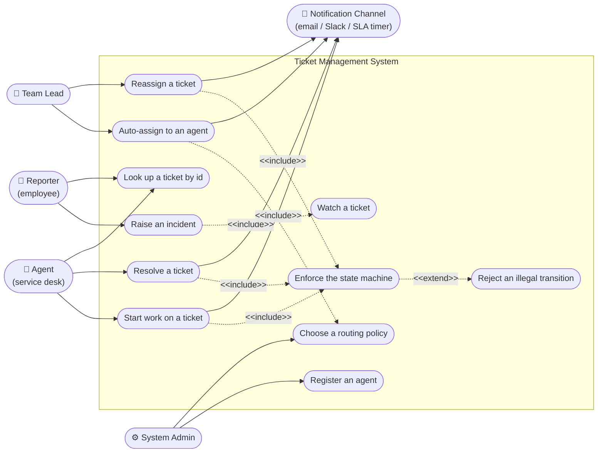
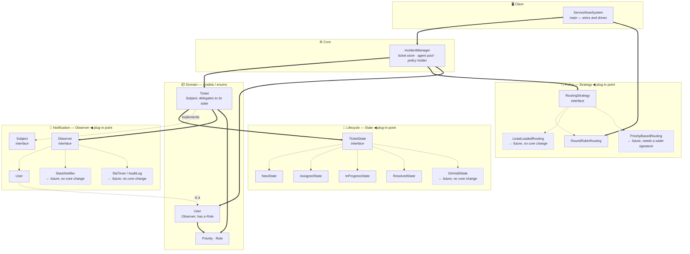
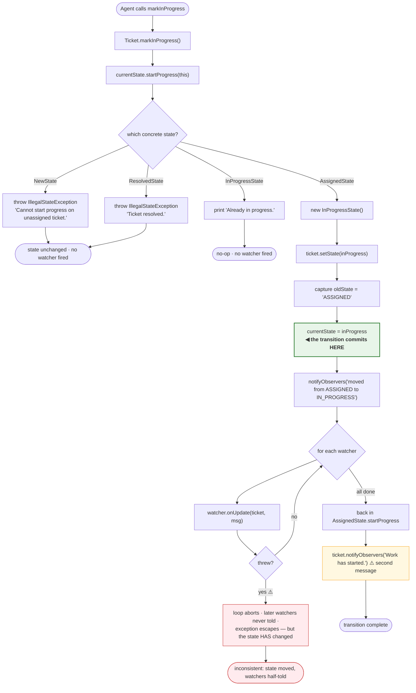
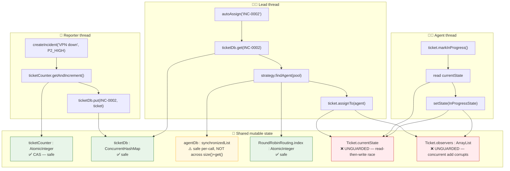
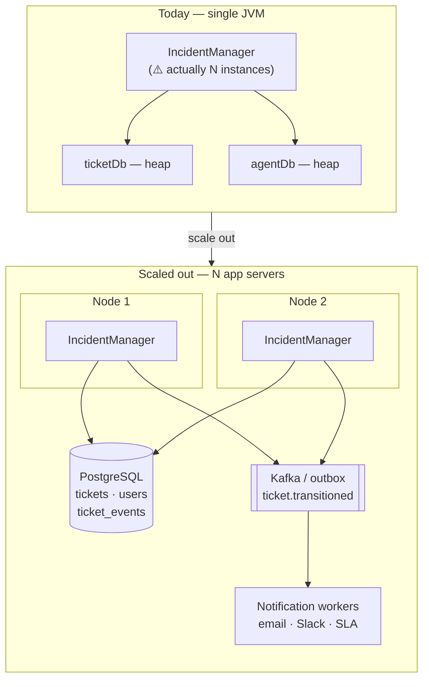

# Ticket Management System — Use Case, Component & Activity Diagrams

> The remaining UML views that earn their place: who uses the system (**use case**),
> how it is assembled and where extensions plug in (**component**), the concurrent work
> of a ticket transition (**activity**), and what changes when this runs on more than
> one machine (**deployment**).

---

## 1. Use Case Diagram

Actors and the capabilities exposed to each.

| Actor | Use cases | Entry point in code |
|---|---|---|
| **Reporter** | Raise an incident, auto-watch it, look it up | `createIncident`, `getTicket` |
| **Agent** | Start work, resolve | `Ticket.markInProgress`, `Ticket.resolveTicket` |
| **Team Lead** | Route a ticket, hand it to someone else | `autoAssign`, `Ticket.assignTo` |
| **System Admin** | Staff the pool, set the policy | `addAgent`, the `RoutingStrategy` injected into the constructor |
| **Notification channel** *(secondary)* | Receive every transition | `Observer.onUpdate` implementations |

**The missing use case.** There is no "close a ticket" and no "reopen a ticket".
`RESOLVED` is terminal, so a fix that did not work leaves the reporter with no path
back. `REOPENED` is the third state a real deployment adds, after `ON_HOLD` and
`CLOSED`.

---

## 2. Component Diagram

How the system is assembled, and where a new piece plugs in without touching the rest.

### Open/Closed in one table

| New requirement | What you write | What you edit | Verdict |
|---|---|---|---|
| Slack notifications on every transition | `class SlackNotifier implements Observer` | one `addObserver` call | ✅ closed |
| SLA breach timer | `class SlaTimer implements Observer` | one `addObserver` call | ✅ closed |
| Least-loaded routing | `class LeastLoadedRouting implements RoutingStrategy` | one constructor argument | ✅ closed |
| An `ON_HOLD` state | `class OnHoldState implements TicketState` + a `hold()` entry path | `TicketState` + its 4 implementations | ✅ closed to the core, open at the interface |
| **Priority-aware routing** | `class PriorityBasedRouting` | ⚠️ `RoutingStrategy.findAgent` signature, and every implementation | ⚠️ **not closed** — the interface is too narrow |
| **Unsubscribe a watcher** | — | ⚠️ `Subject` needs `removeObserver` | ⚠️ **not closed** — a gap in the interface |

The last two rows are the honest answer to "where does your design break?" — both are
missing *parameters* and *methods* on the extension interfaces, not missing classes.

---

## 3. Activity Diagram — A Ticket Transition, With Watchers

The work inside one `markInProgress()` call, showing which parts are the transition and
which are side effects.

**The line that matters is `J`.** Everything above it can still abort cleanly;
everything below it is running after the fact is already true. That is why observer
failures must be contained rather than propagated — there is nothing left to roll back.

---

## 4. Activity Diagram — Concurrent Work, With Swimlanes

Two agents and a reporter acting at once, showing which lanes are safe and which are not.

**Read this diagram as a scorecard.** The *manager's* state is defensively typed and
holds up; the *ticket's* state is plain fields and does not. Since every interesting
mutation happens on a ticket, the concurrency story is only half written — which is
exactly the gap [03 Flow 6](03-sequence-diagrams.md#flow-6--the-concurrency-race-on-a-single-ticket)
closes with three `synchronized` keywords and a `CopyOnWriteArrayList`.

---

## 5. Deployment / Scale-Out View

What breaks when this stops being one JVM.

| Concern | Single JVM (today) | Multi-node |
|---|---|---|
| Unique ticket ids | `AtomicInteger` per manager ⚠️ | DB sequence, or `INC-<node>-<n>` |
| One manager instance | Broken DCL | Statelessness — the manager holds nothing; the DB is the state |
| Serialising a transition | `synchronized` on the ticket | Optimistic locking: `UPDATE ... WHERE id=? AND status=? AND version=?`, assert 1 row |
| Watcher list | In-heap `ArrayList` per ticket | `ticket_watchers` rows |
| Notification delivery | In-process observer call | Transactional outbox → queue → workers, so a failed send retries without touching the ticket |
| Routing fairness | In-heap round-robin cursor | Shared cursor (Redis `INCR`), or route by `hash(ticketId) % agents` |

**The pattern that survives the move.** State and Strategy are unaffected by
distribution — they are pure in-process polymorphism over a ticket loaded from a row.
Observer is the one that changes shape: an in-process listener list becomes a queue,
because a notification that must survive a node restart cannot live on a heap.
